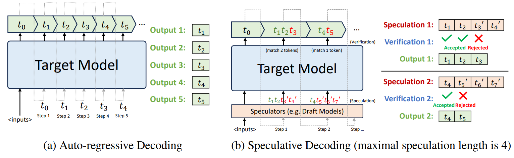

# SGlang 中的 Sepeculative Decoding

在正式进入 SGLang 源码前，我们需要知道为什么我们需要 speculative decoding 以及什么是 speculative decoding。有了这些认识后，我们可以深入源码来了解 SGLang 是如何将 speculative decoding 与 scheduler 集成起来的
> 这里先大概给一下 speculative decoding 的示意图

## Why Speculative Decoding

LLM 是自回归（autoregressive）的：生成一个 token 要依赖前面的所有 token。
> 换句话说，它每次只能生成一个 token，再把结果反馈给模型继续下一次。

即使 GPU 吞吐很高，这种 “token-by-token” 推理方式依然**成为瓶颈**。所以研究人员将目光放在了 decoding algorithms 上，提出了 **speculative decoding 这种并行验证策略**：

- 用一个轻量级的模型（或机制）来“预判”大模型的输出，然后让大模型**一次验证一整段（chunk）** 而不是一个 token。
- 这样，我们就能用少量的模型调用，生成更多 token。

## What is Speculative Decoding

首先我们会介绍什么是推测解码，然后我们会概述下推测解码技术的发展历程

现在推测解码流程基本遵循 `draft-then-verify` 的范式
- 使用更高效的模型 $M_q$ 生成 **γ ∈ ℤ⁺** 个候选 token；  
- 然后使用目标模型 $M_p$​ **并行 Verify** 这些候选样本及其在 $M_q$ 中的概率，  并**接受**所有能使分布与 $M_p$ 一致的候选；  
	> 决定被接受的数量 n（用随机数进行拒绝采样）
- 对第一个被拒绝的候选，从一个**调整后的分布**中重新采样；如果所有候选都被接受，则再采样一个额外的 token。
	> 但若 $n < \gamma$（说明在第 n+1 步的草稿 $x_{n+1}$​ 被拒绝），我们需要**从 $p_{n+1}$ 中去掉那些已经由 $q_{n+1}$​  覆盖掉的质量**，并对剩余部分重新标准化

## Reference 
[^spec1]: [Clover: Regressive Lightweight Speculative Decoding with Sequential Knowledge](https://arxiv.org/pdf/2405.00263)