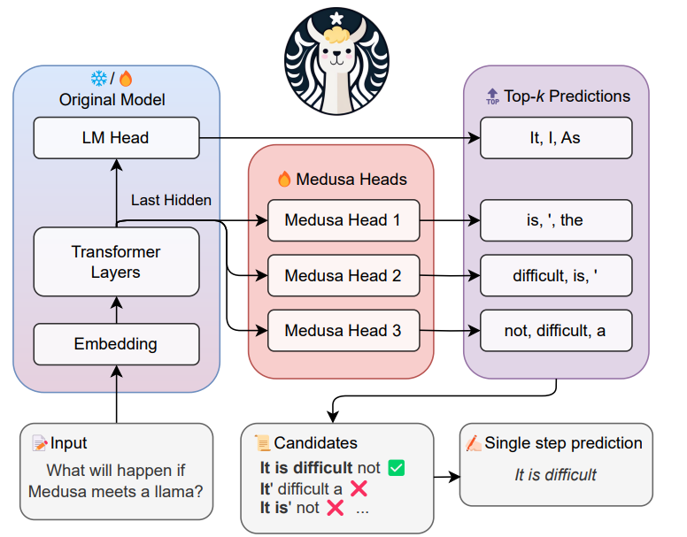
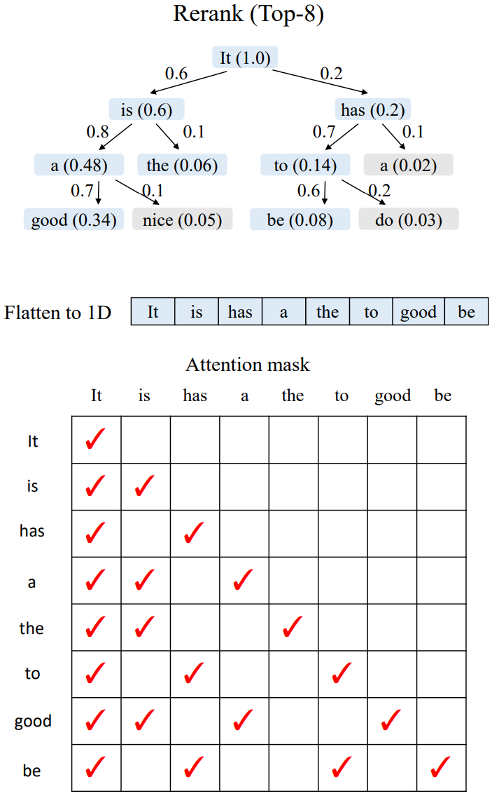

# SGlang 中的 Sepeculative Decoding

在正式进入 SGLang 源码前，我们需要知道为什么我们需要 speculative decoding 以及什么是 speculative decoding。有了这些认识后，我们可以深入源码来了解 SGLang 是如何将 speculative decoding 与 scheduler 集成起来的
> 这里先大概给一下 speculative decoding 的示意图

## Why Speculative Decoding

LLM 是自回归（autoregressive）的：生成一个 token 要依赖前面的所有 token。
> 换句话说，它每次只能生成一个 token，再把结果反馈给模型继续下一次。

即使 GPU 吞吐很高，这种 “token-by-token” 推理方式依然**成为瓶颈**。所以研究人员将目光放在了 decoding algorithms 上，提出了 **speculative decoding 这种并行验证策略**：

- 用一个轻量级的模型（或机制）来“预判”大模型的输出，然后让大模型**一次验证一整段（chunk）** 而不是一个 token。
- 这样，我们就能用少量的模型调用，生成更多 token。

在整个投机采样的流程中，假设轻量 LLM 生成 Draft Tokens 的开销为 $p$ ，原始 LLM 验证 & Next Token 生成的开销近似为 1 ，那么投机采样在接受 Tokens 数大于 $1 + p$ 的情况下才有性能收益，并且随着接受的 Tokens 数增加而性能收益越大。所以投机采样要想获得性能收益，核心要解决以下两个问题：

1. **如何降低投机采样的 overhead？**
2. **如何提升 Verify 阶段的接受率？**

## What is Speculative Decoding

首先我们会介绍什么是推测解码，然后我们会概述下推测解码技术的发展历程

现在推测解码流程基本遵循 `draft-then-verify` 的范式
- 使用更高效的模型 $M_q$ 生成 **γ ∈ ℤ⁺** 个候选 token；  
- 然后使用目标模型 $M_p$​ **并行 Verify** 这些候选样本及其在 $M_q$ 中的概率，  并**接受**所有能使分布与 $M_p$ 一致的候选；  
	> 决定被接受的数量 n（用随机数进行拒绝采样）
- 对第一个被拒绝的候选，从一个**调整后的分布**中重新采样；如果所有候选都被接受，则再采样一个额外的 token。
	> 但若 $n < \gamma$（说明在第 n+1 步的草稿 $x_{n+1}$​ 被拒绝），我们需要**从 $p_{n+1}$ 中去掉那些已经由 $q_{n+1}$​  覆盖掉的质量**，并对剩余部分重新标准化

### 发展历程

#### Speculative Decoding (Leviathan et al., 2023, Google)

- 📄 论文: _“Fast Inference from Transformers via Speculative Decoding”_
- 📍 首次提出该方法，思路：
    - 用一个小模型（draft model）生成多个候选 token；
    - 用大模型（target model）验证其中的一部分；
    - 若验证通过，则一次提交多个 token，减少大模型调用次数。
	

#### Medusa 

- 📄 _“MEDUSA: Simple LLM Inference Acceleration Framework with Multiple Decoding Heads”_

	
- 💡 贡献：
    - 不是单独的小模型，而是 **在大模型 decoder 上直接加多个预测头**；
    - 每个头预测接下来第 1、2、3… 个 token；
    - 只需**一次前向传播即可验证多个候选**。
	    - 为了**加速**与**计算代价**之间取得平衡，引入了一种 **树状结构的注意力机制（tree-structured attention）**，可以**并行处理多个候选序列**
	    - **Tree Mask**：**每个 token 只能看到来自同一条候选序列（continuation）的历史 token**，不能“越支访问”其他候选的 token。
		    
---
#### Lookahead Decoding 

- 📄 _“Lookahead: An Inference Acceleration Framework for Large Language Model with Lossles”_

- 层次化多分支草稿策略 (Hierarchical Multi-Branch Draft Strategy)
> 	利用**共同的前缀标记**将多个预测的草稿序列（分支）进行**合并和压缩**

- 基于 Trie 树的草稿检索和管理 (Trie-tree-based Retrieval and Management)
	- Trie 树存储了**输入提示 (Prompt)** 和**已生成响应 (Generated response)** 中出现的 n-gram 标记序列（即分支）。
	- 引入了 **“生成分支插入” (Generated branch Inserting)** 机制，能够动态地 (on-the-fly) 将生成的重复序列放入 Trie 树中，从而利用输出中的重复模式进行加速。
	- 通过**分支消除**和**节点修剪**策略来保持 Trie 树的高效性，控制内存消耗。
	

---
#### EAGLE 

- 📄 _“EAGLE: Speculative Sampling Requires Rethinking Feature Uncertainty”_
    
- 💡 创新：
    - **消除不确定性**：EAGLE 在草稿模型的输入中加入**前一步采样得到的 token 序列（即 shifted token）**
	    > Medusa 用多个“分头（heads）”预测未来 token（如 +1, +2, +3 步）。但由于生成过程具有随机性（采样带来的不确定性），这些未来 token 可能根本不是唯一确定的目标序列——这导致 draft head 学不到稳定的映射。
	    
		

		> 它使用 **feature + shifted token** 的组合，而不是仅在 token 层面预测。
	    
		

- **EAGLE 的生成循环**：
$$
(feature\_seq,token\_seq)→next\_feature→next\_token→concat→next\_step
$$
- **Tree Attention**：建一个树形草稿结构，只需 m 次前向计算即可生成深度为 m、超过 m 个 token 的草稿树。

---

#### EAGLE-2 

- 📄 _“EAGLE-2: Faster Inference of Language Models with Dynamic Draft Trees”_
    
- 两个观察：
	- 接受率除了与 **Token 所在位置相关以外（在树中所处的位置），还和上文相关（树中的祖宗节点）**。
    > 	P3、P4 和 P5、P6 虽然都是同一层的节点（即同一个 Step 的 Draft Tokens），但接收率上 P3、P4 普遍高于P5、P6 节点，**一个重要的原因是 P3、P4 的父节点为 P1，其概率高于 P5、P6 节点的父节点 P2。P3、P4的概率甚至普遍高于 P2**这更加说明在生成 Draft 树的时候，采用静态 Draft 树并不是一个最优选择，更应该选择动态 Draft 树。

	

	- 原始 LLM 自回归生成的 Token 概率分布表示 Token 接收概率。Eagle 的 Draft 模型生成的 Draft Tokens 概率分布与 Token 接收率分布接近。下图展示了 Draft Tokens 生成概率和 Token 接收率的分布图，可以看出分布很接近，**可以通过 Draft Tokens 生成概率预估 Token 的接收率。**

	
- 💡 创新：
	- **Context-Aware Dynamic Draft Tree**：EAGLE-2 不修改 draft 模型的训练与推理方式，也不改变验证阶段。它的改进集中在两个方面：
		1. 如何扩展草稿树；
		2. 如何对草稿 token 进行重新排序

	- **Expand 阶段**：从当前层选择 **全局接受概率（global acceptance probability）最高的前 k 个 token** 进行扩展。
		- 一个 token 的**全局接受概率**是它从根节点到该节点路径上所有 token 的接受概率的乘积：$$V_i = \prod_{t_j \in \text{Path(root, }t_i\text{)}} p_j \approx \prod c_j​$$，其中 $c_j$ 是 draft 模型的置信度（confidence score）。

	
	- **ReRank 阶段**：**不会直接使用扩展阶段的结果，而是对所有草稿 token 重新排序**，选出全局 top-m 的节点。
		> 扩展阶段的目标是加深草稿树。然而，由于接受率在 0–1 之间，越深的 token 其值越小。**一些浅层未扩展节点可能比深层节点更有价值**。
		
		- **对于值相同的节点，优先选择浅层节点，始终保持父节点在子节点之前被选中。** 这样可以保证 top-m 节点仍构成一棵连通树。

		- **Tree Mask**：把这些选中的 token **拉平成一维序列**，送入主模型进行验证阶段。为了与标准自回归解码保持一致，我们需要调整注意力掩码。不同分支的 token 不应互相可见，因此注意力掩码需根据树结构修改，使每个 token 仅能看到它的祖先节点。
		
	

---

## Eagle in SGLang

## Reference 
[^spec1]: [Clover: Regressive Lightweight Speculative Decoding with Sequential Knowledge](https://arxiv.org/pdf/2405.00263)