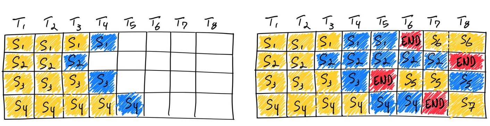

# 一条 Request 在 SGLang 的前世今生

 > [!NOTE] 
 > 这里我们设置一些参数更接近真实的推理场景，启用 `mixed chunked` 参数，prefill 开启 `chunked_prefill`，cache 使用 `page_size > 1`，scheduler 使用 `overlap scheduler`

**Continuous Batching** 的重点在 Scheduler[^sglang]，**Page Attention** 重点在算子层以及对应的封装，所以我们主要关注这两部分。在开始前，我们提出几个问题，在我们梳理完整个代码流程后再来回答：

1. SGLang 调度策略是 prefill 优先吗？
2. prefill 和 decode 如何在一个 batch 中进行推理？
3. 一个 batch 中可以有多个 chunked prefill 吗？
4. chunked prefill 如何处理 KV Cache？

现在我们考虑下整个系统中可能同时出现的请求类型：

- Scenario 1：一个需要分块的新请求进入，此时系统内没有新的请求
- Scenario 2：该新请求 prefill 完第一个 chunk req，开始 prefill 下一个 chunk req
- Scenario 3：该请求进入 decode 阶段，同时有需要分块的新请求进入
  > 这里需要考虑是否会有多个**需要分块的新请求进入**

下面会分这三种情况进行分别详细解释：

## Prerequisite knowledge

### Continuous batching

Continuous Batching[^orca] 放弃了“请求级”同步，转而采用**迭代级(Token-level)** 调度。

- **工作原理**：
  1. 推理引擎在每一个 Token 生成步骤（Iteration）结束时，都会检查当前 Batch 中哪些请求已经完成了生成（遇到了 `<EOS>` 符）。
  2. 如果有请求完成，系统会立即将其移除，释放其占用的显存槽位。
  3. **关键点**：系统会立即从等待队列（Waiting Queue）中拉取一个新的请求，填补刚刚空出来的槽位，加入到**下一个 Token 的生成迭代**中 [^cse234]。



---

### Chunked Prefill

Continuous Batching 中为了**提高吞吐率**是 prefill 优先，长的 prefill 任务会阻塞 decode 进行，造成 TBT 增大，用户体验变差

Chunked Prefill [^chunk]的核心思想是：**把长 Prompt 把它切成小块，分多次算。**


- **工作原理**：
  1. 假设有一个 1000 Token 的 Prompt 进来，系统设定 Chunk Size 为 256。
  2. 在第 1 个迭代，系统处理这个 Prompt 的前 256 个 Token，同时处理其他用户的 Decode 任务。
  3. 在第 2 个迭代，处理接下来的 256 个 Token（利用 KV Cache 累积），继续与其他用户的 Decode 并行。
  4. 直到 Prompt 处理完，转入 Decode 阶段。
- **混合批处理 (Mixed Batching)**：这就形成了一个特殊的 Batch，里面既包含一些请求的 **Decode Token**，也包含另一些请求的 **Prefill Chunk**。
  - 优先处理上一轮的 decode batch
  - 如果 budget 还有剩余，对 chunked prefill 后续的 chunk 进行处理
  - 如果还有剩余，对新加入的 request 进行 chunked prefill，然后处理第一个 chunk


---

### PrefillAdder in SGLang

实际上是对 Chunked Prefill 论文进行预算比较的工程化实现，与 Radix Cache 和 HiCache 结合；所有本次调度可以进行推理的 `Req` 都会被放入 `can_run_list`，后续组装成 `ScheduleBatch` 交给后面模型层推理。

**初始化：**

- 保留 Decode 请求需要的 token，剩余的 token 是给 Prefill 请求分配的

**新请求到达后流程：**

1. 调用 `add_one_req`，计算 `total_tokens`、`real_input_tokens`，快速判定是否直接 `NO_TOKEN`/`OTHER`。
2. 取 `last_node` 锁（保证 tree node 在操作期间不被驱逐）。
3. 若 `host_hit_length>0`，回填 host node 的 prefix。
4. 判断是否能一次性 prefill（非 chunk）：

   - 若可以：对 `last_node` 增加锁引用，加入 `can_run_list`，调用 `_update_prefill_budget`（同时为 new_tokens 预留）。
   - 若不能（需要 chunk）：计算 `trunc_len`（page 对齐 + `truncation_align`），截断 `fill_ids`，加入 `can_run_list`，标记 `new_chunked_req`，只为这块更新预算（不保留 new token 预算）。

5. 返回 `budget_state()`（CONTINUE/NO_TOKEN/OTHER），实际上这里对是否可以**进行多个 Prefill 的 Chunked 进行了限制**(后面会详细说明)。
6. 系统会对 `can_run_list` 实际执行 prefill。若是 chunked，后续再提交剩余 chunk（`add_chunked_req`）时会继续处理。

---

## Overview

用户传来的 Prompt 经过 TokenizerManager 进行 tokenization 转发给 Scheduler 进程；然后 Scheduler 经过一系列处理，将模型的 output 封装成 `BatchTokenIDOut` 发送给 DeTokenizerManager；DetokenizerManager 在其事件循环中接收  `BatchTokenIDOut`，处理后生成  `BatchStrOut`  并返回给 TokenizerManager。至此 SGLang 后端的任务就完成了

## Scenario 1: One New Request

现在假设我们有一条 Prompt 进来，长度超过一次 Prefill 处理的 `max_tokens` 的极限，分别来看 Scheduler 和 ModelRunner 以及后面的注意力后端如何处理

### Processing

- 蓝色部分是涉及到的内部变量，黄色是涉及到的数据结构，红色是 sample 函数


1. 当前 Scheduler 中无请求，该 `req` 放入 `waiting_queue` 中
2. 创建 `PrefillAdder`，从 `waiting_queue` 中取出该请求，调用 `PrefillAdder::add_one_req()` prefill 会被截断分块，`can_run_list` 中只有这个 `req`，单个请求被打包成 `ScheduleBatch`
3. 调用 `ScheduleBatch::prepare_for_extend()` ，实际上调用 `alloc_for_extend()`，分配 `req_pool_indices` 以及为需要 extend 的长度申请真实的 KV 显存 `out_cache_loc`，并把对应关系记录到的 `req_to_token_pool`
4. **模型推理 (`TpModelWorker` & `ModelRunner`)**
   进入  `TpModelWorker::forward_batch_generation()` -> `ModelRunner::forward_extend()` -> 模型层  `forward_extend()`。
   - 此时传入的元数据中：
     - `input_ids`  只有本次 chunk 的 token。
     - `prefix_lens` 0。
     - `extend_lens`  是本次 chunk 的长度。
     - `req_pool_indices`  指向包含了完整 KV 历史的映射表。
5. **Attention 执行 (`FlashAttentionBackend`)**
   调用  `flash_with_kv_cache()`： - Attention Kernel 会读取  `req_pool_indices`  获取 KV Cache 的物理地址。 - 对于本次 chunk 的 Query，它会计算与  **Self (本次 chunk 的 KV)**  的 Attention。

   ```python
	flash_attn_with_kvcache(
                q=q.contiguous().view(-1, layer.tp_q_head_num, layer.head_dim),
                k_cache=key_cache,
                v_cache=value_cache,
                page_table=page_table,
                cache_seqlens=cache_seqlens,
                cu_seqlens_q=cu_seqlens_q,
                cu_seqlens_k_new=cu_seqlens_k if not use_local_attn else None,
                max_seqlen_q=max_seqlen_q,
                softmax_scale=layer.scaling,
                causal=False if use_cascade_attn else causal,
                window_size=window_size,
                softcap=layer.logit_cap,
                k_descale=k_descale,
                v_descale=v_descale,
                return_softmax_lse=use_cascade_attn,
                num_splits=self.num_splits,
                **kwargs,
            )
	```

---

## Scenario 2: Next Chunked Prefill

同一个请求的第二次 chunked prefill 执行（即该请求被截断，现在执行下一个 chunk）

### Processing

1. **Scheduler 处理上一个 Chunk 的结束**
   在  `Scheduler::get_next_batch_to_run()`  中，Scheduler 会检测到  `self.chunked_req`  存在（即上一步是 chunked prefill）。
   - 调用  `self.tree_cache.cache_unfinished_req(self.chunked_req, chunked=True)` 将**上一个 chunk 计算好的 KV Cache 索引插入到 RadixCache 中**。
   - 调用  `self.req_to_token_pool.free(self.chunked_req.req_pool_idx)` 释放上一个 chunk 使用的  `req_pool_idx`（注意：KV Cache 本身因为被 RadixCache 引用，不会被物理释放，只是释放了逻辑映射槽位）。
2. **准备下一个 Chunk 的请求**
   在  `Scheduler::get_new_batch_prefill()`  中：
   - 调用  `self.chunked_req.init_next_round_input()`。
     - 该函数内部调用  `tree_cache.match_prefix()`。
     - **关键点**：它会从 RadixCache 中匹配到上一个 chunk 刚刚存入的 KV Cache 索引，并将这些索引赋值给  `req.prefix_indices`。此时  `req.prefix_indices`  包含了第一个 chunk 的所有 KV 位置。
   - 调用  `PrefillAdder::add_chunked_req()`。
     - 计算本次 chunk 需要处理的 token 数量（[extend_input_len](vscode-file://vscode-app/c:/Users/lzy/AppData/Local/Programs/Microsoft%20VS%20Code/resources/app/out/vs/code/electron-browser/workbench/workbench.html)）。
     - 更新  `req.fill_ids`  为本次 chunk 的 token。
     - 将请求加入`can_run_list`。
   - 创建新的  `ScheduleBatch`。
3. **分配显存与构建映射**
   调用  `ScheduleBatch::prepare_for_extend()`，进而调用  `alloc_for_extend()`：
   - **分配新的  `req_pool_indices`**：为当前 chunk 分配一个新的请求槽位。
   - **分配增量 KV 显存**：只为本次 chunk 的新 token (`extend_input_len`) 申请真实的 KV 显存  `out_cache_loc`。
   - **构建完整的 KV 映射 (`write_cache_indices`)**：
     - 将  `req.prefix_indices` (第一个 chunk 的 KV 地址) 写入到新的  `req_pool_idx`  对应的映射表中。
     - 将  `out_cache_loc` (本次 chunk 的 KV 地址) 写入到映射表的后续位置。
   - 这样，新的  `req_pool_idx`  就拥有了指向 [Chunk 1 KV, Chunk 2 KV] 的完整连续逻辑视图。
4. **模型推理 (`TpModelWorker` & `ModelRunner`)**  
   进入  `TpModelWorker::forward_batch_generation()` -> `ModelRunner::forward_extend()` -> 模型层  `forward_extend()`。
   - 此时传入的元数据中：
     - `input_ids`  只有本次 chunk 的 token。
     - `prefix_lens`  是第一个 chunk 的长度。
     - `extend_lens`  是本次 chunk 的长度。
     - `req_pool_indices`  指向包含了完整 KV 历史的映射表。
5. **Attention 执行 (`FlashAttentionBackend`)**  
   调用  `flash_with_kv_cache()`（或类似接口）：
   - Attention Kernel 会读取  `req_pool_indices`  获取 KV Cache 的物理地址。
   - 对于本次 chunk 的 Query，它会计算与  **Self (本次 chunk 的 KV)**  以及  **Prefix (第一个 chunk 的 KV)**  的 Attention。
   - 由于 Prefix 的 KV 已经在显存中（通过  `prefix_indices` 复用），无需重新计算，只需加载即可。

## Scenario 3: One Decode & One New Request

针对 **One Decode (正在生成的请求) & One New Request (新来的 Prefill 请求)** 同时存在的场景（即 **Mixed Batch**）

### Output Id Generate in Mixed Batching

假设请求的 Input 长度为  $I$，目前已经生成了  $N$  个 Token。我们现在要调度第  $N+1$  步生成。此时，第  $N$  步生成的 Token $T_N$​  应该作为第  $N+1$  步的输入，而 KV Cache 中应该包含  $I+(N−1)$  个 Token（即 Input + 前  $N−1$  个生成词）。

#### 1. 非 Overlap 模式

- **流程**：GPU 跑完第  $N$  步 -> CPU 拿到结果 -> 更新  `req.output_ids` -> CPU 调度第  $N+1$  步。
- **状态**：此时  `req.output_ids`  已经包含了刚刚生成的  $T_N$​。
- **长度**：len(`output_ids`) = $N$。
- **计算**：
  - 总长度 = $I+N$。
  - 我们需要指向  $T_N$​  之前的位置（因为  $T_N$​  是当前输入，还没进 KV Cache）。
  - `prefix_len` = 总长度 - 1 = $I+N−1$。
- **代码对应**：`delta = -1`。

#### 2. Overlap 模式

- **流程**：CPU 调度第  $N$  步 -> GPU 上开始执行队列里的任务($comput_N$ or $sample_N$) -> **CPU 紧接着调度第  $N+1$  步** -> ... -> CPU 稍后处理第  $N$  步的结果。
- **状态**：当 CPU 正在调度第  $N+1$  步（这里执行 Decode 和 Prefill 批次混合）时，第  $N$  步的 Sample 还未执行，所以  `req.output_ids` **还停留在第  $N−1$  步的状态**，不包含  $T_N$​。
- **长度**：len(`output_ids`) = $N - 1$。
- **计算**：
  - 总长度 = $I+N - 1$。
  - `prefix_len` = 总长度 - 1 = $I+N−1$。
  - delta 必须为  **0**。
- **代码对应**：`delta = 0`。
#### Summary

在 Overlap 模式下，当 Scheduler 安排下一个 Batch 时，上一个 Batch 刚刚生成的 Token 还没有更新到  `req.output_ids`  中，即 **`req.output_ids` 的更新有一个 step 的延迟**

---

### Just One Chunked Prefill

SGLang 使用了 PrefillAdder 进行 stall-free 调度，一个 Prefill 请求进入只有下面两种情况：

1. **一整个请求加入  `can_run_list`**：
   - 如果当前请求能完整放入剩余空间，它会被加入。
   - 此时  `rem_chunk_tokens`  还有剩余，调度器会继续尝试加入下一个请求。
   - 最终结果可能是  `[Full_Req_1, Full_Req_2, ...]`。
2. **Chunked prefill request 加入，且没有剩余 token 加入第二个请求**：
   - 如果当前请求放不下（需要 Chunk），代码强制要求它必须是当前 Batch 的**第一个**请求（`len(self.can_run_list) == 0`）。
   - 一旦决定 Chunk，它会贪婪地消耗掉**所有**剩余的  `rem_chunk_tokens`。
   - `budget_state()`  检测到 Token 耗尽，返回  `OTHER`，导致调度循环立即终止。
   - 因此，Chunked Request 后面不可能再有任何请求加入。最终结果是  `[Chunked_Req]`。
1. **不可能出现  `[Full_Req, Chunked_Req]` 或者 `[Chunked_Req, Chunked_Req]`  这样的组合**，因为如果第一个是 Full Req，第二个放不下时会被直接拒绝（而不是被 Chunk 进来）。

```python
def add_one_req(
	self, req: Req, has_chunked_req: bool, truncation_align_size: Optional[int]
):
	# 【关键点 1】：如果当前请求放不下（需要 Chunk），且队列中已经有其他请求了，直接停止！
	# 这保证了 Chunked Request 不会跟在 Full Request 后面。
	if real_input_tokens >= self.rem_input_tokens and len(self.can_run_list) != 0:
		return AddReqResult.OTHER

	with self._lock_node(req.last_node):
		if self.rem_chunk_tokens is None or input_tokens <= self.rem_chunk_tokens:
			# 【情况 1】：Non-chunked prefill (一整个请求加入)
			# 请求能完整放下，加入 can_run_list
			self.can_run_list.append(req)
			# 更新剩余预算，如果还有剩余，budget_state() 会返回 CONTINUE，允许尝试加入下一个请求
			self._update_prefill_budget(...)
		else:
			# 【情况 2】：Chunked prefill (分块请求加入)
			# 请求放不下，且 can_run_list 为空（由关键点 1 保证）
			# 计算截断长度，把剩余所有的 rem_chunk_tokens 全部用完并加入 can_run_list
			self.can_run_list.append(req)
			self.new_chunked_req = req
			# 更新预算，这里会把 rem_chunk_tokens 减为 0
			self._update_prefill_budget(prefix_len, trunc_len, 0)
	# 【关键点 2】：检查预算状态
	return self.budget_state()

def budget_state(self):
	# ...
	# 如果 rem_chunk_tokens 变成了 0 (情况 2 发生后)，返回 OTHER，停止调度循环
	if self.rem_input_tokens <= 0 or (
		self.rem_chunk_tokens is not None and self.rem_chunk_tokens <= 0
	):
		return AddReqResult.OTHER

	return AddReqResult.CONTINUE
```

---

### Processing

1. **Scheduler 准备阶段** (Scheduler::get_next_batch_to_run)

   - **维护 Decode 请求**：`self.last_batch` 中包含正在 Decode 的请求，将 Decode 请求数量传入 PrefillAdder 用于保留 Decode 的 token 数量。
   - **尝试加入 Prefill 请求**：调用 `self.get_new_batch_prefill()`。
     - PrefillAdder 创建时已经计算出 **Decode 请求需要的 token 数量**，会计算剩余显存是否足够容纳新请求的 Prefill，
     - 如果足够，`adder.add_one_req()` 将新请求加入 `can_run_list`，如果该请求过程，还是会被截断。
   - **混合 Batch** ：
     - 检测到 `self.is_mixed_chunk` 且 `running_batch` 不为空，调用 `new_batch.mix_with_running(self.running_batch)`。
     ```python
     self.running_batch.filter_batch()
     if not self.running_batch.is_empty():
     	self.running_batch.prepare_for_decode()
     	new_batch.mix_with_running(self.running_batch)
     	new_batch.decoding_reqs = self.running_batch.reqs
     self.running_batch = ScheduleBatch(
     	reqs=[], batch_is_full=self.running_batch.batch_is_full
     )
     ```
     - **数据合并**：将 Decode 请求的数据（`input_ids`, `out_cache_loc`, `req_pool_indices` 等）拼接到 `new_batch` 后面。`running_batch` 处理的 reqs 设置为空。
     - **转换 Decode 为 Extend**：Decode 请求被视为长度为 1 的 Extend 请求。
       - `extend_input_len` 设为 1。
       - `prefix_lens` 设为 Decode 请求已有的历史长度 `len(r.origin_input_ids) + len(r.output_ids) + delta`。
         > 见 output id generate 章节
   - 最终 `new_batch` 包含了两个请求的元数据，一个是多 Token 的 Extend(Prefill)，一个是单 Token 的 Extend(Decode)。模型层可以按照相同的方式处理这两种请求。

2. **模型推理** (TpModelWorker & ModelRunner)

   - 进入 `TpModelWorker::forward_batch_generation()` -> `ModelRunner::forward_extend()`。
   - 虽然一个是 Prefill 一个是 Decode，但在 SGLang 底层，Decode 被视为一种特殊的 Extend（Input Length = 1）。

3. **Attention 执行** (FlashAttentionBackend)
   - 调用 `flash_with_kv_cache()`
   - 两者在同一个 Kernel Launch 中完成计算，实现了计算资源的流水线并行，填补了 Decode 阶段 GPU 计算能力的空闲。

## Q & A

### 1. SGLang 调度策略是 Prefill 优先吗？

**是的，Prefill 优先。**

在  `Scheduler.get_next_batch_to_run`  方法中，调度器总是先尝试构建一个新的 Prefill Batch。只有当无法构建 Prefill Batch（例如没有新请求或显存不足）时，才会去调度正在运行的 Decode Batch。

```python
def get_next_batch_to_run(self) -> Optional[ScheduleBatch]:
	# 尝试获取一个新的 Prefill Batch
	new_batch = self.get_new_batch_prefill()
	# ...
	if new_batch is not None:
		# 如果成功构建了 Prefill Batch，优先运行它
		ret = new_batch
	else:
		# 否则，运行 Decode Batch (running_batch)
		if not self.running_batch.is_empty():
			self.running_batch = self.update_running_batch(self.running_batch)
			ret = self.running_batch if not self.running_batch.is_empty() else None
		else:
			ret = None
	return ret
```

---

### 2. Prefill 和 Decode 如何在一个 Batch 中进行推理？

SGLang 支持  **Mixed Batch**（混合批处理），即在一个 Batch 中同时包含 Prefill 请求和 Decode 请求。需要开启  `enable_mixed_chunk`  且有 `Chunked Prefill` 。

1. **构建阶段**：在  `get_new_batch_prefill`  中，如果满足混合条件（`is_mixed_chunk`  为真，且不涉及 logprob 计算），调度器会将当前的  `running_batch`（Decode 请求）合并到新构建的  `new_batch`（Prefill 请求）中。
2. **合并逻辑**：调用  `ScheduleBatch.mix_with_running`。
   - Decode 请求被视为  `extend_input_len = 1`  的 Prefill 请求。
   - `input_ids`  和  `out_cache_loc`  会被拼接。
   - Batch 的  `forward_mode`  被设置为  `ForwardMode.MIXED`。

---

### 3. 一个 batch 中可以有多个 chunked prefill 吗？

在当前的 SGLang 实现中，**不可能**同时有两个请求都处于 chunked prefill（分块预填充）阶段。

1. **调度器状态**：Scheduler  类中维护的是单个  `self.chunked_req`  变量，而不是列表。
2. **添加策略**：在  `PrefillAdder.add_one_req`  中，一旦决定将某个请求进行 Chunk（因为它太长放不下），代码会立即消耗完所有剩余的  `rem_chunk_tokens`，并返回  `AddReqResult.OTHER`，这会直接终止当前 Batch 的构建循环。

---

### 4. Chunked Prefill 如何处理 KV Cache？

Chunked Prefill 的核心在于**利用 Radix Cache 保存中间状态**。每处理完一个 Chunk，系统会将这部分计算好的 KV Cache 插入到 Radix Tree 中，使其成为下一个 Chunk 的“前缀”。

**处理流程：**

1. **执行前**：Scheduler  将  `chunked_req`  从 Batch 中暂时移除（`running_batch` 只接收需要 Decode 的请求）。
2. **缓存中间结果**：调用  `cache_unfinished_req`。
   - 将当前已处理的 Token (`req.fill_ids`) 和对应的 KV Cache 索引插入 Radix Tree。
   - 释放旧的 KV 索引，申请新的 Radix Tree 节点。
3. **更新请求状态**：
   - `req.prefix_indices`  更新为指向 Radix Tree 中新插入的节点。
   - `req.last_node`  更新为新的树节点。
4. **下一轮调度**：当该请求再次被调度时，它会发现自己有很长的  `prefix_indices`（即上一次处理完的 Chunk），从而只需计算剩余的部分。

---

## Reference

[^orca]: [Orca: A Distributed Serving System for Transformer-Based Generative Models](https://www.usenix.org/conference/osdi22/presentation/yu)
[^cse234]: [cse234-w25](https://hao-ai-lab.github.io/cse234-w25/assets/slides/mar11.pdf)
[^chunk]: [SARATHI: Efficient LLM Inference by Piggybacking Decodes with Chunked Prefills](https://arxiv.org/abs/2308.16369)
[^sglang]: [SGLang](https://github.com/sgl-project/sglang)
