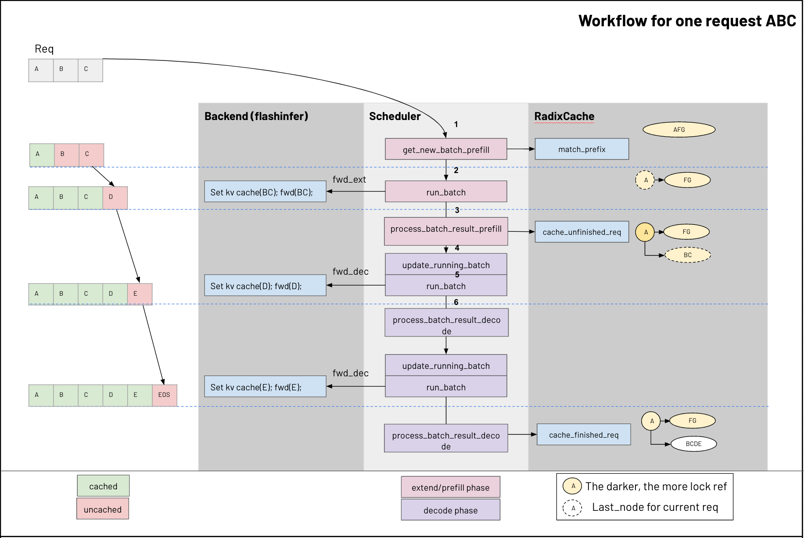

---

title: 从代码看 SGLang 的 KV Cache
created: 2025-11-02
tags:

- LLMInference

---

# 从代码看 SGLang 的 KV Cache

> [!INFO]
> 建议阅读 [SGLang Scheduler 技术变迁](https://tom-jerr.github.io/blogs/posts/SGLang%20Scheduler%20%E6%8A%80%E6%9C%AF%E5%8F%98%E8%BF%81/)后进行阅读，效果更好

实际上 SGLang 的 Cache 管理由三个组件构成 `tree_cache` 、 `req_to_token_pool` 和 `token_to_kv_pool_allocator` 。

- `tree_cache` 充当协调层 ，位于两个内存池之上。

- `req_to_token_pool` 存储了从请求到令牌位置的逻辑映射

- `token_to_kv_pool_allocator` 管理 KV 缓存槽的物理分配

`tree_cache` 通过 `match_prefix()` 返回现有的 KV 索引(`out_cache_loc`)，从而实现前缀重用 ，避免了重新计算和重新分配。

`tree_cache` 通过 `cache_finished_req()` 或者 `cache_unfinished_req()`(chunked prefill 使用) 来重新插入`prefix + new allocate` 的 `cache_loc`，然后释放冗余的 kv cache。


## 组件详解

### req_to_token_pool

这是从请求到其令牌的键值缓存索引的映射。这就是我们在注意力后端图中提到的 `req_to_token`

- 形状：最大允许请求数（由参数 `max-running-requests` 设置，用于指定可同时运行的最大请求数）\* 每个请求的最大上下文长度（由配置 model_config.context_len 设置）

- 访问：

  - Dim0： `req_pool_indices` 标识具体请求
  - Dim1：请求中标记的位置（从 0、1、2… 开始），用于标识请求中的特定标记。
  - Value: `out_cache_loc` ，表示令牌指向由 Dim0 和 Dim1 标识的与该令牌关联的 KV 缓存索引。

### token_to_kv_pool

`req_to_token_pool` 维护了 Request 到 token KV 缓存索引的映射关系， `token_to_kv_pool` 进一步将 token 从其 KV 缓存索引映射到其实际的 KV 缓存数据。

- Layout: Number of Layers _ Max Allowed Tokens Number _ Number of Head * Head Dimension
- 访问：
  - Dim0：`layer_id` 标识特定图层
  - Dim1：`out_cache_loc` 标识特定的 KV 缓存索引（空闲槽位）
  - Dim2：`head`
  - Dim3：`head_dim`
  - Value: k_buffer 的值为 cache_k ，v_buffer 的值为 cache_v ，表示实际的键值缓存数据。

请注意，我们通常会一次性检索整个层的 KV 缓存，因为我们**需要请求中所有先前 token 的 KV 才能进行 forward**。

### Example

| 请求     | prefix                  | 新chunk | decode             | 状态     |
| -------- | ----------------------- | ------- | ------------------ | -------- |
| **req₀** | [A, B, C]               | [D, E]  | 生成 [F] 后结束    | ✅先结束 |
| **req₁** | [A, B, C]（共享prefix） | [G, H]  | 生成 [I, J] 后结束 | 后结束   |

- 系统中已经有一个 prefix cache：

```python
prefix_cache = {"ABC": [0, 1, 2]}  # KV槽位

token_to_kv_pool = {
    0: (k_A, v_A),
    1: (k_B, v_B),
    2: (k_C, v_C),
}
```

**Chunked Prefill（仅分配新chunk部分**）

- `req₀` 新chunk: [D, E]
- `req₁` 新chunk: [G, H]
- prefix `[A,B,C]` 不再重算，直接复用槽位 `[0,1,2]`。

```python
req_to_token_pool = {
    0: [0, 1, 2, 3, 4],
    1: [0, 1, 2, 5, 6],
}

token_to_kv_pool.update(
    {
        3: (k_D, v_D),
        4: (k_E, v_E),
        5: (k_G, v_G),
        6: (k_H, v_H),
    }
)
```

**第一次Decode**

- `req₀` 生成新 token F（槽位7）
- `req₁` 生成新 token I（槽位8）

```python
req_to_token_pool = {
    0: [0, 1, 2, 3, 4, 7],
    1: [0, 1, 2, 5, 6, 8],
}

token_to_kv_pool.update(
    {
        7: (k_F, v_F),
        8: (k_I, v_I),
    }
)
```

`req₀` 已生成完毕，因此系统释放其 **非prefix槽位** `[3,4,7]`，prefix `[0,1,2]` 保留以供复用。`req₁` 继续进行 decode

```python
req_to_token_pool = {1: [0, 1, 2, 5, 6, 8]}

token_to_kv_pool = {
    0: (k_A, v_A),
    1: (k_B, v_B),
    2: (k_C, v_C),
    5: (k_G, v_G),
    6: (k_H, v_H),
    8: (k_I, v_I),
}
```

## 模型推理中的 KV Cache 管理流程

这里为了简化提取关键流程，我们假设设置 `page_size=1` ，即逐 token 精确匹配。

### Prefill

1. Step 1: Prefix Matching

   - 当有新请求到达时， `tree_cache.match_prefix()` 方法会遍历基数树以找到最长的缓存前缀
   - `match_prefix()` 函数返回 `prefix_indices` （键值缓存位置张量）和 `last_node` （表示匹配前缀的树节点）。这些 `prefix_indices` 直接指向可重用的物理键值缓存槽位。

1. Step 2: Memory Allocation

   - 为批次分配键值缓存时，系统会使用树缓存中已缓存的`prefix_indices`，并且仅为未缓存的标记分配新的缓存

   ```python
   # prefix reuse: 从树缓存中检索缓存的键值索引
   prefix_tensors = [r.prefix_indices for r in batch.reqs]
   # req_to_token_pool alloc: allocates slots for new tokens
   req_pool_indices = alloc_req_slots(batch.req_to_token_pool, ...)
   # token_to_kv_pool alloc: kv cache allocation for new tokens
   out_cache_loc = alloc_token_slots(batch.tree_cache, ...)
   # mapping: writes both cached and new indices to req_to_token_pool
   write_cache_indices(...)
   ```

1. Step 3: Cache Insertion

   - 计算完成后，新的键值缓存通过 `cache_finished_req()` 或者 `cache_unfinished_req()`被插入回树缓存中，插入过程中，树缓存：
     - 识别树中已存在的重复前缀（返回 new_prefix_len ）
     - 通过 `token_to_kv_pool_allocator.free()` 释放重复的 KV 索引
     - 使用新节点更新 radix tree
     - 增加/减少锁引用以保护缓存节点免受驱逐

1. Step 4：经过 Scheduler 调度后，modelrunner 进行模型真正执行，这里以 flash attention 作为后端为例

   - 获取 metadata，比如多个序列 `cur_q_len`，`cur_q_len` 以及每个序列的 token 需要的 KV cache 索引
   - 调用 `flash-attn.flash_attn_with_kvcache()`，将 page table 和 meta data 作为参数传入，就结束了 prefill 的过程

### Decode

Decode 的流程实际上与 Prefill 相似，只是分配内存时，每个 token 只需要分配 1 个即可，其余操作基本相同

### Summary

借用[^kvcache] 的一张图作为总结



## Reference

[^kvcache]: [KV Cache 代码解析](https://github.com/zhaochenyang20/Awesome-ML-SYS-Tutorial/blob/main/sglang/kvcache-code-walk-through/readme-CN.md)
