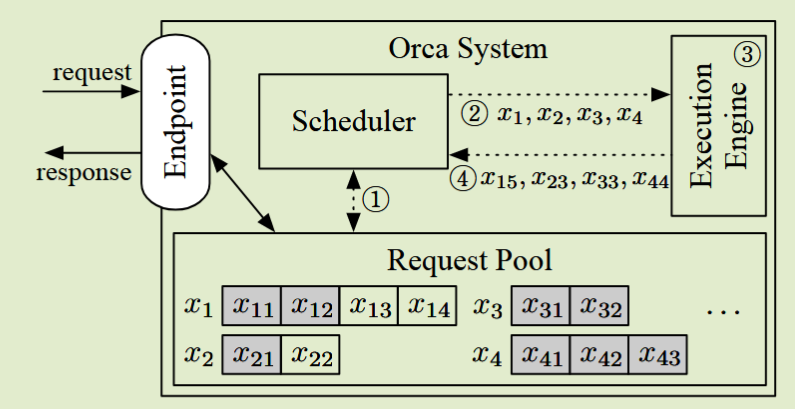
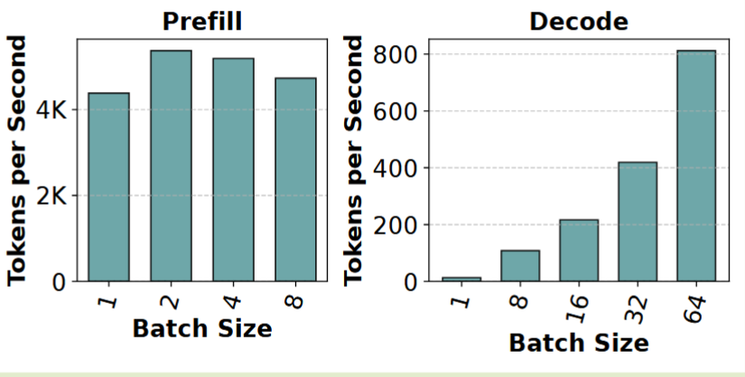
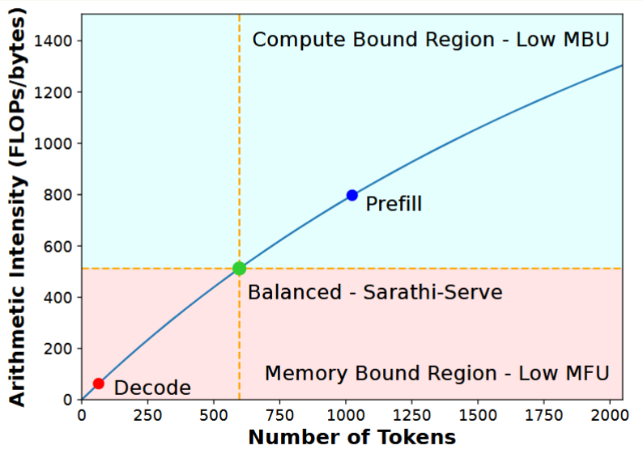
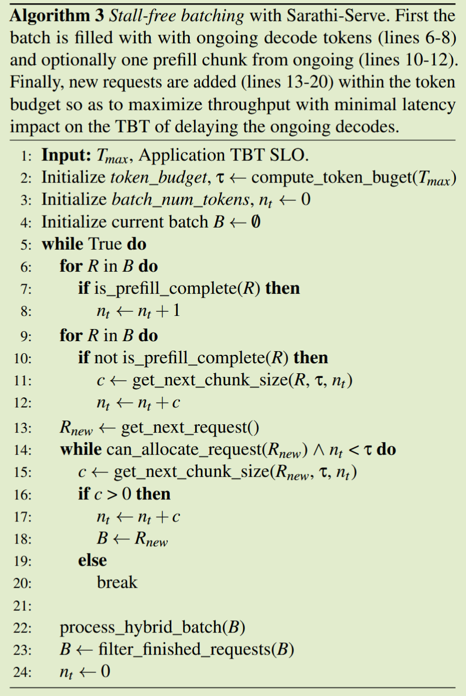
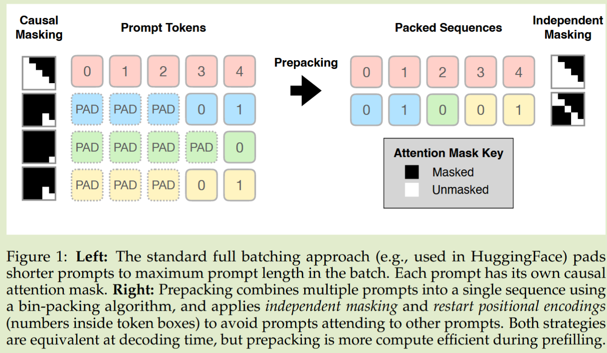

# 大模型推理服务中的 Batching

现在的大模型推理的框架基本都实现了 **Continuous Batching**，本文将从大模型推理服务为什么需要 Batching 开始，逐步讲解该领域的技术演进。

> [!WARNING]
> 这里大模型特指**自回归类大模型(GPT 类)**

## Two Phase in LLM Inference

LLM 推理由两个阶段组成 Prefill 阶段和 Decode 阶段

- **阶段 1：预填充 (Prefill) - 计算密集型**：在预填充阶段，模型并行处理输入提示中的**所有  Token，以计算生成第一个输出 Token 所需的键值缓存 (KV Cache)** 。
- **阶段 2：解码 (Decode) - 访存密集型**：在解码阶段，模型以自回归 (Autoregressive) 的方式\_**逐个生成 Token** 。GPU 需要为生成的每一个 Token  从高带宽内存 (HBM, 即 GPU 显存) 中重复**读取完整的模型权重和已累积的、规模庞大的 KV Cache** 。

## Why Batching?

对于 Prefill 来说，对所有 token 进行 Attention 和 MLP 操作，这是一个大矩阵乘法（`[batch_size x hidden_dim] @ [hidden_dim x hidden_dim]`），可以充分利用 GPU 的计算资源

而 Decode 阶段，一个 request 一次只会根据上一个 token 生成下一个 token，相当于做一个 **batch size = 1** 的矩阵乘法（`[1 x hidden_dim] @ [hidden_dim x hidden_dim]`）。这是一个极小的矩阵乘法——**GPU 无法被有效利用**

**Batching** 把多个用户请求在同一时间 “打包” 到一起，**让 GPU 一次计算多个序列的 forward**。
这样矩阵乘法从 `[1 x hidden_dim] @ [hidden_dim x hidden_dim]` 变成 `[batch_size x hidden_dim] @ [hidden_dim x hidden_dim]` 这时 batch_size 可以是几十甚至上百，从而显著提高 GPU 利用率。

## Batching Problems

除了**提升推理服务的吞吐量，降低 TTFT，TBT 延迟**，我们还需要为下面这三种 batching 问题提供高效的解决方案：

1. **两个请求都处于 Prefill 阶段**，但各自的输入 token 数量不同。

2. **两个请求都处于 Decode 阶段**，但当前处理的 token 索引（index）不同。

3. **两个请求分属不同阶段**——一个在 Prefill 阶段，另一个在 Decode 阶段。

实际上，这三个问题的产生与计算层的 kernel 息息相关，所以我们除了需要考虑调度层的优化，也需要对 kernel 进行改进，从 **padding 到 prepacking**，减小计算资源的浪费。

## Batching Technology Evolution

本节将系统梳理大模型推理服务中 **Batching 技术的演进路径**，阐述其如何从早期的静态批处理逐步发展到连续批处理 + chunked prefill。本节主要关于调度层的优化，计算层的优化略有涉及。

### Overview

最开始大模型推理服务是通过**静态批处理**处理多个请求，但是这带来了**计算浪费和大量空闲 GPU cycles** 等问题。静态批处理可以认为是 **request-level** 的调度，后续提出了**token-level** 的连续批处理，允许请求提前退出和立即开始推理。

但是真正高效解决了 Batching Problems 是多种技术的融合：

- **ORCA** 提出了 `iteration-level scheduling`，允许请求提前退出和立即进入。

- **Page Attention** 解决了问题 2，通过定制化的 kernel 实现了对变长 kv cache 的 attention 计算。而问题 1 由其他第三方库的 kernel 解决。

- **Chunked Prefill** 利用 FlashInfer 提供的 Kernel，解决了三个 Batching 问题。同时将 prefill 分块与 decode 共同组成一个 batch，可以**保证在 TBT 服务质量同时增加 decode 阶段的算术密集程度**。

### Static Batching(静态批处理)

**静态批处理（Static Batching）**：在推理开始之前，**固定一组请求（固定 batch size）**，将一组 $N$ 个具有不同长度 $L_1, L_2, \dots, L_N$ 的输入请求（prompts）强行转换为一个密集的、矩形的张量。该操作通过将**所有序列填充 (Padding) 到批次中“最长序列的长度” $L_{max}$ 来实现，最终形成一个形状为 $[N, L_{max}]$ 的张量**。

> [!NOTE]
> 标准的 MatMul Kernel **无法直接操作 “不规则” (ragged) 或可变长度的序列**。因此，填充成为了一种必需的“预处理”步骤，以便将多个独立请求 flatten 为 GPU 可以一次性处理的单一、大型计算任务。

#### Problems

这种处理方式来解决上面的 batching Problems 带来了一系列的问题：

- **问题 1：计算浪费 (Compute Waste)**
  - GPU 已经为计算整个 $[N, L_{max}, L_{max}]$ 矩阵（包括所有 padding Token 对）消耗了大量的 FLOPs。
- **问题 2：显存浪费 (VRAM Waste)**
  - 高显存占用主要归咎于 KV Cache。KV Cache 的大小与序列长度和批次大小成线性关系$Size = b \times t \times n\_layers \times n\_heads \times d\_head \times p\_a$，其中 $b$ 是批次大小，$t$ 是序列总长度。
  - 在静态批处理中，系统必须为批次中的**每一个序列**，预先分配一个足以**容纳完整填充长度 $L_{max}$ 的 KV Cache 缓冲区** 。
- **问题 3：空闲的 GPU cycles**

  - 请求在不同的迭代中结束，不能提前退出。只有整个 batch 中最长请求的结束，整个 batch 所有请求才能退出
  - 新的请求也不能立刻进行推理，必须等待整个 batch 推理结束

  

### Continuous Batching

`ORCA：A Distributed Serving System for Transformer-Based Generative Models` 首先提出了 `iteration-level scheduling` 的调度策略，实际上就是 `token-levle scheduling`。由于**不使用 padding**以及计算层 kernel 本身的限制，提出了 `selective batching` 策略，只对 **non-attention** 操作进行 batching

#### Motivation

- 我们不希望浪费计算资源，这里**不用 padding**，因为 padding 对计算资源是极大的浪费
- 我们希望尽可能减小 **TTFT 和 TBT**，所以提前完成的请求要**立即退出推理**以及后来的请求要**立即开始推理**
- 我们希望 Batching 任意一组大小不同的请求，但是存在三种情形使得一对请求无法在下一次迭代中共同批处理（length 不同，KV Cache 长度不同）：

  1.  **两个请求都处于启动阶段（initiation phase）**，但各自的输入 token 数量不同。
  2.  **两个请求都处于增量阶段（increment phase）**，但当前处理的 token 索引（index）不同。
  3.  **两个请求分属不同阶段**——一个在启动阶段，另一个在增量阶段。

#### Design

##### 迭代级调度（Iteration-level scheduling）

ORCA 的调度器可以在**每一次迭代后动态改变要处理的请求集合**：

- 调度器在每次迭代结束后都会收到返回结果，因此它能够**检测到请求是否已完成**，并可以**立即将生成的 tokens 返回给客户端**。
- 对于一个新到达的请求，该请求可以在当前迭代执行完之后**立刻获得调度机会**（即调度器可在下一次迭代选择它运行），从而显著**减少排队等待延迟**。



##### 选择性批处理（Selective Batching）

由于 GPU 要求输入需要 shape 完全对齐，所以即使采用 `iteration-level scheduling`，仍然不能对 Attention 实现 batcing。

> [!WARNING]
> `torch.bmm` 及其代表的标准计算范式，**在设计上要求所有数据在内存中是连续且统一的（contiguous and dense）**。它假设批次中的所有 K/V 缓存可以被组织成一个单一的、巨大的、形状规整的张量

所以这里只对**部分操作**进行批处理，💀 实际上这是对计算层的妥协：

- **Attention 操作不能处理这种不规则形状 tensor**，它必须知道每个 token 属于哪个请求，以确保注意力仅在同一请求的 tokens 之间计算
- **非注意力类（non-Attention）的矩阵乘法（Linear）、层归一化（LayerNorm）等操作可以直接 flatten 来处理**，因为这些操作**不需要区分 token 属于哪个请求**

Selective Batching 机制能够根据不同操作的特性做出区分：

- 对于 **Attention** 操作，拆分批次，在每个请求上**单独执行**；
- 对于其他 **非 Attention 操作**，不以请求为单位，而以 token 为单位进行批处理。


#### Problems

在 **Orca (OSDI’22)** 中，微软提出了“**迭代级调度（iteration-level scheduling）**”，让推理系统能动态接入和释放请求，从而打破了传统“静态批处理”的固定批次。但仍然有两个问题亟需解决：

- **仍然无法将不同阶段、不同长度的请求批在一起执行。**
  - Orca 用 **Selective Batching** 局部解决这一问题 —— 让非-Attention 层（如 Linear、LayerNorm）跨请求混合执行，但 Attention 仍需“按请求拆开”运行。
  - 💀 本质上，**它仍受限于「同形张量」的要求**，Batch 并非真正连续或无缝。
- **内存碎片：** 传统的内存分配器（如 PyTorch 中的）要求为 KV Cache 分配连续的(contiguous) VRAM 块(**外部碎片**)，并且会分配比 req 更长的内存作为预留空间(**内部碎片**)

---

### Page Attention

`Efficient Memory Management for Large Language  Model Serving with PagedAttention` 借鉴操作系统的虚拟内存和分页，将 KV Cache 分成不同的 physical block；系统为每个 request 维护一个 block table 映射逻辑 token 位置到实际显存的物理块位置；通过高度定制化的 PageAttention kernel 解决了**不同 token index 的 decoding request 批处理问题**

#### Movtivation

为了能够将请求  `i`  与其他请求批处理，系统必须提前为请求  `i`  分配一块连续的内存空间，这块空间必须大到足以容纳其**可能生成的最大序列长度**（例如 2048 或 4096 tokens）。这种策略导致了灾难性的内存碎片：

1. **内部碎片（Internal Fragmentation）：**  一个用户只输入了 10 个 token，生成了 190 个 token（总共 200 tokens）就结束了。但系统为他预留了 2048 tokens 的空间。这导致该请求 90% 的预留显存被白白浪费  。
2. **外部碎片（External Fragmentation）：**  随着请求的进进出出，GPU 显存被分割成许多小的、不连续的空闲块。当一个新请求（例如需要 1024 tokens 的连续空间）到达时，即使总的空闲显存（例如 2000 tokens）足够，但由于找不到**连续的 1024 tokens 空间**，系统也会因 OOM (Out-of-Memory) 而崩溃  。


为了解决这个问题，vLLM 提出了 PageAttention 机制以及对应的 Attention kernel 解决了**显存碎片问题**以及 Batching Problems 中，**不同 token index 的 decoding request 批处理**的问题。

#### Design

##### Page Attention

vLLM 的 PagedAttention 机制，其灵感来自于现代操作系统（OS）中成熟的虚拟内存和分页技术  。

vLLM 的内存管理器首先将 GPU 显存中用于 KV 缓存的区域，划分为数千个大小固定的“物理块”（Physical Blocks），例如，每个块固定为 16 tokens 的大小  。

当请求生成 token 时，系统会“按需”（on-demand）为其分配物理块  。一个 100-token 的 KV 缓存，现在被存储在 7 个（`100/16`  向上取整）物理块中。最关键的是，**这些物理块在显存中完全不需要是连续的** 。

这种“分页”管理方式带来了立竿见影的内存优势：

- **消除内部碎片：**  内存按需分配，最小单位是 1 个块（16 tokens），只有**最后一个块的尾部会有浪费**。
- **消除外部碎片：**  所有块的大小都相同，任何一个空闲块都可以被任何请求使用  。
- **实现高效共享：**  这一设计使得 KV 缓存的共享变得极其简单和廉价。例如，在并行采样（parallel sampling）或前缀缓存（prefix caching）中，多个逻辑请求（例如，具有相同 prompt 的 3 个请求）的 **KV 缓存可以指向相同的物理块** 。

##### Prefill First Schedule Policy

- vLLM 会尽可能多地调度新的 prefill，然后才恢复正在进行的 decode，从而引发 generation stall。(**牺牲 token 间延迟（TBT）来换取更高吞吐率**)

##### PagedAttention Kernel：异构批处理在计算层面的实现

vLLM 实现了一个高度定制化的 CUDA kernel，通常称为  `paged_attention_kernel`。这个 kernel 从一开始就是为了在 PagedAttention 提供的**非连续、分页的内存布局上执行 Attention 计算**而设计的  。这是一个典型的“内存-计算协同设计”（Memory-Compute Co-design）的范例  。

vLLM 的调度策略**只会存在 all decode 和 all prefill 的 batch**，PageAttention Kernel 处理的正是**包含不同长度 KV Cache 的 decode batch**；而 all prefill 则由其他的 batching kernel 处理，如 flashinfer kernel 或者 flash attention。

#### Problems

- **Prefill Block Decode**：它们在执行新的 prefill（预填充）时会**暂停正在进行的 decode（解码）**，显著增加 TBT。

---

### Chunked Prefill

`Taming Throughput-Latency Tradeoff in LLM Inference with Sarathi-Serve` 提出了 `chunked prefill` 和一种混合 `prefill` 和 `decode` 的 `stall-free scheduling` 调度策略。可以在保证 TBT 的服务质量同时，尽可能增加吞吐量。

> 在算术密集度比较低的 decode 阶段，与被分块的 prefill 任务一起作为一个 batch 进行批处理。

#### Motivation

- **Cost Analysis of Prefill and Decode**

  - 批处理极大地提高了解码阶段的吞吐量，但对预填充吞吐量影响很小

  

- **Low Compute Utilization during Decodes**

  - Decode 阶段的算术密集程度很低，Prefill 算术密集程度很高
  - 我们可以在 decode 阶段考虑加入 prefill，共同组成一个 batch

  

- **Throughput-Latency Trade-off**

  - vLLM 会尽可能多地调度新的 prefill，然后才恢复正在进行的 decode，从而引发 generation stall。(**牺牲 token 间延迟（TBT）来换取更高吞吐率**)

  - Orca 支持混合批次（prefill + decode 混合），而 vLLM 只能处理全 prefill 或全 decode 的批次。(**牺牲 token 间延迟（TBT）来换取更高吞吐率)**
    > [!WARNING]
    > 即便如此，Orca 仍无法完全避免 stall，因为**含有长 prompt 的 prefill 批次执行时间太长。**
  - FasterTransformer 采取 **严格的请求级（request-level）批处理**，不交叉 prefill 与 decode。**这种“先全部 decode，再 prefill 新请求”的方式保持稳定延迟，但 GPU 闲置时间多，吞吐率较差**。

- **Pipeline Bubbles waste GPU Cycles**

  - 我们在推理过程中识别出三种类型的流水线气泡（Pipeline Bubbles）：
    1. **$PB_1$ 型气泡**：由于相邻两个微批次中的预填充 token 数量不同而产生；
    2. **$PB_2$ 型气泡**：当预填充阶段与解码阶段交替执行时，由于两者计算时间不同而产生；
    3. **$PB_3$ 型气泡**：当不同微批次的解码阶段计算时间不同而产生。
  - 这种差异的根本原因在于注意力计算的开销取决于累积的上下文长度（即 **KV-cache 大小**），而该长度在不同请求之间是不同的。

  - 如果我们能够确保每个 micro-batch 执行的计算量大致相同，就能显著**减少这些流水线气泡**。

  

#### Design

**Sarathi-Serve 采用了：**

- **Chunked Prefill（分块预填充）**：将长 prefill 拆分为多个小块；
- **Stall-free Scheduling（无停顿调度）**：decode 与小块 prefill 交错执行，不会阻塞；

- **Uniform Batching（均匀批次）**：使得同一批内任务执行时间更接近，尽可能减少流水线气泡。


##### Chunked Prefill

**解码批次（decode batches）受制于显存带宽**，其**算术强度（arithmetic intensity）较低**。我们可以在解码批次中**叠加额外的 prefill 计算任务**，但是如果直接将如此**长的预填充**与解码批次混合执行，会导致**time-between-tokens（TBT）显著上升**。

**Chunked-Prefill（分块预填充）** 技术，将大型的预填充任务**拆分为多个小块（chunk）**，将这些分块后的预填充与解码任务**组合成合适 token 数量的批次**，从而在**不违反 TBT SLO（服务等级目标）** 的前提下，**充分利用解码阶段的算力潜能**。

##### Stall-free Scheduling

与 **Orca 和 vLLM** 不同，它们在执行新的 prefill（预填充）时会**暂停正在进行的 decode（解码）**。

**无停顿批处理（stall-free batching)** 则利用解码阶段中算术密集度的“空闲窗口”（arithmetic intensity slack）来插入 Chunked Prefill，从而不打断 decode 的执行。

- 优先处理上一轮的 decode batch
- 如果 budget 还有剩余，对 chunked prefill 后续的 chunk 进行处理
- 如果还有剩余，对新加入的 request 进行 chunked prefill，然后处理第一个 chunk



- Continuous Batching 结合 Chunked Prefill 基本构成了现在主流大模型推理服务框架的调度层，在保证 TBT 质量的情况下增加 GPU 利用率。

> 下一节将介绍计算层是如何适配不同的 batching 的

---

## Batching Kernel

实际上，我们需要新的 kernel 来适配上面三个不同的 Batching 情况。我们会介绍针对变长 prefill 的 prepacking 技术以及 vLLM 使用的 flashinfer 和 flashattention 内核函数。

### Prepacking Technology

该技术是解决变长 Prefill 的关键，把多个较短的 prompt 放入一个“容器”里，使得总长度接近某一最大长度，避免 padding。

- **合并序列 + 修改 Attention Mask 与位置编码 (Positional Encoding Restart)**
  - 在拼接多个 prompt 为一个序列后，引入了**独立掩码（independent masking）** 保证不同 prompt 之间 **不会互相 attend**。
- **一次 Prefill 调用多个 Prompts 的 KV-Cache 生成**
  - 利用上述打包机制，可以在一次模型调用中处理多个 prompt，从而生成多个 KV-缓存。减少 kernel 启动开销、减少填充 token 的计算浪费



### FlashInfer & Flash Attention

vLLM 等大模型推理服务系统会依赖专业的内核库如 FlashInfer 和 Flash Attention。

- 它们专门提供针对分页 KV Cache 的高效 Batch 注意力内核  。

#### FlashInfer

- 提供了一个 BatchPrefillWithPagedKVCacheWrapper，允许对多个请求带有分页 KV Cache 的 prefill 进行处理。

  - `qo_indptr`（length = num_sequences + 1）
    - 含义：`qo_indptr[i]` 是第 i 个 sequence 在 q 中的起始位置（offset），`qo_indptr[i+1] - qo_indptr[i]` 是该 sequence 对应的 query token 数（prefill 可能为 chunk 长度，decode 为 1）。
  - `kv_page_indptr`（length = num_sequences + 1）
    - 含义：把扁平页表 `kv_page_indices` 切分成每个 sequence 的页范围。第 i 个 sequence 使用的页是 `kv_page_indices[kv_page_indptr[i]:kv_page_indptr[i+1]]`。
  - `kv_page_indices`（flat list）

    - 含义：按序列拼接的物理页 id 列表，每个 entry 是一个 page 的全局索引（范围 `0..max_num_pages-1`）。kernel 用这个索引去从 `paged_kv_cache` 中取出该页的 K/V 数据。

  - `kv_last_page_len`（length = num_sequences）
    - 含义：对于每个 sequence，最后一个 page 可能未填满（只有 L 个有效 token），这里记录最后一个 page 的有效 token 数（若满页则等于 `page_size`）。用于计算 attention 时屏蔽 page 尾部的非法元素、避免越界与错误 attention。

```python
prefill_wrapper = flashinfer.BatchPrefillWithPagedKVCacheWrapper(
    workspace_buffer, "NHD"
)

prefill_wrapper.plan(
    qo_indptr,
    paged_kv_indptr,
    paged_kv_indices,
    paged_kv_last_page_len,
    num_qo_heads,
    num_kv_heads,
    head_dim,
    page_size,
    causal=True,
)

# =========================
# 逐层执行 batch prefill attention
# =========================
outputs = []
for i in range(num_layers):
    q = q_at_layer[i]
    kv_cache = kv_cache_at_layer[i]
    # 计算 batched prefill attention（可复用 plan）
    o = prefill_wrapper.run(q, kv_cache)
    outputs.append(o)
```

#### Flash Attention

- Flash Attention 提供了  `flash_attn_with_kvcache` 函数，它直接接受整个页表，它提供了对分页 KV 缓存（页面大小 > 1）的原生支持，允许 **“ragged tensor（不规则张量）”** 的处理，而  `flash_attn_varlen_func`  不支持页表。

> `flash_attn_varlen_func` 用于 MLA，直接计算 attention，**不从预存的 KV cache 读取**

```python
def flash_attn_with_kvcache(
    q,
    k_cache,
    v_cache,
    cache_seqlens: Optional[Union[(int, torch.Tensor)]] = None,
    page_table: Optional[torch.Tensor] = None,
    cu_seqlens_q: Optional[torch.Tensor] = None,
    cu_seqlens_k_new: Optional[torch.Tensor] = None,
    max_seqlen_q: Optional[int] = None,
    causal=False,
):
    """
    Arguments:
        q: (batch_size, seqlen, nheads, headdim)
        k_cache: (batch_size_cache, seqlen_cache, nheads_k, headdim) if there's no page_table,
            or (num_blocks, page_block_size, nheads_k, headdim) if there's a page_table (i.e. paged KV cache)
            page_block_size must be a multiple of 256.
        v_cache: (batch_size_cache, seqlen_cache, nheads_k, headdim_v) if there's no page_table,
            or (num_blocks, page_block_size, nheads_k, headdim_v) if there's a page_table (i.e. paged KV cache)
        cache_seqlens: int, or (batch_size,), dtype torch.int32. The sequence lengths of the
            KV cache.
        page_table [optional]: (batch_size, max_num_blocks_per_seq), dtype torch.int32.
            The page table for the KV cache. It will derived attention backend's req_to_token_pool.
        cu_seqlens_q: (batch_size,), dtype torch.int32. The cumulative sequence lengths of the query.
        cu_seqlens_k_new: (batch_size,), dtype torch.int32. The cumulative sequence lengths of the new key/value.
        max_seqlen_q: int. The maximum sequence length of the query.
        causal: bool. Whether to apply causal attention mask (e.g., for auto-regressive modeling).

    Return:
        out: (batch_size, seqlen, nheads, headdim).
    """
```

---

## Summary

在大模型推理系统中，**Batching 是吞吐量与延迟平衡的核心机制**。它的目标是：在不牺牲服务质量（TTFT、TBT）的前提下，最大化 GPU 的利用率，充分挖掘算力潜能。

下面我们将重新回顾上面的技术演进过程：从**静态批处理**到**连续批处理**再到**分块预填充**的演化脉络，体现了调度层与计算层的协同优化。

### 调度层

- 静态批处理（Static Batching）——**Padding**

  - **特点**：一次固定 batch 批量推理；所有序列填充到相同长度。
  - **优势**：实现简单；可直接利用标准 dense kernel。
  - **缺陷**：带来严重的 **计算浪费**、**显存浪费** 和 **GPU 空闲周期**；  
     无法动态接入请求或提前退出。

> [!NOTE]
> 本质：request-level batching，低效但易于实现。

---

- 连续批处理（Continuous Batching / Iteration-level Scheduling）——**迭代调度，非对齐执行**

  - **代表系统**：ORCA
  - **核心思想**：每次迭代后可动态调整批次组成，让已完成请求退出、新请求立即加入。
  - **关键优化**：Selective Batching —— 对 non-Attention 操作进行跨请求 batching，避免 padding。
  - **瓶颈**：Attention 仍需单独执行，仍受限于“同形张量”假设；  
     内存分配碎片严重，影响长期稳定性。

> [!NOTE]
> 本质：token-level batching，但受限于 kernel 能力。

---

- Page Attention ——**分页内存管理 + page attention kernel**

  - **代表系统**：vLLM
  - **创新点**：引入 KV Cache 分页机制，每个请求维护 block table，实现非连续显存管理。
  - **优势**：
    - 消除内/外部碎片；
    - 支持不同 token index 的解码请求批处理；
    - 极大提升内存利用率。
  - **局限**：
    - 仍采用 Prefill-First 策略，解码阶段会被 prefill 阻塞；
    - 吞吐与延迟存在显著权衡。

> [!NOTE]
> 本质：在计算层通过 PagedAttention Kernel 支持不同长度 KV Cache 的 batch。

---

- Chunked Prefill + Stall-free Scheduling ——**算力平衡与延迟共赢**

  - **代表系统**：Sarathi-Serve
  - **核心创新**：将长 prefill 分块（Chunked Prefill），与 decode 阶段交错执行（Stall-free Scheduling）。
  - **优势**：
    - 兼顾算术密集与访存密集阶段；
    - 消除 pipeline bubble；
    - 在保证 TBT SLO 的前提下提升吞吐率。

> [!NOTE]
> 本质：Prefill-Decode 混合批次调度，实现吞吐与延迟的动态平衡。

---

### 计算层

- **Kernel-Level 演进**：从 Padding 到 Prepacking

  - **Prepacking** 技术通过打包多个 prompt、修改 attention mask 和 positional encoding，实现变长 prefill 的一次性 KV-Cache 生成。

- **FlashInfer / FlashAttention** 则提供底层高效的 kernel 实现，支持 ragged tensor 与 paged KV cache，真正实现了计算层对变长序列的友好支持。

> [!NOTE]
> 本质：算子层的结构性优化，为 Continuous Batching 与 Chunked Prefill 提供算力支撑。

---
