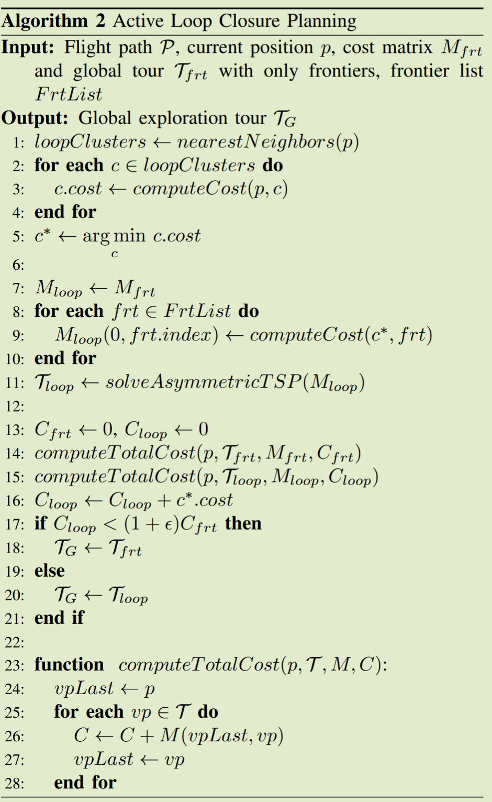
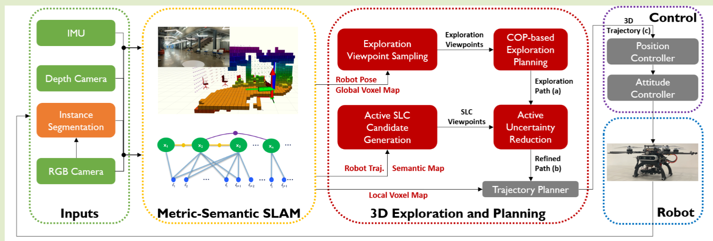
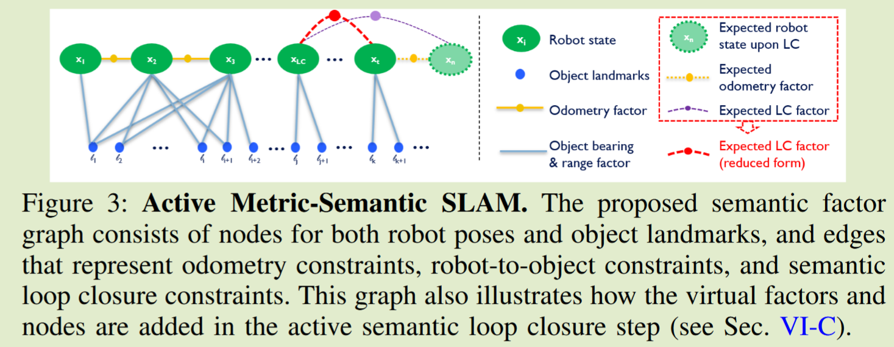
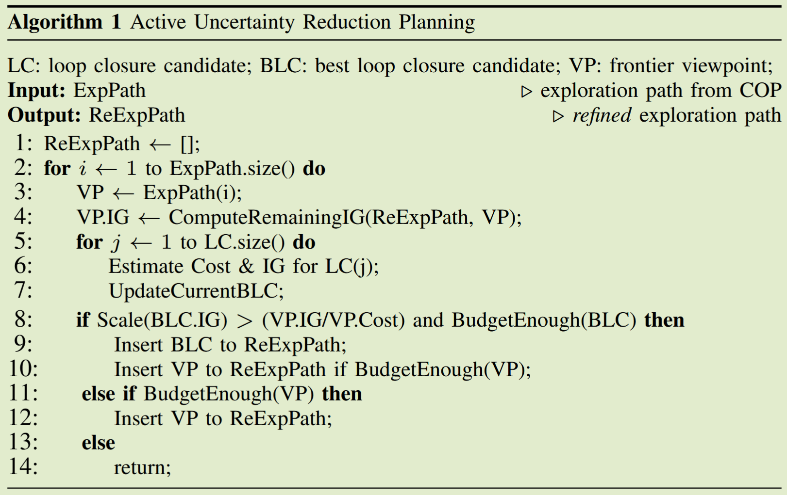

# 3D Active Metric-Semantic SLAM 论文精读

RA-L 2024
作者信息：Yuezhan Tao, 宾西法尼亚大学的 GRASP 实验室，主要研究方向为机器人自主导航和 3D 重建以及将这些东西与 AI 和 LLM 融合

## Abstract

主要解决了在 SWaP(Size Weight and Power)受限的平台上在无 GPS 的多层室内环境中**自主探索和 metric-semantic mapping**的问题

- previous work: 假设 localization 是精确的，会导致不确定性的积累；同时**减小不确定性的操作与探索未知环境的操作是冲突的**
- this work: 提出了一种平衡不确定性和探索的规划框架
  - 从传感器的原始信息提取的**稀疏信息**进行 metric-semantic SLAM
  - 与这个实验室其他的工作一起，组成了一个无人机自主探索系统
  - 对无人机姿态估计的误差减少效果显著
    > 机器人姿态估计的平移误差减少超过 90%
    > 偏航误差减少约 75%
    > 姿态估计和语义图的不确定性分别减少 70% 和 65%

## Introduction 总体介绍

2D 环境主要关心环境的几何信息；基于 3D 环境的 metric-semantic maps 同时关心环境的几何和语义信息，很多 metric-semantic SLAM 使用深度网络模型来提取环境的语义信息

> semantic objects: 提供稀疏但是信息化的环境表示
> 自主探索问题现在被广泛研究，但是之前的工作很少考虑 metric-semantic mapping 或 active metric-semantic mapping 问题；即使有一些工作考虑了 active metric-semantic mapping 问题，但是它们**将 mapping 和 localization 解耦**
> 解耦 mapping 和 localization 会导致不确定性的积累，会导致机器人偏离期望的轨迹

提出了一个统一的框架，解决 exploration, localization 和 metric-semantic mapping 问题

1. 主动语义闭环检测 (SLC) 模块和 SLC 算法：主动 SLC 模块使用稀疏但语义上有意义的环境表示来生成和评估 SLC 候选者。 SLC 算法建立在这种表示的基础上来检测闭环并估计相对姿态变换。
2. 权衡 exploraion 和 exploitation 的框架：前者被建模为**相关性寻路问题（COP）**，后者是使用 **SLC-enbaled 的 active uncertainty reduction planning** 来实现的
3. 用于完全自主无人机的 3D 探索和导航堆栈，具有实时 metric-semantic 定位和建图功能。

## Background

### 3D 自主探索

之前对 2D 环境的探索方法较多，对整个 3D 环境探索出现了一些新的方法

- 使用随机过程方程来检查 3D frontiers
- 使用信息论方法来选择**下一个最佳视图(NBV)**
- 将探索问题看作是 TSP 问题，对边界周围的 3D viewpoint 进行了采样，并在整个探索过程中规划 TSP tour。TSP 仅仅要求访问**all viewpoints**而不考虑每个 viewpoint 的信息
- This work 将探索问题建模为**相关性寻路问题(COP)**，它具有三个主要属性：
  - 顶点有与之相关的奖励
  - 顶点之间的奖励存在相关性
  - 预算约束限制了可以访问的顶点数量。
  - COP 是定向问题 (OP) 的推广，它在**利用顶点之间的相关性的同时最大化总奖励**。
    > 结合现有的定性和定量结果，**COP 对环境的建模比 OP 和 TSP 更准确**。因此，COP 是我们进行 3D 自主探索路径规划的选择。

### Active Semantic SLAM

metric-semantic SLAM 与传统 SLAM 的不同之处在于，它不仅利用传统的几何特征，如点、线或平面，而且还利用语义特征，如**object classes**。

- 它有助于机器人定位，因为 object 特征信息更丰富，存储效率更高，并且对 viewpoint 变化具有鲁棒性。当在无法使用 GPS 的非结构化环境中与自主导航实时集成时，这一点尤其有用。
- 其次，它为机器人提供了对环境的高层次的理解，这种先进的感知能力使机器人能够执行具有语义意义的任务规范的任务，例如主动收集感兴趣 object 的信息或协作调查环境以发现 objects

我们利用环境中的稀疏语义 landmark 来减少探索过程中机器人状态估计的不确定性。我们通过积极建立 Semantic Loop Closure 来实现这一目标。具体来说，目标是重新审视 SLC 的 viewpoint，即发现一组 semantic object 来减少 SLAM 中的不确定性。

> 现有方法可以利用语义图进行被动闭环 ，或使用几何观察进行 opportunistic loop closure。

我们建议将语义地图用于主动 SLC，这使得机器人能够在更大范围内跟踪环境，**有效检测和估计闭环时的相对变换**，并同时优化姿态估计和 semantic mapping 的精度

> 路标 (Landmark) 是环境中一个稳定、可识别、且能被重复观测的特征点。

- Active Loop Closure: 该算法的本质是一个决策过程，用于在两个选项中做出选择：
  - 纯探索 (Explore-Only)：继续执行只访问未知区域边界（Frontiers）的最优路径 T_frt。
  - 探索与闭环结合 (Explore-with-Loop-Closure)：先去一个可以进行闭环检测的地方校准位置，然后再去探索未知区域。(将整个探索所有 frointers 看作是 ATSP 问题)
    

## Method

### Goal

在**给定的探索预算**内最大限度地提高 3D 空间中给定区域的 metric-semantic 图的准确性。

- 有效地探索环境: 我们将问题建模为 COP，其解决方案提供了一条长期探索路径
- 积极减少其状态估计和 metric-semantic 图的不确定性: 我们通过 active SLC、权衡 metric-semantic SLAM 中的探索和不确定性减少来完善路径。

### Hardware Platform

使用了一个 250 轴距的无人机平台，配备了一个 Intel Realsense D455 RGB-D 相机和一个 VOXL VIO Module，以及一个 NUC(i7 处理器)作为机载计算单元。

> VIO 数据与 IMU 数据一起被输入无迹卡尔曼滤波器 (UKF) 以获得 150 Hz 的姿态估计

### System Overview

1. 使用预先训练的深度神经网络（YOLO-V8）模型对 RGB 图像执行实例分割。
2. metric-semantic SLAM 模块接收这些输入并估计
   - 用于**采样探索 viewpoint 的 global voxel map**
   - 用于轨迹规划的 local voxel map
   - 优化的机器人姿态估计
   - 包含 object landmark 的语义图以生成 SLC 候选。
3. 基于 COP 的探索规划算法接收探索 viewpoint 并规划一条由一系列 viewpoint 组成的长视野探索路径 (a)，其目的是在给定旅行预算的情况下最大化信息增益 (IG)。
4. 然后通过插入 SLC viewpoint 来完善该探索路径，以便机器人可以在探索与减少不确定性之间进行权衡。**细化路径 (b) 用于生成低级轨迹规划算法的目标**，该算法不断地在局部体素图中重新规划动态可行的 3D 轨迹 (c)

### Metric-Semantic SLAM

基本流程：

1. 快速位姿估计 (VIO)
   系统将深度图像和 IMU 数据输入到视觉惯性里程计 (VIO) 算法中。VIO 会快速估算出机器人当前时刻的位姿（位置和姿态）。这个估计速度快，但在长时间运行时会产生累积误差（漂移）。
2. 更新高分辨率局部地图
   使用 VIO 提供的实时位姿，系统通过射线投射 (Ray-casting) 的方式，将深度相机的最新读数更新到以机器人为中心的高分辨率局部地图中。这张地图非常精细，能清晰地描绘出机器人身边的障碍物。
3. 语义检测与建模

   - 系统从深度相机的点云数据中，运行物体检测算法。它识别出预先定义好的物体类别，比如长方体 (Cuboid) 和圆柱体 (Cylinder)。
   - 一旦识别成功，它会为**每个物体建立一个简化模型**，例如提取出长方体的质心、尺寸，或圆柱体的底面圆心、中轴线和半径。**这里是提取质心**

4. 数据关联

   - 对于新检测到的每一个物体，系统需要判断：这是一个全新的物体，还是之前在地图上记录过的同一个物体？
   - 它会使用当前最佳的位姿估计，将观测到的物体转换到全局坐标系下，然后与**地图中已有的路标 (Landmarks) 进行最近邻匹配**。
     > 匹配成功，则加强对该路标位置的认知；匹配失败，则在地图中创建一个新的路标。

5. 构建并更新因子图

   - 当机器人移动到某个“关键位置”（Key Pose）时，系统会在因子图 (Factor Graph) 这个“证据网络”中加入新的信息：
     - 添加位姿节点: 将机器人当前的关键位姿作为一个新变量加入图中。
     - 添加里程计因子: 根据 VIO，在**新的位姿节点和上一个位姿节点之建立连接**，表示“我从 A 点移动到了 B 点”。
     - 添加语义因子: 对于**每一个成功关联的物体，在代表机器人当前位姿的节点和代表该物体的路标节点之间，建立一个自定义的形状约束**（长方体或圆柱体因子）。这个约束表示“我在 B 点，从这个角度看到了那个物体”。

6. 全局优化
   周期性地（或当检测到回环等重要事件时），系统会启动 GTSAM 优化器。优化器会审视整个因子图中的所有证据（**包括机器人全部的历史位姿和所有的物体观测**），
   > 基于因子图的优化方法：主要思想是定义一个似然函数。这个函数从数学上描述了在当前地图。和机器人姿态下，我们对新测量的“惊讶程度”。SLAM 系统的目标是调整地图和姿态，以**最小化所有测量中的这种误差**。

### Chanllenges in SLAM

- 检测回环: 在于**对齐两个只有部分重叠的地图**。如果这两张地图是以稠密点云的形式编码的，那么这个问题在计算上会非常困难。
  - 现有的流行方法要么是在估计数据关联和执行点云对齐之间进行迭代，要么是求解该问题的凸松弛形式。
  - 然而，这些方法要么容易陷入次优的局部最小值，要么需要大量的计算资源。此外，**由于视角的改变，它们也可能无法找到匹配。**

#### Hierarchical Volumetric Mapping

Hierarchical Volumetric Mapping 模块维护两个具有不同分辨率的地图：低分辨率（以 $f_{gr}$）global map 和高分辨率（$f_{lr}$）自中心的 local map。前者用于边界检测、视点采样和基于 COP 的探索规划，其大小不小于实验区域。后者用于规划安全的局部轨迹，并且具有较小的尺寸（$f_{lx}×f_{ly}×f_{lz}$）。

- 如何建图：当机器人接收到姿态信息和深度图像时，会进行射线投射，将深度图像的读数投影到 3D 空间中，然后**对所有被射线穿过的体素（voxels）的占据概率进行基于对数几率 (log-odds) 的更新**。
  > 实际上 voxel map 是一个稀疏的三维网格，每个体素存储一个占据概率值，表示该体素被障碍物占据的可能性。
- 如何更新：两张地图异步更新
  - 全局地图使用来自 metric-semantic SLAM 模块的优化位姿进行更新
  - 而局部地图则使用来自 VIO 算法的估计位姿进行更新。
  - 每次地图更新后，一个包围全局地图中**已更新区域的边界框 (bounding box) 会被记录下来**，并用于后续的前沿检测。

#### Semantic SLAM

- 语义建模：**将物体简化成质心**
- 自定义因子：
  - **两个连续关键位姿之间的相对变换作为里程计因子**
  - **检测到的物体的估计质心位置作为距离和方位角因子**
  - 由于语义地图的稀疏性，我们的因子图会在机器人的整个任务期间持续跟踪历史测量数据，并以**全局一致的方式**优化机器人位姿和物体路标点。

> 整个系统建立在 GTSAM 之上，这是一个流行的 C++库，用于解决优化问题

#### Semantic Loop Closure (SLC)

- Input: 已探索 map 以及当前位置的 map
- **只对齐检测到的 Object，而不是对齐稠密点云**，这是一个基于搜索的过程，它通过按基数递减的顺序遍历 A(已探索 map 中的 objects) 和 B("local" map 中的 objects) 变体的笛卡尔积，并存储匹配质量尽可能高的配对

### Exploration with Active SLC

基本流程：

1. Frontier Detection
   - 使用全局 voxel map 来检测前沿 (Frontiers)，即机器人已探索区域与未知区域之间的边界。
   - 通过检查每个体素的邻居状态，识别出那些与未知区域相邻的已知体素，并将其标记为前沿。
2. Viewpoint Sampling

   - 在前沿区域，系统会虚拟地采样一系列候选的“最佳观测点”。
   - 系统会评估从每个候选点出发，预期能观测到多少新的未知区域

3. Exploration Path Planning

   - 机器人使用一个高级规划算法（文中提到了 COP-based planning），从所有候选点中选出最优的下一个目标点。

   - 决策的依据通常包括：信息增益最大化（能看到最多的新地方）、移动成本最小化（路程最短、最安全）、任务目标等。。

#### Frontier Detection and Exploration Viewpoint Sampling

- 使用增量式前沿检测和视点采样模块。地图更新后，边界框（bounding box）内所有现存的“前沿”都会被重新评估

  - 如果已被观测到则将其移除。
  - 新的前沿会被检测出来并进行聚类。如果一个“前沿簇”大于期望的尺寸，它会被递归地分解成更小的簇，以便机器人能用其有限的传感范围和视场角覆盖它。

- 针对每个前沿簇，系统会通过一个两步过程来采样三维视点。
  - 在簇的质心周围均匀地**采样候选位置**
  - 在每个候选位置上均匀地**采样多个偏航角**
  - 系统会为所有采样的偏航角估计基于 **“单元格计数”的信息增益(IG)**，而无需进行信息预测。其中，具有最大估计 IG 的候选偏航角被选为该位置的最终采样偏航角。
  - 最终，我们将所有采样姿态中具有**最高估计 IG 的那个作为该前沿簇的最终 view point，即下一个目标点**

#### COP-based Exploration Planning

- 与其他组件异步执行，机器人会继续执行当前的精化路径，直到收到一条新的精化路径为止
- COP 在一个给定的完全图 \( G = (V, E) \) 上运行，其中 \( V \) 是顶点集，\( E \) 是边集。 每个顶点 \( v \in V \) 都有一个与之关联的奖励 \( r*v \ge 0 \)，每条边 \( (i, j) \in E \) 都有一个旅行成本 \( c*{ij} \ge 0 \)。 边的成本是对称的，即 \( c*{ij} = c*{ji} \)。

- 顶点代表采样的**视点（viewpoint）**；
- 边代表视点之间的**最优路径（optimal path）**；
- 顶点 \( v \) 的奖励 \( r_v \) 是在该视点的**信息增益（Information Gain, IG）**；
- **边的成本通过 **A\*** 算法计算得到**。

---

##### 相关函数定义

- 相关性：对于每对顶点 \( u, v \in V \)，定义相关函数 \( w(u,v) \in [0,1] \)，计算两个视点在无遮挡假设下的视野重叠百分比来获得相关性。  
  相关函数是对称的，即：
  $$
  w(u,v) = w(v,u)
  $$

---

##### COP 优化目标

- COP 的目标是在满足**总旅行成本预算 \( B \)** 的前提下， 找到一条**访问部分顶点的游览路径**（tour） \( \pi \)， 使得**收集到的总奖励最大化**。

设：

- \( x_v \in \{0,1\} \)：顶点 \( v \) 是否被访问；
- \( y\_{ij} \in \{0,1\} \)：边 \( (i,j) \) 是否在游览路径中从顶点 \( i \) 走向顶点 \( j \)。

则目标函数为：**直接访问得到的奖励加上通过相关性间接获得的奖励**

$$
R(\pi) = \sum_{v \in V} r_v (x_v + \omega_v (1 - x_v)) \tag{7}
$$

---

##### 约束条件

**相关性约束：**

$$
\omega_{v} - \sum_{u \in V \setminus \{v\}} w(u,v) x_u \le 0 \tag{8}
$$

其中，变量 \( \omega_v \) 模拟了除顶点 \( v \) 自身外，由其他顶点收集到的那部分奖励 \( r_v \)。  
由于 \( \omega_v \) 处于最大化目标中，它的值总是为 1 或相关性总和的较小者。

---

**预算约束：**

$$
\sum_{(i,j) \in E} (c_{ij} y_{ij} + c_{ji} y_{ji}) \le B \tag{9}
$$

该约束限制了游览路径的总旅行成本。

在实现中，预算 \( B \) 通过以下方式启发式设定：

- 估算机器人当前位置到若干附近前沿（frontiers）的成本，并乘以一个常数因子， 以限制游览路径长度并降低计算复杂性。

---

**路径约束：**

$
y_{ij}, y_{ji} \in \{0,1\}, \quad \forall (i,j) \in E
$
$
\omega_v \in [0,1], \quad x_v \in \{0,1\}, \quad \forall v \in V
$

- 游览路径约束确保路径中没有不相连的子路径，
- 至少有一条连接到被访问顶点的边被遍历。

---

##### 算法复杂度与实现

COP 是一个 **NP-hard** 问题，其 **MIQP（Mixed Integer Quadratic Programming）** 形式不适用于探索任务中的在线计算。因此，this work 采用了中提出的**贪婪构建启发式算法（Greedy Construction Heuristic）** 的简化版本。

算法流程如下：

1. 从一条空路径开始；
2. 贪婪地选择要添加的顶点；
3. 基于已选顶点计算高效的游览路径；
4. 重复上述步骤，直到违反预算约束。

顶点选择的贪婪标准定义为：

$$
\text{value}(v) = r_v + \sum_{u \in V \setminus S} r_u w(v,u) - \sum_{u \in S} r_u w(u,v)
$$

其中 \( S \) 是当前已选择的顶点集合。算法复杂度为 \( O(|V|^3) \)。

> (v 自身的价值) + (v 能带来的新视野的附加价值) - (v 与现有路径重叠造成的冗余成本)

- 在实践中，通过选择合适的前沿簇大小 $f_{sz}$，可以将环境中的视点数量限制在 10 个以下
- 这样即可在机载设备上使用 **Bellman-Held-Karp 算法** 实时计算已选顶点的最优游览路径。

---

##### 动态重规划机制

如果满足以下任一条件，探索游览路径将被重新规划：

1. 当前环境中一小部分 ($f\_{r1}) 的前沿发生变化；
2. 已执行的精化探索游览路径的比例超过给定阈值 ($f\_{r2})

第二个条件也称为 **滚动时域规划（Receding-Horizon Planning）**。

#### Active Semantic Loop Closure

- 在机器人构建 metric-semantic 地图的同时，它需要生成**候选的 SLC 子图和 viewpoint 配对**。这个过程首先通过聚类语义路标来找到子图，然后再选择相应的 viewpoint。

1. 我们使用 DBSCAN 算法在欧几里得空间中对语义路标的质心进行聚类。

   > 请注意，由于我们从**每个路标获得的测量是距离和方位角，并且数据关联是先验未知的**，我们至少**需要三个路标才能在回环闭合时唯一地确定机器人的位置和偏航角**，这在我们之前的工作中有详细解释。

2. 对于每个子图，我们需要生成一个可到达、可检测且信息丰富的视点。

   - 可到达 (Reachable): 我们从因子图中的**关键位姿集合**（机器人过去曾到达过的位置）中选择视点。
   - 可检测 (Detectable): 我们进一步限制关键位姿的选择，要求**子图中的任何一个路标都在传感范围**之内。
   - 信息丰富 (Informative): 为了最大化 SLC 可能带来的信息增益，**系统会选择所有满足上述条件的最旧的关键位姿（即最早被添加到因子图中的位姿）作为视点**。
     - IG 的计算通过插入虚拟因子来进行计算，后面会谈到

3. 机器人通过在这样一个**SLC 视点进行全景扫描（原地偏航旋转）来建立回环**。

> 橙色圈起来的是 slc 子图，紫色框圈起来的是 slc 子图-viewpoint 配对，红星是 slc viewpoint，黑色线是 cop 预测的轨迹，红色线是 active slc 进行 refine 后的轨迹

- SLAM **会维护一个协方差矩阵**（Covariance Matrix，Σ）。这个矩阵从数学上表示了整个地图中每个估计位置和地标的不确定性
- 虚拟因子计算 IG：在语义因子图中添加一个 **“虚拟因子”(virtual factor)** 来实现计算 IG
  - 从概念上讲，在这一步中，我们添加了两个因子：一个期望里程计因子和一个**期望回环因子**。前者将机器人带到回环视点($x_n$)以便与图中的一个现有关键位姿($x_lc$)建立 SLC
  - 由于我们的回环视点是从图中的现有关键位姿之一采样得到的，因此$x_n$和$x_{lc}$是同一个节点。所以，该过程简化为在**当前位姿$x_t$和回环视点$x_{lc}$之间添加一个期望里程计因子，其运动噪声根据预期的旅行距离进行缩放**。
  - 对于一个长时程的路径，我们可以顺序执行此类操作，以评估具有多个 SLC 的一系列动作的 IG。这模拟了机器人直接导航以其带噪声的里程计测量来建立 SLC 的效果。
  - 这个虚拟因子保持了（位姿和路标的）估计值不变，但改变了因子图的协方差矩阵。我们通过计算添加此虚拟因子前后协方差矩阵的迹 (trace) 的减少量，作为 IG 的度量：
    $$
    IG = tr(Σ_t) − tr(Σ_{t+1})
    $$
    其中 tr 表示协方差矩阵的迹。一旦我们评估了沿给定路径的 IG，我们就会从因子图中移除这些虚拟因子，这样它们就不会改变因子图的估计值。
    

#### Active Uncertainty Reduction Planning

该算法通过平衡探索的 IG 和 SLC 的不确定性减少，将 COP 模块的计划探索路径转换为细化路径

- 在每次迭代中，系统会通过从后续探索视点的 IG 中减去已被精化路径中视点所收集到的相关信息，来**评估该视点的剩余信息增益。**
- 然后，通过 A\*算法评估每个 SLC 候选的成本，并使用上面提到的方法计算其 IG。如果预算允许添加最佳的 SLC 候选，我们会进一步比较后者的缩放后 IG 与即将到来的探索视点的效用（即性价比指数）。比较结果决定了是否应将候选 SLC 插入到精化探索路径中。
- 我们只允许在**两个连续的探索视点之间插入一个 SLC 候选**，这也限制了总运行时间复杂度。

#### Drift Compensation and Trajectory Planning

- 由于 SLC（语义回环检测）会引发间歇性的漂移修正，其平滑性可能会受到影响。
  > 朴素想法：语义 SLAM 估计的无人机位姿直接输入给规划器和控制器。然而，与基于滤波的 VIO 能给出平滑位姿估计不同，语义 SLAM 估计的位姿可能在局部上并不平滑（例如，由于回环闭合）。这会导致无人机偏离现有轨迹
- 维护分离的 SLAM 和里程计参考系

  - 里程计参考系：robot’s controller, local mapper, VIO, and trajectory planner
  - SLAM 参考系：exploration planner, semantic SLAM, and global mapper

- 局部轨迹优化：将轨迹分解为多个多项式，目标是最小化位置的二阶导数的积分同时满足**几何约束和连续性约束**
- 预测性信息感知 yaw planning：**预测的信息增益和朝向语义感兴趣物体(SoI)的相对视角**来优化偏航角
  - 搜索偏航基元 (yaw primitives)，以获得一个**具有高价值信息的参考偏航角**
  - 基于搜索的程序识别出最优的参考偏航序列后，我们**直接求解一个最优的偏航轨迹**

## Experiments/Evaluation/Results

TODO

## Conclusion

开发了一种使用自主无人机对 GPS 无法识别的室内环境进行 3D 探索和 metric-semantic 映射的系统。

1. metric-semantic SLAM
2. 基于 COP 的探索规划
3. active SLC
4. 主动不确定性减少规划

它利用环境的抽象，包括**从度量地图和稀疏语义地图中提取的探索视点，显着减少实时探索和主动定位的计算负载**。通过广泛的现实世界实验，我们展示了我们提出的系统在使无人机能够规划长视野路径、权衡探索和利用方面的有效性。定性结果表明，我们的系统使无人机不仅能够探索多层环境并构建 metric-semantic 地图，而且还能间歇性地建立 SLC 以提高地图的质量。定量评估表明，我们的 SLC 模块可以帮助机器人显着降低位置和姿态估计误差和不确定性。

## My Summary

之前大多数 metric-semantic slam 将探索问题抽象成 ATSP 问题，忽略了视点之间的相关性，这篇文章将探索问题建模成 COP 问题，考虑了视点之间的相关性和探索成本问题，对无人机这种 SWaP 受限设备有必要

设计了 SLC 模块并利用主动 SLC 在 COP 规划的路径中插入 SLC 视点，权衡探索和不确定性减少，减少了无人机累计漂移。

**整体流程再梳理**

- Metric-Semantic SLAM 模块在 SLOAM 上修改，初始位姿估计由卡尔曼滤波来做，使用 GTSAM 来做因子图优化[^sloam]
- Frontier detection 和 viewpoint sampling 模块：借鉴自 SEER 论文[^seer]，使用增量式前沿检测和视点采样模块，选取信息增益最大的视点作为下一个目标点
- COP-based exploration planning 模块：将探索问题建模为 COP 问题，使用贪婪构建启发式算法来求解 COP 问题
- Active SLC 模块：使用 DBSCAN 对语义路标进行聚类，从因子图中的关键位姿集合中选择 SLC 视点，使用虚拟因子来计算 IG
- Active uncertainty reduction planning 模块：在 COP 规划的路径中插入 SLC 视点，权衡探索和不确定性减少
- 局部轨迹规划模块：借鉴了 Geometrically constrained trajectory optimization for multicopters[^gofei]，使用了多项式轨迹规划
- yaw planning 模块：借鉴了 SEER: Safe Efficient Exploration for Aerial Robots using Learning to Predict Information Gain[^seer]，使用了基于搜索的 yaw primitives

## Reference

[^gofei]: [Geometrically constrained trajectory optimization for multicopters](https://arxiv.org/abs/2103.00190)
[^seer]: [SEER: Safe Efficient Exploration for Aerial Robots using Learning to Predict Information Gain](https://arxiv.org/abs/2209.11034)
[^sloam]: [Active metric-semantic mapping by multiple aerial robots](https://arxiv.org/abs/2209.08465)
