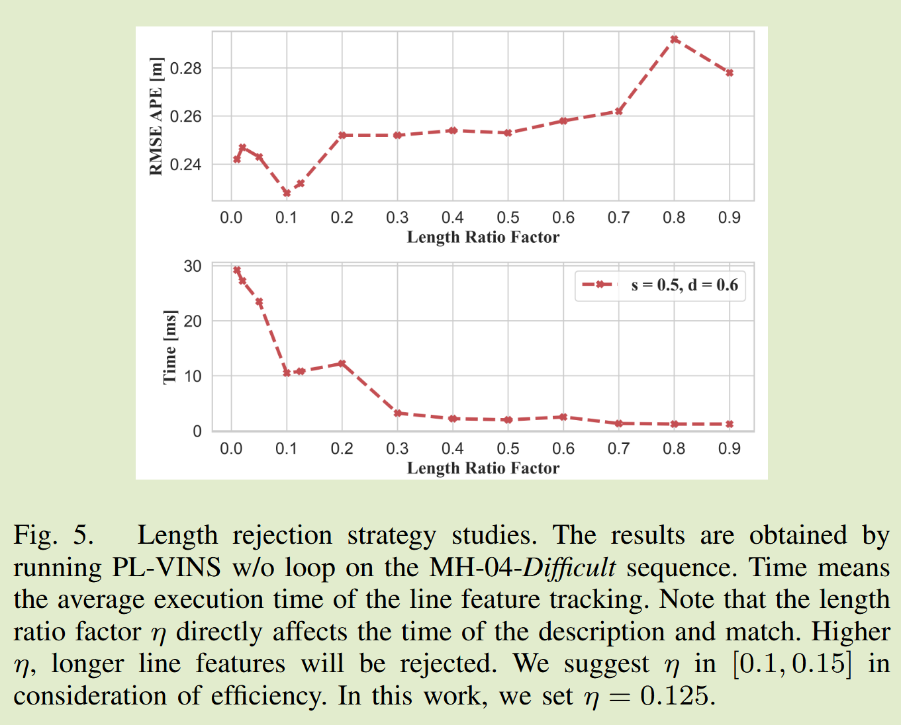

# PL-VINS: Real-Time Monocular Visual-Inertial SLAM with Point and Line Features 论文阅读笔记

## Abstract

在人为环境中，单纯的特征点提取方法对姿势估计来说不够，与线特征结合可以提升鲁棒性。当前做法准确度搞但是缺乏实时性。

1. 通过修改 LSD 算法过滤下一帧图像中可能被筛选掉的短线特征，加速算法。
2. 用普吕克坐标表示线特征，提高准确率
   > 普吕克坐标（Plücker coordinates） 是一种用六个齐次坐标来表示三维空间中直线位置和方向的方法。
   >
   > 你可以把普吕克坐标看作是一种为三维空间中的直线“定制”的特殊地址。通常，我们用一个点和一个方向向量来定义一条直线，而普吕克坐标则用两部分来描述它：
   >
   > - 方向向量：这是一个三维向量，代表了直线的方向和朝向。
   >
   > - 矩向量：这是一个三维向量，描述了直线相对于坐标原点的位置。它的计算方式是直线上任意一点的位置向量与方向向量的叉积。
3. 基于 VINS-Mono 框架进行优化
   - 前端：特征提取的优化，从单纯的点特征提取到点线结合
   - 后端：增加线特征的约束条件

## Intro 总体介绍

为了 cost 和精确度的 trade-off，大量场景仅使用一个单眼相机和 IMU 传感器。现有的单目视觉惯性 SLAM 系统大多依赖于点特征，但在**低纹理环境中表现不佳**。线特征在这些环境中更具鲁棒性，因为它们能捕捉到更多的结构信息。然而，结合点和线特征的系统通常计算复杂度较高，难以实现实时性能。

- 现有的解决方案使用 OpenCV 的 LSD 算法进行线特征提取，但 LSD 算法本身并不是为 pose estimation 设计的，存在**计算量大**同时检测出大量短线段的问题，这些**短线段在后续的匹配和优化中往往被过滤掉，导致计算资源浪费**。
- PL-VINS 优化了 LSD 算法，更关注决定性的线段并拒绝短线段。同时使用 Plücker 坐标来表示线特征，相对于两点表示线段，可以更好地跟踪两帧之间的特征点。优化了后端的滑动窗口，结合点线特征以及 IMU 进行高效优化。

## 背景知识的相关工作

### MSCKF

1. 核心状态向量：系统的状态向量 只包含 IMU 的状态，这包括了机器人的姿态、速度、位置，以及 IMU 的偏置（bias）。其维度是固定的（通常是 15 或 16 维），不会随着时间增长。

   $$
   \mathbf{x}_{IMU} =
   \begin{bmatrix}
   q_{IW} \\
   p_{IW} \\
   v_{IW} \\
   b_g \\
   b_a
   \end{bmatrix}
   $$

   > 其中 q 是姿态四元数, p 是位置, v 是速度, $b_a$ 和$b_g$ 分别是陀螺仪和加速度计的偏置。

2. 状态扩增 (State Augmentation)：当相机捕获一帧新的图像时，该时刻相机的位姿（从 IMU 状态加上外参可以得到）会被**临时加入（扩增）**到状态向量中。这样，状态向量中就保存了最近 N 个相机位姿的“克隆”。

3. 特征点跟踪：系统会持续跟踪同一个三维空间点在不同图像帧（也就是不同相机位姿）中的投影位置。例如，一个特征点 f 可能在第 i, j, k 帧图像中都被观测到。

4. 约束的构建与利用：当一个特征点的跟踪结束时（比如被遮挡或移出视野），MSCKF 就利用这个特征点的整条观测轨迹来构建一个几何约束。

- 它首先对这个特征点的三维位置进行三角化（Triangulation）。
- 然后，将这个估计出的三维点反向投影回所有观测到它的那些历史相机位姿上，得到理论上的像素坐标。
- 这个理论上的投影坐标与当时实际观测到的像素坐标之间的差值，就构成了残差（Residual）。
- MSCKF 将这个残差（包含了多个历史相机位姿的误差）作为一次“零测量”更新，施加到卡尔曼滤波器的更新步骤中。这个约束同时关联了多个历史相机状态，因此被称为**多状态约束**。

5. 边缘化 (Marginalization)：在完成更新后，这些被用作约束的历史相机位姿就可以从状态向量中移除了（边缘化），从而保持了状态向量的维度恒定。

### VINS 分类

VINS 可以分为 filter-based 和 optimization-based。

- 基于滤波器 (Filter-based) 的方法：将 VINS 看作一个在线的、递归的状态估计问题。它像一个流水线，新的传感器数据（测量值）源源不断地流入，滤波器利用这些新数据来更新对当前时刻状态的估计。它不回头修改过去的状态。
  > MSCKF：第一个 filter-based VINS 系统，使用了多状态约束卡尔曼滤波器（MSCKF）框架，通过跟踪特征点来估计相机的运动，同时利用 IMU 数据进行预测和校正。
  > OpenVINS：一个开源的 extended KF-based VINS 系统，以及基于 OpenVINS 的结合线特征的 VINS 系统
- 基于优化 (Optimization-based) 的方法：将 VINS 看作一个批量处理的非线性最小二乘问题。它会收集一段时间内（一个“窗口”或全部历史）的所有传感器数据，然后寻找一条最优的轨迹（包含多个时刻的姿态、位置等），使得这条轨迹能够最好地“解释”所有观测到的数据。
  - Point-based methods：VINS-Mono，由于对点提取的依赖性，T 可能会在充满挑战的场景中产生低临界性姿势估计
  - Point and line-based methods：会为后面优化提供额外的约束
    - 同时跟踪点和线路特征，并预先整合 IMU 测量信息，包括陀螺仪和加速度计
    - 通过联合最小化与点的重投影、线的重投影以及 IMU 测量相关的三个残差误差项，来对相机的位姿进行估计
      > 1. 点重投影误差（Point Reprojection Error）:（实际观测到的 vs. 计算预测的）在图像上的像素距离，就是点重投影误差。
      > 2. 线重投影误差（Line Reprojection Error）: 实际检测到的二维线段，到理论投影的二维直线之间的距离，就是线重投影误差。
      > 3. IMU 误差 (IMU Error)：IMU 积分预测的位姿变化量与相机位姿计算出的变化量之间的差异。
    - 提取线特征成为了**bottleneck**

| 特性维度             | 基于滤波器 (Filter-based)                                                                                                                          | 基于优化 (Optimization-based)                                                                                                     |
| -------------------- | -------------------------------------------------------------------------------------------------------------------------------------------------- | --------------------------------------------------------------------------------------------------------------------------------- |
| **数据处理方式**     | 序贯/递归 (Sequential/Recursive) 处理完一个测量数据就立即更新当前状态，然后丢弃这个数据。                                                      | 批量/滑动窗口 (Batch/Sliding Window) 将一段时间内的所有测量数据（IMU 和视觉）放在一起，进行联合优化。                         |
| **对历史信息的利用** | 间接利用 / 会遗忘 过去的信息被压缩并体现在当前状态的先验估计和协方差矩阵中。一旦处理过，旧的测量数据本身就被“边缘化”或丢弃，可能导致信息损失。 | 直接且充分利用 在优化窗口内的所有历史状态和测量值都会被同时考虑。未来的观测可以用来修正窗口内过去的位姿，信息利用更充分。     |
| **计算复杂度**       | 较低且稳定 每个时间步的计算量相对固定，通常与状态向量的维度相关。非常适合计算资源受限的嵌入式设备。                                            | 较高且可变 计算量与优化窗口的大小直接相关，窗口越大，计算越复杂。通常采用“滑动窗口”策略，只优化最近的一部分状态以保证实时性。 |
| **精度**             | 相对较低 受限于线性化误差。EKF 只在当前状态点进行一次线性化，误差会随着时间累积，导致漂移。                                                    | 相对较高 通过多次迭代求解非线性问题，可以在新的估计点反复线性化，精度更高。                                                   |
| **处理非线性的能力** | 较弱 EKF 的单次线性化假设在强非线性运动中可能失效。                                                                                            | 较强 迭代优化能更好地处理系统非线性。                                                                                         |
| **鲁棒性与扩展性**   | 相对较差 添加新的约束（如 GPS、回环检测）相对复杂。                                                                                            | 相对较好 框架灵活，添加新约束通常等同于在图中增加新的“因子”，如回环约束、GPS 因子等。                                         |
| **典型代表算法**     | MSCKF (Multi-State Constraint Kalman Filter), ROVIO, EKF-VINS                                                                                      | OKVIS, VINS-Mono, ORB-SLAM3, LVI-SAM                                                                                              |

- VINS-Mono 基本可以分成三部分：loop closure, pose-graph optimization, and map-merging

  > - VIO 提供高频率、高精度的局部运动估计。
  > - 回环检测负责识别全局重复场景，提供全局的强约束。
  > - 位姿图优化利用这些全局约束，将局部误差进行全局平滑优化，消除累积漂移。
  > - 地图融合则在此基础上，将系统从单次建图扩展到多会话/多机器人场景，实现真正大规模、可重用的地图构建。
  >   这部分会根据文章背景，把一些需要了解的概念稍微展开讲一下。

## Method

PL-VINS 分为三个线程：

- Measurement Preprocessing：检测、跟踪、提取特征+IMU 预积分
  - Point Features：使用 shi-tomasi 检测 KLT 光流法进行跟踪，基于 RANSAC 的表现几何约束识别 inliers
  - Line Features：修改后的 LSD 提取线特征然后由 LBD 描述该行特征，并通过 KNN 匹配。
  - IMU Pre-integration：仍使用 VINS-Mono 的方法
- Local Visual-Inertial Odometry
  - 首先，通过将帧之间的 2D 点和行特征对应关系进行三角测量，将重建空间点和线。空间点通过反深度参数化，而空间线通过 PLÜCKER 坐标进行了参数化。
  - 接下来，采用固定大小的滑动窗口通过最小化残差找到最佳状态矢量，包括姿势，速度，空间点和线，加速度和陀螺仪偏置。当新帧到达时，我们将滑动窗口中的最后一个帧边缘化以保持窗口大小。
- Loop Closure

  - PL-VINS 判定当前帧是否为密钥帧，具体取决**于当前帧和最后一个关键帧之间的视差大于一定阈值**或**跟踪特征点的数量小于某个阈值**。
  - 一旦被识别为关键帧，loop closure 线程启动去搜索并决定是否存在闭环。

### Line feature fusion

- 现有的 LSD 是为场景形状表示设计的，不能较好地适用与姿态估计问题，PL-VINS 首先通过研究 LSD 隐藏的参数调整来简化线路特征检测，然后通过长度拒绝策略来滤除短线特征。
- LSD 算法
  - 使用 n-layer Gaussian 金字塔来创建多尺度表示，其中原始图像以固定比率 R 和高斯滤波器模糊为 n 次，将原始图像倒置为 n-1 次。OpenCV 设计图像比例参数 $s =(0,1]$ 以扩展每一层的图像。
  - 将每张图片分区，保证每个区域内的像素梯度方向相似，每个区域近似是个矩形，从而 LSD 将最小密度阈值 **d** 定义为拒绝线路特征：矩形中对齐点的数量需要小于阈值
  - s 和 d 参数对减少检测时间至关重要
    
- 长度拒绝策略：使用最小长度阈值 $L_{min}$ 拒绝短线特征，$W_I$和$H_I$分别是输入图像的宽和高
  $$
    L_{min} = \left\lceil \eta \cdot min(W_I, H_I) \right\rceil
  $$
- 处理 line tracking 的异常值
  - KNN 计算的锤距离需要超过 30
  - 匹配线之间的角度必须小于 0.1 rad
- Space Lines
  - 使用 Plücker 坐标来表示空间线
  - 优化时使用正交表示减少计算量
- Line Reprojection Residual Model
  - 首先，我们定义线的几何变换。给定一个从世界坐标系（用下标 w 表示）到相机坐标系（用下标 c 表示）的变换矩阵 $T_{cw}$，它由旋转矩阵 $R_{cw}$ 和平移向量 $t_{cw}$ 组成。利用这个矩阵，我们可以将世界坐标系中的 3D 空间直线 $L_{w}$ 变换到相机坐标系中。
  - 投影矩阵: $K_L$是一个特殊的“线投影矩阵”，它依赖于相机的内参（如焦距和主点）3D 直线的投影只依赖于其普吕克坐标中的矩向量 $n_c$，即
    $$
      l = [l_1,l_2,l_3]^T = K_Ln_c
    $$
  - 我们来定义线的重投影误差。假设 $L_w$是空间中的第 j 条 3D 直线，它在第 i 帧相机图像中被观测到。
- 使用点，线和 IMU 的滑动窗口优化

  - 使用 非线性最小二乘优化（如 Ceres Solver、g2o、或 VINS-Mono 自带的优化器），通过迭代更新相机状态
    $\mathcal{X}$（位姿、速度、IMU bias、特征参数），逐步减小总残差。

    

  - 线残差计算

    - 最小化观测到的 2D 直线特征 和当前估计的 投影直线 之间的几何残差。
    - $(i,j)\in \mathcal{L}$：表示第 j 条空间直线 $L_j$ 在第 i 帧相机图像中被观测到。

    $$
    \left\{
    \begin{aligned}
    \mathbf{e}_{\text{line}} &= \sum_{(i,j) \in \mathcal{L}}
    \rho \left( \left\| \mathbf{r}_{\mathcal{L}}\!\left( \mathbf{z}_{\mathcal{L}_j}^{c_i}, \mathcal{X} \right) \right\|^2_
    {\Sigma_{\mathcal{L}_j}^{c_i}} \right) \\[8pt]
    \rho(s) &=
    \begin{cases}
    s, & s \leq 1 \\
    2\sqrt{s} - 1, & s > 1
    \end{cases}
    \end{aligned}
    \right.
    $$

## 实验/评估/结果

- 实验环境：low-power Intel Core i7-10710U CPU @1.10 GHz, Ubuntu 18.04, ROS Melodic
- 在基准数据集 EuRoc 上的定位准确性和实时性。

### Accuracy Comparison

evaluated by the root mean square error (RMSE) of the absolute trajectory error (ATE) and the relative pose error (RPE)

- 多数情况下，PL-VINS 的误差要更小
- 闭环( loop )是消除累积误差的必要步骤。

## 结论

主要修改了 LSD 的参数并通过设置阈值的方式过滤掉短线段加速计算。将线特征用普吕克坐标表示，并将线特征的重投影误差加入到滑动窗口优化中。实验表明在 EuRoc 数据集上，PL-VINS 在准确性和实时性上均优于 VINS-Mono。

但是**线特征约束并没有加入 loop closure 中**。同时**帧与帧之间某些线特征会被忽略**，可以 VINS 系统建立并维护一个由空间线组成的局部地图模型，然后在当前帧和地图模型之间建立线对应关系，以利用忽略的线特征

## 总结

⭐ 我以为 LSD 算法修改是修改了算法细节，实际上这篇论文只是调整了两个参数，并且增加了一个长度阈值来过滤短线段。LSD 算法本身并没有改动。可能的创新是将线段表示为普吕克坐标，减小误差和计算量，但是这个线特征的约束也并未加入到 loop closure 中。

:star2: 总体来说，这篇论文并没有什么独特的创新点，只是在 VINS-Mono 的基础上增加了线特征（PL-VIO 可能才是首创）并据此进行部分的实时优化。
