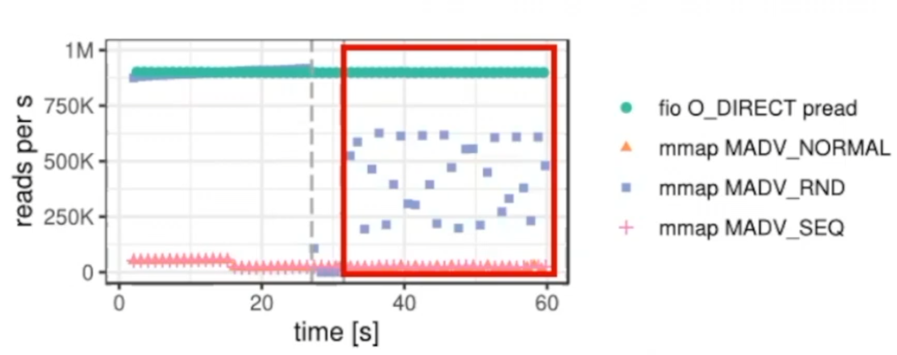
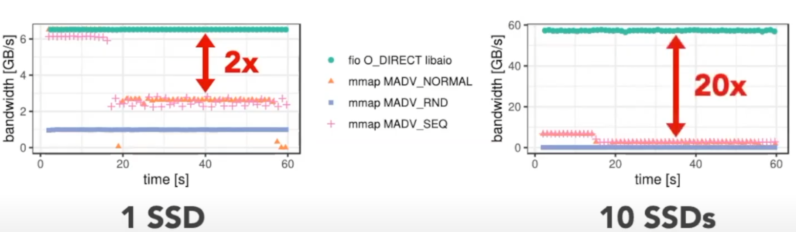

---

title: Are You Sure You Want to Use MMAP in Your Database Management System
created: 2025-09-11
update:
comments: true
katex: true
tags:

- Paper Notes
- DB

---

# Are You Sure You Want to Use MMAP in Your Database Management System 论文阅读笔记

## Abstract

mmap = :shit:
永远不要在 DBMS 中应用 mmap

## Intro 总体介绍

### mmap work flow

1. 用户用 mmap 请求读写 cidr.db 文件

1. mmap 系统调用将其映射到进程的虚拟内存空间中与文件关联，**注意此时并没有将文件加载到真实物理内存**

1. 直到用户开始访问该文件数据，OS 发现虚拟内存没有对应的物理内存，触发 page fault，此时 OS 将文件的相应部分加载到物理内存中

1. 同时向维护的页表以及 TLB 中加入对应的映射关系

   

### POSIX API

- **mmap:** 这种调用使得操作系统将**一个文件映射到 DBMS 的虚拟地址空间**。然后，DBMS 可以使用普通的内存操作读取或写入文件内容。操作系统将页面缓存在内存中，当使用 MAP_SHARED 标志位时，将(最终)写回底层文件的任何更改。或者，MAP_PRIVATE 标志会创建一个只对调用者(也就是说,**更改不会持续到备份文件**)可访问的写时拷贝映射。
- **madvise:** MADV_NORMAL 会**prefetch next 16 pages and previos 15 pages**，即使调用者只请求一个页面，也会导致 OS 从二级存储中读取 128 KB。根据工作负载的不同，这种预取可能会帮助或损害 DBMS 的性能。
  - 例如，只读取必要页面的 MADV_RANDOM 模式对于大于内存的 OLTP 工作负载是更好的选择，而 MADV_SEQUENTIAL 模式对于顺序扫描的 OLAP 工作负载是更好的选择。
- **mlock:** 这种调用允许 DBMS 在内存中 Pin 页面，**确保操作系统永远不会驱逐它们**。然而，根据 POSIX 标准(以及 Linux 的实现)，**操作系统允许在任何时候将脏页刷新到备份文件中，即使页面被挂起**。因此，DBMS 不能使用 mlock 来确保脏页永远不会被写入到二级存储中，这对事务安全有严重的影响。
- **msync:** 该调用显式地将指定的内存范围刷新到二级存储中。如果没有 msync，DBMS 就没有其他方法来保证更新被持久化到备份文件中。

### Why do not use mmap?

#### Transactional Safety

OS 会 at any time 刷写脏页到磁盘(即使当前事务未 commit)，我们无法阻止

- solution：

  1. OS CoW(MongoDB)

     > 用 mmap 创建数据库文件的两个副本，这两个副本最初将指向相同的物理页。第一种作为主副本，第二种作为私有工作区，事务可以在其中进行阶段更新。

     > 更新数据时，只在私有工作区上进行，会 remap 到新的物理空间页，但是更改不会写入 db 文件

     > 因此，为了提供持久性，DBMS 必须使用预写日志( WAL )来记录更改。当事务提交时，DBMS 将相应的 WAL 记录刷新到二级存储中，并使用一个单独的后台线程将提交的修改应用到主副本中。

     - Two Main Problems:
       1. DBMS 必须确保提交事务的最新更新已经传播到主副本，才能允许相互冲突的事务运行，这就**需要额外的簿记来跟踪有待更新的页面**。
       1. 随着更多更新的发生，私有工作空间将继续增长，DBMS 最终可能会在内存中获得数据库的两个完整副本。
       1. 为了解决第二个问题，DBMS 可以通过 mremap 系统调用周期性地收缩私有工作空间。但是，DBMS 必须再次确保所有挂起的更新在破坏私有工作区之前已经传播到主副本。 此外，为了避免在 mremap 过程中丢失更新，**DBMS 需要阻塞挂起的更改，直到操作系统完成私有工作空间的压缩**。

  1. User CoW(SQLite, MonetDB)

     > 将受影响的页面从 mmap-backed 内存中手动复制到用户空间中单独维护的缓冲区中。

     > 为了执行更新，DBMS 只对副本进行更改，并创建相应的 WAL 记录。DBMS 可以通过将 WAL 写入二级存储来执行这些修改，此时它可以安全地将修改后的页面复制到 mmap - backed 内存中。由于复制整个页面对于小的变化是浪费的，因此一些 DBMS 支持将 WAL 记录直接应用到 mmap 支持的内存中。

  1. Shadow Paging(LMDB)

     > 通过影子分页，DBMS 分别维护数据库的主副本和影子副本，主副本和影子副本均由 mmap 支持。

     > 为了执行更新，DBMS 首先将受影响的页面从主副本复制到影子副本，然后在影子副本中应用必要的更改。

     > 提交更改需要用 msync 将修改后的影子页刷新到二级存储，然后更新指针以安装影子副本作为新的主副本。原始的初级则作为新的影子拷贝。

#### I/O Stalls

我们无法知道哪些 page 在内存中，读取任何页都可能造成 I/O 停顿

- Solution:
  1. OS hints
  1. Build own prefetcher

#### Error Handling

验证 page 合法性(checksum)会更加繁琐，我们需要在从磁盘加载到内存时验证以及在写回磁盘前验证，但是我们不知道 OS 何时会做这些事。

任何访问可能会造成 SIGBUS 信号，我们需要使用 signal hanlder 来处理，need to code everywhere

#### :skull: Performance Issues

传统观点认为在更好的硬件上如 PCIe5.0 NVMe 上，mmap 性能比传统的文件 IO 更好，因为它避免了两个主要的开销来源。

- 首先，mmap 规避了**显式读写方法系统调用的成本**，因为操作系统在后台处理文件映射和页面错误。
- 其次，mmap 可以将指针返回到存储在操作系统页面缓存中的页面，从而避免额外在用户空间的 copy。
- 基于 mmap 的读写文件还导致了较低的总内存消耗，因为**数据在用户空间中没有不必要的重复**

1. Random Reads
   

- OS 只使用单个线程处理 page eviction (kswapd)
- Page table contention/synchronization
- TLB shootdowns，flush 本地 TLB 成本不高，但是同步远程 TLB 需要数千个时钟周期

1. Sequential Scan
   

- page cache 满了之后，性能骤降
- mmap 不能饱和 SSD 的带宽
