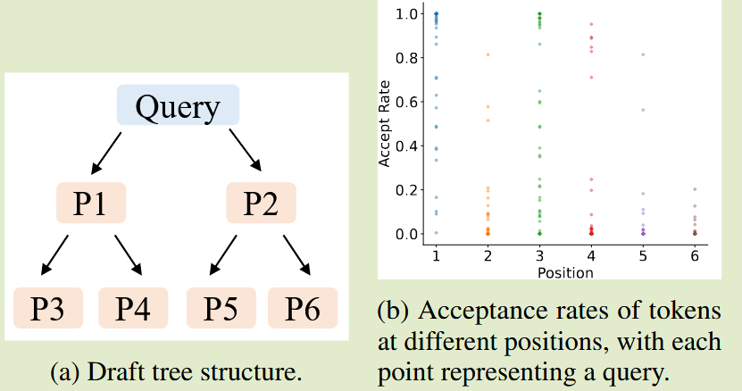
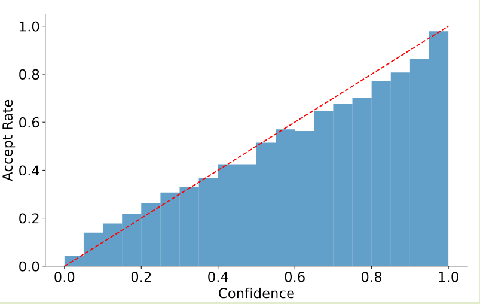
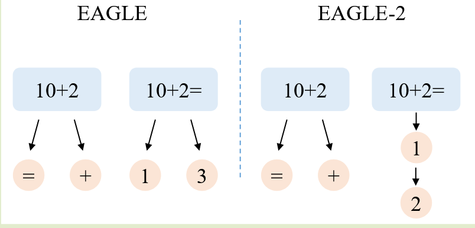
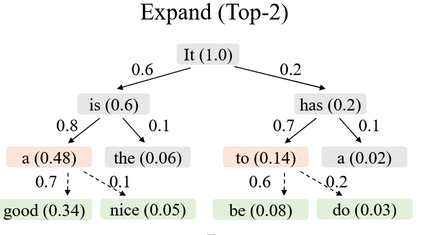
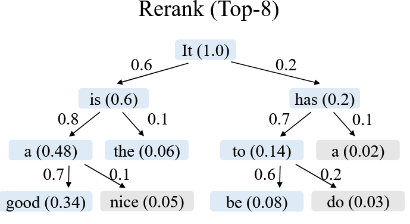
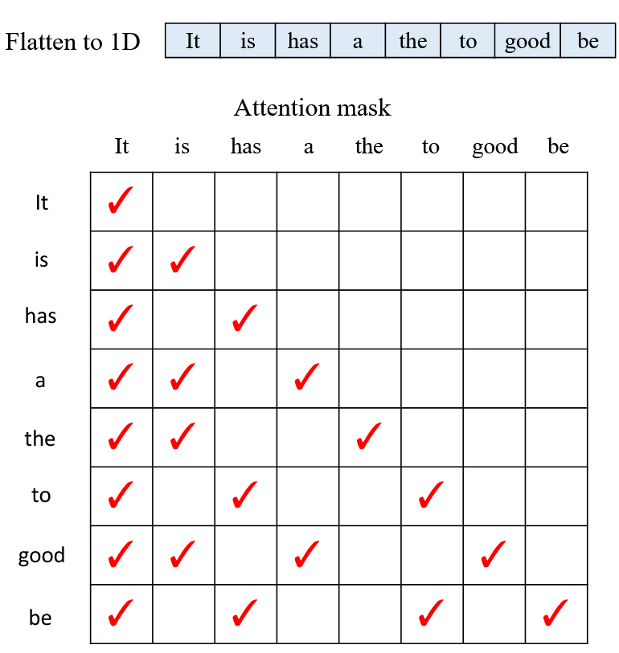
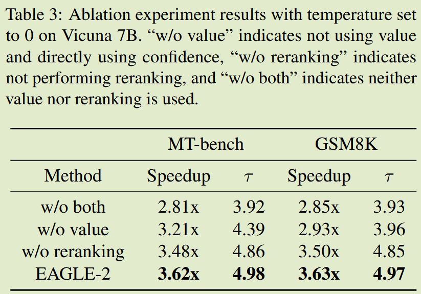

# (EAGLE 2)EAGLE-2: Faster Inference of Language Models with Dynamic Draft Trees

# Key Observation
1. Context-Dependent Acceptance Rates
   - draft token 的接受率与位置相关，位置 P1 的接受率最高，位置 P6 的接受率最低
   - 同一位置的接受率存在显着差异，这表明 **draft token被接受的概率不仅取决于其位置，还取决于上下文**。这表明上下文感知的动态草图树比静态草图树具有更大的潜力
  
2. Well-Calibrated Draft Model
   - 为了应用动态草案树，我们需要一种低成本方法来估计草案代币的接受率，而无需调用原始的 LLM。
   - **草稿模型的置信度得分与代币的接受率之间存在很强的正相关性**。置信度分数低于 0.05 的草案代币的接受率约为 0.04，而置信度分数高于 0.95 的草案代币的接受率约为 0.98。
   - 因此，我们可以使用草稿模型的置信度分数来估计接受率，而无需额外的开销，从而实现对草稿树的动态调整。其他方法中的草图模型也观察到类似的现象，例如 GLIDE 和 CAPE。
  

# Motivation
当前投机采样方法都使用静态草稿树，隐式假设草稿令牌的接受率仅取决于它们的位置，但实际上 draft token 接受率与它们的具体上下文是相关的
- EAGLE 和 Medusa 都在第 i 个 step，为 draft tree 添加 k 个候选者，其中 k 是固定的
- 隐式假设草稿令牌的接受率仅取决于它们的位置，这种假设似乎与推测性抽样的见解相矛盾，即**某些令牌更简单并且可以通过较小的模型进行预测。**

# Core Idea
根据 acceptance rate 来调整树结构，但 acceptance rate 需要通过 target model 的前向传递才能得到违背了投机采样的初衷。这里作者发现 EAGLE 是经过良好校准的：**草稿模型的置信度得分（概率）很好地近似了草稿令牌的接受率**。这使得使用上下文相关的动态草图树结构变得可行。

## Expanding the Draft Tree

当前层中选择全局接受概率最高的 top-k 代币进行扩展。在推测性采样中，拒绝草稿令牌会导致丢弃所有后续令牌；仅当令牌的所有前缀都被接受时，该令牌才最终被接受。
- 令牌 ti 的全局接受率是从根节点到 ti 的路径上所有令牌的接受率的乘积。我们将其定义为值 Vi：
$$
V_i = \prod_{t_j \in path(root,t_i)} acceptance(t_j) \approx \prod_{t_j \in path(root,t_i)} confidence(t_j)
$$
- 较高值的​​ token 开始的分支更有可能被接受，每一轮只保留最有希望的 k 个 frontier nodes 来扩展树结构。

## Rerank draft tokens

一些未扩展的浅节点可能比较深的扩展节点具有更高的值。因此，我们不会直接将扩容阶段选出的代币作为草稿。
- 对所有草稿令牌进行重新排序，并选择具有最高值的前 m 个令牌。
- 节点的值总是小于或等于其父节点的值。对于具有相同值的节点，我们优先选择较浅的节点。
- 这确保了重新排序后选择的前 m 个标记仍然形成连接树。
  

## Tree Attention Mask
- 选定的 token 展平为一维序列，作为验证阶段的输入。为
- 使用草稿树时，来自不同分支的令牌不应彼此可见。因此，必须根据树结构调整注意力掩码，以确保每个令牌只能看到其祖先节点。

# Ablation Study
- EAGLE 的草稿模型提供了接受率的良好近似值，但它是局部的，无法反映 draft token 被接受的实际概率。因此，在选择扩展节点时，我们使用**草稿令牌的置信度与其祖先节点的置信度的乘积值作为排名的基础**
- EAGLE-2扩展阶段的目的是加深草图树，但所选择的令牌可能在全局上不如未选择的浅层节点最优。因此，在重新排名阶段，我们对所有 draft token 进行 reranking。

# Summary
- 静态树不符合 SD 的核心见解，即某些令牌更简单并且可以通过较小的模型进行预测。EAGLE-2 通过引入上下文相关的动态草图树结构来解决这个问题。
- 我们希望可以通过 acceptance rate 来调整树结构，但 acceptance rate 需要通过 target model 的前向传递才能得到违背了投机采样的初衷。EAGLE-2 通过发现草稿模型的置信度得分与草稿令牌的接受率之间存在很强的正相关性，成功实现了对草稿树的动态调整。
- 问题变成了如何 expand 树，EAGLE-2 通过选择全局接受概率最高的 top-k 代币进行扩展来解决这个问题。
  - 评价指标是从根节点到 ti 的路径上所有令牌的接受率的乘积。较高值的​​ token 开始的分支更有可能被接受，每一轮只保留最有希望的 k 个 frontier nodes 来扩展树结构。
  - 相同的 Vi 但浅层节点优先于深层节点，因为它们更有可能被接受，所以需要重新进行 reranking 来选择最终的草稿令牌。
- SGLang 中实现的时候只是选择了 expand 阶段的 top-k 代币，没有进行全局 reranking，会存在丢失父亲节点的问题，kernel 直接选择忽略这个问题，这样可能会导致 acceptance rate 下降，最终导致 speedup 下降。
  > [!NOTE]
  > ？可能是个 Trade-off，需要进行更多的实验来验证这个问题，或者说在实际应用中这个问题的影响程度。