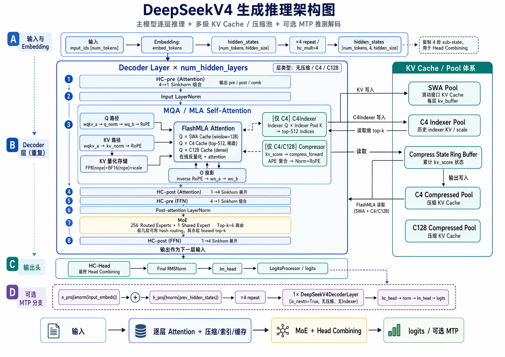
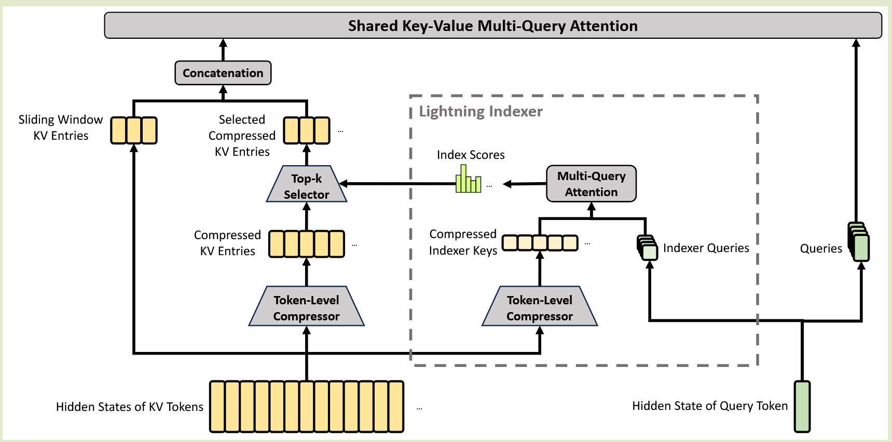
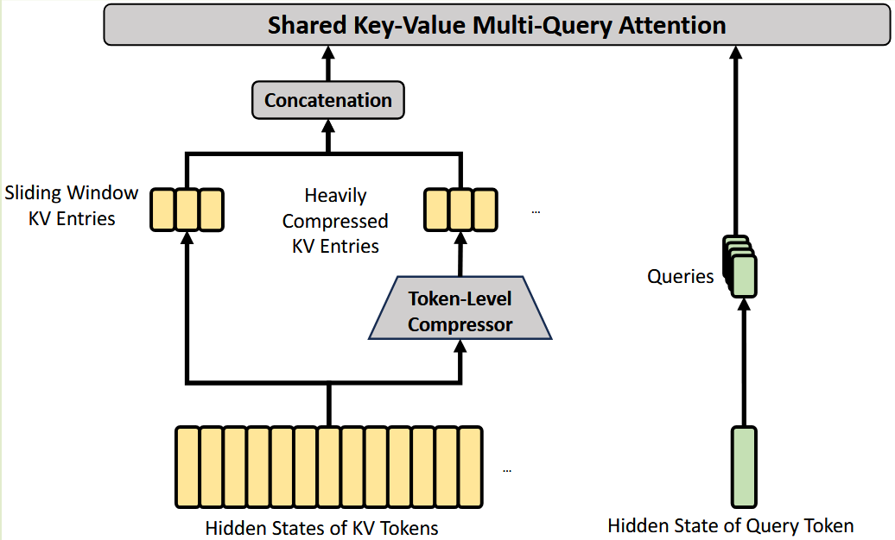
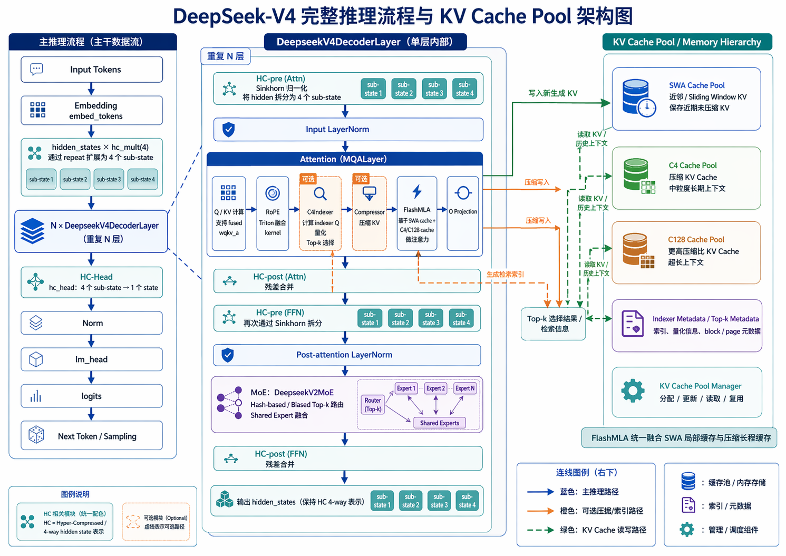
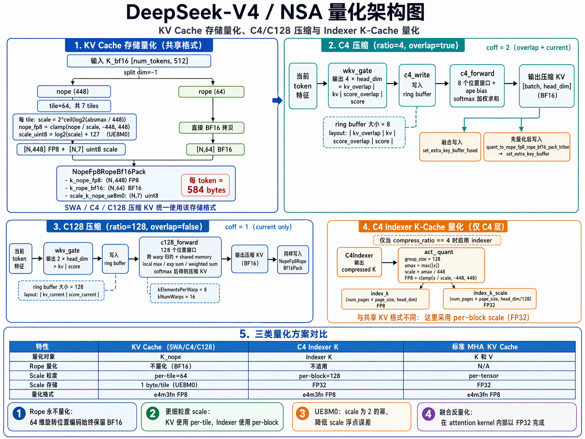

# DeepseekV4
## 模型架构

### Attention
这里所有的 Attention 实际上都是 MLA 的方式计算，只是 KV 的压缩程度不同以及是否有 DSA 参与

#### CSA(Compressed Sparse Attention)
- **Compressed KV Entries**：每 m 个 token 生成 1 个压缩 KV，但这个压缩 KV 实际会参考当前 block 的 m 个 token，以及前一个 block 的 m 个 token，一共 2m 个候选 token，然后用 learned softmax 权重加权求和(**Overlap**)
- **DSA Strategy**：对于每个 query，选择 top-k 的压缩 KV entry 进行 attention 计算，k 是一个超参数
- **MQA**：compressed kv entry 既是 K 又是 V，与 query 进行 MQA 计算
- **Grouped Output Projection**：先投影到c * n_h 太大，直接 $R^{c n_h} -> R^d$ 的输出投影太贵，所以先按 head 分组，把每组从 $R^{c n_h/g}$ 压到 $R^{d_g}$，再把 g 个小向量拼起来投影回 $R^d$




#### HCA(Heavily Compressed Attention)
- **Compressed KV Entries**：每 m′ 个 token 压缩成一个 compressed KV，m′ 远大于 m，压缩程度更高，适用于更长的上下文 
  > 第 i 个 compressed KV 是第 i 个 block 内 m′ 个 token 的加权和，不在考虑前一个 block 的 token

- **Shared KV MQA**：所有 query 共享同一组 compressed KV 进行 MQAttention 计算

- **Grouped Output Projection**：同 CSA



### Other Details
#### Partial RoPE
- 与 MLA 相同，只对最后 64 维度进行 RoPE
- Attention Output 施加 position -i 的 RoPE
  > [!IMPORTANT]
  > 因为 compressed KV Entries 同时作为 K 和 V，实际上 V 不应该携带位置信息，所以这里对 attention output 施加 position -i 的 RoPE 来抵消掉 V 中的位置信息

#### Additional Branch of SWA
- **Question**：CSA 和 HCA 的 compressed KV 是按 block 生成的，可能会导致 query token 看不到同一个 compressed block 里已经过去的 token，这会损失非常重要的近邻信息
- **Solution**：增加一个 SWA 分支，合并 compressed KV + 最近 n_win 个未压缩 KV

#### Attention Sink
- **Motivation**：对于一些 query 来说，所有的 compressed KV 都不相关，如果强行让它们参与 attention 计算，可能会引入噪声，反而降低性能
- **Attention Sink 允许**：如果当前 head 觉得这些 KV 都没用，就把大部分概率质量给 sink。
  > 因为 sink 的 value 近似为 0，所以该 head 输出可以接近 0。


## 推理流程
1. Embedding：embed_tokens -> hidden_states * hc_mult(4)（通过 repeat 扩展）
2. HC-Head：hc_head 把 4 个 sub-state 合并回 1 个 -> norm -> lm_head -> logits
3. *每层 (DeepseekV4DecoderLayer)*：
   - *HC-pre (attn)*：Sinkhorn 归一化把 hidden 拆成 4 个 sub-state
   - Input LayerNorm
   - *Attention (MQALayer)*：
     - Q/KV 计算（支持 fused wqkv_a）
     - RoPE（Triton 融合 kernel）
     - (可选) C4Indexer：计算 indexer Q，量化，top-k 选择
     - (可选) Compressor：压缩 KV
     - FlashMLA：SWA cache + C4/C128 cache 注意力
     - O 投影
   - *HC-post (attn)*：合并残差
   - *HC-pre (FFN)*：再次 Sinkhorn 拆分
   - Post-attention LayerNorm
   - MoE：DeepseekV2MoE（hash-based / biased top-k 路由 + shared expert 融合）
   - *HC-post (FFN)*：合并残差



### KV Cache Pool
#### SWA Pool
每个 token 的 完整 KV（未压缩）存入此池。所有层共享同一个 SWA 池（每个 layer_id 对应 kv_buffer[layer_id]）。FlashMLA kernel 读取 SWA cache 时只看最近 window_size=128 个 token。

```python
swa_kv_pool = DeepSeekV4SingleKVPool(
    swa_size, swa_page_size=256, qk_nope_head_dim=448, qk_rope_head_dim=64,
    layer_num=layer_num,          # 所有层都在这里存一份
    is_swa_pool=True,             # 标记为 SWA 池
)
```
#### C4 Compressed Pool — 4:1 压缩 KV Cache
- **成员变量**：与 SWA Pool 同构，区别是 page_size=64 且 layer_num 不同。
- **作用**：只存 compress_ratio=4 的层的压缩后的 KV。每 4 个相邻 token 压缩为 1 个 token，然后量化存为相同的 NopeFp8RopeBf16Pack 格式。
- **FlashMLA 读取**：做 top-512 稀疏注意力，只取最近的 512 个压缩 token。

```python
c4_kv_pool = DeepSeekV4SingleKVPool(
    c4_size, c4_page_size=64,   # page_size = 256/4 = 64
    qk_nope_head_dim=448, qk_rope_head_dim=64,
    layer_num=c4_layer_num,     # 只给 compress_ratio==4 的层
)
```

#### C128 Compressed Pool — 128:1 压缩 KV Cache
- **成员变量**：与 C4 池同构，page_size=2。
- **作用**：存 compress_ratio=128 的层的压缩 KV。每 128 个 token 压缩为 1 个。
- **FlashMLA 读取**：做密集注意力（读所有压缩 token，不做稀疏选择）。
- **与 C4 的关键区别**：
  - C4 用重叠压缩（相邻 m 个 token 重叠(即 2m 个 token 计算)，overlap=True, coff=2），取 top-512
  - C128 用非重叠压缩（overlap=False, coff=1），全量 dense attention
```python
c128_kv_pool = DeepSeekV4SingleKVPool(
    c128_size, c128_page_size=2,  # page_size = 256/128 = 2
    ...
    layer_num=c128_layer_num,    # 只给 compress_ratio==128 的层
)
```

#### C4 Indexer Pool — 索引器 KV Cache
- **存储格式**：每 page 存 `page_size * index_head_dim + page_size * num_scales_per_token * 4` 字节。与主 KV cache 不同，这里存的是 FP8 量化的 indexer K + float32 scale（通过 index_buf_accessor.SetKAndS 写入）。
- **作用**：C4 层需要两步稀疏选择：
  1. 先通过 C4Indexer 模块计算 indexer Q（index_head_dim=128），与 indexer pool 中的 K 做 fp8_paged_mqa_logits（top-k logits 计算）
  2. 选出 top-k 的索引，再在 FlashMLA 中对 C4 压缩池做稀疏注意力

```python
c4_indexer_kv_pool = DeepSeekV4IndexerPool(
    c4_size, c4_page_size=64, index_head_dim=128,
    layer_num=c4_layer_num,
)
```

#### Compress State Pool — 压缩中间状态 Ring Buffer

- **KVAndScore**: 是一个将 tensor 后半部分视为 score、前半部分视为 kv 的包装类。
- **作用**: 压缩不是凭空从 hidden_state 直接算出最终 KV，而是分两步：
  1. 第一步：linear_bf16_fp32(x, wkv_gate) 算出原始 kv_score（compress_forward 的输入）
  2. 第二步：compress_forward 取 ring buffer 中累积的历史 kv_score + 当前 kv_score，配合 APE 做压缩
    - APE: Attention Position Embedding，控制每个 token 对 compressed output 的贡献
         1. Load 8 kv + 8 score entries from ring buffer (last ratio tokens)
         2. Add corresponding APE bias to each score: score[j][i] += bias[j][i]
         3. Safe softmax over 8 scores → attention weights
         4. Weighted sum Σ(kv[j] * weight[j]) → compressed output
  > ring buffer 存储的是未完成的压缩中间结果（kv + score），待到累积满 ratio 个 token 后才执行一次压缩输出。
```python
# 每层两个 compress state pool：一个给主压缩，一个给 indexer 压缩
for ratio in compression_ratios:
    compress_state_pool = CompressStatePool(
        size, swa_page_size=256, ring_size=ring_size,
        overlap=(ratio==4), head_dim=512, ratio=ratio,
    )
    if ratio == 4:
        indexer_compress_state_pool = CompressStatePool(...)  # head_dim=128
```

## KV Cache 量化
整体来说，DeepSeek V4 有 三类 KV cache 存储，每类有不同的量化策略：

| 存储类型                       | 压缩率                    | 量化方式                              | 存储格式                    |
| ------------------------------ | ------------------------- | ------------------------------------- | --------------------------- |
| SWA KV Cache (dense attention) | ratio=0, 不压缩           | FP8 nope + BF16 rope + UE8M0 scale    | NopeFp8RopeBf16Pack         |
| C4 压缩 KV Cache               | ratio=4, 重叠滑动窗口     | FP8 nope + BF16 rope + UE8M0 scale    | NopeFp8RopeBf16Pack         |
| C128 压缩 KV Cache             | ratio=128, 非重叠滑动窗口 | FP8 nope + BF16 rope + UE8M0 scale    | NopeFp8RopeBf16Pack         |
| C4 Indexer K Cache             | ratio=4 only              | FP8 + per-tile FP32 scale (act_quant) | index_k_fp8 + index_k_scale |



### 存储格式(NopeFp8RopeBf16Pack)
这是所有压缩模式共享的 KV 存储格式。
- Nope 部分：FP8 量化的 K/V，448 维（7 个 head，每个 head 64 维）
- RoPE 部分：BF16 量化的 RoPE 位置编码，64 维
- Scale 部分：UE8M0 量化的 scale，用于从 Nope 的 uint8 还原到 float32，7 个 head 每个 head 1 个 scale
```python
@dataclass
class NopeFp8RopeBf16Pack:
    k_nope_fp8: torch.Tensor            # (N, 448) fp8
    k_rope_bf16: torch.Tensor           # (N, 64)  bf16
    scale_k_nope_ue8m0: torch.Tensor    # (N, 7)   uint8
```
每token存储: 448×1 + 64×2 + 7×1 + 1(pad) = 584 bytes 


