# Taming Throughput-Latency Tradeoff in LLM Inference with Sarathi-Serve

## Motivation
- Prefill 因为是长序列计算有高延迟，decode 是低延迟但是 GPU 利用率很低
- 现有的 batching 调度交错 prefill batch 和 decode batch，让高吞吐和低延迟变得困难

Batch 对 decode 吞吐量提升很大，对 prefill 影响小
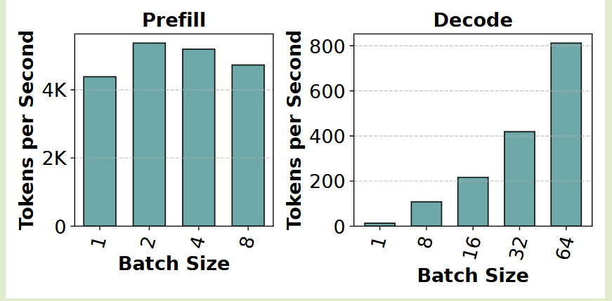

Decode 阶段计算资源未被充分利用
- SM 计算资源空闲：可以在解码批次中处理更多令牌，而不会显着增加其延迟。
- 线性层在预填充和解码阶段占据了大部分运行时间。
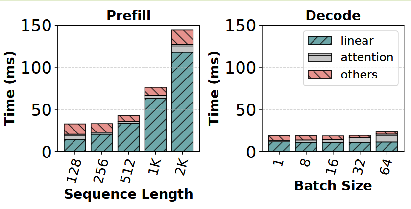

当前推理系统使用 Prefill 优先调度，用 TBT 换 throughput 
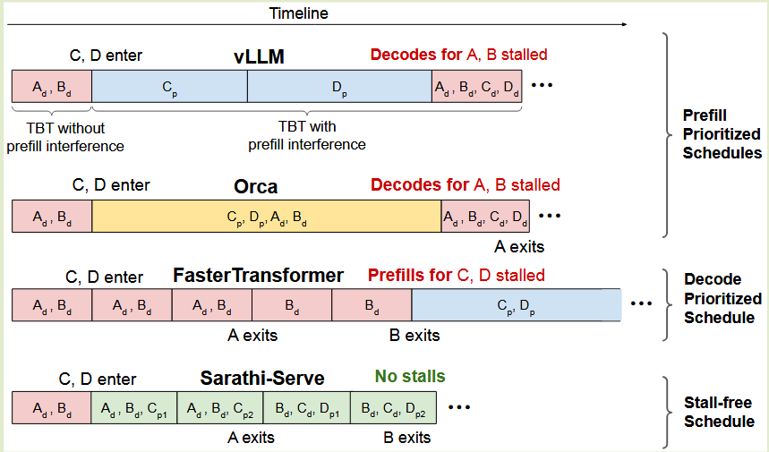

Prefill 计算差异导致 PP bubble
- LLM 迭代的计算时间可能存在很大差异，具体取决于批次中预填充和解码令牌的组成。使用 PP 时，这可能会导致严重的气泡。
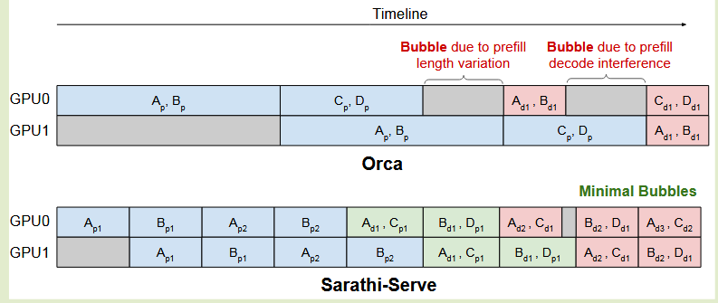

## Key Observation
- 我们表明当前的 LLM 服务系统必须面临吞吐量和延迟之间的权衡。现有系统批处理多个请求的方式会导致吞吐量或延迟受到影响
- Batching 有利于 decode，但对 prefill 没有收益甚至有负影响，因为 prefill 本身已经是 compute-bound
- Prefill 优先和 decode 优先都有问题，decode 优先会影响吞吐量，而 prefill 优先会影响 TBT。
  > 这里称为 generation stall

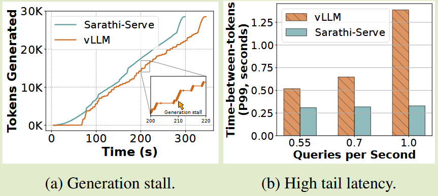

## Core Idea
### Chunked Prefill
- 具有适度序列长度的预填充请求可以有效地使 GPU 计算饱和。例如，在图 4 中，预填充吞吐量在 512 个令牌的序列长度附近开始饱和。
- 其次，在许多实际场景中，输入提示平均包含数千个标记。这提供了将大型预填充请求分解为较小计算单元的机会，这些计算单元仍然大到足以使 GPU 计算饱和

- 在 Sarathi-Serve 中，我们利用这种机制来形成具有适当数量令牌的批次，以便我们可以在解码批次中利用计算潜力，而不会违反 TBT SLO。

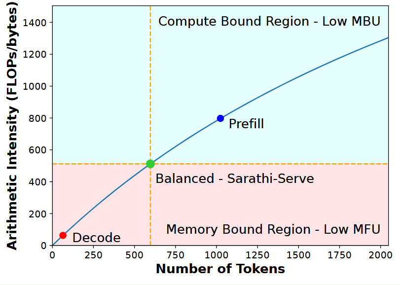

### Stall-free Scheduling
- 无停顿调度允许新请求加入正在运行的批次，而无需暂停正在进行的解码
- 将所有正在进行的 decode 与来自新请求的一个（或多个）prefill 合并来构建批次，以便每个批次达到预先配置的块大小。
- 它限制每次迭代中预填充令牌的数量，同时在正在运行的批处理中接纳新请求。这不仅限制了每次迭代的延迟，而且使其几乎独立于输入提示的总长度。通过这种方式，Sarathi-Serve 可以最大限度地减少计算新预填充对正在进行的解码的 TBT 的影响，从而实现高吞吐量和低 TBT 延迟

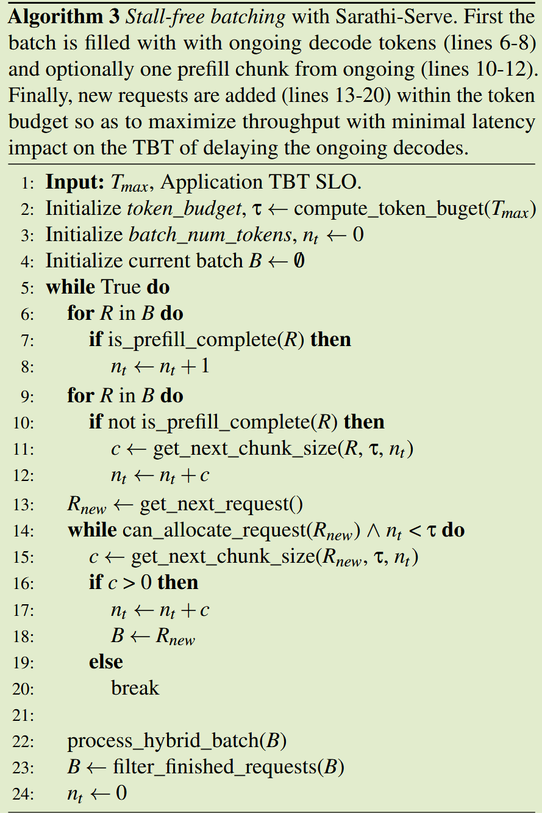

### Token Budget
TBT SLO 要求和分块预填充开销。从 TBT 最小化的角度来看，较小的 token 预算更好，因为 prefill token 较少的迭代具有较低的延迟。然而，较小的令牌预算可能会导致预填充过度分块，从而导致开销，因为
- 较低的 GPU 利用率
- 注意力操作中重复的 KV 缓存访问。
  - 在分块预填充的计算过程中，提示的每个块的注意力操作都需要访问同一提示的所有先前块的 KV 缓存。即使计算成本不变，这也会导致 GPU HBM 的内存读取增加。
  - 例如，如果预填充序列被分成 N 个块，则第一个块的 KVcache 会加载 N-1 次，第二个块的 KV-cache 会加载 N-2 次，依此类推。
  - 然而，我们发现即使在小块大小下，注意预填充操作也是 Compute-Bound 操作
确定 token budget 需要根据不同工作负载进行模拟才能得到一个比较好的 trade-off 值

## Evaluation
### ENV

| Model       | Attention Mechanism | GPU Configuration         | Memory Total (per-GPU) |
| ----------- | ------------------- | ------------------------- | ---------------------- |
| Mistral-7B  | GQA-SW              | 1 A100                    | 80GB (80GB)            |
| Yi-34B      | GQA                 | 2 A100s (TP2)             | 160GB (80GB)           |
| LLaMA2-70B  | GQA                 | 8 A40s (TP4-PP2)          | 384GB (48GB)           |
| Falcon-180B | GQA                 | 4 A100s×2 nodes (TP4-PP2) | 640GB (80GB)           |

### Workload
<table>
  <thead>
    <tr>
      <th rowspan="2">Dataset</th>
      <th colspan="3">Prompt Tokens</th>
      <th colspan="3">Output Tokens</th>
    </tr>
    <tr>
      <th>Median</th>
      <th>P90</th>
      <th>Std.</th>
      <th>Median</th>
      <th>P90</th>
      <th>Std.</th>
    </tr>
  </thead>
  <tbody>
    <tr>
      <td><em>openchat_sharegpt4</em></td>
      <td>1730</td>
      <td>5696</td>
      <td>2088</td>
      <td>415</td>
      <td>834</td>
      <td>101</td>
    </tr>
    <tr>
      <td><em>arxiv_summarization</em></td>
      <td>7059</td>
      <td>12985</td>
      <td>3638</td>
      <td>208</td>
      <td>371</td>
      <td>265</td>
    </tr>
  </tbody>
</table>

### Metrics
- TTFT 的中值
- P99 的 TBT

### Results
**Capacity Evaluation**
在所有模型和工作负载的情况下，Sarathi-Serve 的表现始终优于 Orca 和 vLLM。
- 在严格的 SLO 下，Sarathi-Serve 可以承受比 Orca 高 4.0 倍的负载，比严格 SLO 下的 vLLM 高 3.7 倍的负载（Yi-34B，openchat_sharegpt4）。
- 对于使用 PP 的大型模型，由于管道气泡很少，与 Orca 和 vLLM（LLaMA2-70B、openchat_sharegpt4）相比，Sarathi-Serve 分别实现了高达 6.3 倍和 4.3 倍的增益。  

我们观察到，在大多数情况下，Orca 和 vLLM 在达到最大可用吞吐量之前都会违反 P99 TBT 延迟 SLO。因此，我们观察到放宽延迟目标会导致模型服务能力显着增加。
- 在严格的延迟 SLO 下运行时，我们使用严格的 token budget 并将提示分割成更小的块。这会略微降低系统效率，但使我们能够实现更低的尾部延迟。
- 当延迟约束放松时，我们增加 token budget 以允许更有效的预填充。

我们在宽松和严格设置下的所有模型分别使用 2048 和 512 的 token budget ，除了 LLaMA2-70B 宽松配置，我们使用 1536 的 token budget 来减少 bubble 的影响。
- **通过根据工作负载特征动态改变 token budget，可以进一步增强系统性能。我们将这种探索留给未来的工作。**

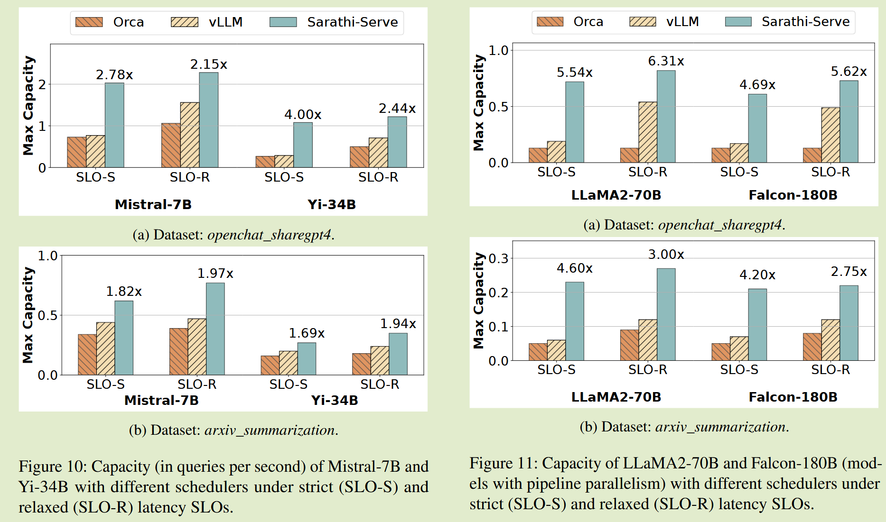

**Throughput-Latency Tradeoff**
- 在严格的 SLO（100ms，Mistral-7B）下，使用 512 的小 token budget ，Sarathi-Serve 的容量比 vLLM 高 3.5 倍。
- 对于 SLO 限制更宽松的场景，选择 2048 的更大 token budget 可以让 Sarathi-Serve 更高效地运行，从而与 vLLM（1s，Yi-34B）相比，容量高 1.65 倍

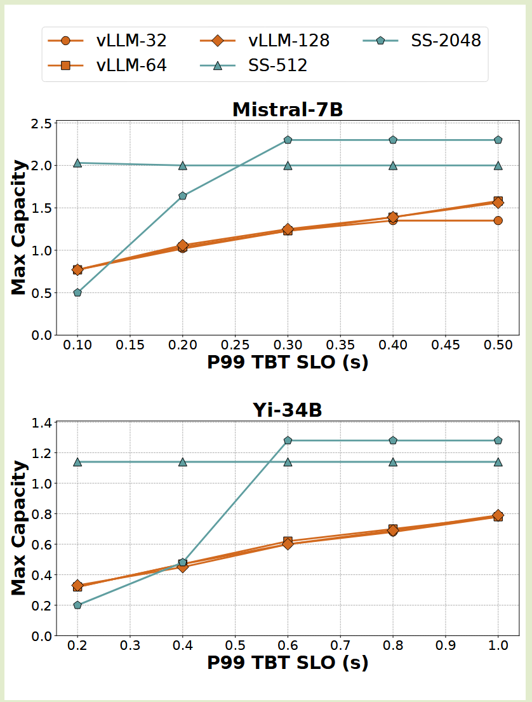

**Pipeline Parallelism**
在两个节点上运行 Falcon-180B，每个节点都有四个 A100 GPU，通过 100 Gbps 以太网连接。
- 具有 8 路 TP 的 vLLM
- 具有 PP 实现的 vLLM 
- 具有 PP 的 Sarathi-Serve
- 对于 PP 配置，我们在节点内进行 4 路 TP，在节点间进行 2 路 PP。

TP 的中值延迟比 PP 高约 2 倍。这是因为TP由于跨节点 all-reduce 而产生较高的通信开销。

**请注意，与混合并行配置不同，即使在宽松的 SLO 下，TP 也会因高延迟而实现低容量**。
- 尽管 vLLM 可以在宽松的 SLO 下通过混合并行支持相当高的负载，但由于 pipeline bubble，它的性能在严格的 SLO 下急剧下降。
- Sarathi-Serve 利用分块预填充来减少微批次之间执行时间的变化，以避免 bubble，从而在宽松的 SLO 下将容量增加了 1.48 倍，在严格的 SLO 下将容量增加了 3.6 倍。

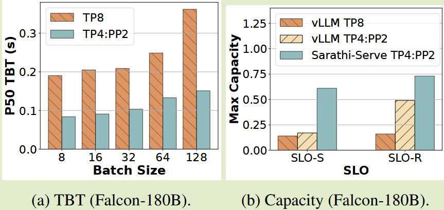

## Ablation Study
### Overhead of chunked-prefills
正如预期的那样，较小的块会带来较高的开销，如图 14 中逐渐减小的条形高度所示。
- 然而，即使使用最小的块大小 512，我们也观察到最多 ∼25% 的中等开销。
- 当预算高达 2048，分块预填充的开销几乎可以忽略不计，此时 compute 是主要开销
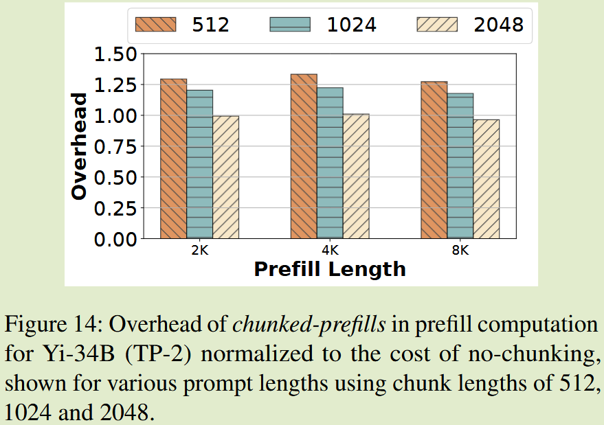

### Impact of individual techniques
- 仅分块预填充会增加 TTFT，因为预填充块效率稍低，
- 仅混合批处理会增加 TBT，因为长预填充仍会造成生成停顿。
- 当一起使用时，Sarathi-Serve 可以提高两个方面的性能

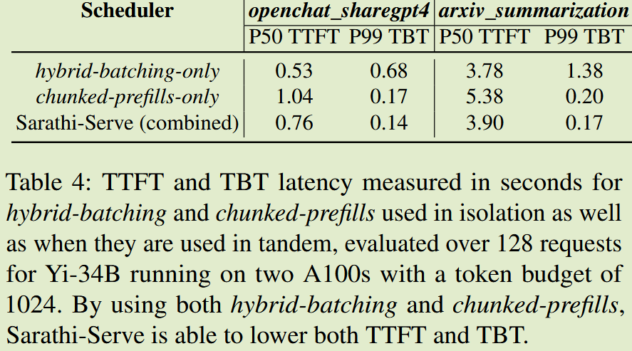

## Summary
- Sarathi-Serve 通过分块预填充和无停顿调度来实现高吞吐量和低 TBT 延迟之间的权衡；通过 token budget 来控制分块预填充的开销，现有的开源框架基本都集成了这个功能，通过类似 TCP 拥塞控制动态调整 token budget 来适应不同的工作负载特征；但是可能不能向这篇工作中提到的保证 PP 中的 bubble-free 。
- Sarathi-Serve 主要是为了解决在严格 SLO 下最大化 throughput 的问题，在宽松 SLO 下，分块预填充的开销可能会抵消其带来的效率提升，因此需要动态调整 token budget 来适应不同的工作负载特征。

