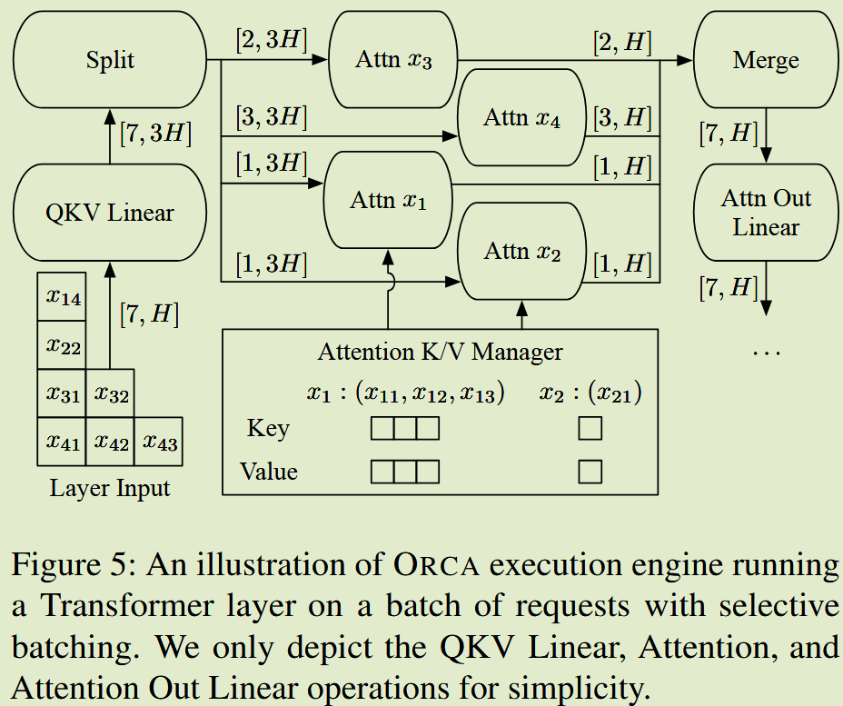
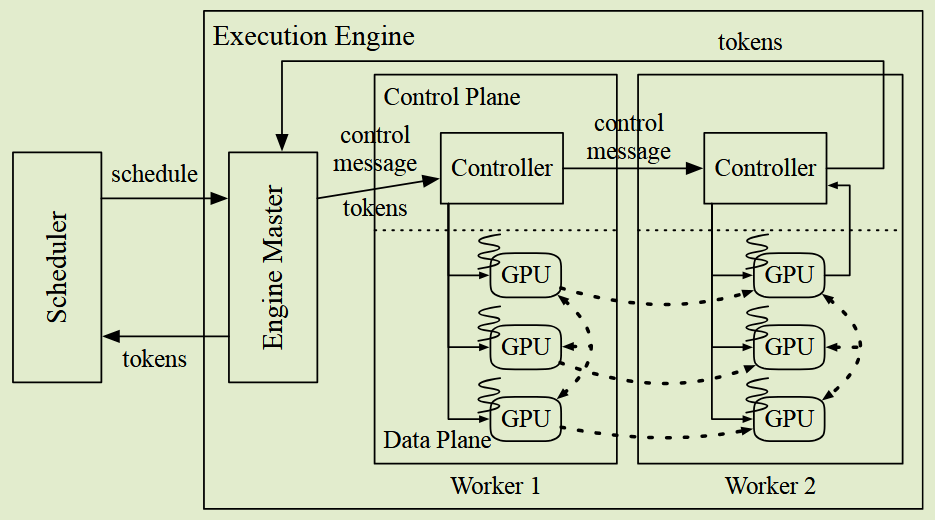
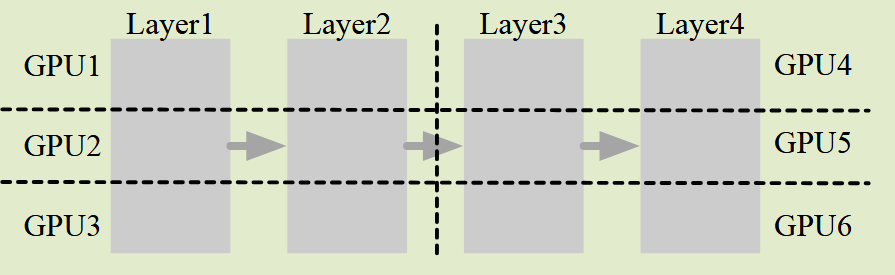
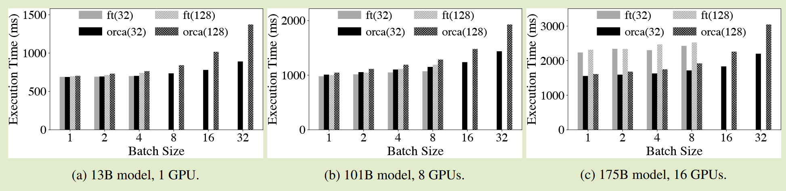
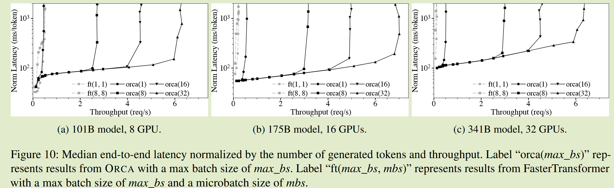

---

title: Orca: A Distributed Serving System for Transformer-Based Generative Models (Yu 等, 2022, p. 520)
created: 2026-03-29
update:
comments: true
katex: true
tags:

- LLM

---

# Orca: A Distributed Serving System for Transformer-Based Generative Models

## Motivation
当前的 serving system 调度方式是 request-level，对于当前自回归模型推理来说不够灵活
- 完成的请求无法立即退出
- 新来的请求无法在有空闲时加入
- 必须等待 batch 中最长的请求完成

在进行 iteration-level 调度时对操作进行 batching 操作时有困难
- 当时的 Attention 算子对输入长度和 position 有要求

## Core Idea
### Iteration-level Scheduling(后续所有 serving 优化的基础)
通过 scheduler 进行全局 request 的调度
- 选择接下来要运行的请求
- 调用引擎对选定的请求执行一次迭代
- 接收预定迭代的执行结果。由于调度程序在每次迭代时都会收到返回，因此它可以检测请求的完成并立即将其生成的令牌返回给客户端

调度算法比较粗糙，按照 max_tokens 和当前 GPU 余量来选择请求，优先级相同的请求按照先来先服务的方式调度
- 在第一次调度请求时保留足够的空间来存储请求的键和值，即 max_tokens
### Selective Batching
这应该是算子层的限制，所以服务层必须为此付出代价。所以 orca 的思路是把与 pos 相关的 attention 去除出 batching op，只把其他操作打成 batching 来做(LayerNorm, GEMM, GELU)
- 因为 Attention 操作与 Pos 位置有关系，如果算子不支持不能直接拉成一维进行计算
- 而其他操作与 token 位置无关可以直接拼接成一维计算

> [!IMPORTANT]
> PageAttention 出现后，后续算子层解决了这个问题：
> 1. 将整个 batch 的 Input token 拉成一维，通过另一个元数据张量表示每个 req 的 input token 起点
> 2. 算子实现时，直接按照 req 的数量进行并行，并在构建 attention mask 时根据元数据构建即可

### Parallelism
- TP，切分 model hidden size，每个 GPU 上只加载部分权重，用通信量换缓存
- PP，将不同的 layer 分到不同的 GPU，GPU间只在跨 GPU 的层间有 hidden_states 的通信开销

ORCA 的实现类似传统分布式系统，Scheduler 与 Engine 交互，scheduler 单独抽出来
- Engine 是分布式的，Master 管理多个 Worker，Worker 管理多个 GPU
  - 请求信息等元数据用 CPU 通道通信
  - Tensor 数据 GPU 间通信
- 相当于把复杂度交给了 controller 和 master，管理元数据通信和 GPU Tensor 通信
- KV cache 管理由 KV Manager 负责，在 engine 内部存在，为每个请求预先分配 max_token 大小的长度，直接分配连续大块显存，这里又碎片问题，而且不能动态调整，后续的设计是动态复用预分配的内存

- Sglang 中是每个 GPU 都有一个进程管理，里面有 scheduler 和 modelrunner
  - 这样与通信库的原语更好适配
  - 一旦进入多机 TP/EP，几乎所有底层库都假设 rank 是基本调度单元
  - GPU 本地维护状态越来越复杂，统一的 Master 来维护不是一个好的 design

## Evaluation
### ENV
Azure ND96asr A100 v4 VM 上运行评估，每个 VM 配备 8 个通过 NVLink 连接的 NVIDIA 40-GB A100 GPU。根据所测试模型的大小，我们最多使用四个虚拟机。每个虚拟机都有 8 个 Mellanox 200Gbps HDR Infiniband 适配器，在虚拟机之间提供 1.6Tb/s 的互连带宽

### Models
GPT-3 13B, 101B, 175B, 341B
- max length 2048
- fp16 权重和 activation
- 并行策略，使用 TP + PP
  

### Baseline
FastTransformer

### Senarios
1. 请求级别调度 benchmark：同一 batch 反复注入 ORCA 引擎，同时固定 batch 中的所有请求具有相同数量的输入令牌并生成相同数量的输出令牌
   - input: 32 or 128 token
   - gen: 32 tokens
2. 模拟工作负载：合成了客户端请求的跟踪。合成跟踪中的每个请求都是通过对输入令牌的数量和 max_gen_tokens 属性进行采样来随机生成的，其中输入令牌的数量加上 max_gen_tokens 等于 max_tokens 属性。
   - 忽略 <EOS> token，生成到 max_gen_tokens 个 token 后停止

### Results
#### 请求级别 benckmark
1. ORCA 引擎在所有配置中都显示出与 FasterTransformer 相似（或稍差）的性能。这是因为 ORCA 不对 Attention 操作应用批处理，而 FasterTransformer 对所有操作应用批处理。
     - 性能差异相对较小。尽管没有对 Attention 操作进行批处理，但 Attention 中缺少模型参数使得该决策对效率影响很小，因为在多个请求中重用模型参数没有任何好处。
2. 在单个虚拟机中使用所有 8 个 GPU 的 101B 模型的类似结果。从这些结果可以看出，ORCA引擎和FasterTransformer在CUDA内核的实现和层内分区之间的通信方面具有相当的效率
  

#### 模拟工作负载
Metrics 是每个请求生成的令牌数量的 median latency。
- ORCA 比 FasterTransformer 提供了显着更高的吞吐量和更低的延迟。唯一的例外是低负载下的 101B 型号

- ORCA 最大批量大小的增加会带来更高的吞吐量，而不会影响延迟。

## Summary
- ORCA 解决了模型推理系统调度只能等待一批 req 中生成最长的 req 的问题，提出了 iteration-level scheduling，允许 req 在每次迭代时动态进入和退出批处理
- ORCA 没有解决 Attention 操作的 batching 问题，而是将其与其他操作分开进行批处理，这使得 ORCA 在请求级别基准测试中与 FasterTransformer 的性能相当或稍差
- ORCA 在模型并行中将数据拆分成 cpu 和 gpu 两部分，cpu 负责元数据通信，gpu 负责 tensor 通信，让 GPU 计算资源得到更好的利用，在实验中确实并行度增加 ORCA 表现更优
- ORCA 没有在内存上进行优化，预分配了 max_token 大小的连续显存存储后续的 KV cache，这可能会导致内存碎片和资源浪费，后续的设计是 Page Attention，类似 OS 的分页机制，动态复用预分配的内存

