# Efficient Memory Management for Large Language  Model Serving with PagedAttention
## Motivation
- 当时的大模型推理系统直接通过 pytorch 为每个 req 预分配一块连续的内存，会造成内部碎片（因为分配的会过多），外部碎片（因为需要分配连续的）；让整个系统的吞吐量骤降，无法高效利用和复用显存

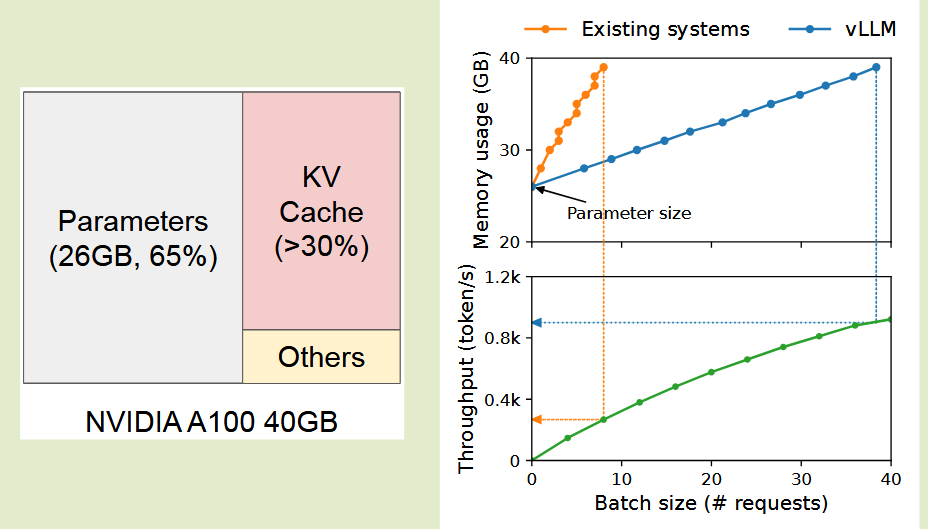

## Key Observation
- KV Cache 当模型生成新的 token 时，它会随着时间动态增长和收缩，并且它的生命周期和长度是未知的。
1. 现有系统预分配 max_token 长度的显存，会导致内部碎片。因为实际上推理长度远小于预分配的长度
     - 即使长度相当，但是相当多空间是 reserved，**其他短请求无法利用这些暂时没有用到的 kv cache，造成 throughput 不能很好提升**
  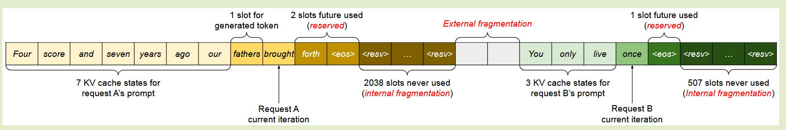
  

1. 现有系统无法利用内存共享的机会，因为每个请求的 KV Cache 被存储在独立的连续空间内，系统无法感知并操作
  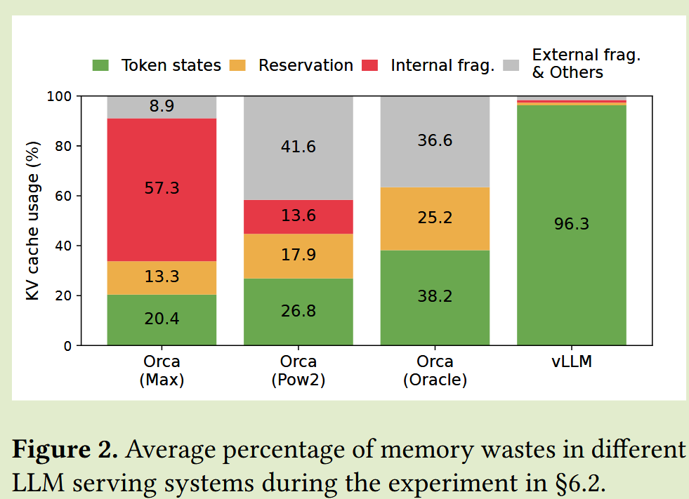

## Memory Challenges in LLM Serving
**Large KV Cache**
- KV Cache 随 req 数量增加而飞速增加

**Complex decoding algorithms**
- 不同的采样方法， 让 kv cache 共享不同
- 
**Scheduling for unknown input & output lengths**
- 对 LLM 服务的请求在输入和输出长度方面表现出可变性。这要求内存管理系统能够适应各种提示长度。
- 随着解码时请求的输出长度增加，其 KV 缓存所需的内存也会扩展，并且可能会耗尽传入请求或现有提示的持续生成的可用内存。
- 系统需要做出调度决策，例如从GPU内存中删除或换出某些请求的KV缓存。

## Core Idea
### PageAttention
- 从 OS 的页表中获取灵感，PagedAttention 将请求的 KV 缓存划分为块，每个块可以包含固定数量 token 的注意力键和值。
- 在 PagedAttention中，KV 缓存的块不一定存储在连续的空间中。这种设计通过使用相对较小的块并按需分配来减少内部碎片。
  - 块内内部碎片：每个请求只有最后一个 block 中有内部碎片，最多 block_size - 1 个碎片
  - 无外部碎片：因为所有块都具有相同的大小。
  - Prefix block：它支持以块为粒度、跨与同一请求关联的不同序列甚至跨不同请求的内存共享。
- KV 块管理器还维护块表，即每个请求的逻辑和物理 KV 块之间的映射。每个块表项记录了一个逻辑块对应的物理块以及已填充位置的数量。分离逻辑和物理 KV 块允许 vLLM 动态增长 KV 缓存内存，而无需提前为所有位置保留它

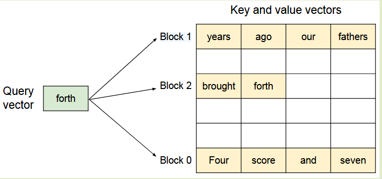

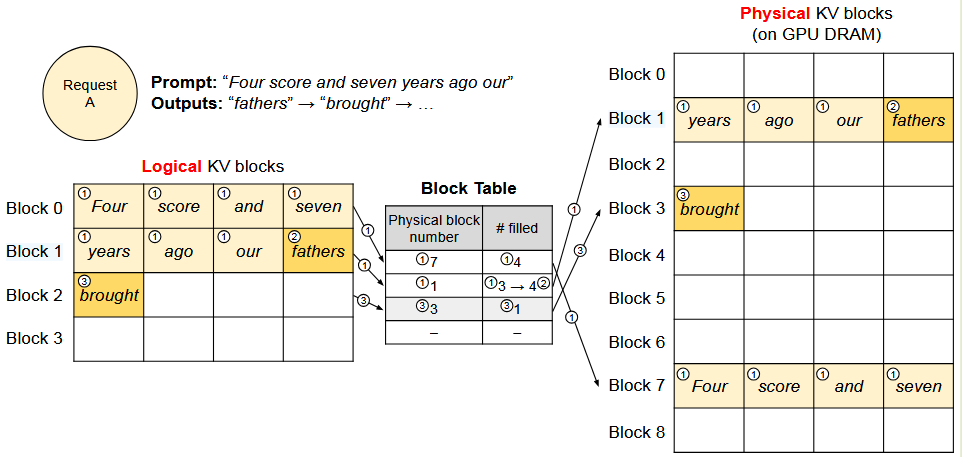

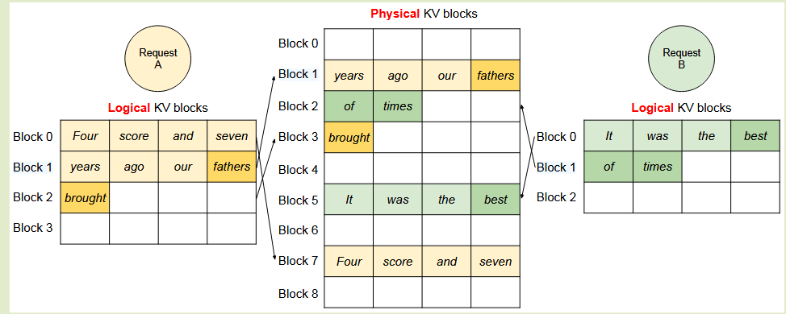

### System Architecture
- vLLM采用集中式调度器来协调分布式 GPU worker 的执行。 KV 缓存管理器通过 PagedAttention 以分页方式有效地管理 KV 缓存。KV缓存管理器通过集中调度器发送的指令来管理 GPU Worker上的物理 KV缓存
- 现在应该是与 sglang 相同，不在使用集中式的 scheduler，对称的 scheduler 可以极大减轻主控逻辑负担

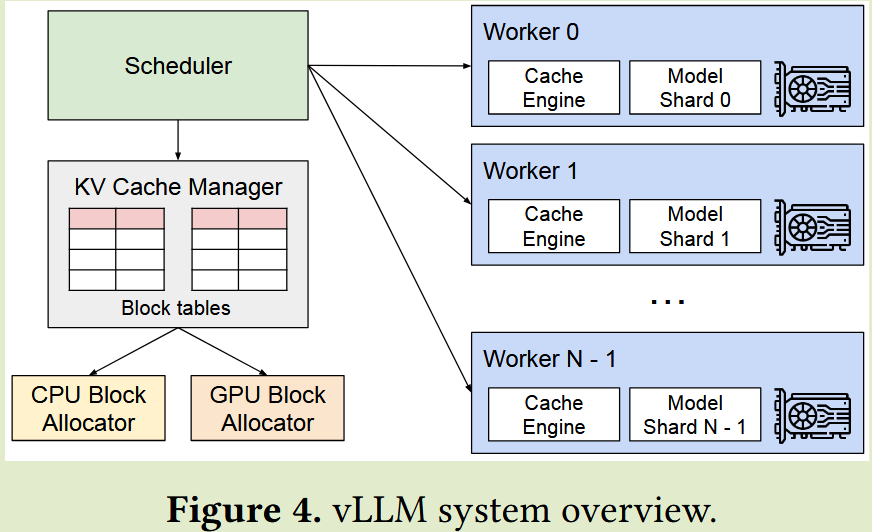

### Shared Prefix
在 vLLM 中，这可以通过 LLM 服务提供商为**一组预定义共享前缀保留一组物理块**来方便地实现，就像操作系统跨进程处理共享库的方式一样。
- 具有共享前缀的用户输入提示可以简单地将其逻辑块映射到缓存的物理块（最后一个块标记为写时复制）

>[!IMPORTANT]
> SGLang 中只保留 page size 整数倍的前缀，管理更方便；需要测试来考量 COW 中复制非整数倍块的开销是不是比重算这部分还要大

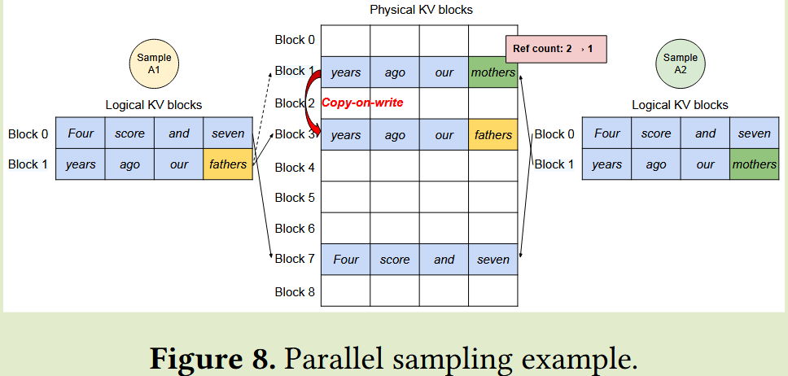

### Scheduling and Preemption
- swap 到磁盘和重新计算，这两种方式的性能取决于 CPU RAM 传输速率、GPU 的计算效率
#### Swapping
交换。这是大多数虚拟内存实现所使用的经典技术，它将被逐出的页面复制到磁盘上的交换空间。
- 将被逐出的块复制到 CPU 内存。除了 GP块分配器之外，vLLM还包括 CPU 块分配器来管理交换到 CPU RAM的物理块。
- 当 vLLM 耗尽新令牌的空闲物理块时，它会选择一组序列来逐出并将其 KV 缓存传输到 CPU。一旦抢占序列并逐出其块，vLLM 就会停止接受新请求，直到所有抢占序列完成。
- 一旦请求完成，其块就会从内存中释放，并且被抢占序列的块将被带回以继续该序列的处理。请注意，在这种设计中，交换到 CPU RAM 的块数量永远不会超过 GPU RAM 中物理块的总数，因此 CPU RAM 上的交换空间受到分配给 KV 缓存的 GPU 内存的限制。  
#### Recomputation
重新计算。在这种情况下，我们只需在重新调度被抢占的序列时重新计算 KV 缓存即可。
- **重新计算延迟可以显着低于原始延迟**，因为解码时生成的令牌可以与原始用户提示连接起来作为新的提示。

## Evaluation
**Model** 13B、66B 和 175B 参数的 OPT 模型以及具有 13B 参数的 LLaMA 模型进行评估。
**Env** Google Cloud Platform 上使用配备 NVIDIA A100 GPU 的 A2 实例。

| Model Size            | 13B   | 66B    | 175B        |
| --------------------- | ----- | ------ | ----------- |
| GPUs                  | A100  | 4×A100 | 8×A100-80GB |
| Total GPU memory      | 40 GB | 160 GB | 640 GB      |
| Parameter size        | 26 GB | 132 GB | 346 GB      |
| Memory for KV cache   | 12 GB | 21 GB  | 264 GB      |
| Max. # KV cache slots | 15.7K | 9.7K   | 60.1K       |

**Workload** 基于 ShareGPT 和 Alpaca 数据集合成工作负载，其中包含真实 LLM 服务的输入和输出文本。由于这些数据集不包含时间戳，因此我们使用**具有不同请求率的泊松分布生成请求到达时间**。

**Key Metrics**
- **Throughput**: 每秒处理的请求数
- **Normalized Latency**: 每个请求的端到端延迟的平均值除以其输出长度

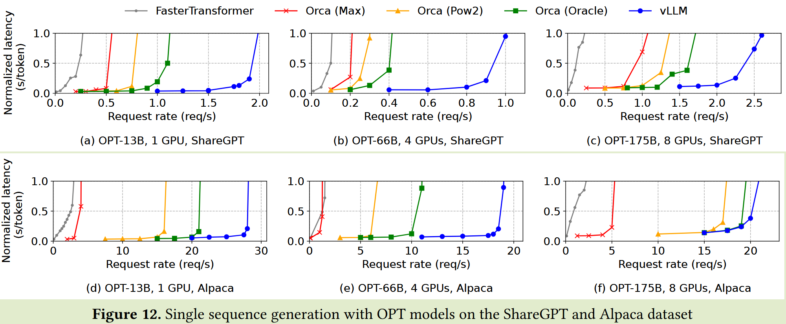

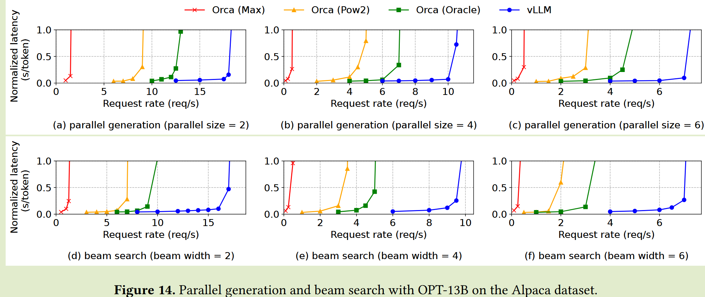

## Ablation Studies
### Kernel Microbenchmark
PagedAttention 中的**动态块映射**会影响涉及存储的 KV 缓存的 GPU 操作的性能，即**块读/写和注意力**。
- 涉及访问块表
- 执行额外分支
- 处理可变序列长度的额外开销。

与高度优化的 FasterTransformer 实现相比，这会导致注意力内核延迟增加 20-26%

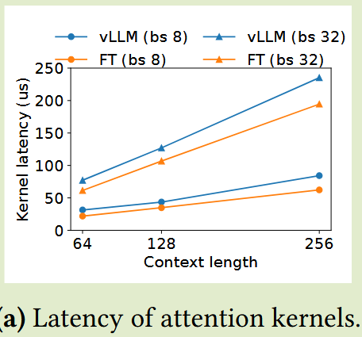

### Impact of Block Size
块大小的选择会对 vLLM 的性能产生重大影响。
- Block size 过小：vLLM 可能无法充分利用 GPU 的并行性来读取和处理KV缓存。
- Block size 过大：**内部碎片会增加，共享的概率会降低**。

使用 ShareGPT 和 Alpaca 轨迹以及固定请求率下的基本采样来评估不同块大小的 vLLM 的性能。
- 在 ShareGPT 跟踪中，块大小从 16 到 128 会带来最佳性能。
- 在 Alpaca 跟踪中，虽然块大小 16 和 32 效果很好，但较大的块大小会显着降低性能，因为序列变得比块大小短。
- 在实践中，我们发现块大小 16 足够大，可以有效地利用 GPU，并且足够小，可以避免大多数工作负载中出现严重的内部碎片。因此，vLLM 将其默认块大小设置为 16。

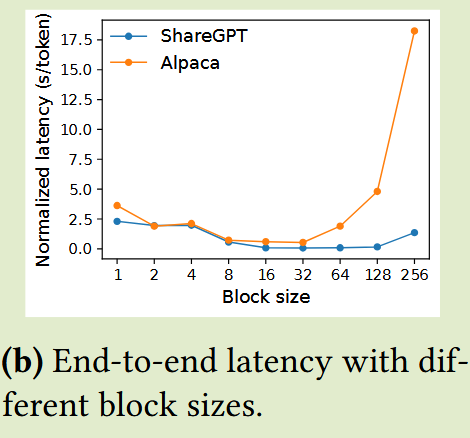

### Swapping vs. Recomputation
**小块大小的交换会产生过多的开销**。这是因为较小的块大小通常会导致 CPU 和 GPU 之间进行大量小数据传输，从而限制了有效的 PCIe 带宽。

**重新计算的开销在不同的块大小上保持不变**，因为重新计算不利用 KV 块。
- 当块大小较小时，重新计算效率更高
- 当块大小较大时，交换效率更高

尽管重新计算开销永远不会高于交换延迟的 20%。对于 16 到 64 的中等块大小，这两种方法表现出相当的端到端性能。

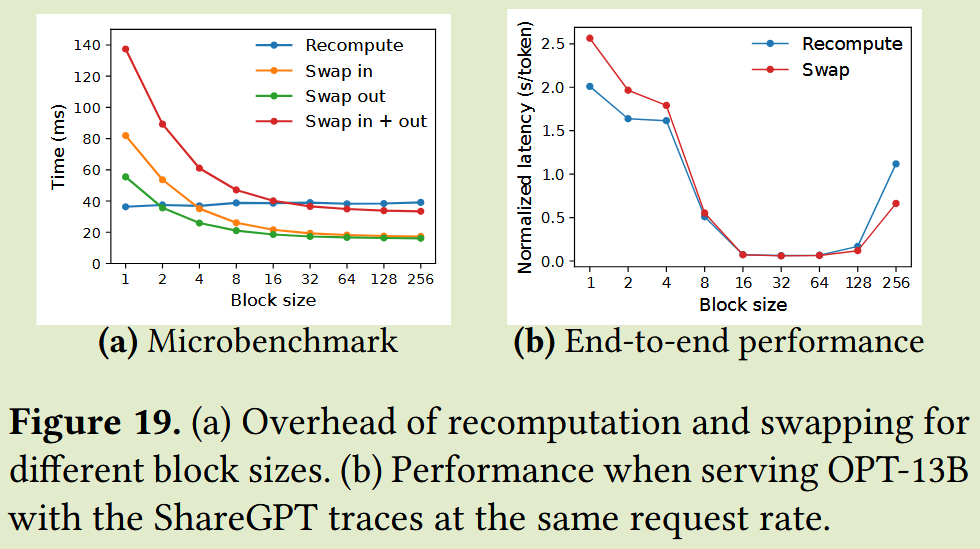

## Summary
- vLLM 通过 PagedAttention 引入了一种新的内存管理机制，显著提高了 LLM 服务的效率和可扩展性。PagedAttention 通过将 KV 缓存划分为块并按需分配来减少内部碎片并消除外部碎片，同时允许当前请求暂时访问其他请求未来预留的 KV 缓存块，从而提高了吞吐量。
- vLLM 允许 shared prefix，在这部分 chatbot 场景中非常有用，可以大幅减少内存占用和计算开销。
- vLLM 还引入了两种机制来处理内存不足情况：交换和重新计算。评估表明，重新计算在大多数块大小下表现出更好的性能，尤其是在较小的块大小下。
- vLLM 对 block 大小的设置；抢占机制的 trade-off 以及 kernel 的性能做了详细的评估和分析，为未来的 LLM 服务系统设计提供了有价值的见解。

