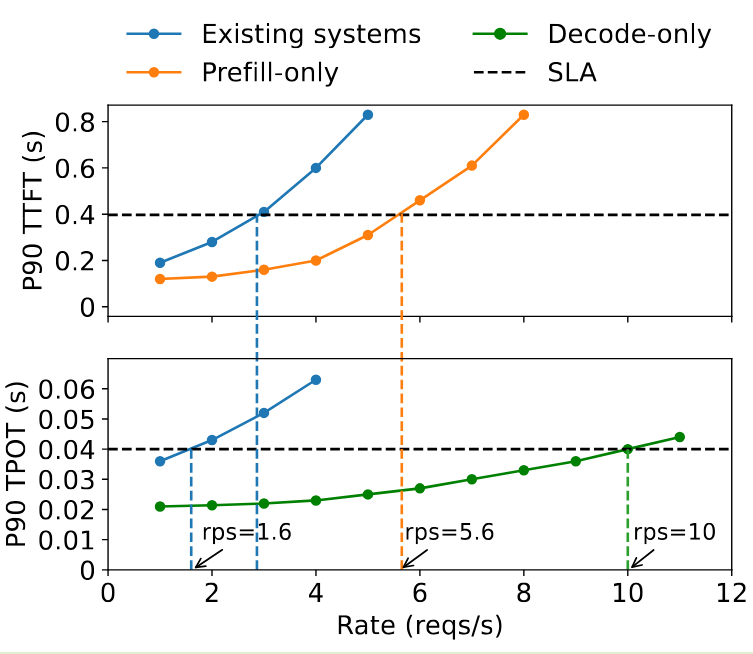
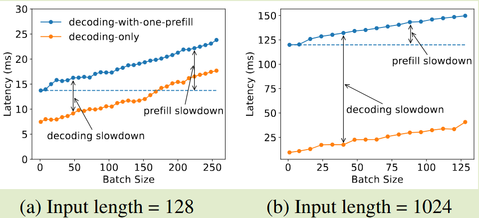
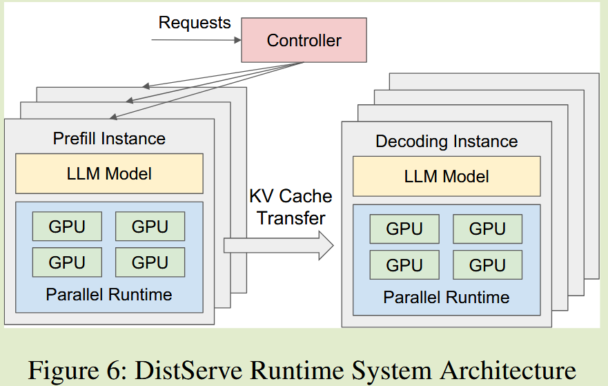
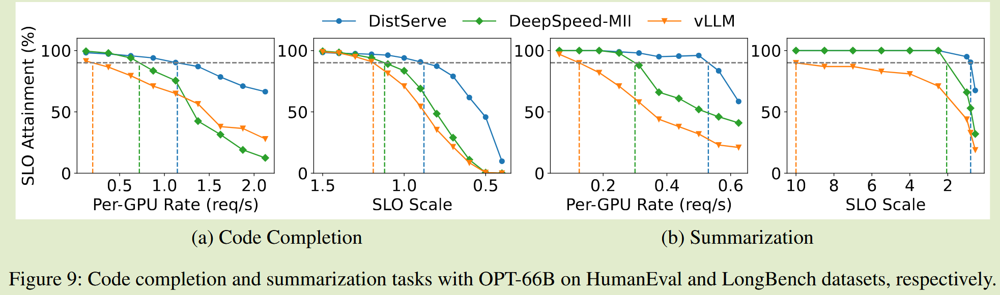

# DistServe: Disaggregating Prefill and Decoding for Goodput-optimized  Large Language Model Serving

## Motivation

现有的 LLM 服务系统将 prefill 和 decode 两个阶段并置，并批量计算所有用户和请求的预填充和解码。我们发现这种策略不仅会导致强烈的预填充解码干扰，而且还会耦合两个阶段的资源分配和并行计划。
- prefill 关注 TTFT
- decode 关注 TPOT
现有系统为了满足两种不同的延迟，过度配置计算资源或者牺牲其中一个来满足另一个；这会造成成本效益不足
- 因此，优化每个 LLM 查询的成本，同时遵守高 SLO attaninment（满足 SLO 的请求比例）对于所有 LLM 服务变得越来越重要

在 SLO 达到 90% 的情况下，单个 A100 GPU 上可实现的最大吞吐量（受到 TTFT 和 TPOT 要求中更严格的一项的限制）约为每秒 1.6 个请求 (rps)。
- 预填充阶段的每 GPU 吞吐量为 5.6 rps
- 解码阶段的每 GPU 吞吐量为 10 rps。

理想情况下，通过分配 2 个 GPU 进行预填充和 1 个 GPU 进行解码，我们可以有效地以 10 rps 的总体吞吐量（即每个 GPU 3.3 rps）为模型提供服务，这比现有系统高 2.1 倍。
- 吞吐量的差距主要源于预填充和解码的并置——这两个阶段具有非常不同的计算特性和延迟要求

### Prefill-decoding interference
预填充步骤通常比解码步骤花费更长的时间。
- 当一起批处理时，批处理中的解码步骤会被预填充步骤延迟，从而显着延长其 TPOT；
- 包含解码步骤导致 TTFT 的显着增加

### Ineffective Scheduling
取消批处理预填充和解码作业并按顺序调度它们并不能减轻干扰。
- 由于等待 GPU 上正在进行的预填充作业，解码作业可能会遇到较长的排队延迟。
- 专用于解码的批次通常会导致 GPU 利用率不足。在任一阶段对任务进行优先级排序都会对另一个阶段的延迟产生不利影响，从而导致优先级调度无效(prefill 优先 or decode 优先)。
### Resource and parallelism coupling
在同一 GPU 上并置预填充和解码阶段不可避免地会共享其资源和并行设置。然而，每个阶段都有其独特的计算特性和延迟要求，需要更多异构的资源分配。
- 预填充阶段往往受计算限制，并受益于 TP，以减少执行时间，以满足 TTFT 上严格的 SLO。
- 解码阶段的最佳并行配置取决于 max-running-reqs。

## Metrics
与不同的 LLM 应用相关，chatbot 需要更小的 TTFT，对于 TPOT 只需要比人阅读更快；而对于代码生成等应用，TPOT 需要更小的值。
- TTFT（Time To First Token）：从请求到第一个 token 生成的时间，衡量 prefill 阶段的性能。
- TPOT（Time Per Output Token）：每个输出 token 生成的平均时间，衡量 decode 阶段的性能。
- Per-GPU goodput：为每个配置的 GPU 提供符合 SLO 实现目标（例如 90%）的最大请求率

## Key Observation
### Analysis for Prefill Instance
**Batching strategy**：对于 13B 参数 LLM，处理单个 512 个令牌序列可以充分利用 A100 GPU。一旦 GPU 受到计算限制，向批次添加更多请求将不再提高 GPU 效率。有必要提前分析特定的 LLM 和 GPU，以确定关键输入长度阈值（表示为 $L_m$），超过该阈值，预填充阶段将受到计算限制。仅当计划请求的输入长度低于 $L_m$ 时才应考虑批量处理更多请求

**Parallelism plan**：TP 在较低到达率时更有效，而 DP 随着到达率的增加而获得优势
- prefill-only 场景故意简化成了一个很标准的队列系统，输入长度均为 512 token
- 低到达率时，inter-op：执行时间接近 D，intra-op：执行时间是 $D/K$所以自然 intra-op 更优。
- 随着到达率增加，inter-op：执行时间接近 D，intra-op：执行时间是 $D/K$ + 排队时间；排队时间会随着到达率增加而增加，所以 inter-op 更优。

### Analysis for Decoding Instance
**Batching strategy**：由于单个解码作业严重受带宽限制，因此批处理是避免 GPU 利用率低（因此每 GPU 吞吐量高）的关键。当前系统较高的到达率会产生更多的预填充作业，如果优先考虑预填充作业，则需要更多的 GPU 时间来满足 TTFT 要求，这反过来会对 TPOT 产生不利影响

**Parallelism plan**：因此，当 TPOT SLO 很严格时，TP 对于减少 TPOT 以满足延迟目标至关重要。DP 更适合线性提高吞吐量。
- 当模型可以装入单个 GPU 的内存时，除了预填充和解码实例的模型并行性之外，复制也是一种有竞争力的选择
## Core Idea

- 在不同的 GPU 上独立运行每个阶段可以消除预填充解码干扰。
- 通过定制的资源分配和模型并行策略独立扩展每个阶段，以满足其特定的延迟要求。
- PD 分离会导致 GPU 之间的中间状态进行通信，但在现代 GPU 集群中，通信开销并不大，并且如果管理得当，分解会显着提高每个 GPU 的吞吐量。

DistServe 还具有一种算法，可以根据其分配方案和集群的带宽来放置预填充和解码计算，以最大限度地减少阶段之间通信中间状态的开销。

### Placement for High Node-Afinity Cluster
高节点亲和性集群 + Infiniband + KV 跨节点传输代价可以忽略，所以 prefill 和 decode 可以近似独立规划，最后再组合。分别找到 prefill 和 decode 的最优方案，然后复制它们，实现总 goodput 的要求
> $n,m \leftarrow \lceil\frac{R}{conft_p.goodput}\rceil , \lceil \frac{R}{conft_d.goodput} \rceil $

### Placement for Low Node-Afinity Cluster
不是把整个实例同置，而是把实例切成段（segment），只要求对应阶段的 prefill 段和 decode 段同置在同一节点。这样跨节点实际上只需要传输 hidden_states 即可而不是大量的 KV Cache，通信开销大大降低了。
### Online Scheduling
所有传入请求都到达集中控制器，然后分派到具有最短队列的预填充实例进行预填充处理，然后分派到负载最少的解码实例进行解码步骤

**Reducing pipeline bubbles**：为了减轻由不一致的 Prompt 长度引起的管道气泡，我们以平衡 pipeline 中所有 batches 的执行时间的方式安排请求。
- 对于预填充实例，我们分析目标模型和 GPU，以计算出使 GPU 饱和所需的最短提示长度 Lm。我们通过批处理多个短于 $L_m$ 的请求或单独调度长于 $L_m$ 的请求来调度总序列长度接近 $L_m$ 的预填充批次。
- 对于解码实例，我们将 $L_m$ 设置为最大批量大小

**Combat busrtiness**：工作负载的突发可能会导致大量 KV 缓存从预填充转移到解码实例，从而导致**解码实例存在内存过载的风险**。为了解决这个问题，DistServe 采用 push 的方式进行 KV 缓存传输，而不是 pull 的方式
- 解码实例根据需要从预填充实例中获取 KV 缓存，使用预填充实例的 GPU 内存作为排队缓冲区。

> [!IMPORTANT]
> 相对于 decode 端，prefill 端更适合作为短期等待缓冲；同时系统要通过 push + 调度控制，避免这个缓冲无限增长。

**Replaning**：DistServe 中的资源和并行计划针对特定工作负载模式进行了优化，如果工作负载模式随时间变化，则可能会变得次优。 **DistServe 实施定期重新规划**。工作负载分析器监视关键参数，例如请求的平均输入和输出长度、平均到达率等。如果检测到显着的模式转变，DistServe 将根据最近的历史数据触发重新运行放置算法，并且重新加载 LLM 权重可以在几分钟内完成——远远短于现实世界工作负载变化往往发生的每小时规模。  

**Preemption and fault tolerance**。 DistServe 没有实现抢占和容错等高级运行时策略。在 DistServe 中，FCFS 策略可能会导致“护航效应”，即较长的请求会在预填充阶段阻塞较短的请求。
- 在传统的基于主机托管和复制的系统中，一个实例中的故障通常不会中断其他副本实例。
- 然而，在DistServe中，预填充和解码实例之间的依赖关系引入了故障传播的风险。例如，映射到多个预填充实例的单个解码实例中的故障可能会破坏整个服务和集群。我们把两者都留作未来的工作

> [!NOTE]
> 当前 SGLang 也没有容错，只是简单的将当前的 req 直接 abort，如果 prefill 和 decode 任何一方出现了传输问题或者 heartbeat 超时都会让当前的 req 失败

## Results

**Per-GPU Rate**：评估了 DistServe 在所有三种 OPT 模型的chatbot 应用程序上的性能。
- 当我们逐渐提高速率时，更多请求将违反延迟要求，并且 SLO 达到率会降低。
- 垂直线显示系统可以处理的最大每 GPU 速率，以满足超过 90% 的请求的延迟要求

**SLO Scale**：固定速率，然后使用称为 SLO Scale 的参数同时线性缩放中的 TTFT 和 TPOT 两个延迟要求。随着 SLO 规模的减小，延迟要求更加严格。我们的目标是遵守系统能够承受的最严格的 SLO 等级，同时仍能实现目标

## Summary
- 通过将 prefill 和 decode 阶段分离到不同的 GPU 上，DistServe 消除了预填充解码干扰，并允许每个阶段独立优化其资源分配和并行计划以满足其特定的延迟要求。对不同的集群考虑了不同的放置策略，以最大限度地减少阶段之间通信中间状态的开销。
- 问题：
  - 如果没有容错，prefill 和 decode 之间 kv cache 的传输如果失败了怎么办，后续当前 batch 中的 req 如何处理？
  - 如果使用不同的并行策略，如何保证传输 kv cache 可以按照不同的 layout 到对应的 GPU 上?
  - 后端传输引擎是什么，如何进行通信的？
