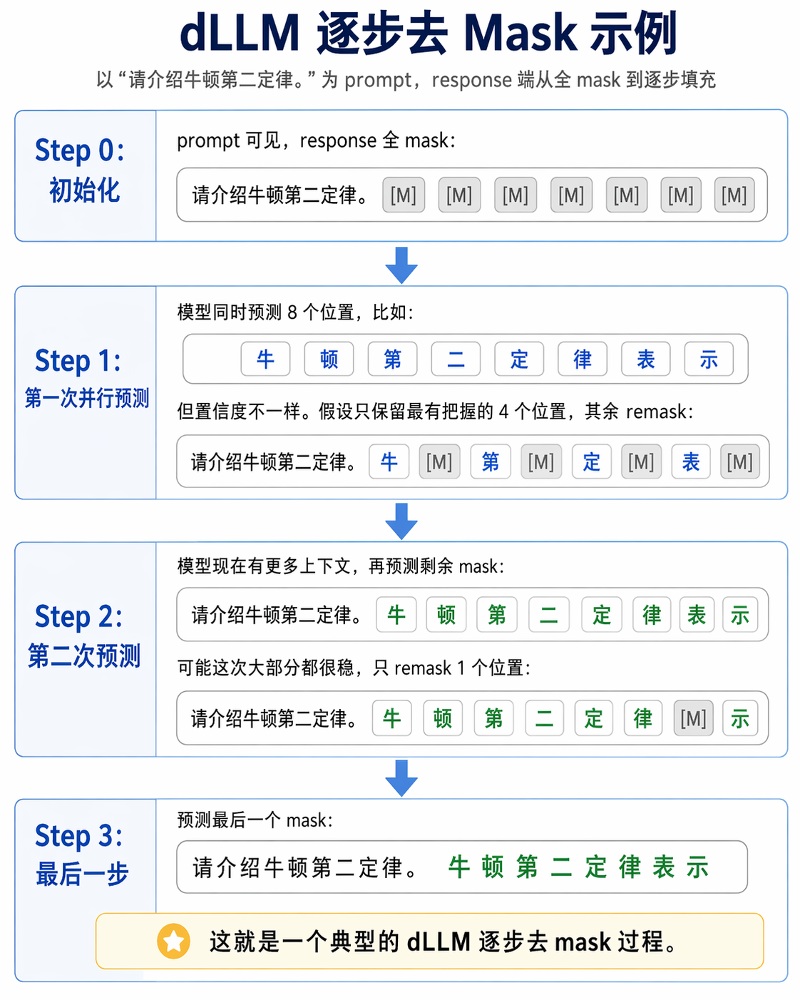
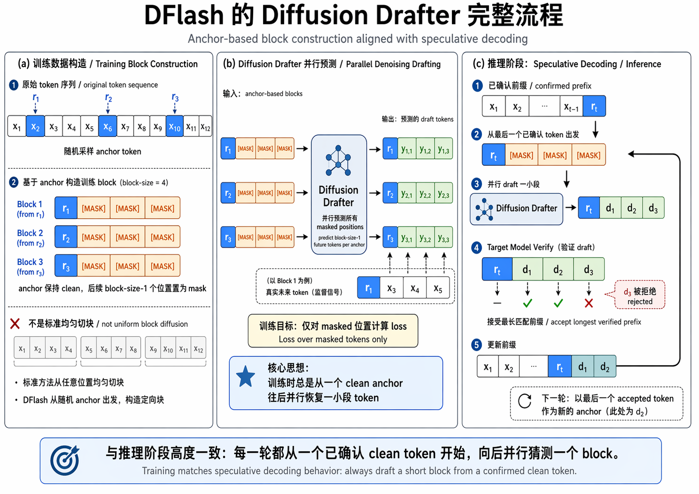
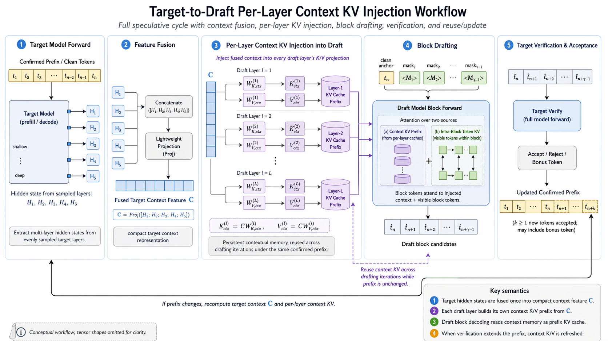

# DFlash : Block Diffusion for Flash Speculative Decoding
## 什么是 DLLM？
在标准的自回归语言模型中，序列的联合概率分布被严格分解为条件概率的连乘：$$p(x_1,\dots,x_n)=\prod_{i=1}^n p(x_i\mid x_{<i})$$直观含义：第 $i$ 个 Token 只能基于它前面的 $i-1$ 个 Token 来预测。

dLLM 抛弃了上述的单向连乘约束，转而借鉴了 Diffusion 模型在图像生成领域的成功经验，定义了一个**加噪与去噪”**的过程：
- Forward Process (前向加噪)：在训练阶段，拿一段干净的原始文本（Clean Sequence），将其中的一部分 Token 随机替换为 [MASK] 标记。
- Reverse Process (反向去噪)：模型不去学习下一个词是什”，而是学习在当前这个部分可见、部分被 Mask 的序列状态下，每个 Mask 位置最原本的 Token 是什么。
- 此时，模型建模的目标变成了条件分布：$$p(x_{masked} \mid x_{observed})$$

具体有如下两个核心流程：
1. Block Diffusion (块状并行预测)
   - 在推理的初始状态，整个序列（或一个 Block）可能完全是 [MASK]。模型进行一次前向计算（Forward Pass），就会同时对这个 Block 内所有被 Mask 的位置给出预测概率。
   - Block 内是双向注意力，Block 间是因果注意力，可以复用 LLM 推理中的 KV Cache 机制。

2. Remask (动态重掩码与迭代细化)
   - 如果一次性把所有 Mask 预测出来直接作为最终结果，质量通常会很差，因为全 Mask 状态下缺乏上下文信息（类似图像扩散中直接一步从纯噪声跨越到清晰图像）因此，dLLM 引入了 Remask 机制，形成迭代循环：
     - Step 1: 并行预测。基于当前的 Mask 状态，模型预测出所有 [MASK] 位置的候选 Token 及其置信度。
     - Step 2: 择优保留。在所有预测出的 Token 中，系统只接受那些置信度最高、最确定的一小部分 Token（相当于将这些位置从 [MASK] 更新为真实的 Token）。
     - Step 3: 重新掩盖 (Remask)。将其余置信度不高的位置重新打上 [MASK] 标记。
     - Step 4: 循环迭代。带着刚才已经接受的 Token，进入下一轮预测。因为有了更多确定的上下文，下一轮对剩余 [MASK] 的预测会更加准确。

## Diffusion Drafter (DFlash) 相较于 AR Drafter 的本质加速优势

在每一轮投机解码中，平均生成单个 Token 的延迟 $L$ 定义如下：$$L = \frac{T_{draft}+T_{verify}}{\tau}$$
- $T_{draft}$：Draft 模型生成候选 Token 序列（Proposal）所花费的时间代价。
- $T_{verify}$：Target 模型并行验证这些候选 Token 所花费的时间。
- $\tau$：单轮最终实际推进的 Token 数量。

若 Draft 提议了 $\gamma$ 个 Token，则 $\tau \in [1,\gamma+1]$（包含 Target 自身附赠的 1 个 Bonus Token）。

加速的唯二路径：
- 增大分母（提升 $\tau$）：让 Target 模型每轮接受更多的 Token（即猜得更准、更长）。
- 减小分子（降低 $T_{draft}$ 或 $T_{verify}$）：在保证质量的前提下，极力压缩 Draft 和 Verify 的时间成本。

因此，投机解码的终极加速比（Speedup） $\eta$ 为：$$\eta = \frac{L_{target}}{L}$$

### AR Drafter
AR Drafter 的核心痛点在于串行生成的成本随着预测长度线性膨胀。其 Draft 时间成本模型为：$$T_{draft} = \gamma \cdot t_{step}$$
- 想增大预测长度 $\gamma$（试图提高分母 $\tau$），就必须串行执行更多次 Forward，$T_{draft}$ 随之线性飙升。
- 为了控制 $T_{draft}$ 不至于爆炸，AR Drafter 被迫设计得极浅、极轻（例如 EAGLE-3 常用的单层 Transformer）。
- 接受长度（$\tau$）迅速饱和：模型太浅导致表达能力羸弱，越往后的 Token 猜测准确率越低。

### Diffusion Drafter (DFlash)
Diffusion Drafter 时间成本模型变为：$$T_{draft} \approx t_{parallel}$$

由于它采用 Block-parallel prediction（即一个 Block 内的 $\gamma$ 个位置同时预测），只要在现代 GPU 的合理 Block Size 内，Draft 成本对 $\gamma$ 的增加极不敏感。
- Diffusion Drafter 可以承担更深、更具表达能力的架构。
- 更深的模型带来了质的飞跃，候选 Token 的准确率大幅上升，使得 $\tau$ 能够持续增长，而不会像浅层 AR 模型那样迅速饱和。

## Dllm Drafter
不是 dllm 使用的 block diffusion 的均匀切块，而是随机采 anchor，把 anchor 作为块的第一个位置，mask 后面所有位置，让模型并行预测后续 block-size-1 个 token。这样和推理阶段总是从一个已确认 token 往后 draft 的行为一致

> [!NOTE]
> 在推测解码中，并非所有令牌都是相等的。草稿块中早期位置的错误会使所有后续令牌无效。这使得早期预测对于接受长度显得尤为重要。我们通过对交叉熵损失进行加权来反映这种不对称性，以强调训练期间早期的标记位置；使用权重衰减来实现

- 更大的 block size 效果更好，用更大 block size 训练的模型可以使用更小的 block size 进行推理，但反过来不行。

## DFlash Inference Workflow
- Step 1：目标模型先正常 prefill，一边算首 token，一边抽 hidden feature
- Step 2：把多层 hidden feature 融合成一个 target context feature
- Step 3：把这份 context feature 注入 draft 每一层的 KV cache
- Step 4：draft model 以一个 clean token + 一串 mask token 为输入，并行预测下一整个 block
- Step 5：target model 对整个 draft block 做并行 verify
- Step 6：更新状态，进入下一轮

## 数学证明（AI 辅助）
为什么 AR drafting 容易 error accumulation，而 block diffusion（尤其在 DFlash 这种强条件化 target hidden features 的设置下）能显著缓解。

---
1. 记号与 acceptance length 的基本公式
设一次 speculative 迭代要生成一个长度为 B 的块：
- 目标模型（target）在给定前缀上下文 c（可理解为 prefix + target hidden state）下的逐步条件分布：
$$p_i(\cdot) \;=\; p\big(x_{t+i}\mid c, x_{t+1:t+i-1}\big)$$
- draft 生成的候选块记为 $\hat x_{1:B}$，target 在 verify 阶段得到参考 token 序列 $x^\star_{1:B}$
- 定义接受长度
$$\tau \;=\; \max\{k: \hat x_{1:k}=x^\star_{1:k}\}$$
- 一个常用恒等式（离散非负整数随机变量）：
  - τ≥k 的含义是至少接受了前 k 个 token
  - 这等价于前 k 个 token 都匹配，也就是 $\hat x_{1:k}=x^\star_{1:k}$
$$\mathbb{E}[\tau] \;=\; \sum_{k=1}^{B}\mathbb{P}(\tau\ge k) \;=\;\sum_{k=1}^{B}\mathbb{P}(\hat x_{1:k}=x^\star_{1:k})$$
并且
$$\mathbb{P}(\hat x_{1:k}=x^\star_{1:k}) = \prod_{i=1}^{k} \mathbb{P}\Big(\hat x_i=x^\star_i \,\big|\, \hat x_{1:i-1}=x^\star_{1:i-1}\Big)$$

所以长前缀能否被接受，取决于每一位的命中概率是否会随着 i 快速变差。
- 如果概率快速变差，乘积会快速衰减，导致大 k 的概率很小，$\mathbb{E}[\tau]$就小。

---
2. 为什么 AR drafting 会产生 error accumulation：隐藏状态误差的递推放大
AR draft 的核心结构是链式条件化：
$$q(\hat x_{1:B}\mid c)=\prod_{i=1}^{B} q\big(\hat x_i \mid c, \hat x_{1:i-1}\big)$$
 draft 在每一步用的是自己的隐状态 $\tilde h_i$，它由 draft 的动力学递推得到；一旦前面有偏差，这个偏差会通过递推影响后续全部步骤。
目标 vs draft 的隐状态演化
把 transformer 的状态更新抽象成一个状态递推（这在理论分析里很常见）：
- target 的状态：
$$h_i = F(h_{i-1}, x^\star_i), \quad h_0 = H(c)$$
- draft 的状态：
$$\tilde h_i = \tilde F(\tilde h_{i-1}, \hat x_i), \quad \tilde h_0 = \tilde H(c)$$
- 经过一系列推导和约束，我们可以得到偏差的下界 $\delta_i$
$$\delta_i \le L^i\delta_0 + \varepsilon\sum_{j=0}^{i-1}L^j = L^i\delta_0 + \varepsilon\frac{L^i-1}{L-1}$$
- 结论 1（累积放大）：如果 $L\ge 1$，则$\delta_i$ 随 i 呈指数/几何增长趋势（至少不小于线性增长），这就是 AR drafting 的 error accumulation 的数学原型：前面的一点点状态偏差，会在链式递推中被反复放大。

---
3. 隐状态误差如何导致命中概率随位置变差
- 再考虑 draft 与 target 之间还存在“头/表示”偏差（如果不复用 head/embedding，这个偏差更大）。最终可写成
$$d\big(q_i(\cdot), p_i(\cdot)\big) \;\le\;  \underbrace{C\,\delta_{i-1}}_{\text{链式累积项}} +\underbrace{\eta}_{\text{静态偏差项（结构/头部不一致）}}$$
  - 而命中概率至少会随着分布差增大而下降。比如设 $x^\star_i$ 是从 $p_i$ 采样或 greedy，保守地可以用 TV 给出:
 TV(Total Variation distance 全变差距离)，用来衡量两个概率分布差得有多可区分，KL 小，TV 必然小
  $$\mathbb{P}(\hat x_i = x^\star_i \mid \text{prefix match}) \;\le\; p_i(x^\star_i) + d_{\text{TV}}(q_i,p_i)$$
- 结论 2（命中概率随位置恶化）：在 AR draft 中，$d(q_i,p_i)\ \text{包含}\ C\delta_{i-1}$，而  $\delta_{i-1}$ 由 $\delta_i \le L\delta_{i-1}+\varepsilon$ 递推增长，因此随着 i 增大，后面 token 的命中概率会系统性下降，导致 
$\mathbb{P}(\tau\ge k)=\prod_{i=1}^{k}\text{(命中概率}_i\text{)}$
出现更快的指数衰减（这就是接受长度更短的数学原因）。

---
1. 为什么 block diffusion 能缓解：生成整个块时，每个位置的预测不需要依赖前一个尚未验证 token 形成的递推状态，而是依赖一个共享的强条件 $\mathbb{P}(\tau\ge k)=\prod_{i=1}^{k}\text{(命中概率}_i\text{)}$
出现更快的指数衰减（这就是接受长度更短的数学原因）。

$$q(\hat x_{1:B}\mid c)  = \int q(\hat x_{1:B}\mid z,c)\,\pi(z)\,dz$$
- $z$ 是 diffusion 中的随机噪声变量
- 每个位置 i 的 logits 近似看作 $\hat \ell_i = \phi_i(c, z, \text{(block interaction)})$
  - 重点是：不存在$\tilde h_i = \tilde F(\tilde h_{i-1}, \hat x_i)$ 这种沿 i 方向的强递推依赖。
  
于是分布偏差的上界变成：
$$d\big(q^{\text{BD}}_i(\cdot), p_i(\cdot)\big) \;\le\; \underbrace{\eta'}_{\text{静态偏差（可通过复用 head/embedding 降低）}} +\underbrace{\text{(interaction error)}}_{\text{与 denoise steps 有关，但不随 }i\text{几何放大}}$$
也就是说，AR 的误差界里会递推放大；block diffusion 的误差界里通常没有这种按位置递推放大的项（它可能随 denoising step 收敛，但不会沿 token index i 级联爆炸）。
- 因此对同样的块长 B，block diffusion 更容易得到更大的 $\mathbb{E}[\tau]$。