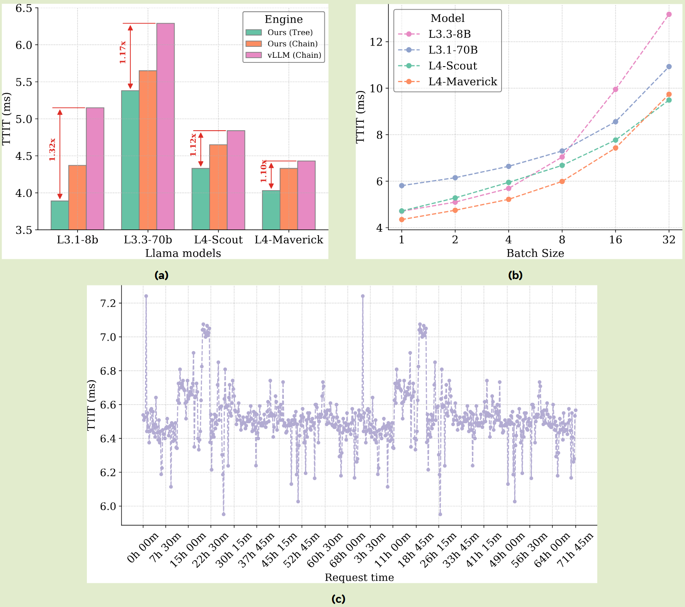

# Efficient Speculative Decoding for Llama at Scale: Challenges and Solutions

> [!NOTE]
> 在 8 个 NVIDIA H100 GPU 上以每个 token 约 4 ms（批量大小为 1）的速度进行解码，这比之前最知名的方法快了 10%。
> 对于基于 EAGLE 的推测解码，我们的优化使我们能够在生产规模上实现 1.4 倍到 2.0 倍之间的大规模部署上的加速

这篇文章从训练和推理两方面对现在 eagle-based 的 sd 方法如何在大规模生产环境下使用提出了一些方法。
暂时只看了推理部分
Inference
这里使用了 PD 分离的策略，所有 req 都先进行 Prefill
[图片]
1. Prefilling (预填充阶段)
  - Base Model Prefill: 计算用户输入的 Prompt。得到 Prompt 的 KV Cache 和最后一个 Token 的隐状态（Hidden States）。
  - Draft Model Prefill: 与传统的推测解码不同，EAGLE 的草稿模型需要 Base 模型的隐状态作为输入。因此，草稿模型也要跑一遍 Prompt，建立自己的 KV Cache。
2. Tree Dispatcher (树调度器)
  - 功能：根据当前的 Batch Size 和模型负载，从预定义的一组静态树结构中选一个最合适的。
  - 静态树可以提前编译成 CUDA Graphs，避免动态生成树结构带来的额外计算开销。
3. Drafting (草稿生成阶段)
  - 形成一棵由 $$N$$ 个候选 Token 组成的推测树。
4. Validation (验证阶段)
  - 在整个链路中是最耗时的部分
  - Base 模型一次性读入整棵推测树，通过 Tree Attention 机制，计算树上每个节点在 Base 模型视角下的概率分布。
  - 高效性： 无论树有多少分支，Base 模型只需做一次前向传播（Forward Pass）即可完成验证。
5. Sampling (采样阶段)
  - 功能： 根据概率分布，决定从树根开始，哪条路径是被接受的。
  - MSS（多轮采样）： 确保这种推测出来的结果，在数学概率上与直接运行大模型完全一致（即无损压缩）。
6. Bookkeeping (后台处理) 
  - KV Cache Rewinding ： 比如推测了 10 个词，但 Base 模型只接受了 4 个。此时必须把 Base 和 Draft 模型已经存进显存的 KV Cache 截断，删掉后面 6 个无效的部分，将指针退回到第 4 个词的位置。
  - Hidden States Caching (隐状态缓存)： EAGLE 需要最新的隐状态来开始下一轮推测。Bookkeeping 会提取并存储被接受路径上最后一个 Token 的隐状态。

Tree Attention
显示的注意力掩码计算成本随上下文增长而显著增加，具有显式掩码的树注意力速度很慢。因此，我们将注意力计算分为两部分：
- 查询和上下文之间的注意力（前缀）
- 查询本身内部的注意力（后缀），
前者计算量大，但不需要掩码，而后者需要树掩码，但相对较小。进行两次 attention 操作，使用 merge_attentions 聚合这两个注意力计算
[图片]
Multi-round speculative sampling
由于树深度上的嵌套循环以及启动大量小内核的需要，MSS 的简单实现可能会在生产解码环境中引入大量开销，有如下优化：
PyTorch-2 compilation
Naively 应用 torch.compile 可能会导致每个 bs 的重新编译，从而可能导致生产中的延迟峰值。为了解决这个问题，我们将每个输入张量中的批量维度指定为动态的。通过此更改，重新编译仅限于两种情况：
- Bs = 1 
- Bs > 1。
此外，如果服务在启动时收到 warm up req，并且涵盖了这两种情况，则编译器缓存将在预热阶段由 torch.compile 填充。然后在实际流量期间重用此缓存，有助于避免延迟峰值

---
Parallelisation across tensor parallel ranks
采样仍成为大批量解码性能的明显瓶颈。一个主要原因是 top-p 掩模或核采样的应用，这涉及固有的串行操作，很难在 GPU 上加速：
- 排序 (Sorting)： 要计算累积概率，必须先将词表（通常有 32k 到 128k 个词）按概率从大到小排序。虽然有并行排序算法（如 Radix Sort），但在超大词表下，它依然比矩阵运算慢得多。
- 前缀和/累积求和 (Prefix Sum / Cumsum)： 计算 $$\sum p_i$$，必须等前面的概率加完才能算下一个。这是一个典型的串行依赖操作。
- 阈值截断 (Threshold Masking)： 找到累积概率正好超过 p 的临界点，并将其余 Token 的概率置为 0。
在张量并行（Tensor Parallel）中，模型权重被拆分，但通常采样逻辑在每个 Rank 上是冗余执行的。
- 痛点： 如果 Batch Size 为 128，原本每个 GPU 都要独立对这 128 条序列进行 top-p 排序和计算。
- 优化： 每个 GPU 完成 bs 的一部分，所有 GPU 计算完成后，通过 All-Gather 通讯操作，让所有 Rank 都获得完整的 128 个选好的 Token。

采样的 bs 不同，随机数生成器向前推进的 step 不同，此时会有 system hang 的风险：分布式系统（如使用 PyTorch 分布式后端）要求所有参与计算的节点（Rank）步调一致。
- 如果 Rank 0 处理 20 条序列，它会向 RNG 申请 20 个随机数，RNG 的状态（Seed State）会向前推进 20 步。
- 如果 Rank 7 只处理 5 条序列（余数部分），它的 RNG 状态只前进 5 步。
- 后果： 几轮迭代后，不同 Rank 的 RNG 状态完全不同。当模型进入某些需要全员同步的环节时，由于随机数不同导致某些路径分叉（例如一条序列结束了，另一条没结束），系统会因为等待永远不会到来的同步信号而死锁（Hang）。
为了既能享受并行计算，又能保持 RNG 同步，Meta 采取了以下策略：
1. 统一 Padding： 强制将 Batch Size 补齐。如果 BS=13，GPU=8，就补到 16。这样每个 GPU 处理的局部 Batch大小完全一致且保证是 world size 的倍数。
2. 全量生成 (Full-sized Random Tensor)：
  - 每个 Rank（无论它实际负责哪一部分）都在内存中生成一个对应完整 Global Batch 的随机张量。
  - 因为每个 Rank 使用相同的 Seed，所以它们生成的这组随机数是完全一模一样的副本。
3. 切片取用 (Slicing)：
  - Rank 0 只拿这个大张量的第 0-1 个元素。
  - Rank 1 只拿第 2-3 个元素。
  - 虽然多生成了一些随机数，但保证了所有 Rank 的 RNG 状态在每一轮结束时都是完全对齐的。
Greedy draft decoding
虽然 Draft 阶段用了 Greedy，但 Validation（验证）阶段依然会应用完整的 Top-p 掩码。这意味着最终输出的质量和分布仍然受目标模型的严格控制，Greedy 只是用来提高寻找正确 Token 的效率

---
CPU-GPU Overlap
- Removing Synchronization Points
  - .item() 实际上是隐藏的 cuda 同步
  - 异步执行：CPU 能够提前把后续的多个任务塞进 GPU 的任务队列（Work Queue）。

[图片]
- Overlapping CPU & GPU
  - 在投机采样中，除了 GPU 算力开销，还有大量的 Bookkeeping 工作，如管理 KV Cache、序列处理等）。如果这些工作非得等 GPU 算完才开始，GPU 就会在 CPU 处理逻辑时处于 idle 状态。
  - 优化：将任务分解。在 GPU 还在跑复杂的计算 Kernel（比如 validation）时，CPU 同步开始处理上一轮的后处理或下一轮的准备工作。
- Sampling at Prefill End
  - 通常流程是 Prefill（预填充）完全结束后，再进入正式的 Decoding（解码）循环。这中间存在一定的转换开销，导致用户等待第一个字的时间（TTFT）较长。
  - 优化手段：在 Prefill 任务的最后一个环节直接嵌入一个采样步骤（Sampling）。
    - Send token 0
- Reordering & Result Masking
  - 优化手段 A（重排）：将Prefill 响应处理挪到 Bookkeeping之前。因为 Prefill 处理通常较快，可以将其隐藏验证 Kernel（Validation Kernels）执行期间完成。
  - 优化手段 B（提前启动）：在当前轮次的验证结果还没传输给客户端时，就已经提前启动下一轮的 Drafting 和 Validating
  - 将通信延迟隐藏在计算中
[图片]
Why can we do this?
优化手段 A：将 Prefill 响应处理挪到 Bookkeeping 之前
- Prefill 已经做了 sampling，实际上我们需要的 token 和 hidden_states 已经存在了，所以 handle prefill 的数据不再依赖 bookkeeping，可以放到 Bookkeeping 之前

---
优化手段 B：提前启动下一轮的 Drafting 和 Validating
- 后续轮次的启动：启动下一轮 Drafting（草稿生成）的真正前提是确定当前轮次的最终接受状态（即验证结束并采样出下一个真实 Token）。
- 并行化 I/O 与计算：一旦 GPU 完成了采样（Sampling）并确定了下一个 Token，CPU 就可以立即发起下一轮的 Launch Drafting 和 Launch Validating。将 send results 的 I/O 掩盖在 validating 的计算开销中

---
Other Optimizations
Pre-computed Static Trees
投机采样通常使用树状结构同时预测多个可能的后续 token。虽然树越大（预测的 token 越多），单轮接受的 token 数（TPC）可能越高，但在 Batch Size 较大时，计算这棵大树的开销会抵消其带来的收益。
Meta 引入 Tree Dispatcher（树调度器）。系统预先计算好不同形状的树，并根据当前的 Batch Size 动态切换：
- 小 Batch Size：使用复杂的静态树结构，以获取更高的 TPC。
- 大 Batch Size：切换为简单的链式结构（例如只预测 3 个 token），以降低计算压力。

---
Draft KV Cache Alignment
在投机采样方法（如 EAGLE）中，每一轮草稿生成前都需要将主模型的最新状态同步给草稿模型。如果同步所有的历史信息，计算量会非常大。
优化手段：研究发现，仅使用上一个回合产生的最后一个输出 token 及其隐藏状态来对齐草稿模型的 KV Cache 就足够了。在保证草稿模型预测准确率的同时，显著降低了每一轮对齐操作的计算成本，提升了推理效率。

---
CUDA Graphs
消除 CPU 启动 GPU 算子的开销。在高性能推理中，频繁地从 CPU 发射（Launch）微小的 GPU 内核会产生明显的延迟，尤其是在 Batch Size 较大时。
- 关键差异：不同于 vLLM 将 Attention 计算排除在外的做法，该方案选择捕获完整的模型执行。
可能是本身就是用的是 torch.compile，所以 CUDA Graph 并没有排除 Attention
- 结果：极大地减少了内核启动开销（Kernel Launch Overhead），使 GPU 运行更加连贯流畅。
Attention Kernel Chosen
- 优化手段：系统集成了多种内核实现（Flash Decoding, Flash Attention v2/v3, Composable Kernel），并基于启发式策略动态选择：
  - 低延迟场景：当树尺寸 $$\le 4$$ 且 Batch $$\le 64$$ 时，优先使用 Flash Decoding。
  - 高吞吐场景：在硬件支持的情况下，大树和大 Batch 优先使用 Flash Attention v3

---
Paged KV with Tree Attention
Paged KV 能极大地节省内存，但它天然不支持树状结构的注意力计算。
- 局部寻址：仅对 Prefix（前缀）部分应用分页寻址；对于较小的 Suffix（后缀）部分，直接写回中间结果而不进行复杂的寻址查询。
- 树状填充 (Tree Padding)：在分配内存块时预留空间，防止投机生成的 token 跨越内存块边界，确保存储的连续性。

---
Quantized Draft Model
推测性解码的无损是草稿模型的质量不会影响最终输出；它只会影响速度。因此，我们可以以不同于基本模型的方式压缩草图模型。INT4 前馈网络量化在 TPC 和解码速度之间提供了良好的权衡。 

---
Guided Decoding
- 在推测解码工作流程的所有阶段（包括起草、采样和簿记）集成了引导解码逻辑。
- 优化 GPU 上与 GD 相关的操作来提高性能。
  - 我们有效地初始化了GD有限状态机（FSM）状态，并通过将CPU相关操作移至GPU来加速屏蔽logits的关键步骤
Sglang 当前还是在 CPU 上处理；sglang 直接调用 XGrammar 后端，在 req 第一次进入 scheduler 时初始化 grammar

---
Benchmark
之前的工作大多假设推测解码加速随着批量大小的增加而降低。这是因为推测性解码方法可能未充分利用 GPU 计算资源，即 draft & verify 新增的 FLOP 不会增加延迟，因为 decode 受 GPU 内存带宽而非计算的限制。
- 在大批量大小下，解码变得受计算限制，导致加速下降。  
- 在上下文长度较大的情况下，即使对于大批量大小，注意力也主导着计算，因此工作负载仍受内存限制。图 9 中的结果部分证实了这些观察结果。
总的来说，我们观察到端到端推测解码加速与批量大小之间的关系根据模型大小及其性能特征而变化。例如，与小批量大小相比，Llama3.1 8B 模型在大批量大小时表现出更大的推测解码加速。相比之下，拥有大约 4000 亿个参数的 Llama4 Maverick 的加速比随着批量大小的增加而降低
[图片]
为什么 Llama 3.1 8B 在大 Batch 时加速比反而提高？
对于像 8B 这样的小模型，即使 Batch Size 增加（例如到 64 或 128），它依然往往处于访存受限状态。
- 权重极小：8B 模型的权重很轻量，即使大 Batch 下，读取权重占用的带宽比例依然相对较低。
- 计算密度低：小模型单次前向计算需要的 FLOPs 远低于 GPU 的峰值算力。
- 验证成本低：在大 Batch 下，常规解码（Non-speculative）也必须读取一遍权重。推测解码虽然增加了验证 token 的计算量，但这些计算任务被填补到了 GPU 原本空转的计算单元中。
- 吞吐收益：由于大 Batch 下 GPU 的并行效率更高，推测解码一次性验证多个 token 带来的收益（TPC）被放大，从而提升了加速比。

---
为什么 Llama 4 Maverick (400B) 在大 Batch 时加速比下降？
对于 400B 规模的模型（如 Maverick），情况发生了反转：
- 算力需求激增：大模型的参数量是小模型的 50 倍。随着 Batch Size 增加，矩阵运算的规模变得极大，迅速填满了 GPU 的计算单元（如 Tensor Cores）。
- 进入算力受限区：在大 Batch 下，400B 模型已经让 GPU 处于饱和状态。推测解码要求的一次验证 5 个 token 意味着计算量变成了原来的数倍。因为 GPU 已经没有闲置算力了，这额外的计算量会直接导致延迟（Latency）按比例增加。
- 加速比摊薄：当验证 5 个 token 的延迟增加到接近普通解码 5 次的延迟时，推测解码的优势就消失了。

---
上下文长度（Context Length）的干扰
- 强制回退到访存受限：由于 KV Cache 非常庞大，读取 KV Cache 占用的带宽会超过读取权重的带宽。这使得即便在大 Batch 下，工作负载也可能重新变回 memory-bound。因此在极长文本场景下，推测解码在大型模型上依然可能有不错的表现。
