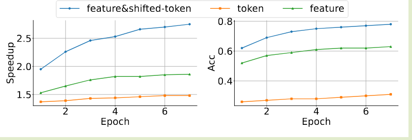
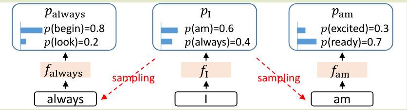
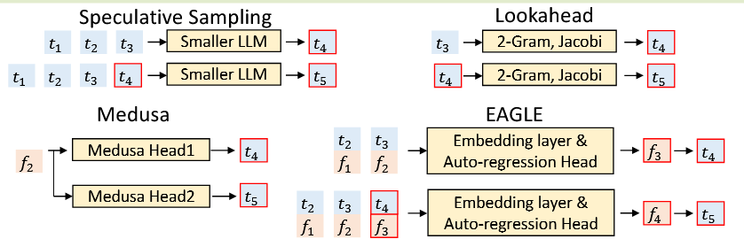
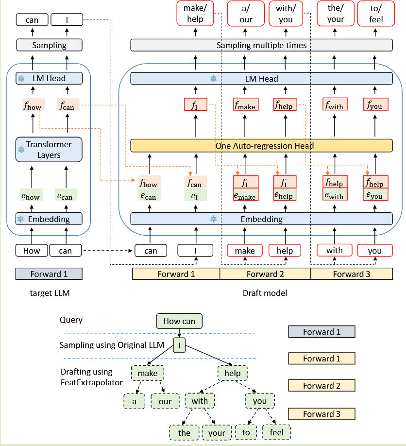
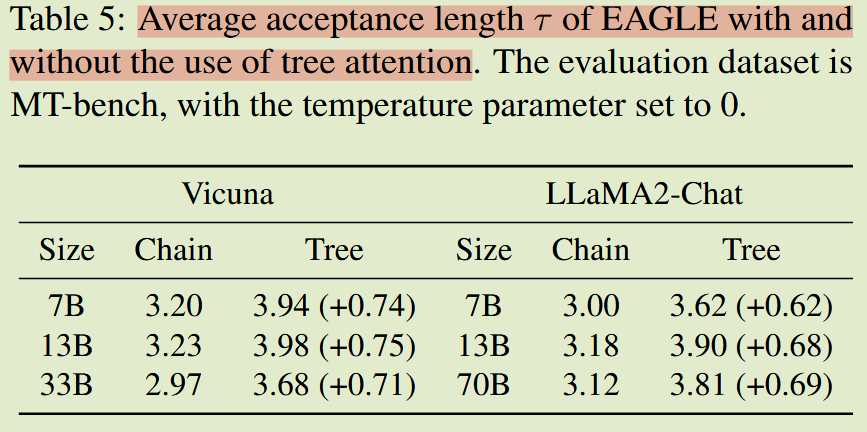
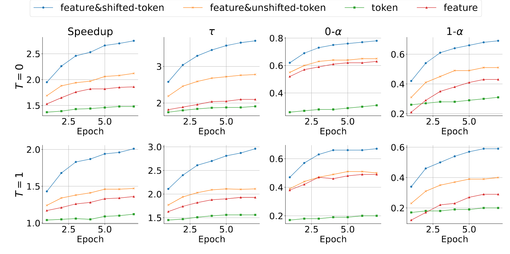

# (EAGLE 1)EAGLE: Speculative Sampling Requires Rethinking Feature Uncertainty

# Key Observation
1. 特征（second-to-top-layer）级别的自回归比令牌级别更直接。
   - 这一层的 feature 更有规律，在特征级别进行自回归处理，然后使用原始 LLM 的 LM 头导出标记比直接自回归预测标记更有效率。
  
2. 采样过程中固有的不确定性极大地限制了预测下一个特征的性能。
   - 对“am”或“always”等不同的 token 进行采样会产生不同的特征序列，从而在特征级自回归中引入歧义
   - EAGLE 将后一步的 token 序列（包括采样结果）输入到草稿模型中（即 $f_t + t_{t+1} \rightarrow f_{t+1}$）。这涉及根据 fI 和 talways 预测 falways，以及根据 fI 和 tam 预测 fam。
  
# Motivation
投机采样的目标是通过让一个更快的草稿模型（Draft Model）来预测未来多个 token 的特征表示，从而减少对原始模型（Target Model）的调用次数。验证阶段确保文本分布与原始LLM的解码结果精确对齐，保持生成内容的完整性。
- 加速 SD 关键
  - 减少 Draft Model 的 overhead
  - 提高 Target Model 的 acceptance rate
- 应用 SD 取决于找到一个反映原始 LLM 功能但延迟时间较短的草稿模型，使用同一系列较小的模型或者重新训练一个统一系列更小的 draft model 成本极高
- 现有的方法如 Lookahead 使用 n-gram 和 Jacobi 迭代来预测未来 token 的特征表示；Medusa 利用 Target Model 的 second-to-top-layer feature 通过多个 MLP 并行预测后续多个 token来减少 draft model 的 overhead，但它们都没有很好地解决 acceptance rate 低的问题。

# Metrics
- Walltime 加速比：相对于普通自回归解码的实际测试加速比。  
- Average acceptance length τ：目标LLM 每次前向传递接受的平均 token 数。
- Acceptance rate α：起草过程中接受的令牌与生成的令牌的比率，衡量起草的准确性。
  - 它不太适用于树草稿，因为每个位置采样了多个令牌，但只接受了一个。
  - 因此，在测量这个指标时，我们使用没有树关注的链草案，与推测采样和 DistillSpec 保持一致
# Core Idea
EAGLE 同时通过 feature 和 sampling 得到的 token 来预测下一个 token 的 feature，利用了两者的互补优势来提高 acceptance rate。
- 这里涉及到一个问题，我们实际上需要用 target model 得到的 feature 和 token 来进行每一次的 decode 阶段的 draft，所以每一轮 draft->verify->sampling 之后，**我们需要再次推进 draft，即用 target model 刚刚得到的所有 token 的 hidden_state 以及采样得到的 bonus token 来恢复 KV Cache 以供下一轮 draft 使用**。
- 而 Medusa 实际上是并行预测未来的多个 token，我们只需要得到 verify 最后一个 feature 就可以了，这也是 SGLang 中为什么会有 `hidden_states::LAST` 和 `hidden_states::ALL` 两种模式的原因。

EAGLE draft token 是一棵树而不是一个链，如果 top-k 为 1 也会退化成链
- 草稿模型将形状（bs，seq len，hidden dim）的 features 和形状（bs，seq len）的 tokens 作为输入。然后，它将 tokens 转换为形状为 (bs, seq len, hidden dim) 的 tokens embedding，并将其连接起来形成形状为 (bs, seq len, 2×hidden dim) 的融合序列。
- 自回归头由 FC 层和 decodeLayer 组成。 FC 层将融合序列的维度降低到 (bs, seq len, hidden dim)，然后我们利用 decodeLayer 来预测下一个特征。 
- LM Head 根据特征计算分布，并从中采样下一个标记。最后，将预测特征和采样标记连接到输入中，促进自回归过程的继续。 
- EAGLE 使用树注意力创建树结构草稿，通过 m 次前向传递生成深度为 m 且超过 m 个标记的草稿树。

# Ablation Study
## Tree Attention
- 在EAGLE中实施树草案和验证导致平均接受长度大约增加0.6-0.8，加速比大约增加0.3-0.5。
- tree attention 让 draft 不再只赌一条链，而是一次性覆盖多个可能 continuation；
  - 因此 target 一次 verify 更容易在树中找到一条长的可接受路径，平均接受长度变长。
  - 接受长度变长后，每次昂贵的 target 前向能提交更多 token，所以 speedup 也会上升。
  - 只是 tree 同时增大了单次前向处理的 token 数，抬高了每轮成本，因此 speedup 的提升幅度通常小于acceptance length 的提升

## Inputs of Draft Model
第一，draft model 到底在看什么信息源：只看 token，还是看 target LLM 的 feature，还是两者都看。
第二，它看到的 token 是当前时刻的 token，还是“往前错一位”的 token：也就是论文说的 shifted vs unshifted。EAGLE 的关键提升，主要就来自第二点。

实验对比了四种输入组合：
- token：从离散前缀硬猜未来，信息最少
  $$
  f_{t+1} \sim p(\cdot \mid f_{\le t})
  $$
- feature：直接利用 target 的内部语义状态，更容易
- feature + unshifted-token：既看连续语义，又有离散锚点，误差更稳，但对哪一个采样结果真正决定了状态跳转表达得还不够直接
  $$
  f_{t+1} \sim p(\cdot \mid f_{\le t}, x_{\le t})
  $$
- feature + shifted-token：除了上面这些，还把采样结果这个随机事件也显式条件化了，所以最容易学到正确的下一步 feature dynamics
  $$
  f_{t+1} \sim p(\cdot \mid f_{\le t}, x_{t+1})
  $$

# Summary
- EAGLE 通过利用 $feature_t$ 和采样后的  $x_{t+1}$ 来预测下一个特征 $feature_{t+1}$，再通过 LMHead 从 $feature_{t+1}$ 预测 token 来实现更高的 acceptance rate 和加速比。
  - LMHead 前的 feature  更有规律，在特征级别进行自回归处理，然后使用原始 LLM 的 LM 头导出标记比直接自回归预测标记更有效率。  
  - 采样过程中固有的不确定性极大地限制了预测下一个特征的性能。对“am”或“always”等不同的 token 进行采样会产生不同的特征序列，从而在特征级自回归中引入歧义。EAGLE 将提前一个时间步的 token 序列（包括采样结果）输入到草稿模型中。
- 因为我们每次预测实际上使用 target model 的 feature 和 sample 后的token 作为 draft model 的输入来预测 draft token，所以每次 draft->verify->sampling 之后，我们都需要再次推进 draft，即用 target model 刚刚得到的所有 token 的 hidden_state 以及采样得到的 bonus token 来恢复 KV Cache 以供下一轮 draft 使用。
- Tree Attention 让 draft 不再只赌一条链，而是一次性覆盖多个可能 continuation；因此 target 一次 verify 更容易在树中找到一条长的可接受路径，平均接受长度变长。接受长度变长后，每次昂贵的 target 前向能提交更多 token，所以 speedup 也会上升。只是 tree 同时增大了单次前向处理的 token 数，抬高了每轮成本，因此 speedup 的提升幅度通常小于acceptance length 的提升。
- EAGLE 的关键提升，主要就来自于将采样结果这个随机事件也显式条件化了，所以最容易学到正确的下一步 feature dynamics。
- EAGLE 的加速理论上保证了目标 LLM 输出分布的保留。因此，评估 EAGLE 生成结果的质量既没有必要，也毫无意义
  > [!IMPORTANT]
  > 这里有问题，实际上我们只能说从理论上来说，使用了拒绝分布采样，可以保证最终输出的文本分布和原始 LLM 的解码结果分布相同
  > 但是现实系统里，等价性可能被很多实现细节破坏。由于浮点数本身不符合结合律，不同的 batch size 或者不同的 Tree attention shape 都可能导致中间的结果漂移累积导致 token 翻转从而降低 acceptance rate，最终导致输出分布的偏移。
- SGLang 实现中，并没有使用严格的拒绝分布采样，因为这样的收益并不明显，反而会增加实现复杂度和系统开销。实际上采用了类似 Typical Sampling 的方法，直接通过 target probs 和一个概率阈值判断是否该接收当前 token，只在该层所有的 token 都不满足时才在这一层进行一次拒绝采样得到 bonus token。