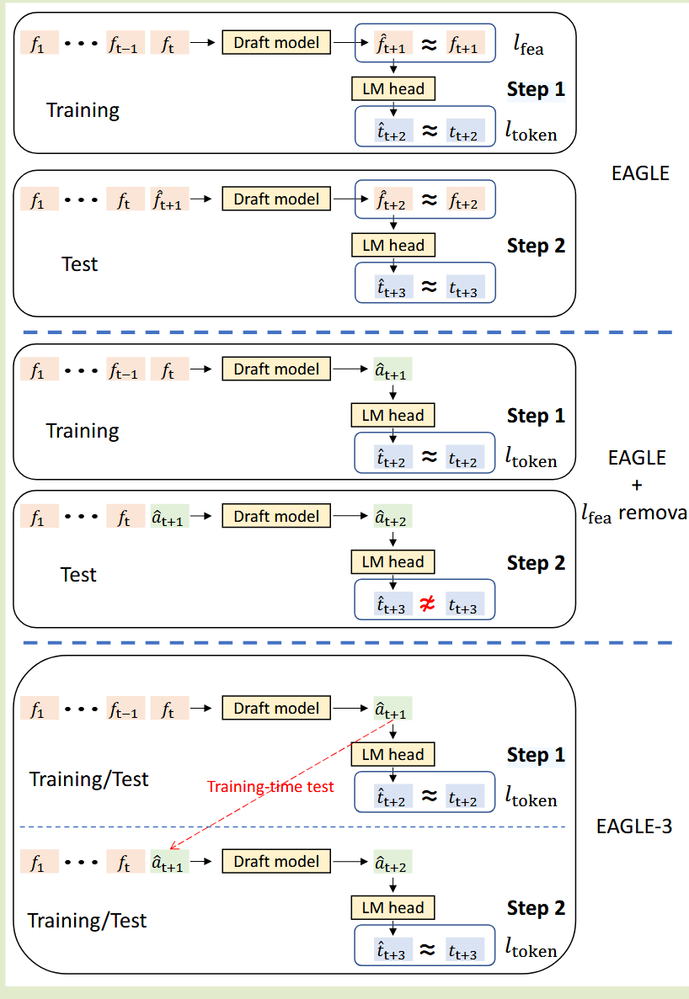
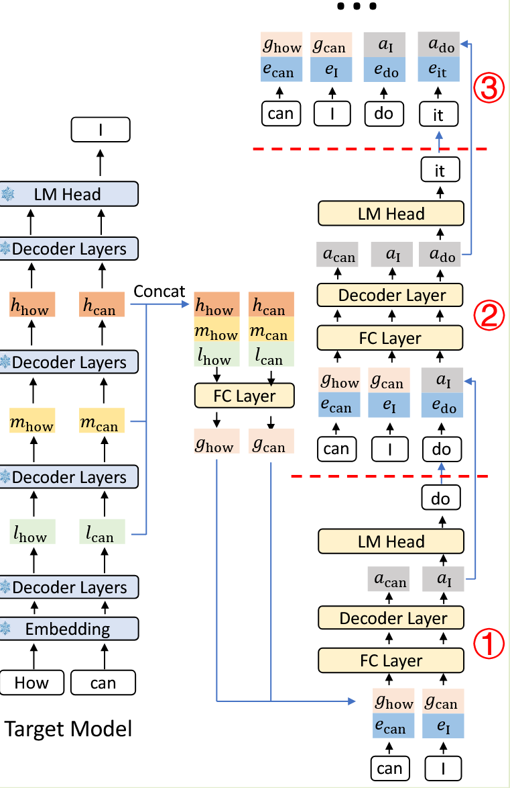
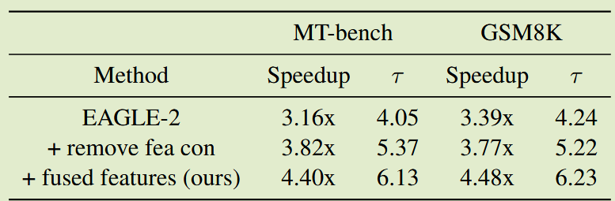
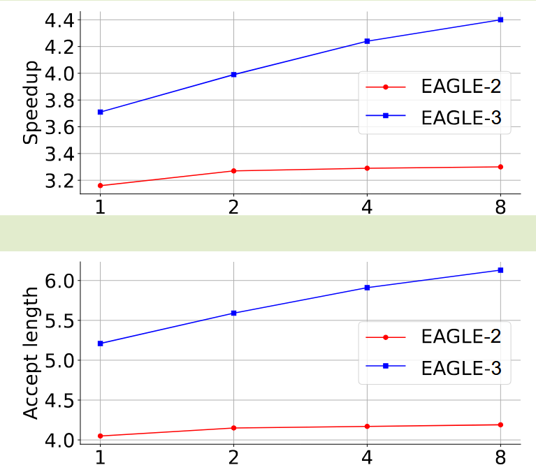
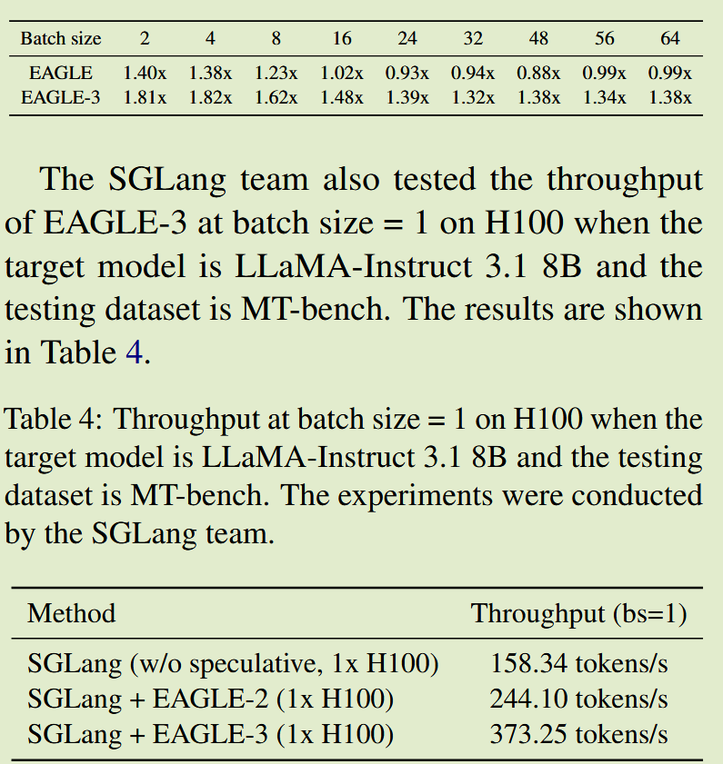

# (EAGLE 3)EAGLE-3: Scaling up Inference Acceleration of Large Language Models via Training-Time Test

## Motivation
当前的 EAGLE 范式在 scaling-up 上已经达到了瓶颈，无法通过更多的训练数据来提升 EAGLE 的性能，需要分析原因并改进

## Key Observation
EAGLE 在特征层面进行自回归预测，预测下一个特征，然后将特征输入到目标模型的 LM head 中以获得 token 分布。 EAGLE 的损失函数由两个部分组成：特征预测损失 $l_{fea}$ 和 token 预测损失 $l_{token}$。
- 以 token 预测为最终目标，**特征预测可以被视为额外的约束，它限制了草稿模型的表达能力**，并且很难从增加的数据中受益
- 直接去掉 $l_{fea}$，first token的接受率 $0-\alpha$ 显着提高。
  - 步骤 1 中草稿模型的输出表示为 $\hat a_{t+1}$，与真实值 $f_{t+1}$ 相距甚远
  - 导致步骤2中的输入序列明显偏离训练分布，导致第二个草稿token的接受率 $1-\alpha$ 非常低
- 我们可以通过将步骤 1 合并到训练过程中来解决这个问题。使用这种方法，增加训练数据的好处变得更加明显。我们将这种技术命名为训练时间测试(Training-Time Test, TTT)，它允许草稿模型在训练过程中适应其预测的草稿token，从而提高接受率并实现更好的加速比。

## Core Idea
### Training-Time Test for Draft Model
删除特征预测约束并直接预测 token，同时在训练期间模拟多步生成。这种直接的令牌预测为草稿模型的输入提供了完全的灵活性。
- 并不只是重用顶层特征，而是集成和利用目标模型的低、中、高层特征，从不同的特征中捕获丰富的语义信息。
- 训练时插入一段按测试路径运行的 rollout，让模型在训练阶段就暴露在它测试时会遇到的输入分布。
  1. 先给草稿模型当前上下文的输入，让它真实运行一次，生成预测结果 $\hat{a}_{t+1}$。
  2. 再把这个 $\hat{a}_{t+1}$ 反馈回去，作为下一步输入的一部分。
  3. 然后继续预测 $\hat{a}_{t+2}$。
  4. 训练时仍然用真值来监督它，也就是要求：
   - 在用了自生成的 $\hat{a}_{t+1}$ 作为条件之后，模型后续输出仍然要尽量接近真实的 $f_{t+2}$、$f_{t+3}$。
  
### Inference Pipeline
- 实质上与 EAGLE-2 的 pipeline 相同，只是 draft model 的输入变成了 target model 的多个层的特征，而不再是单纯的 second-to-top-layer 的特征。

## Ablation Study

## Result
与普通自回归生成相比，EAGLE-3 提供了约 3.0x-6.5x 的加速，比 EAGLE-2 提高了 20%-40%。不同的任务会影响草稿模型的接受率，因此平均接受长度和加速比都与任务相关

均在 H100 GPU 上进行测试，目标模型为 LLaMA-Instruct 3.1 8B，测试数据集为 MT-bench
- 第一个实验设置链长设置为 3，测试吞吐量
- 第二个实验 EAGLE-3 在批量大小 = 1 时的吞吐量

