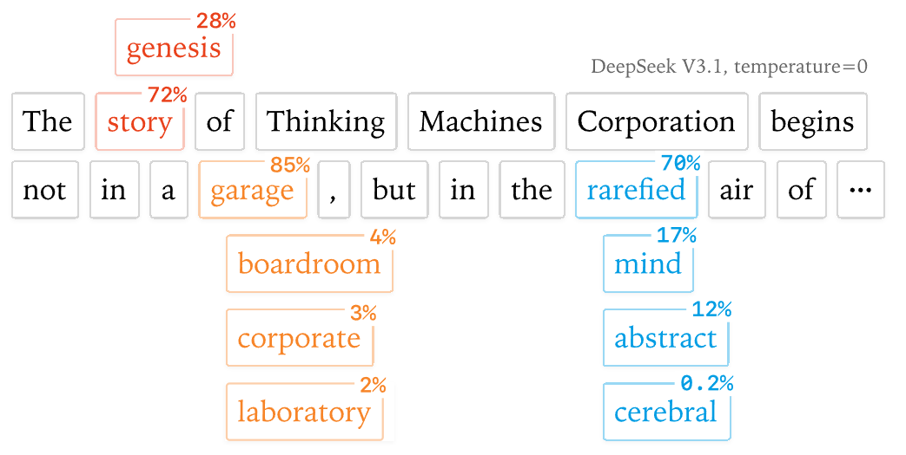
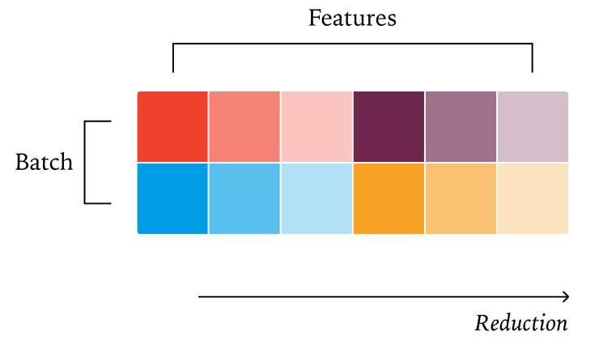
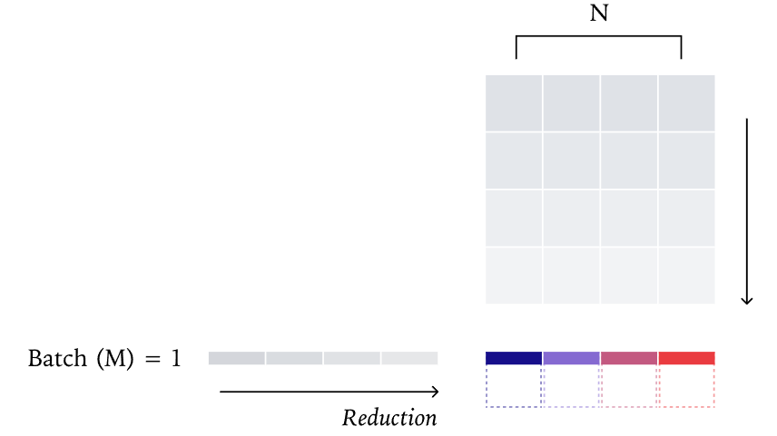
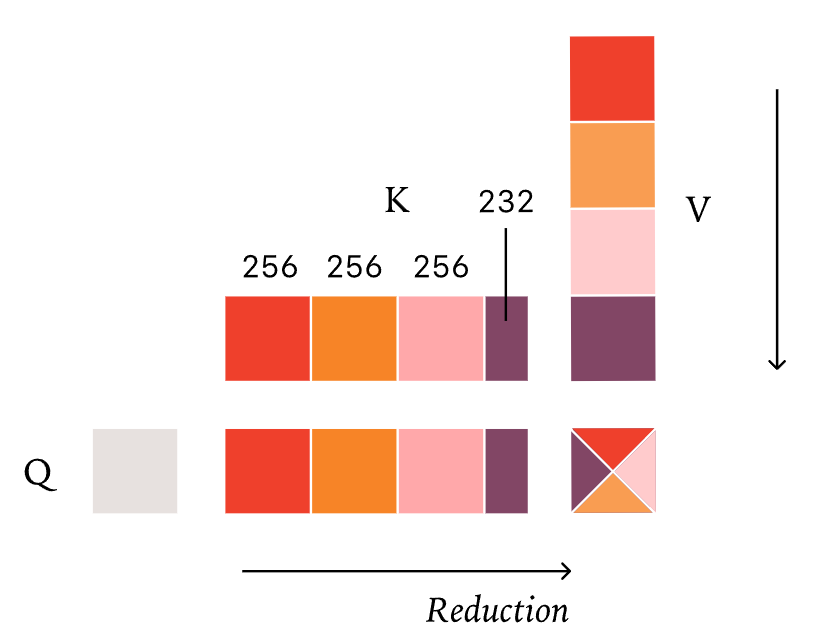

# Batch-Invariant Kernel
- 实际上是在硬件、软件栈以及 sampling temperature = 0 严格受控情况下的，输出确定性

## Motivation

1. 浮点结合律
浮点数加法不满足结合律，即：$$(a + b) + c \neq a + (b + c)$$
在 GPU 计算中，为了追求极致速度，成千上万个线程会并行计算。如果计算的顺序发生了哪怕一丁点改变，由于舍入误差（Rounding errors），最终的结果在比特位级别（Bit-level）就会产生微小差异。由于 LLM 是一个深度堆叠的非线性系统，这种微小的差异会随着层数增加被迅速放大，最终导致生成的下一个 Token 完全不同。
2. 为什么浮点结合律不能解释全部？
传统的观点（博客中称为 Floating Point + Concurrency 假设）认为：GPU 的并行是不确定的，线程结束的顺序是随机的，所以加法顺序随机，导致结果随机。但 Thinking Machines 指出，这个观点在现代 LLM 推理引擎（如 vLLM, TensorRT-LLM）中并不完全成立：
   - 现代算子是运行间确定的：如果你在同一台机器上，用完全相同的输入和固定的批次大小（Batch Size） 运行两次矩阵乘法，结果通常是 bitwise consistent 的。这是因为现代 GPU 算子（如 FlashAttention 或固定的矩阵乘法实现）通常会采用确定的规约（Reduction）路径，而不是随机的。
   - 矛盾点出现：既然算子本身在固定输入下是确定的，为什么在生产环境（如 ChatGPT 接口）下，即便 Temperature 设为 0，结果还是会变？
3. 批次不变性：真正的不确定性来源
在真实生产中，LLM 推理服务器（Inference Server）会进行连续批处理（Continuous Batching）。
   - 动态调度：当你发送一个请求时，服务器会根据当前的负载，把你的请求和另外 5 个人的请求拼成一个 Batch（批次 1）。
   - 优化策略改变顺序：GPU 算子为了效率，会根据 Batch 的大小、KV 缓存的情况、序列长度等，动态地调整计算策略（例如：如何切分任务到不同的核心，如何分块进行求和）。
   - 打破一致性：因为批次的大小和内容在随时变化（受其他用户请求影响），你的请求在 GPU 内部的求和顺序（Summation Order） 也被改变了。
     - 不同 batch 大小，会影响 GPU 的 grid 大小，block 大小、调度的方式等等，导致并行的 thread 规约顺序不同。
4. 为什么批次不变性能解决问题？
Thinking Machines 提出的解决方案是开发批次不变算子（Batch-Invariant Kernels）。其核心逻辑是：
   - 固定规约路径：无论 Batch Size 是 1 还是 256，无论其他序列多长，对于某一个特定序列的计算过程（如 RMSNorm、Attention 中的求和），强制使用固定的分块和归约顺序。
   - 牺牲部分性能换取确定性：虽然这可能无法达到理论上的最高吞吐量（因为不能针对每个 Batch 形状做极限优化），但它保证了计算路径不再受 batch 变化的影响。

## 批次不变内核
### RMSNorm
- RMSNorm 的计算公式为：$$\text{RMSNorm}(x_i) = \frac{x_i}{\sqrt{\frac{1}{d} \sum_{j=1}^{d} x_{ij}^2 + \epsilon}} \cdot \gamma$$
  
**不确定性的来源**
- 在标准的 GPU 实现中，如果 Batch 较小，一个 GPU 核心（SM）可能处理一行
- 如果 Batch 很大，为了负载均衡，一行数据可能会被切分给多个核心并行计算再进行跨核心规约。核心数量分配的变化会导致 $\sum x^2$ 的加法顺序改变。

**批次不变转换方案：数据并行规约（Data-Parallel Reduction）**
- 做法：强制每一行（Row）的规约过程完全在单个核心（CTA/Thread Block） 内完成。
- 原理：只要 hidden dimension 不是大到离谱，单个核心的寄存器和 Shared Memory 足以处理。由于整个 Batch 的每一行都是独立计算的，增加 Batch Size 只是开启了更多的核心处理新行，而不会改变原有行的内部加法顺序。
- 代价：当 $d$ 极小时，这种方法可能无法充分利用 GPU 所有的线程。
  

### GEMM
- 矩阵乘法 $$C = A \times B$$ 是 LLM 中最耗时的部分。

**不确定性的来源**
- 现代 GEMM 库（如 cuBLAS）会根据 $M$（Batch/Sequence）、$N$（Output Dim）、$K$（Hidden Dim）的大小动态选择不同的 Tile Size（分块大小）。
- 如果 Batch 变大（$M$ 增加），算法可能会选择更大的分块，或者改变对 $K$ 维度的拆分方式（Split-K）。
- $K$ 维度的拆分一旦改变，浮点数中间变量的累加顺序就会改变。

**批次不变转换方案：固定分块策略（Fixed Tiling Strategy）**
- 做法：放弃动态优化，强制使用一套固定的分块大小和累加逻辑。
- 关键点：确保 $K$ 维度的拆分策略只取决于 $K$ 本身，而与 $M$（批次大小）完全解耦。
- 实施：通过手动编写 Triton Kernel，确保无论 $M$ 是多少，每个输出 Tile 的计算路径都是位对位一致的。

### Flash Attention
这是最难的部分，因为 Attention 在 Prefill（预填充）和 Decode（解码）阶段的行为完全不同。

**不确定性的来源：FlashDecoding / Split-KV**
- 在 Decode 阶段，Query 长度通常为 1。由于并行度太低，如果不进行优化，GPU 效率极低。
- FlashDecoding 策略会把 KV Cache 沿着序列长度维度切分成多段（Split-KV），交给不同的核心计算，最后再合并。
- 问题：通常切分多少段是根据当前 GPU 有多少空闲核心动态决定的。如果 Batch 变大，分配给每个请求的核心变少，切分段数就会减少，合并时的加法顺序随之改变。

**批次不变转换方案：固定步长的 Split-KV（Fixed-Size Split-KV）**
- 做法：不再根据核心数量动态切分，而是根据 KV 序列的固定长度 进行切分（例如：每 128 个 Token 强制切一分）。
- 原理：
  1. 当序列长度增加时，切分的份数会增加，但每一份内部的计算顺序保持不变。
  2. 最后合并这些份时，使用一种确定的、与份数无关的规约算法（如二叉树规约，且补齐到固定深度）。
- 处理 Prefill 与 Decode 的一致性：确保 Prefill 阶段（长 Query）和多次 Decode 阶段（短 Query）在处理同一段 KV 缓存时，生成的中间结果（Attention Score 和 Weighted Sum）在比特位上是完全等价的。

## Trade-off 
实现批次不变性并不是免费的。为了让 LLM 在任何负载下都输出同样的结果，我们需要付出以下代价：

| 挑战维度       | 核心痛点与性能损耗描述                                                                        |
| :------------- | :-------------------------------------------------------------------------------------------- |
| **性能损耗**   | 无法针对特定的 Batch Shape 进行最优调度，通常会有 **5%-10%** 的吞吐量损失。                   |
| **开发复杂度** | 无法直接调用 cuBLAS 或标准 FlashAttention，必须深入底层使用 **Triton** 或 **CUDA** 重写算子。 |
| **内存压力**   | 为了保证固定步长的规约，有时需要预留更多的中间缓冲区。                                        |
