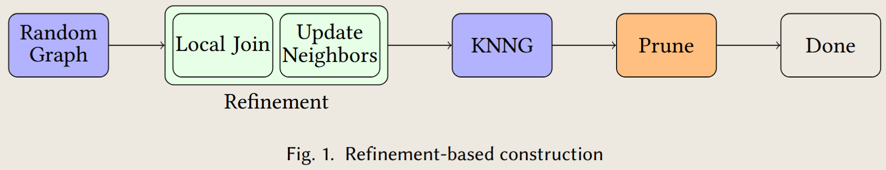
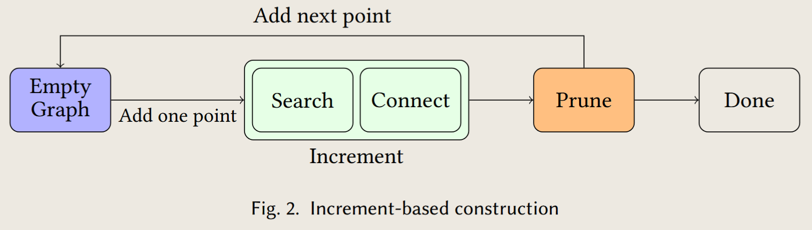
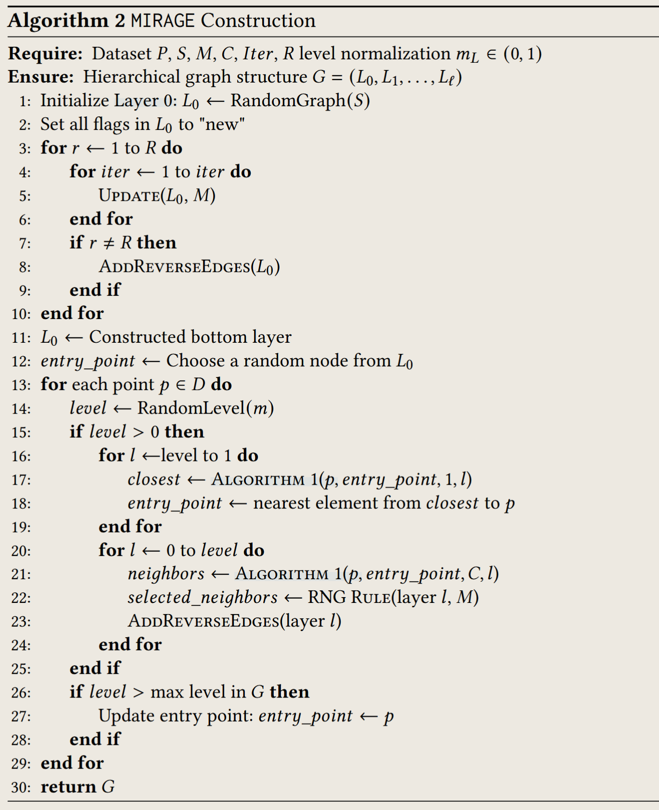
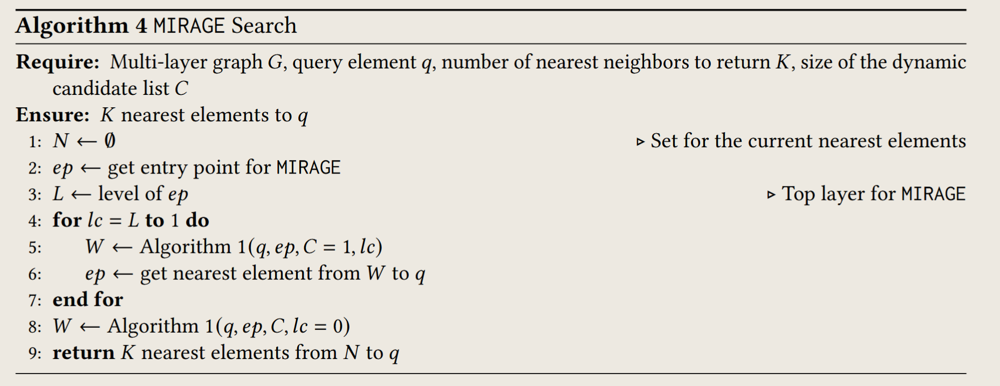

---

title: MIRAGE-ANNS: Mixed Approach Graph-based Indexing for Approximate Nearest Neighbor Searcha Layout for Vector Similarity Search
created: 2025-06-10
update:
comments: true
description: MIRAGE-ANNS: Mixed Approach Graph-based Indexing for Approximate Nearest Neighbor Searcha Layout for Vector Similarity Search

- Constructs the index as fast as refinement-based approaches while retaining search performance comparable or better than increment-based ones

katex: true
tags:

- Paper Notes
- Vector Search

---

# Findings

1. Refinement-based approaches such as NSG and NN-Descent use the most memory to build the index, because they first build an approximate KNN graph
1. Reverse edge addition to the Layer 0 of MIRAGE for optimal search performance.
1. When the **out-degree is the same, the hierarchical solution is able to achieve better search performance** due to providing better entry points to the bottom layer than randomly choosing a start point.
   > having longer edges that can **traverse the whole graph quickly and provide good entry points** for the lower layer
1. The reason for the fewer computations is because MIRAGE has **a lower average out-degree than HNSW at Layer 0.**
1. HNSW does not benefit from hierarchy due to a small subset of well-connected nodes (hubs)，while Layer 0 and upper layers of MIRAGE are constructed using different approaches.

# Highlights

1. We propose MIRAGE, a new approach to constructing graph-based indexes using refinementbased construction to create the bottom layer of the graph, and then building layers above in an increment-based manner, with upper layers containing fewer points and longer links, and lower layers containing more points and shorter links.
1. The search uses a greedy algorithm starting from the highest layer and continuing down to the lowest layer.

# BackGround

## Refinement-based Graph Construction

Index construction is fast primarily because the randomly-connected graph is available at the start and is refined iteratively to improve its quality, rather than building the graph incrementally. Now most algorithms construct a **approximate k−nearest neighbor graph (kNNG)** not a K-Graph, because K-Graph has a loss of navigability caused by too high of an out-link density.

> the neighbor of my neighbor is likely to be my neighbor

NSG first builds a graph using NN-Descent and then prunes using an edge selection strategy based on the RNG rule.

## Increment-based Graph Construction

This kind of graph starts with an empty graph and treats every point being added as a query, performing ANNS on the current graph to find the k nearest neighbors of the newly inserted point.

# Motivation

- Efficient construction
- Global navigability
- Local precision

# Overview

MIRAGE indexes all points starting with a randomly connected graph and progressively refines it while pruning at the same time.

MIRAGE addresses global navigability and local precision by incrementally building upper layers with a subset of points that contain long-range links that enable rapid traversal across the graph.

MIRAGE builds a hierarchical structure, where the bottom layer (Layer 0) of the graph is constructed using a refinement-based approach, and then creates layers on top (Layers 1 to N ) following an increment-based approach.

## Graph Construction

1. **Layer 0**: The bottom layer is constructed using a refinement-based approach, where the graph is built from a randomly connected graph and refined iteratively to improve its quality.
   MIRAGE finds neighbors using a traditional NN-Descent algorithm and prunes edges at the same time using the RNG rule.

- use insights from RNNDescent to first check whether the RNG rule is satisfied before adding the edge
- maintain a flag for each vertex indicating whether it is "new" or "old" to help eliminate duplicate distance comparisons of the same vertices
- adds reverse edges to complete the bottom layer of the graph
- limit the maximum out-degree of the constructed graph, pruning every vertex in Layer 0 down to M neighbors using the RNG rule

2. **Layer 1 to N**: The upper layers are constructed incrementally, where each layer contains a subset of points that are selected based on their distance to the points in the lower layer.

- Each point in the dataset is assigned a layer by the distribution and then first inserted at the corresponding layer
- it finds its M nearest neighbors using Algorithm 1, moves down a layer and repeats the same process stopping after being inserted at layer 1
- selecting neighbors at each layer, if the value of M is exceeded for any vertex, we use the RNG rule to prune edges.

## Search Algorithm

