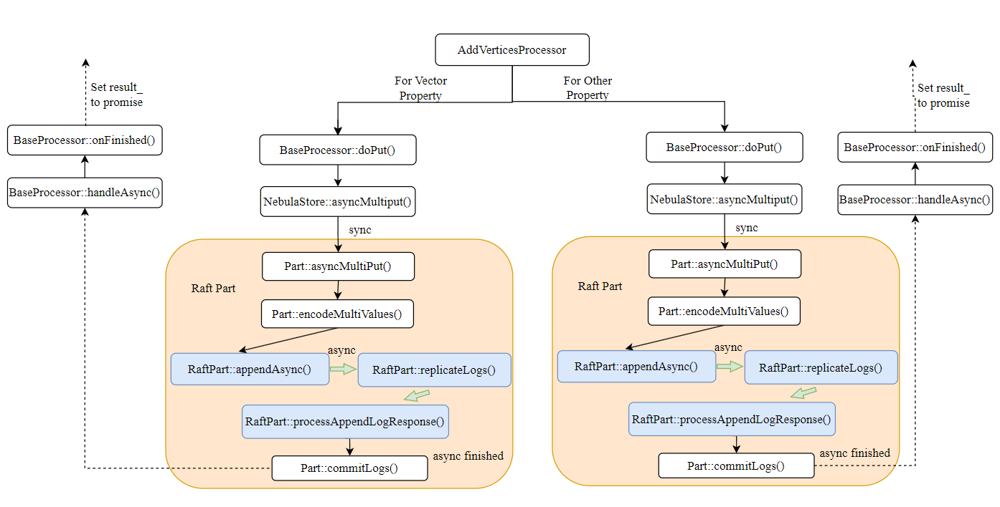

# The Process of DML for Vector Type(Insert for example)

## Overview

### Graphd Process

1. Insert 语句首先由 Graphd 从 client 接收，Graph Service 将 Query、Session、Storage 等打包成 Request Context，随后将 Request Context 打包成 Query Context，创建 Query Instance 随后开始执行 parse、validate、optimize、execute 整个流程。
2. 经过 Graphd 的 validate，进入 Planner 阶段对应的时 InsertVertices，此时已经构建了一个逻辑执行计划。
3. 通过 Optimizer 优化逻辑执行计划，生成物理执行计划。
4. 物理执行计划这里只涉及到一个 Executor，InsertVerticesExecutor。InsertVerticesExecutor 实际上会调用 StorageClient 的 insertVertices 方法，向 Storaged 发送 Insert 请求。

### Storaged Process

- Storaged 与 Metad 定期使用心跳去更新本地 Schema 缓存，通过这种方式获取比较新的 Schema 信息。
- Storaged 执行 AddVerticesProcessor 的 process 方法，开始处理 Insert 请求，这里涉及到 BaseProcessor 的 doPut()方法，实际上涉及的是 Raft-wal 的写入。

## Storaged Schema Cache Update

1. Storaged has the meta client, when metad is ready, storaged will get the schema from metad.
   
2. So if we want to insert vertices in a cluster, we need to add vector columns for the schema in the metaClient not only the metad.

## Write data by Raft-wal

在 Nebula Graph 中，Vertex 的创建通常通过 `AddVerticesProcessor` executor 来完成。它会将 Vertex 要插入的数据已经元数据打包成 raft-wal log，提交到 Raft Part 中，`最后在 Part::commitLogs()`中将数据写入到 RocksDB。

`handleAsync()` 作为写入成功/失败的回调函数执行，实际上会将 Processor 的 `callingNum_` 减 1，直到所有 Part 都完成写入。执行 BaseProcessor 的`onFinished()`方法，将`result_`设置之前返回 Graphd 的 Future 对应的 Promise 中。

## Modifying the Insert Process

### Attemption 1

对于 VECTOR 类型的属性，我们与其他属性分开存储，所以我们对 Storaged 的 AddVerticesProcessor 进行修改，只是简单的增加一次对 VECTOR 类型的属性的`doPut()`。

- 这样会破坏对同一 vertex 但插入不同属性的原子性

### Attemption 2

修改 Raft-wal 的 Log 形式，增加每个 KV 对的 column family 信息，实现在 commitLogs()中对不同的 column family 进行写入。保证原子性。

### Final Solution

- 我们修改 Raft 中处理 Log 的过程，通过处理的 key 的第一字节(**Type**)判断是否需要写入向量 column family
  
