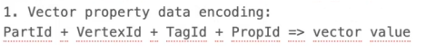

# Week1 - Week2 Plan

## Prerequisite Knowledge

- RocksDB Column Family: Purpose and Usage
  - Understanding the role of Column Families in logically and physically partitioning data within a single RocksDB instance.
- NebulaGraph's Raft-WAL Workflow
  - How key-value pairs representing graph data are written to RocksDB.
  - How the Write-Ahead Log (WAL) is integrated with the Raft consensus algorithm to create a replicated state machine.
  - The process for WAL file deletion: when and how old log files are truncated.
- Cooperation Between Graphd and Storaged Executors
  - How the query plan executors in the graphd (query) layer interact with the local executors in the storaged (storage) layer to fulfill a request.
- Folly's Future/Promise Asynchronous Programming Model
  - Understanding the asynchronous programming paradigm using folly::Future and folly::Promise.
- NebulaGraph's Memory Management Approach
  - How NebulaGraph manages memory allocation and deallocation efficiently, potentially using techniques like arena allocators and memory tracking.
- Thrift: Serialization, Code Generation, and Usage
  - defining data structures and services in the IDL
  - generating language-specific code.

## Support vector in type system

- Implement vector value type and property type
  - Implement vector value type in type system.
  - Implement vector property type:
    - data encoding with column family
      
    - RocksEngine for Multi Column Family
- Implement serialization and deserialization for vector type
  - Graphd to Storaged by thrift
  - Graphd to Client by nebula-go

## Support distance functions for vector type

- Support euclidean/cosine/inner_product functions in function manager
- Support k-NN search
  - Test by original nGQL sentence

## Support partial DDL for vector type

- Create tag with vector type properties

## Support DML for vector type

- Insert vertex or edge with vector property type

## Support original search for vector type

- Support MATCH, GO, FETCH statement for vector type
