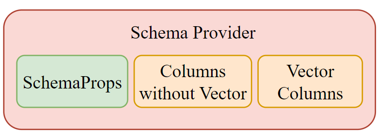
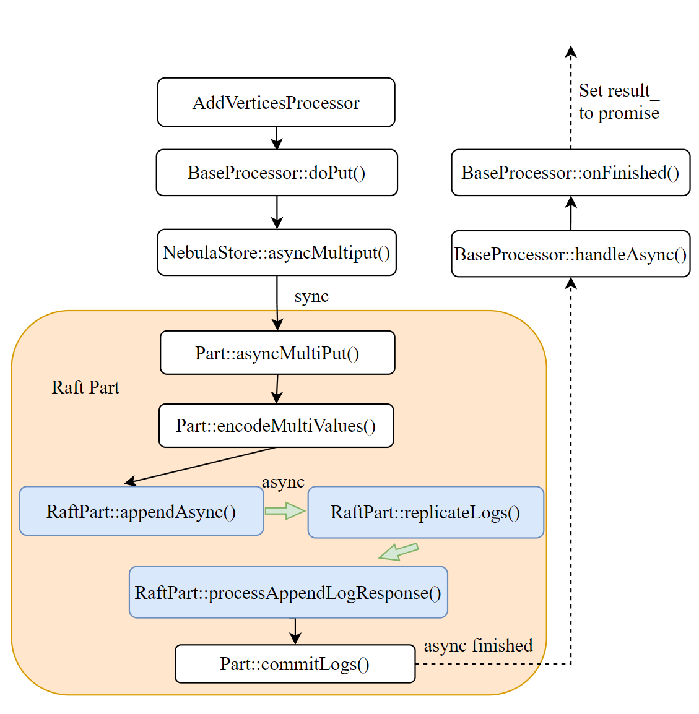
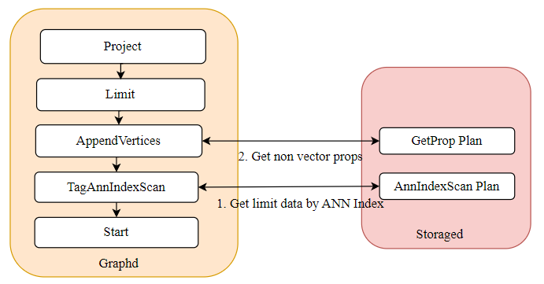
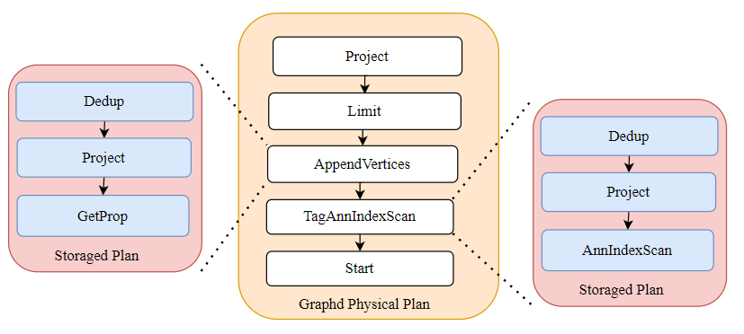

# 项目报告

<div align="center" style="line-height:2.2;">

<h1>项目名称：为 NebulaGraph 支持向量近似邻检索</h1>

<h2>项目导师：曹志鹏</h2>

<h2>申请人：刘芷溢</h2>

<h2>日期：2025.09.25</h2>

<h2>邮箱：lzy_CS_LN@163.com</h2>

</div>
<div style="page-break-after: always;"></div>

# 项目信息

## 项目名称

为 NebulaGraph 支持向量近似邻检索

## 方案描述

在 NebulaGraph 分布式图数据库中原生集成向量数据存储与近似最近邻（Approximate Nearest Neighbor, ANN）检索能力。确保设计的语法兼容 NebulaGraph 现有的查询语言，查询语句兼容 OpenCypher 语法规范。

1. 实现向量数据类型并支持其持久化。
   - 实现新的数据类型 VECTOR
   - 实现向量类型的存储，为 RocksDB 增加多 column family 支持
   - 实现向量的 Key 结构和存储格式(加工后的字符串)
2. 实现向量相关的 DDL 语句，包括 create tag、create index 等语句。
   - 语法兼容 NebulaGraph 现有的查询语言
   - 在原有 Schema Provider 基础上增加对向量列的支持
   - 实现的 create ann index 计划执行类似 rebuild index
3. 实现向量相关的 DML 语句，包括 insert、update、delete 等语句。
   - 语法兼容 NebulaGraph 现有的查询语言
   - 实现向量属性的插入、更新、删除等功能，不影响分布式一致性和可用性
4. 设计并实现 ANN Search 语句。
   - 语法兼容 NebulaGraph 现有的 match 语句
   - 集成 Faiss 和 HNSWLib 实现 ANN Search 功能
   - 实现 ANN Search 语句的单机功能，类似 Index Scan
5. 满足分布式一致性和可用性要求，保证向量数据副本一致性及内存磁盘数据一致性。
   - 设计向量索引的 WAL 机制，保证内存和磁盘数据一致性
   - 设计向量数据的 Raft 日志机制，保证向量数据副本一致性
6. 对 ANN Search 性能进行优化以满足业务需求。
   - 使用 profiler 工具对 ANN Search 进行性能分析
   - 结合分析结果对 ANN Search 进行性能优化

## 功能开发时间表 🚀

| 时间         | 任务内容                                                                        | 状态      |
| ------------ | ------------------------------------------------------------------------------- | --------- |
| 6.20 - 7.5   | 实现向量数据类型和属性类型                                                      | 🟢 完成   |
| 7.6 - 7.16   | 实现向量类型的存储，为 RocksDB 增加多 column family 支持                        | 🟢 完成   |
| 7.16 - 7.28  | 实现向量属性相关的 DDL 语句                                                     | 🟢 完成   |
| 7.28 - 8.4   | 实现向量属性相关的 DML 语句                                                     | 🟢 完成   |
| 8.4 - 8.14   | 将 Faiss 和 HNSWLib 集成到 Nebula 中，实现向量检索功能并进行 ANN Benchmark 测试 | 🟢 完成   |
| 8.14 - 8.30  | 设计并实现向量索引(ANN Index)的创建和删除语句                                   | 🟢 完成   |
| 8.30 - 9.25  | 实现 ANN Search 语句(单机功能实现)                                              | 🟢 完成   |
| 9.26 - 10.26 | 实现分布式一致性和可用性要求，保证向量数据副本一致性及内存磁盘数据一致性        | 🟡 进行中 |
| 未来         | 对 ANN Search 性能进行优化以满足业务需求                                        | ⏳ 计划中 |

# 项目进度

## 具体方案(Finished)

### 向量数据类型

- 向量数据类型与 List 类型不同，除了比较运算符外，它**不应该支持其他的运算符**，如加减乘除等。
- 实际向量类型是一个`std::vector<float>`，在存储时会将其序列化为二进制字符串存储在 RocksDB 中。
  { width="200px" }

### 向量存储支持(RocksDB Multi Column Family)

- 这里我们采用向量存储与其他图属性分离的方式，方便后续进行 ANN 索引构建。
- 为了实现与其他数据的隔离，我们需要将向量数据存储在向量列族中，其他数据存储在默认列族中。
  > :warning:这里的 ID-VID 列族是为了后续实现 ANN 索引创建使用的

{ width="200px" }

### 向量类型的 Key 结构

- 经过我们对 RocksDB 的多 column family 的改造，现在需要将向量属性存入向量列族中。这需要我们重新设计向量属性的 Key 结构。
- 经过设计，向量属性的 Key 结构如下：

  ```shell
  VectorTagKeyUtils:
  type(1) + partId(3) + vertexId(*) + tagId(4) + propId(4)

  VectroEdgeKeyUtils:
  type(1) + partId(3) + srcId(*) + edgeType(4) + edgeRank(8) + dstId(*) + propId(4) +placeHolder(1)
  ```

### 向量属性的 DDL 语句(Create Tag/Edge)

为了同时支持原始列和向量列，我们需要对 Schema Provider 进行如下调整：

- 原始列：用于除 VECTOR 类型之外的其他数据类型
- 向量列：专门用于 VECTOR 类型
- Schema 属性选项：如 TTL、TTL_COL 等

{ width="400px" }

此外，还需修改 RowWriter 和 RowReader 以支持向量列操作：

- RowWriter 将向量数据写入 RocksDB 的 vector 列族
- RowReader 从 RocksDB 的 vector 列族读取向量数据

{ width="600px" }

### :skull: 向量属性的 DML 语句(Insert/Update/Delete/Upsert)

这里我们需要先梳理一下数据从客户端到存储引擎的流程：

- Client 端将数据打包成 Request 发送到 Graphd 节点。
- Graghd 节点进行 validate，planner，optimizer 之后生成实际执行的物理计划，向 Storage 节点发送真正的数据写入请求
- Storage 节点接收到 Request 后，会生成 Storage 节点的计划，最后调用存储引擎接口将数据写入 RocksDB
- 返回结果给 Client 端

{ width="400px" }

:warning:这里面有一些细节需要注意:

- Storage Cache: storaged 会定期使用心跳拉取 metad 最新的 Schema 信息，更新本地的 Schema 缓存，从而获取最新的 Schema 信息。我们需要确保**向量列的信息也能正确地被缓存和更新(后续还有向量索引的更新)**。
  { width="200px" }
- 为了确保 DML 操作的一致性，我们在 DML 流程中进行了修改，要求每个请求仅使用一次异步操作将数据写入。具体实现是在数据真正写入的 `Raft::commitLog()` 函数中，通过检查键（Key）的第一个字节（Type），来判断需要写入到哪个列族中。
  { width="400px" }
- 除了 Graghd 会生成物理计划，实际上 Storaged 也会生成自己的执行计划，这个计划会调用存储引擎的接口将数据写入 RocksDB 中。我们需要为获取向量属性修改相关计划节点(TagNode/EdgeNode)。
  - 为了支持 TagNode/EdgeNode 多向量属性的支持，在 TagNode/EdgeNode 中增加了`std::vector<RowReader> vecReaders_`成员变量，用于读取多个向量属性的值。
    { width="400px" }

### 向量索引功能(Ann Index in Common)

我们会将向量索引对象交由存储服务（Storage Server）管理，采用 `<TagID, IndexID>` 作为 key，`shared_ptr<AnnIndex>`作为 value。

- **向量索引生命周期**: 向量索引的生命周期由存储服务管理。执行 Create Index 命令后，会插入对应的向量索引；执行 Drop Index 命令后，该索引会被移除。在其他情况下，存储服务会持续维护该索引。
  - 持久化：当存储服务关闭或崩溃前，将索引持久化到磁盘，每次重启时加载。
- **内存追踪**: 暂时利用 Nebula 内置的 MemoryTracker 定期查询内存索引的大小。如果超过限制，就禁止插入新的向量
  - 使用`MemoryTracker::getCurrentUsage()`获取当前内存使用量
- **Faiss & HNSW 并发**: 通过实现 ANNIndex 接口，我们实现了两种向量索引，一种基于 Faiss IVF 索引，另一种基于 HNSWlib HNSW 索引。为了实现并发控制，我们在向量索引中引入了**读写锁**：允许多个查询同时执行 ANN 搜索（ANN Search），但只允许一个 DML 操作（Add 或 Remove）进行。
- **ANN 索引接口**: 目前我们仅完成了 ANN 索引模块的单机测试，WAL 和 Raft 相关方法尚未实现。

  ```cpp
  class AnnIndex {
  public:
    AnnIndex() = default;

    AnnIndex(GraphSpaceID graphID,
            PartitionID partitionID,
            IndexID indexID,
            const std::string &indexName,
            bool propFromNode,
            size_t dim,
            const std::string &rootPath,
            MetricType metricType,
            size_t minTrainDataSize = 3);

    virtual ~AnnIndex() = default;
    AnnIndex(const AnnIndex &) = delete;
    AnnIndex &operator=(const AnnIndex &) = delete;

    [[nodiscard]] virtual Status init(const BuildParams *params) = 0;
    // add data to index incrementally
    [[nodiscard]] virtual Status add(const VecData *data) = 0;
    // upsert data to index
    [[nodiscard]] virtual Status upsert(const VecData *data) = 0;
    // soft delete data from index, return number of deleted vectors
    [[nodiscard]] virtual StatusOr<size_t> remove(const IDSelector &sel) = 0;

    // ann search
    [[nodiscard]] virtual Status search(const SearchParams *params, SearchResult *res) = 0;
    // reconstruct vector by id
    [[nodiscard]] virtual StatusOr<Vector> reconstruct(VectorID id) = 0;

    // load index file from disk
    // flush index to disk
    [[nodiscard]] virtual Status read(const std::string &file) = 0;
    [[nodiscard]] virtual Status write(const std::string &dir, const std::string &file) = 0;

    // apply raft log, disable index dump and roll the WAL when taking snapshot
    [[nodiscard]] virtual Status applyRaftLog(const AnnRaftLog &log, bool takingSnapshot) = 0;
    // load raft log to memory index
    [[nodiscard]] virtual Status loadRaftLog(const AnnRaftLog &log) = 0;

    // create wal file or open existing wal file via file name(not absolute path)
    [[nodiscard]] virtual Status openWal(const std::string &walName) = 0;
    // close wal file and release write/read stream
    [[nodiscard]] virtual Status closeWal() = 0;
    // remove wal file
    [[nodiscard]] virtual Status removeWal() = 0;
    // remove idx file
    [[nodiscard]] virtual Status removeIdxFile() = 0;
    // load index file and wal file from disk
    [[nodiscard]] virtual Status load() = 0;
    // create checkpoint for snapshot
    [[nodiscard]] virtual Status createCheckpoint(const std::string &snapshotPath) = 0;
    virtual AnnIndexType indexType() const = 0;
    virtual std::string toString() const = 0;
  };
  ```

### :skull::skull:向量索引的 DDL 语句(Create/Drop Index)

#### 语法设计

- Tag Ann Index:

```shell
CREATE TAG ANNINDEX <index_name> ON <tag_name_list>::(<field_name>) [IF NOT EXISTS] ann_index_params}[COMMENT '<comment>']
```

- Edge Ann Index:

```shell
CREATE EDGE ANNINDEX <index_name> ON <tag_name_list>::(<field_name>) [IF NOT EXISTS] ann_index_params}[COMMENT '<comment>']
```

- Ann Index Params

```shell
{ANNINDEX_TYPE: "IVF", DIM:128, METRIC_TYPE:"L2", NLIST:3, TRAINSIZE:3}
{ANNINDEX_TYPE: "HNSW", DIM:128, METRIC_TYPE:"L2", MAXDEGREE:15, EFCONSTRUCTION:200}
```

#### 执行流程设计

- Graphd 生成的执行计划为：`Start -> CreateTagAnnIndex -> SubmitJob`。`SubmitJob` 会将任务发送到 Metad。

- Metad 首先在内部创建 Ann 索引条目。创建成功后，会提交一个 `AdminJob`。 Metad 会将作业参数打包并发送给 Storaged 的 `AdminTask`。Storaged 通过其内部的 `AdminTaskManager` 来处理这些任务，从而完成作业。
  :warning: 这里涉及一个**分布式的时序问题**：

  - MetaClient 缓存更新机制：Storage 节点的 IndexManager 通过 MetaClient 获取索引信息，但 MetaClient 的缓存是通过心跳周期来更新的。
  - 时序问题：在 Meta 服务创建索引之后，Storage 节点需要等到下一次心跳周期才能看到新索引。
  - 同步问题：getTagAnnIndex 是直接从缓存中读取。如果缓存还没更新，就会返回 IndexNotFound。

  因此，在 Storaged 中我们采用了**重试机制**。如果多次重试仍然失败，就会直接向 Meta 服务请求数据，以强制刷新缓存。

- Storaged 会遍历当前所有的 partition，对于每个 Partition，执行以下操作：

  - 扫描 KVStore（RocksDB）中所有匹配该属性名的向量属性数据。
  - 将 Vertex ID 与 VectorID 之间的映射关系存储到 KVStore 的 id-vid 列族中。
  - 其中，Vertex ID 类型为 `std::string`。而 VectorID 是通过哈希计算得到的，因此需要存储两种映射：
    - `VectorID → VertexID`
    - `VertexID → VectorID`
  - 最后构建向量索引，并将其加载到内存中。

{ width="600px" }

:warning: Storaged 中实际上也会有一个计划，进行真正的索引创建工作：

1. 从 RocksDB 中扫描所有的向量数据
2. 将 Vertex ID 与 Vector ID 的映射关系存储到 id-vid 列族中(:star2:**这就是为什么我们需要三个列族**)
3. 构建向量索引并加载到内存中

{ width="600px" }

### :skull::skull:ANN Search

为了实现 ANN Search 功能，我们对现有的 Match 语句进行了扩展，在`Return 语句`新增了 `Approximate limit` 语法和 `euclidean` 等函数。

具体来说，如果当前的 Tag/Edge 上有 ANN 索引，执行计划会首先扫描 ANN 索引以获取 limit × K 条数据，然后再与其他数据一起做过滤获得 limit 条数据。因此，我们必须修改优化规则以执行`AnnIndexScan`和 graphd 的物理执行计划，并且在 storaged 中新增一个 `AnnIndexScan` 节点。

#### 语法设计

- 不返回 vector distance

```shell
match (v:tag5:tag6) return v order by euclidean(vector(1.0,2.0,3.0), v.vec)  approximate limit 3 options {ANNINDEX_TYPE:'IVF', METRIC_TYPE:L2, NPROBE:3}
```

- 返回 vector distance

```shell
 match (v:tag5:tag6) return v, euclidean(vector(1.0,2.0,3.0), v.vec) order by euclidean(vector(1.0,2.0,3.0), v.vec)  approximate limit 1 options {ANNINDEX_TYPE:'IVF', METRIC_TYPE:L2, NPROBE:3}
```

#### Overview

整体的执行流程如下：

1. 经过优化规则处理后的物理执行计划会执行 `TagAnnIndexScan`，在 storaged 收到请求后，会生成一个内部执行计划，在 IVF 索引上进行搜索，并将结果返回给 graphd
2. Graphd 调用 storaged 的 `getProp` 算子生成执行计划，以获取节点的非向量属性，最后执行 Limit 和 Project，得到最终结果

{ width="600px" }

#### 优化规则

- 对不返回向量距离的语句，优化器工作流程如下图所示:

{ width="400px" }

- 对返回向量距离的语句，优化器工作流程如下图所示:

{ width="400px" }

#### 执行流程

经过优化器优化后端 Graphd 端的物理执行计划为`TagAnnIndexScan -> GetProp -> Limit -> Project`，graphd 和 storaged 生成的计划如下图所示。

对每个计划节点 Graphd 会生成对应的执行器，每个执行器都会通过 RPC 向 storaged 上的服务发起远程调用。

> 实际上，storaged 接收到 graphd 的请求后会启动它自己的执行器，并在其中生成 storaged 的执行计划，计划执行会从 Ann Index 中获取数据，最后返回结果给 graphd。

{ width="600px" }

实际上，在 storaged 中，`AnnIndexScan` 的处理过程与 `IndexScan` 非常相似。

- 需要先进行初始化，然后执行 `doExecute`。实际的数据获取是通过调用 `resetIter` 完成的。
  > 此时是通过 ANN 索引获取结果（这里得到的只是向量 ID，而不是实际的顶点 ID）
- 随后 `doNext` 只是简单地遍历这些结果，再调用 `AnnIndexVertexScan::getVidByVectorid() `从 RocksDB 中获取实际的 VID 数据，并将 VID 与向量距离数据一并返回给 graphd。

{ width="300px" }

## 功能测试

### tck 测试

- 使用 tck 回归测试工具，通过对新增功能编写新的测试用例测试，确保新增功能没有影响到原有功能。

  - 新增的测试用例见`tests/tck/features/vector`目录下
    - `Create Tag/Edge with VECTOR property`
    - `Insert/Update/Delete/Upsert VECTOR property`
    - `Create Ann Index`
  - 详细的测试结果见下表的 github PR 链接。

    | 功能                                             | PR 链接                                                                                               |
    | ------------------------------------------------ | ----------------------------------------------------------------------------------------------------- |
    | 向量数据类型                                     | [Implement vector value type](https://github.com/vesoft-inc/nebula/pull/6068)                         |
    | 向量存储支持                                     | [Implement the multiple column family RocksDB](https://github.com/vesoft-inc/nebula/pull/6074)        |
    | 向量类型的 Key 结构                              | [Implement the key for vector type](https://github.com/vesoft-inc/nebula/pull/6083)                   |
    | 向量属性的 DDL 语句                              | [Implement CREATE TAG statement for vector type](https://github.com/vesoft-inc/nebula/pull/6076)      |
    | 向量属性的 DML 语句(Insert/Update/Delete/Upsert) | [Implement DML statement and process for vector type](https://github.com/vesoft-inc/nebula/pull/6087) |
    | 向量索引功能                                     | [Vector index Interface](https://github.com/vesoft-inc/nebula/pull/6090)                              |
    | 向量索引的 DDL 语句(Create/Drop Index)           | [Create Ann Index](https://github.com/vesoft-inc/nebula/pull/6099)                                    |
    | ANN Search                                       | [Ann Search](https://github.com/vesoft-inc/nebula/pull/6104)                                          |

  - tck 测试用例结果：
    

### 单元测试

- VECTOR 数据类型测试

  ```cpp
  nebula::Vector shortVec1({1.11, 2.22, 3.33});
  nebula::Vector emptyVec;
  // we will test dimension in ValueTest.cpp
  // so here we assume the dimensions of two vectors are equal

  EXPECT_EQ(shortVec1.dim(), 3);
  EXPECT_EQ(emptyVec.dim(), 0);
  EXPECT_EQ(shortVec1, nebula::Vector({1.11, 2.22, 3.33}));
  ```

- RocksDB 支持多列族测试，详情见`src/kvstore/test/RocksEngineMultiCFTest.cpp`

  - MultiCFSimpleOptionTest
  - MultiCFCompressionConfigTest

- 对新增语法的测试，详情见`src/parser/test/ParserTest.cpp`
- 对 VECTOR 类型的 Key 结构测试，详情见`src/common/test/NebulaKeyUtilsTest.cpp`
  - VectorSimpleTest
  - VectorNegativeEdgeTypeTest
- 向量属性的 DDL 语句测试，详情见`src/meta/test/ProcessorTest.cpp`
  - CreateVectorTagTest
  - CreateVectorEdgeTest
- RowWriter 和 RowReader 测试，详情见`src/codec/test/RowWriterV2Test.cpp`
  - VectorTest
  - VectorWithDefaultValue
  - DoubleSetVector
  - UpdateVector
- 向量索引功能测试，详情见`src/common/vectorIndex/test/AnnIndexTest.cpp`
  - IVFIndexTest
  - HNSWIndexTest
- Ann Benchmark 测试，详情见`src/common/vectorIndex/test/ANNBenchmark.cpp`
  - IVFBenchmarkTest
  - HNSWBenchmarkTest

### Mock 测试

- DML 功能实现了 Mock 测试，详情见`src/storage/test/AddVerticesTest.cpp` 和 `src/storage/test/AddEdgesTest.cpp`
  - SimpleVectorTest
  - BasicHNSWAnnSearchTest
  - MultiVersionVectorTest
- Create Ann Index 测试，详情见`src/storage/test/BuildTagVectorIndexTest.cpp` 和 `src/storage/test/BuildEdgeVectorIndexTest.cpp`
- Get Vector Prop 测试，详情见`src/storage/test/GetPropTest.cpp`
  - VectorPropertyTest
- Ann Search 测试，详情见`src/storage/test/LookupAnnProcessorTest.cpp`
  - BasicAnnSearchTest
  - BasicHNSWAnnSearchTest

## 后续工作计划

- 结合修改后的 Search 语句对 DML 进行更详细的测试
- 完成分布式一致性和可用性要求，保证向量数据副本一致性及内存磁盘数据一致性
  - 修改 DML 操作，在 Raft 提交日志过程后将数据写入内存索引
  - 实现向量索引的 WAL 机制，保证内存和磁盘数据一致性
  - 处理节点重启（从 RocksDB 重建索引并回放日志）和 leader 切换。
    > **snapshot**: 当一个新 follower 加入集群时，它需要接收一份快照。这份快照现在必须包含 ANN 索引的序列化表示，以避免从头开始进行代价高昂的完全重建
- 完成所有功能后进行代码的重构和优化
- 对 ANN Search 性能进行优化以满足业务需求
