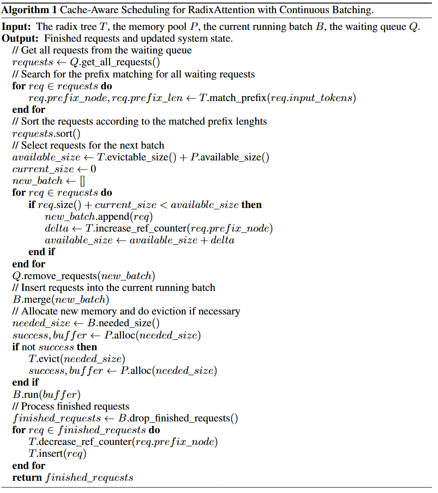

# RadixAttention 你需要知道的细节

## Why Radix Attention?

LLM 推理分为 Prefill（预填充） 和 Decode（解码）两个阶段。KV Cache 存储了 Prefill 阶段计算出的中间状态。 KV Cache 的计算**只依赖于前序 Token**。只要前缀（Prefix）相同，KV Cache 就可以完全复用，无需重复计算。

实际应用中，Prompt 的结构非常复杂，比如：

- **Few-shot Learning：** 多个请求共用一长串 Examples。
- **Self-Consistency / Tree-of-Thought：** 从同一个问题分叉出多条推理路径。
- **Chat Session：** 多轮对话不断追加后缀。

传统的 KV Cache 复用通常**基于“Prompt 完整哈希”**或**简单的“完全匹配”**。然而，这些方法难以处理树状结构的共享模式（如多轮对话的分叉、多路推理），且无法高效地处理动态的节点分裂与合并。我们需要一种更灵活的数据结构——Radix Tree，来将 KV Cache 的管理粒度从“整条请求”精细化到“Token 序列片段”。

## Radix Tree

Radix Attention 的核心在于维护了一个**Radix Tree**（也称为压缩前缀树）。

- **节点 (Node) - TreeNode:**
  - **KV Cache 映射**: `self.value`  存储着该节点对应的 Token 序列在 PagedAttention 中的  **Block Indices** (物理显存块索引)。
  - **引用计数**: `self.lock_ref`  记录了当前有多少个请求正在使用该节点（或其子节点）。
  - **LRU 追踪**: `self.last_access_time`  用于记录最后访问时间，支持 **LRU 驱逐策略。**
  - **父子关系**: `self.children`  是一个字典，映射 child_key  到子节点；`self.parent`  指向父节点。
- **边 (Edge) - RadixKey**:
  - 虽然逻辑上称为“边”，但在代码中，边上的 Token 序列实际上存储在子节点的  `self.key`  中。
  - RadixKey  包含  `token_ids`(Token 序列) 和  `extra_key` (用于区分不同 LoRA 适配器或采样参数的命名空间)。

```python
# sglang/srt/mem_cache/radix_cache.py
class TreeNode:
    def __init__(self, ...):
        self.children = defaultdict(TreeNode)
        self.parent: TreeNode = None
        self.key: RadixKey = None
        self.value: Optional[torch.Tensor] = None  # <--- 这里存储 KV Cache 的 Block Indices
        self.lock_ref = 0                          # <--- 引用计数
        self.last_access_time = time.monotonic()   # <--- LRU 时间戳

class RadixKey:
    def __init__(
        self,
        token_ids: List[int],
        extra_key: Optional[str] = None,
        is_bigram: bool = False,
    ):
        # token ids sequence
        self.token_ids = token_ids
        # extra key (e.g. lora_id, cache_salt)
        self.extra_key = extra_key
        # is bigram key
        self.is_bigram = is_bigram
```

#### 路径压缩

代码通过  `_split_node()`  方法实现了路径压缩。

- **合并**: 当你插入一个序列  `[A, B, C]`  时，如果树是空的，它会创建一个包含完整序列  `[A, B, C]`  的节点，而不是三个节点。
- **分裂 (Split)**: 当树中已有  `[A, B, C]`，而新请求是  `[A, F, DG]`  时，`_match_prefix_helper()`  会发现匹配到  `[A]`，然后在  `[B, C]`  处分叉。此时会调用  `_split_node()`：
  1. 原来的节点  `[A, B, C]`  被切分为父节点  `[A]`  和子节点  `[B, C]`。
  1. 新请求的后缀  `[F, G]`  成为  `[A]`  的另一个子节点。


### 工作流程（Workflow）

Radix Attention 主要涉及最长前缀匹配，Radix Tree 的更新，内存管理与驱逐三部分

#### 前缀匹配（Prefix Matching）

当新请求到来时，`match_prefix()`  函数会被调用。

1. **遍历**: `_match_prefix_helper()`  从根节点开始，沿着边匹配 Token。
1. **最长公共前缀**: 它会尽可能深地匹配，直到无法匹配为止。
1. **返回结果**: 返回匹配到的所有节点的  `value` (KV Cache Indices) 拼接后的 Tensor。这就是  **Cache Hit**。

#### 树的更新与插入（Update & Insertion）

请求生成结束后，调度器会调用  `cache_finished_req()` (或  `cache_unfinished_req]()`)。

- 先对齐到 `page_size` 的倍数，value 已经通过 `alloc_for_extend()` 和 `alloc_for_decode()` 分配了新的 KV Cache
- 根据 `req.fill_ids` (已有的 token 序列)构造 RadixKey 插入到 Radix Tree 中
  - 如果树中已存在部分前缀，`insert()`  会自动处理节点分裂（Split）或合并，并返回新插入的前缀长度  `new_prefix_len`。
- 这里通过 `token_to_kv_pool_allocator.free()`将  req  可以复用树中节点的那些**新分配的显存块释放掉**，避免浪费。
- 重新匹配以获取树中的物理索引（可能包含复用的旧块）
- 将 Radix Tree 返回的  `new_indices`  写回  `req_to_token_pool]`，确保请求后续使用的物理索引与树中一致。

##### 何时进行更新？

主要有两个触发时机：

1. **请求完成时 (`cache_finished_req()`)**:
   - 当一个请求生成结束（遇到 EOS 或达到最大长度），系统会将该请求完整的 Token 序列（Prompt + Output）作为一条路径插入到 Radix Tree 中。
   - 这使得后续相同的 Prompt 可以直接复用完整的 KV Cache。
1. **分块 Prefill 结束时 (`cache_unfinished_req()`)**:
   - 对于超长 Prompt，SGLang 会将其切分为多个 Chunk 进行 Prefill。
   - 每处理完一个 Chunk，系统会调用 `cache_unfinished_req()`  将当前已计算好的部分前缀插入 Radix Tree。
   - 这样，即使请求还没完全处理完，其中间状态也可以被保存，防止被意外驱逐，并允许在后续 Chunk 中继续复用。

##### 如何处理不足一个 Page 的部分？

当  `page_size > 1`（例如 16）时，Radix Tree **只存储完整的 Page**。对于不足一个 Page 的尾部数据，处理逻辑如下：

- **对齐截断 (Alignment & Truncation)**:
  - 会将 Token 序列长度向下取整到  `page_size` 的倍数。只有完整的 Page 会被插入树中并共享。
- **尾部处理 (Tail Handling)**:
  - **不入树**: 剩余的不足 16 个 Token 的 KV Cache **不会**  被插入 Radix Tree。这意味着这部分数据无法被其他请求通过 Radix Tree 匹配到。
  - **私有保留**: 虽然不入树，但这部分 KV Cache 对应的物理索引（Indices）会被保留在当前请求对象 (`req.prefix_indices`) 中，后续后端进行计算时会获取对应的 KV Cache。
  - **后续复用**: 当该请求处理下一个 Chunk 时，它会直接拼接这些保留的 Indices，从而无缝继续计算，而不需要重新计算这部分尾巴。

#### 内存管理与驱逐策略（Eviction Policy）

**显存是有限的，Radix Tree 不能无限增长**。

- **引用计数（Reference Counting）：** 每个节点都有一个引用计数，表示当前有多少个正在运行的请求正在使用这个节点对应的 KV Cache。
- **LRU 驱逐**: `evict()` 函数
  1. **收集叶子**: `_collect_leaves()`  找到所有引用计数为 0 的叶子节点。
  2. **排序**: 对叶子节点排序。
  3. **删除**: 循环删除最近最少使用的叶子节点，并释放其对应的 KV Cache (`self.token_to_kv_pool_allocator.free(x.value)`).
  4. **递归删除**: 如果删除叶子后，其父节点变成了无子节点的叶子且引用计数为 0，父节点也会被加入驱逐候选队列。

##### 何时进行驱逐？

###### 1. 显存分配不足时 (Allocation)

这是最常见的触发点。当系统尝试为新的 Token 分配物理显存（KV Cache Block）但发现  allocator 中的空闲块不足时，释放 Radix Tree 中最近最少使用（LRU）的节点。

- **Prefill 阶段**: alloc_paged_token_slots_extend（为 Prompt 阶段分配显存时）。
- **Decode 阶段**: alloc_paged_token_slots_decode（为生成新 Token 分配显存时）。
- **通用分配**: alloc_token_slots（非分页模式或通用分配时）。

###### 2. 解码前的内存检查 (Memory Check)

在每一轮解码（Decode）开始前，调度器会主动检查是否有足够的显存来容纳当前 Batch 中所有请求生成的下一个 Token。

如果预测到显存不足，它会先尝试调用  `evict_from_tree_cache()`  清理空间。如果清理后仍然不足，则会触发  **Retraction（请求回退/抢占）**。

###### 3. 请求回退/抢占时 (Retraction)

当显存严重不足，必须强制停止某些正在运行的请求（Retract）以腾出空间给其他高优先级请求或防止 OOM 时。

当一个请求被“杀掉”或回退时，系统会立即调用 `evict()`  来确保其占用的资源被彻底释放并转化为可用的空闲块。

---

## Cache-Aware Scheduling

### 注意

要启用这个逻辑，启动服务时需要设置  `--schedule-policy lpm`。默认情况下调度策略是  `fcfs`，此时不会进行基于前缀长度的排序。



### 流程

1. **调用入口**：在  `scheduler.py`  的  `get_new_batch_prefill()`  方法中。\
   在从  `waiting_queue`  取出请求之前，会调用  `self.policy.calc_priority()`。
   ```python
   # python/sglang/srt/managers/scheduler.py
   def get_new_batch_prefill(self) -> Optional[ScheduleBatch]:
       # ...
       # Get priority queue
       self.policy.calc_priority(self.waiting_queue)  # <--- 这里触发排序
       # ...
   ```
1. **排序实现**：在  schedule_policy.py  中。\
   `calc_priority()`  方法会根据当前的策略（如  `lpm`）计算前缀匹配并排序。

   > “全量遍历收集 -> 堆排序”

   ```python
   # python/sglang/srt/managers/schedule_policy.py
   def calc_priority(self, waiting_queue: List[Req]) -> bool:
       # ...
       if isinstance(policy, CacheAwarePolicy):
           # 1. 计算前缀匹配 (对应图中 Search for the prefix matching)
           temporary_deprioritized = self._compute_prefix_matches(waiting_queue, policy)
           if policy == CacheAwarePolicy.LPM:
               # 2. 根据前缀长度排序 (对应图中 requests.sort())
               SchedulePolicy._sort_by_longest_prefix(
                   waiting_queue, temporary_deprioritized
               )
       # ...


   @staticmethod
   def _sort_by_longest_prefix(
       waiting_queue: List[Req], temporary_deprioritized: Set[int]
   ) -> None:
       """Sorts the waiting queue based on the longest prefix match."""
       waiting_queue.sort(
           key=lambda r: (
               -len(r.prefix_indices)  # 按匹配到的前缀长度降序排序
               if r.rid not in temporary_deprioritized
               else float("inf")
           )
       )
   ```

---

## 补充

[从代码看 SGLang 的 KV Cache](https://tom-jerr.github.io/blogs/posts/%E4%BB%8E%E4%BB%A3%E7%A0%81%E7%9C%8B%20SGLang%20%E7%9A%84%20KV%20Cache/) 中设置了 `page_size=1`，这里补上 `page_size > 1` 的讨论。

为了利用 PagedAttention（来自 vLLM）或 FlashInfer 等后端的高效计算，page_size 通常设置为 16 或 32。

当 page_size > 1 时，核心思想从“逐 Token 管理”转变为“逐 Page 管理”，但 SGLang 为了保持 RadixAttention 的灵活性，依然保留了细粒度的 Token 映射。

### 分配器

`token_to_kv_pool_allocator`内存分配必须按页对齐 (Page Aligned)。

- 如果一个请求的长度不是 page_size 的倍数，最后一个 Page 会有未使用的槽位（Padding）。

### 模型推理流程

#### Prefill 阶段

- **Prefix Matching:** 依然精确匹配 token。假设匹配了 20 个 token (page_size=16)，这意味着匹配了完整的 Page 0 和 Page 1 的前 4 个 token。

- **Memory Allocation:** 假设新输入有 10 个 token。如果 Page 1 还有剩余空间（当前用了 4 个，剩 12 个），则直接填入 Page 1。如果空间不足，则分配新的 Page。`alloc_extend_kernel`分配逻辑被明确分为了三部分：

  - **Part 1 (Fill old partial page)**: 计算前缀最后一个 Page 剩余的 slot 数量 (num_part1)，并将新生成的 Token 填入这个 Page 的剩余位置。
  - **Part 2 (Fill new full pages)**: 如果还有剩余 Token，分配新的完整 Page。
  - **Part 3 (Fill new partial page)**: 处理最后剩余的不足一个 Page 的 Token。

> 在 `common.py` 的 `alloc_for_extend()` 函数中，系统会获取前缀最后一个 Token 的物理位置 (last_loc) 并传递给分配器，从而实现这一机制。

#### Decode 阶段

SGLang 的 Decode 内存分配主要由 `alloc_decode_kernel` 和 `alloc_for_decode` 协同完成。

- **检查当前 Page (Check Page Full):**

  - 计算公式: `num_new_pages = (seq_len + page_size - 1) // page_size - (pre_len + page_size - 1) // page_size`
  - 如果 num_new_pages == 0，说明当前 Page 未满。
  - 如果 num_new_pages > 0，说明当前 Page 已满，需要新 Page。

- **写入数据 (Write Data):**

  - 未满 (Append): 直接获取 last_loc (上一个 token 的物理位置)，新 token 写入 last_loc + 1。
  - 已满 (New Page): 从 free_page_ptr 拿一个新的物理 Page ID (例如 p)，新 token 写入 p \* page_size (即该 Page 的第 0 个 slot)。

- **更新映射 (Update Mapping):**: 将新分配的物理位置写入 `req_to_token_pool` 的对应位置。

### Block Table

SGLang 与 vLLM 的一个显著区别是：**SGLang 维护的是 Token 级的映射 (req_to_token)**，SGLang 通过对 `req_to_token_pool` 进行步长切片 (Strided Slice) 来生成 Block Table。

```python
# python/sglang/srt/layers/attention/flashattention_backend.py
def init_forward_metadata(self, forward_batch: ForwardBatch):
    # 1. 首先，从 req_to_token_pool 中获取 Token 级的物理索引
    # metadata.page_table 此时存储的是 [Batch, Max_Len] 的物理 Token ID 矩阵
    # 例如: [[40, 41, 42, 43, 48, 49, ...]]
    metadata.page_table = forward_batch.req_to_token_pool.req_to_token[
        forward_batch.req_pool_indices, : metadata.max_seq_len_k
    ]

    # 2. Convert the page table to a strided format which is needed by FA3 API
    # 如果 page_size > 1 (例如 4)，则需要进行步长切片转换
    if self.page_size > 1:
        # 生成步长索引: [0, 4, 8, 12, ...]
        self.strided_indices = torch.arange(
            0, metadata.page_table.shape[1], self.page_size, device=self.device
        )
        # 核心操作：
        # A. 切片 (Slice): 取出每个 Page 的第一个 Token 的物理索引
        #    [40, 41, 42, 43, 48, 49] -> [40, 48]
        # B. 转换 (Convert): 将物理 Token ID 转换为物理 Page ID
        #    40 // 4 = 10, 48 // 4 = 12
        metadata.page_table = (
            metadata.page_table[:, self.strided_indices] // self.page_size
        )
```

## 问题

### Q1：高并发下，如何保证 Radix Tree 安全？GIL 会不会影响效率？

在 SGLang 的架构中，Radix Tree 的线程安全**不是靠锁（Lock）来实现的，而是靠“串行化”**。

- **单线程调度器 (Single-threaded Scheduler)**：\
  SGLang 的核心调度逻辑（`event_loop()`）运行在一个**单线程**的主循环中。
  - 所有的请求（Request）通过 ZMQ 队列进入，被串行地取出。
  - 所有的 Radix Tree 操作（`insert`, `match_prefix`, `evict`）都只在这个主线程中执行。
  - 因此，**同一时刻只有一个线程在修改 Radix Tree**，从根本上避免了多线程竞争（Race Condition），不需要复杂的互斥锁（Mutex）。
- **逻辑引用计数 (Logical Ref Counting)**：\
  虽然没有线程锁，但 Radix Tree 内部维护了  `lock_ref`（引用计数）。
  - **作用**：这**不是**为了线程同步，而是为了**内存安全**。它防止调度器在处理当前 Batch 时，错误地把正在使用的 KV Cache 页（Page）给驱逐（Evict）掉。
  - **机制**：当一个 Request 正在运行（Running）时，它所占用的 Radix Tree 节点的 `lock_ref`  会增加，确保  `evict()`  函数不会回收这些节点。

**GIL 是 Python 实现版本的主要瓶颈之一。**

- **Python 版 Radix Tree (默认)**：\
  默认情况下，RadixCache  是用纯 Python 实现的。

  - **GIL 的限制**：由于 Python 的全局解释器锁（GIL），调度器只能利用一个 CPU 核心。
  - **高并发下的瓶颈**：在高并发（High Concurrency）或高吞吐（High Throughput）场景下，大量的  `insert`（插入）、`match_prefix`（前缀匹配）和  `evict`（驱逐）操作会消耗大量 CPU 时间。如果这些操作太慢，会阻塞调度循环，导致 GPU 等待（GPU Starvation），从而降低整体推理性能。

- 为了解决 GIL 带来的效率问题，SGLang 引入了 **C++ 实现的 Radix Tree**。

  - **原理**：将树的数据结构和操作下沉到 C++ 层。在执行耗时的树操作时，C++ 扩展可以**释放 GIL (Release GIL)**，允许其他 Python 线程（如数据接收、监控线程）并行运行，且 C++ 本身执行效率远高于 Python。

### Q2：为什么尾部 (Tail) 不足一个 Page 的 Token 不共享？真的无法共享吗？

**尾部不足一个 Page 的 Token 目前确实不共享。**

Radix Cache 设计为只缓存完整的 page，未满的 page 不会被共享。这样做的原因是：

- 避免跨请求共享可变状态
- 简化 page 的引用计数和释放逻辑
  
如果希望复用 page 的部分 token，需要修改 radix cache 的插入和匹配逻辑，使其能处理部分 page。但这会显著增加复杂性，因为：

- 需要追踪每个 page 的填充程度
- 共享部分 page 时需要处理并发写入问题
- 释放时需要更精细的引用计数


### Q3：在 Radix Attention 中，如果在一个长 Prompt 中间插入（Insert）或修改（Edit）了一个 Token，整个后续的 KV Cache 还能复用吗？如果不能，有没有什么办法让它复用？

通常不能，KV Cache 得到前会经过 RoPE，该算子利用绝对位置编码来得到相对位置信息，所以**改变 token 位置会对 KV Cache 有不可逆影响**。而且 KV Cache 强依赖于前序所有 Token。中间变了，后面的 KV 值全变

> 因为 RoPE（Rotary Positional Embedding）是绝对位置编码的一种变体。KV Cache 中的 Key 向量携带了位置 $m$ 的旋转信息 $R_m$。如果在中间插入 Token，后续所有 Token 的绝对位置索引都会发生平移 ($m \to m+k$)，导致其对应的旋转矩阵发生变化。旧的 KV Cache 中的 $K$ 值是基于旧位置计算的，数学上无法直接复用，必须重新计算

### Q4：在 Tensor Parallel (TP) 模式下，Radix Tree 如何维护？

因为每个 GPU 都有自己的 Scheduler 进程，所以 Radix Tree (RadixCache) 在每个 GPU 上都维护了一份完整的副本，并且通过确定性的逻辑保持完全一致”。

#### 工作流

广播的**是 Request，而不是 Block Indices**

**接收与广播：**

- Rank 0 的 Scheduler 接收来自 Tokenizer 的请求。
- Rank 0 将这些 Request 对象（包含 input_ids 等）通过 broadcast_pyobj 广播给所有其他的 TP Ranks。
  **独立调度与分配：**
- 所有 Rank（0 到 7）收到相同的 Request 列表。
- 所有 Rank 运行 完全相同 的调度算法（get_next_batch_to_run）。
- 所有 Rank 运行 完全相同 的内存分配逻辑（alloc_for_extend / alloc_for_decode）。
- 因为输入相同、算法确定性相同，它们各自计算出的 block_indices (内存槽位) 是 完全一致 的。
  **执行：**
- 每个 Rank 基于自己计算出的 metadata 和分配好的内存，驱动本地的 GPU (TpModelWorker) 进行计算。

### Q5：evict() 现在是如何做的，有优化空间吗？

现在 SGLang 中的处理方式是 DFS 全量收集叶子节点 + 堆排序，这种实现方式在高并发或长上下文场景下（导致树的叶子节点极多）会有明显的性能问题：

- 时间复杂度：每次触发 Eviction（通常发生在显存不足需要 Swap out 时），都需要 O(N) 的时间来遍历树收集叶子，以及 O(N) 的时间来建堆（heapify）。标准的 LRU Cache 配合 Hash Map + 双向链表应该是 O(1) 的。

### Q6：为什么设计 `req_to_token` 而不是直接维护 Block Table？

- **统一性 (Unification):** SGLang 的 RadixCache 需要处理各种复杂的 Token 级操作（如前缀匹配、驱逐），维护 Token 级映射比维护 Page 级映射更灵活。
- **零拷贝 (Zero-Copyish):** 虽然为了构建逻辑上的 Block Table 做了一次切片和除法，但这都是在 GPU 上极其高效的 Tensor 操作，避免了在 CPU 上重新构建 Block Table 并传输到 GPU 的开销（vLLM 早期版本是在 CPU 构建 Block Table）。
- **兼容性:** 这种方式让 SGLang 可以轻松适配需要 Block Table 的 Kernel (如 FlashInfer, FlashAttention-3)，同时保留其独特的 RadixCache 结构。

### Q7：Why Radix Tree Not Trie？

SGLang 的 RadixCache 在插入时，如果 page_size > 1，实际上是将 Token 序列的长度截断 `(len // page_size * page_size)` 后作为 Key 插入树中。逻辑上 Radix Tree 的节点代表的是“完整 Page 序列”，而不是任意 Token 序列。这与 Trie 的定义产生了微妙的偏离（变为 Block-Trie）。

普通的 Trie 树每个节点只存储一个 Token，会导致树非常深，遍历和维护开销大。Radix Tree 进行了**路径压缩**，如果一个父节点只有一个子节点，它们会合并。这意味着一个节点可能存储序列 `[A, B, C]` 而不仅仅是 `[A]`。
