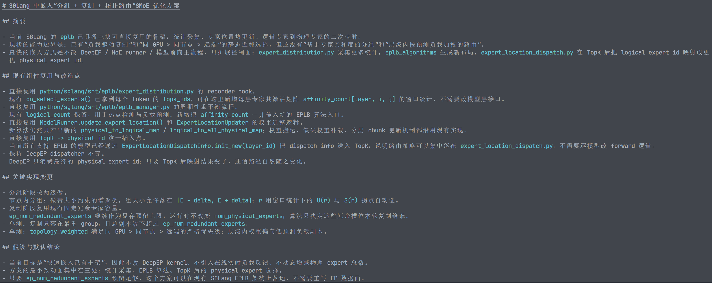

# GRACE-MoE 优化
一种针对稀疏混合专家（SMoE, Sparse Mixture-of-Experts）模型在分布式多GPU集群上推理时的综合优化方案。SMoE模型的核心痛点在于：**跨设备通信开销大**与**计算负载极度不均衡**。

文中提出的三个核心Idea层层递进，形成了一个闭环：先通过**分组**减少通信（但加剧了负载不均衡），再通过**复制**缓解负载不均衡，最后通过**路由**在通信和计算之间找到最优的执行路径。

## Core Idea

### 1. 专家分组 (Expert Grouping)：以通信为中心的优化

**核心理念：**
将经常同时被激活的专家（即“高亲和度”专家）放在同一个GPU或节点上。这样，当一个Token需要被路由到多个专家时，这些专家大概率在同一个设备上，从而大幅减少跨GPU或跨节点的网络通信（All-to-All通信）。

**如何实现：**
实现该策略分为两个关键维度：**可控的非均匀分组**和**层次化部署**。

* **计算专家亲和度与谱聚类 (Spectral Clustering)：** 首先，通过分析模型的激活模式，构建一个专家亲和度矩阵 $A$。使用谱聚类算法将高亲和度的专家分到一组。
* **寻找“非均匀比例” $r$ 的最优解：** 如果完全按照亲和度分组，会导致某些组的专家数量极多，某些组极少，造成严重的计算负载不均衡。因此，文中引入了“可控的非均匀分组”。
    * 设定理想的平均组大小为 $E = n/D$（$n$ 为专家总数，$D$ 为组数）。
    * 允许每组的大小在一个浮动范围内：$[E - \delta, E + \delta]$，其中 $\delta = E \cdot r$。
    * 通过构建优化问题寻找最佳的 $r$：平衡“组内亲和度利用率” $U(r)$ 与“组大小偏差” $S(r)$。通过绘制这两者的曲线，找到“拐点 (knee point)”作为最佳的 $r$ 值。
    * 计算公式如下：
    $$U(r) = \frac{\sum_{C \in C(r)} \sum_{i<j, i,j \in C} A_{i,j}}{\sum_{i<j} A_{i,j}}, \quad S(r) = \sqrt{\frac{1}{D} \sum_{d=1}^{D} (|C_d| - E)^2}$$
* **层次化分组 (Hierarchical Grouping)：** 针对多节点、多GPU的物理拓扑，采用两级分组：
    1.  **节点间 (Inter-node)：** 采用**完全非均匀分组**。因为跨节点通信极慢，所以必须最大化节点内的亲和度，宁可牺牲节点间的计算均衡。
    2.  **节点内/GPU间 (Intra-node)：** 采用上述的**可控非均匀分组**。在单个节点内部的多个GPU之间，在保留亲和度的同时，强制约束分组大小，以保证GPU之间的负载不要过于悬殊。

---

### 2. 专家复制 (Expert Replication)：以“计算负载均衡为中心”的优化

**核心理念：**
第1步的分组虽然减少了通信，但由于高亲和度的专家总是被一起调用，导致负载极度倾斜。为了解决这个问题，需要对那些最热门的专家进行**动态复制**，让空闲的GPU来分担计算压力。

**如何实现：**
该策略的关键在于“精准且克制”地复制，避免退化为全量数据并行（Data Parallelism），从而浪费显存并破坏此前的通信优化。

- **不复制广泛协作的专家，只复制高频激活的专家**: 只在负载最重的那一个组（Heaviest group）中寻找热点专家，而不是对所有组进行盲目复制。
- **动态计算副本数量 (Load Skew-driven)：** 使用分析数据（Profiling data）计算负载倾斜因子 $\rho = W_{\text{max}} / \bar{W}$（其中 $W_{\text{max}}$ 为最大组负载，$\bar{W}$ 为平均负载）。通过以下公式决定需要多少个副本：
    $$n_{\text{replica}} = \min(\max(1, \lfloor\rho\rfloor), n_{\text{gpu}} - 1)$$
- **分配与安置：**
    * 在负载最重的组内，按个体负载对专家进行排序。
    * 选出累计负载超过阈值（$W_{\text{max}} \cdot \frac{n_{\text{replica}}}{1 + n_{\text{replica}}}$）的“热点专家”。
    * 将这些热点专家的副本（Secondary copies）放置在当前**最空闲**（Most underutilized）的 $n_{\text{replica}}$ 个GPU上。
    * 原有的专家分组结构保持不变，新增加的仅仅是用于分担流量的“备用节点”。

---

### 3. 路由策略 (Routing Policy)：通信与计算负载的协同优化

**核心理念：**
经过第2步后，网络中存在了同一个专家的多个实例（原始副本+新增副本）。此时，当一个Token需要找这个专家时，应该派发给哪个实例？路由策略的作用就是在这个派发过程中，权衡就近原则（省通信）和分担压力（保计算均衡）。

**如何实现：**
文中探讨了两种策略，并最终推荐将它们结合使用：

* **策略一：基于负载预测的加权轮询 (Weighted Round-Robin with Load Prediction)**
    * 首先预测复制后的 GPU 负载情况。假设原最重组负载为 $W_{\text{max}}$，被复制专家的总负载为 $W_r$，均分给所有实例后的单实例负载为 $W_p$。预测公式如下：
    $$W'_{\text{max}} = W_{\text{max}} - W_r + W_p, \quad W'_i = W_i + W_p$$
    * 根据预测出的负载 $W'$，为其分配反比例的权重（预测负载越低，权重越高）。
    * Token 根据这个权重进行随机加权轮询。
    * *缺点：* 这种纯随机的方法可能会把 Token 跨节点发送，导致不必要的昂贵通信。
* **策略二：拓扑感知的局部优先路由 (Topology-Aware Routing with Locality Preference) [最终方案]**
    * 采用**严格的层级就近原则**：
        1.  优先选择与 Token 在**同一个 GPU** 上的专家副本（零通信成本）。
        2.  如果没有，选择**同一个节点内其他 GPU** 上的副本（NVLink通信，速度较快）。
        3.  最次选择，才跨越节点去找副本（网卡通信，速度最慢）。
    * **结合策略一：** 在同一个层级内（例如同一个节点内有多个副本），使用策略一的加权轮询来决定具体发给谁。
    * *效果：* 这种策略虽然在极限情况下牺牲了一点点绝对的计算均衡，但在大规模推理中，彻底避免了昂贵的跨节点通信，实现了通信与计算的最佳平衡。

## Plan
<!-- 
 -->