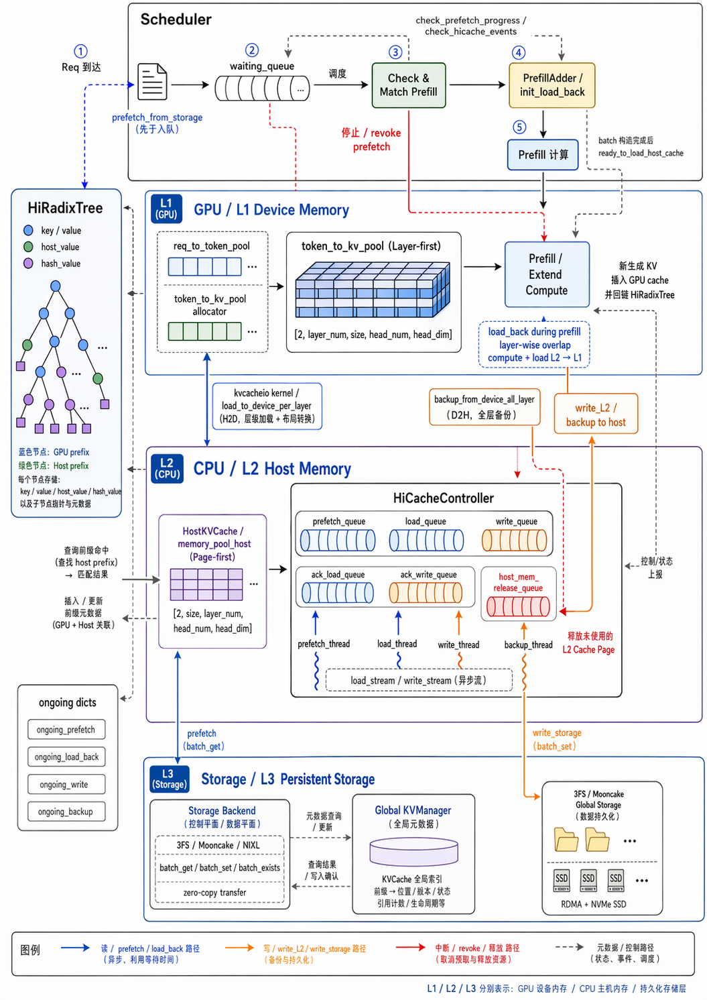
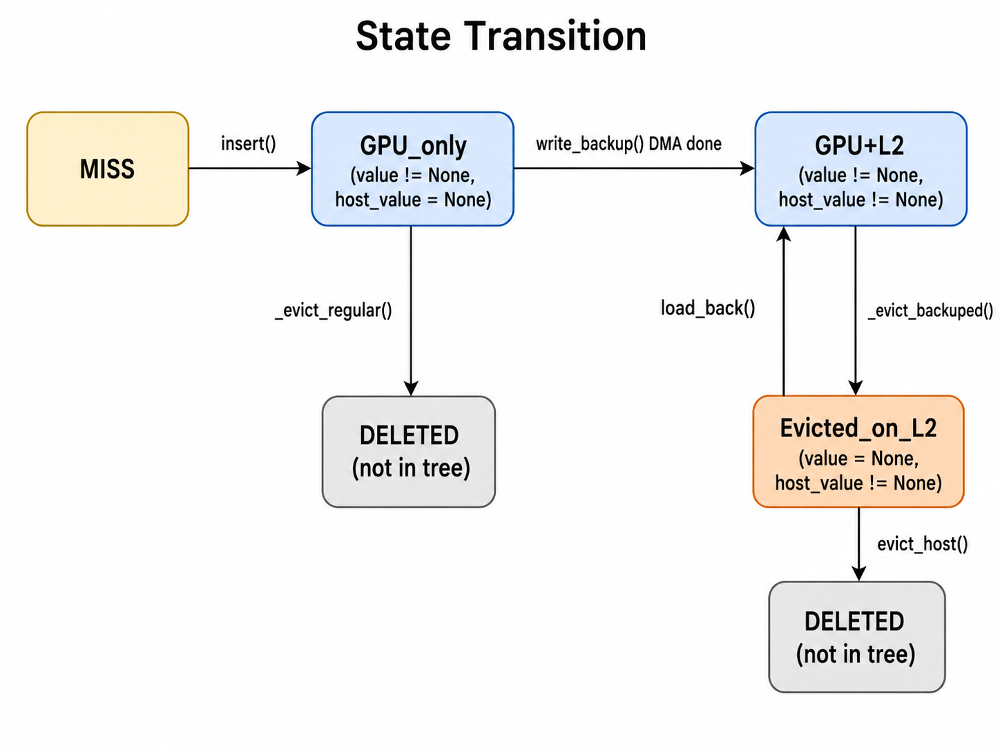
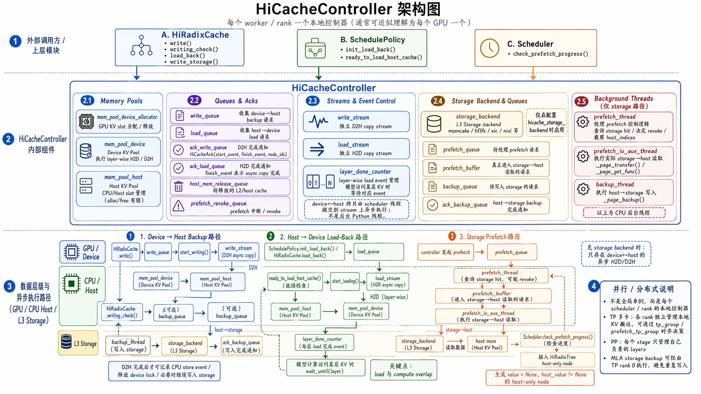
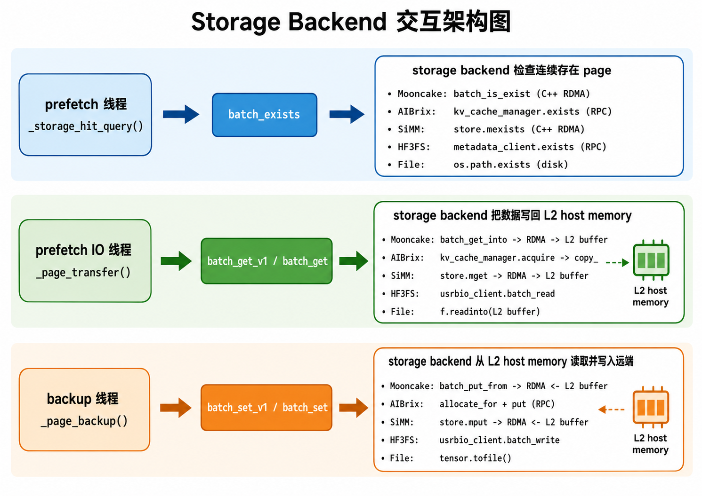

# Hicache In SGlang
## Overview
HiCache 即多级 KVCache，架构如下：

- HiRadixTree：单机 GPU-CPU 双层前缀缓存树
- Storage Backend：可插拔存储后端，集成 3FS、Mooncake、NIXL 等
  - 统一接口封装 batch_get / batch_set / batch exists
  - 零拷贝数据传输
- Global KVManager：提供分布式文件系统（FS）的元数据统一管理服务，具备高效的元数据组织、查询与协调能力，为全局 KVCache 提供一致性管理（KVCache 全局索引）
- 3FS/Mooncake Global Storage：存算分离架构，结合 RDMA 网络优化与 NVMe SSD，提供 TiB/s 级别的聚合读取带宽

### 流程
HiCache 的读路径可以理解成两段独立轮询、可以重叠执行的异步流水线：

1. **L3 -> L2**：Scheduler 先通过 `match_prefix()` 找到 L2 挂载点，再把 L2 未覆盖的 suffix 交给 prefetch 线程。prefetch 线程先做 hash 计算和 storage existence check，确认命中足够多后，再由 IO 线程把 storage 中的 KV 直接读入预分配的 host memory。
2. **L2 -> L1**：请求真正被选入 batch 时，`init_load_back()` / `load_back()` 才会把 host 上命中的 KV 分配回 GPU slot，并提交 H2D DMA。

两段流水线的轮询点不同，但都是 scheduler 每次迭代时进行轮询：
- `check_prefetch_progress()` 负责把 L3 prefetch 完成的数据插入 radix tree
- `loading_check()` 负责检查 H2D DMA 是否完成并释放保护引用。

**Load back**
- H2D load 和 prefill forward 是 layer-wise 重叠的：第 0 层 KV 搬完后 forward 就可以开始算第 0 层，同时 load stream 继续搬后面的层。

**Backup**
- Prefill 结束后，新产生的 KV 留在 GPU；如果策略要求 write back / backup，则再按 L1 -> L2 -> L3 的方向异步写回。

> [!NOTE]
> 这里的 L3 预取和 L2 load back 都需要匹配时超过一个阈值，如果没有超过不会进行这个过程
> 
> L3 prefetch 预分配一大段的 host kv slot，实际上可能 IO 线程只填充了一部分，剩余的会放入 host_mem_release_queue 里面。



## Component Details

### HiRadixTree
**RadixAttention 原始模型**
普通 RadixAttention 用 radix tree 存 prefix KV。每个节点是一段连续 token：
```shell
  root
   └── [system prompt tokens]
        └── [user turns]
             └── [more tokens]
```
Tree Node 结构：
```python
  TreeNode.key        # 这段 token span
  TreeNode.value      # GPU KV cache indices
  TreeNode.children   # 后续 token span
  TreeNode.lock_ref   # 正在被请求引用，不能驱逐
```
匹配请求时，从 root 开始按 token prefix 往下走。命中的节点 KV 可以直接复用，未命中的 suffix 才需要 prefill 计算。

**HiRadixTree 增加的状态**
HiCache 在同一个 TreeNode 上增加分层状态：
```python
  node.value       # L1: GPU KV indices；None 表示 GPU 已驱逐
  node.host_value  # L2: host KV indices；None 表示 host 没有备份
  node.hash_value  # L3: 每个 page 的 hash key，用来查外部 storage
```
通过 value 和 host_value 的组合来判断节点的状态：
- L1 hit: node.value != None
- L2 hit: node.value == None and node.host_value != None
- L3 hit: node.hash_value != None 且 storage backend 存在对应 hash
- Miss: 以上都没有
  
这就是分层 radix cache 的本质：tree 结构仍然按 token prefix 组织，但每个节点标记 KV 数据在哪一层

#### Prefix Match

`match_prefix()` 是 HiCache 读路径的入口之一。它先调用 `_match_prefix_helper()` 沿 radix tree 从 root 按 token prefix 向下走，然后再向上走两次，用两个指针分别定位 L1 和 L2 的覆盖范围。


```python
value, last_node = self._match_prefix_helper(self.root_node, key)

# 指针 1：沿 evicted 节点向上走，累加 L2 覆盖的 token 数
host_hit_length = 0
last_host_node = last_node
while last_node.evicted:
    host_hit_length += len(last_node.host_value)
    last_node = last_node.parent

# 指针 2：从原始位置向上走到第一个 backuped 祖先，作为 L2 锚点
while not last_host_node.backuped:
    last_host_node = last_host_node.parent
```

HiCache 版本的 `_match_prefix_helper()` 和 base radix cache 的关键区别是：已经 `evicted` 的节点不会被加入 `device_indices`，因为它的 GPU KV 已经不在 L1。

```python
# 普通 radix cache：所有匹配节点的 value 都加入结果
value.append(child.value)

# HiCache：evicted 节点跳过，避免返回已经释放的 GPU slot
if not child.evicted:
    value.append(child.value)
```

返回值可以这样理解：

| 返回值             | 含义                                                         |
| ------------------ | ------------------------------------------------------------ |
| `device_indices`   | L1 上已经命中的 GPU KV indices，可以直接复用                 |
| `host_hit_length`  | L2 上处于 `evicted` 状态、需要 load back 的 token 数         |
| `last_host_node`   | 最深的 L2 备份祖先，也是 L3 prefetch 的挂载点                |
| `last_device_node` | 最后一个未 evict 的 L1 命中节点，用来保护和更新 GPU 驻留状态 |

一个典型例子：

```text
root (backuped)
 └─ Node_A (GPU + backuped)            <- last_device_node / last_host_node
     └─ Node_B (evicted, 128 tok)      <- host_hit_length += 128
         └─ Node_C (evicted, 64 tok)   <- host_hit_length += 64
```

这次匹配会得到：

```text
device_indices  = Root ... Node_A 的 device value 拼接
host_hit_length = 128 + 64 = 192
last_host_node  = Node_A
```

这里的直觉是：tree match 负责确认 prefix 结构，`device_indices` 只返回 L1 上真实存在的 KV；L2 上的 evicted 节点只统计长度，真正 H2D 搬运要等请求进入 batch 后由 `init_load_back()` 触发。

#### Insert

HiCache 的 `insert()` 相比 base radix cache 多了分层状态维护：同一个 token span 可能只在 GPU、只在 host、或者同时在 GPU 和 host。插入时既要维护 radix tree 结构，也要维护 `value` / `host_value` / `hash_value` 三类元数据。


**1. 驱逐节点重物化**

如果插入路径命中了一个 `evicted` 节点，说明这个节点的树结构和 L2 备份还在，但 GPU value 已经释放。这次请求重新计算出同一段 KV 后，可以直接把新的 GPU indices 写回该节点。

```python
if node.evicted:
    node.value = value[:prefix_len].clone()
    self.evictable_size_ += len(node.value)
    self._update_leaf_status(node)
    self._update_host_leaf_status(node)
```

这一步相当于把 `Evicted_on_L2` 重新 materialize 成 GPU 驻留节点，而不是创建重复节点。

**2. 分裂时同时保留 GPU / Host / Hash 状态**

当新 key 和已有 child 只有部分 prefix 相同，需要调用 `_split_node()` 把 `parent -> child` 拆成 `parent -> new_node -> child`。


```python
# GPU value 分裂
if child.evicted:
    new_node.value = None
else:
    new_node.value = child.value[:split_len].clone()
    child.value = child.value[split_len:].clone()

# Host value 分裂
if child.backuped:
    new_node.host_value = child.host_value[:split_len].clone()
    child.host_value = child.host_value[split_len:].clone()

# Hash value 分裂
new_node.hash_value, child.hash_value = split_node_hash_value(
    child.hash_value, split_len, self.page_size
)
```

这里必须同时切分三类 value，否则会破坏分层缓存的 invariant：GPU 上的 token span、L2 备份、L3 page hash 链都要和 radix node 的 key 对齐。

**3. 命中计数触发 write-through**

插入或复用已有节点后，HiCache 会增加节点的 `hit_count`。在非 `write_back` 模式下，如果一个节点被命中到阈值，并且还没有 L2 备份，就会触发 `write_backup()`，把 L1 KV 写穿到 L2。


```python
def _inc_hit_count(self, node, chunked=False):
    if self.cache_controller.write_policy == "write_back" or chunked:
        return

    node.hit_count += 1
    if not node.backuped and node.hit_count >= self.write_through_threshold:
        self.write_backup(node)
```

这也是 `write_through_selective` 的核心：不是所有节点一插入就写到 host，而是热点节点达到阈值后再写。

**Host-only 插入**

L3 prefetch 完成后走的是 `_insert_helper_host()`，它不会创建 GPU value，而是把 storage 读出来的数据 materialize 成 L2 节点。


```python
new_node.value = None
new_node.host_value = host_value.clone()
new_node.hash_value = hash_value
self._record_store_event(new_node, medium=StorageMedium.CPU)
```

这种节点可以看成 host-only tombstone：它在 tree 中占据 prefix 位置，但不占 GPU KV。后续请求命中它时，`match_prefix()` 会累计 `host_hit_length`，再由 `load_back()` 恢复 GPU value。

#### Eviction

HiCache 有两层驱逐：`evict()` 处理 L1 GPU KV，`evict_host()` 处理 L2 host KV。两者的最大区别是：
- L1 驱逐如果有 L2 备份，会保留 tombstone
- L2 驱逐会把 tombstone 从树中彻底删除

##### L1 Eviction

主入口是 `evict()`。它从 `evictable_leaves` 构建最小堆，根据 eviction strategy 选择要驱逐的 GPU 叶子节点。

```python
def evict(self, params):
    leaves = list(self.evictable_leaves)
    heap = [(self.eviction_strategy.get_priority(node), node) for node in leaves]

    while num_evicted < num_tokens and heap:
        _, x = heapq.heappop(heap)
        if x.lock_ref > 0:
            continue

        if not x.backuped:
            if write_policy == "write_back":
                self.write_backup(x, write_back=True)
                write_back_nodes.append(x)
            else:
                self._evict_regular(x)
        else:
            self._evict_backuped(x)
```

三种 L1 驱逐路径：

| 驱逐方法            | 条件                               | 操作                                                |
| ------------------- | ---------------------------------- | --------------------------------------------------- |
| `_evict_backuped()` | 已有 `host_value`                  | 释放 GPU value，保留树节点和 L2 备份                |
| `_evict_regular()`  | 无 `host_value` 且 `write_through` | 释放 GPU value，并从树中删除节点                    |
| write-back 两阶段   | 无 `host_value` 且 `write_back`    | 先 `write_backup()` 写到 L2，再按 backuped 节点降级 |

**`_evict_backuped()`：GPU -> CPU 降级**


```python
def _evict_backuped(self, node):
    self._record_remove_event(node, medium=StorageMedium.GPU)
    self.cache_controller.evict_device(node.value)
    self.evictable_size_ -= len(node.value)
    node.value = None
    self._update_leaf_status(node)
    self._update_host_leaf_status(node)
    self._update_leaf_status(node.parent)
```

这个节点不会被删除，`host_value` 仍然保留在树中。之后再命中同一段 prefix 时，可以通过 `load_back()` 把 L2 KV 恢复到 GPU。

**`_evict_regular()`：完全删除**


```python
def _evict_regular(self, node):
    assert len(node.children) == 0
    self._record_remove_event(node)
    self.cache_controller.mem_pool_device_allocator.free(node.value)
    num_evicted = len(node.value)
    self._delete_leaf(node)
    return num_evicted
```

这种路径没有 L2 备份，因此节点会从 tree 中彻底消失。


##### L2 Eviction

当 host memory 不够时，`evict_host()` 会驱逐 L2 上的 host-only tombstone。


```python
def evict_host(self, num_tokens):
    leaves = list(self.evictable_host_leaves)
    heap = [(get_priority(node), node) for node in leaves]

    while num_evicted < num_tokens and heap:
        _, x = heapq.heappop(heap)
        if x.host_ref_counter > 0:
            continue
        if not x.evicted:
            continue

        self._record_remove_event(x, medium=StorageMedium.CPU)
        self.cache_controller.evict_host(x.host_value)
        x.parent.children.pop(key)
        self.evictable_host_leaves.remove(x)

        if len(x.parent.children) == 0 and x.parent.evicted:
            heapq.heappush(heap, (get_priority(x.parent), x.parent))
```

和 L1 eviction 的关键区别是：`evict_host()` 释放的是 L2 `host_value`，并且会把 tombstone 从 radix tree 里删掉；而 `_evict_backuped()` 只是 `node.value = None`，保留 L2 可恢复状态。

##### Evictable Leaf Sets

HiCache 同时维护两组可驱逐叶子集合：

| 叶子集                  | 维护函数                     | 节点条件                                              |
| ----------------------- | ---------------------------- | ----------------------------------------------------- |
| `evictable_leaves`      | `_update_leaf_status()`      | `not evicted`、`lock_ref == 0`、所有 child 都已 evict |
| `evictable_host_leaves` | `_update_host_leaf_status()` | `evicted`、`lock_ref == 0`、没有更深的 evicted child  |

设计意图是让两类驱逐都从最深处开始：

- GPU evict 从最深的 GPU 叶子开始，避免先驱逐父节点导致 GPU child 失去前缀结构。
- L2 evict 从最深的 tombstone 开始，因为更深的 evicted node 应该先被删除。

每次 insert、split、evict、load back 后，都要更新这两组集合，否则后续驱逐候选就会不准确。

##### State Transition
核心设计原则有三个：

1. **Backup invariant**：父节点不备份，子节点不能备份；L2 上的节点必须形成从 root 开始的连续 prefix。
2. **Tombstone 保留**：有 L2 备份的驱逐节点保留在树中，后续 `load_back()` 可以恢复；只有 `evict_host()` 才会最终删除。
3. **叶子驱逐 + 父级级联**：永远从叶子开始驱逐，驱逐后父节点可能变成新的叶子，再加入候选堆。



---

### HiCacheController

初始化路径：Scheduler -> HiRadixCache -> HostKVCache -> HiCacheController
- 每个 rank 都有一个 HiCacheController 实例，负责管理本地 HiRadixTree 和与 storage backend 的交互。
- memory device pool 管理 GPU 池，memory host pool 管理 host 池
- 多个队列存放不同请求，scheduler 每次调度都会 check 这些队列状态并清除完成的请求：
  - write_queue：L1->L2 写请求
  - ack_write_queue：L1->L2 写完成 ack
  - load_queue：L2->L1 读请求
  - ack_load_queue：L2->L1 读完成 ack
  - prefetch_queue：L3 预取请求
  - prefetch_revoke_queue：L3 预取撤销请求
  - host_mem_release_queue：host 内存释放请求
  - backup_queue：L2->L3 写请求
  - ack_backup_queue：L2->L3 写完成 ack
- 后台线程和多流：
  - copy stream：专门用于 GPU<->host 的异步 copy，配合 CUDA event 实现非阻塞的 load/write 操作
    > 每一层记录一个 CUDA event，实现 layer-wise的 load/prefill 重叠
  - prefetch_thread：负责 L3 prefetch 的元数据查询和命中判断
  - prefetch_io_aux_thread：负责 L3->L2 的实际数据搬运
  - backup_thread：负责 L2->L3 的写入操作



---

#### Device->Host->Storage Backup

**写入策略**
- **write_through**：命中/插入后尽快写到 L2/L3，缓存收益最大，I/O 压力也最大。
- **write_through_selective**：命中次数达到阈值后才写，偏向热点数据。
- **write_back**：GPU 驱逐时才写到 host/L3，减少 I/O。

**Device->Host Backup**
HiCacheController 将 host_indices 放入 write_queue，然后 merge_ops 把队列中多个写操作合并成一个批量操作：
1. 拼接 tensor：把多个 host_indices 和 device_indices 张量拼接成一个大 tensor
2. 收集 node_ids：把所有请求的 node_id 汇总
3. 取最小 priority：使用最低优先级
4. 合并 pool_transfers：合并内存池传输信息
5. 然后 node.value 对应的 GPU KV 拷到 host pool：

> [!IMPORTANT]
> 对 write_through 有一个重要约束：host 备份必须形成从 root 开始的连续 prefix，**不能父节点没备份而子节点先备份**。

**Host->Storage Backup**
递归获取祖先的 hash value，直到 root，形成当前节点的 hash_value。然后把 host KV 和 hash_value 作为一个 StorageOperation 放入 backup_queue，由 backup_thread 负责写回 storage。
- Zero-copy backend（Mooncake、NIXL、EIC、SiMM、HF3FS 等）：通过 `batch_set_v1()` 直接传 host memory 指针或 buffer view，backend 从 L2 buffer 读出并写到远端。
- Generic-copy backend（File、AIBrix 等）：通过 `batch_set()` 先构造 tensor / block handle，再由 backend 写入本地文件或远端 KV manager。

完成的 backup 回放入 ack_backup_queue，由 scheduler drain 并更新节点状态。

---

#### Storage -> Host -> Device Load Back

Storage -> Host -> Device 是一条两段异步流水线：

- **L3 -> L2**：`prefetch_thread` 做 hash 计算和 storage 命中查询，`prefetch_io_aux_thread` 做真正的 storage -> host 数据搬运。
- **L2 -> L1**：Scheduler 主线程触发 `load_back()`，`load_stream` 按 layer 做 host -> device DMA。
- 两段互相独立：都由 scheduler 每次迭代后进行轮询；L3 prefetch 通过 `check_prefetch_progress()` 轮询，L2 load back 通过 `loading_check()` 轮询，因此可以和调度、prefill 计算重叠。

##### 第一阶段：L3 -> L2（Storage -> Host Prefetch）

**Step 1：`match_prefix()` 确定 L2 覆盖范围**

位置：`hiradix_cache.py:1218-1252`

请求进入 radix tree 后，`match_prefix()` 会返回三个和 HiCache 读路径相关的值：

```python
# 沿 parent 向上走，统计 evicted 节点在 L2 上的 token 数
while last_node.evicted:
    host_hit_length += len(last_node.host_value)
    last_node = last_node.parent

# 沿 parent 向上走，找第一个 backuped 祖先，作为 L3 prefetch 挂载点
while not last_host_node.backuped:
    last_host_node = last_host_node.parent
```

| 返回值            | 含义                                                              |
| ----------------- | ----------------------------------------------------------------- |
| `device_indices`  | GPU 上已经命中的 prefix，可直接复用                               |
| `last_host_node`  | 最深的 L2 备份节点，也是 L3 prefetch 结果插入 radix tree 的挂载点 |
| `host_hit_length` | L2 上处于 `evicted` 状态的 token 数，后续需要 load back 到 GPU    |

这里有个关键约束：prefetch 结果最终要插入 radix tree，因此必须先找到一个已经 `backuped` 的 L2 祖先节点作为挂载点。

**Step 2：`_prefetch_kvcache()` 触发 L3 prefetch**


```python
if last_host_node.backuped or last_host_node is self.tree_cache.root_node:
    new_input_tokens = req.fill_ids[matched_len:]
    self.tree_cache.prefetch_from_storage(
        req.rid, last_host_node, new_input_tokens, last_hash, prefix_keys
    )
```

`new_input_tokens` 是 L2 尚未覆盖的 suffix。只有 `last_host_node.backuped`，或者挂载点退化到 `root_node` 时，Scheduler 才会发起 storage prefetch。

**Step 3：`prefetch_from_storage()` 分配 L2 host memory 并入队**

```python
def prefetch_from_storage(self, req_id, last_host_node, new_input_tokens, ...):
    prefetch_length = len(new_input_tokens) - (len(new_input_tokens) % self.page_size)

    if not self.enable_storage or prefetch_length < self.prefetch_threshold:
        return

    last_host_node.protect_host()
    host_indices = self.cache_controller.mem_pool_host.alloc(prefetch_length)
    operation = self.cache_controller.prefetch(
        req_id, host_indices, new_input_tokens, ...
    )
    self.ongoing_prefetch[req_id] = (
        last_host_node, new_input_tokens, host_indices, operation
    )
```

这一步还没有做真正 I/O，只是完成三件事：

1. 按 `page_size` 对齐计算 `prefetch_length`。
2. 保护 L2 父节点，避免 prefetch 期间挂载点被 evict。
3. 预分配 host memory，并创建 `PrefetchOperation` 放入 `prefetch_queue`。

如果 storage 没启用、命中长度低于 `prefetch_threshold`，或者 host pool 已经接近限流阈值，这里会直接短路返回。

**Step 4：`prefetch_thread_func()` 做 hash 查询，IO 线程做数据搬运**

`prefetch_thread` 是第一层后台线程，它从 `prefetch_queue` 取出 operation 后，先做 hash 计算和 existence check：

```python
def prefetch_thread_func(self):
    while not stopped:
        operation = self.prefetch_queue.get(block=True)
        hash_value, storage_hit_count = self._storage_hit_query(operation)

        if storage_hit_count < self.prefetch_threshold:
            self.prefetch_revoke_queue.put(operation.request_id)
        else:
            self.prefetch_buffer.put(operation)
```

`_storage_hit_query()` 会按 page 做链式 SHA256。每个 page 的 hash 依赖上一个 page 的 hash，因此它天然表达的是 longest-prefix 语义：

```python
for start in range(0, len(tokens), page_size * storage_batch_size):
    batch_tokens = tokens[start:end]
    for i in range(0, len(batch_tokens), page_size):
        last_hash = self.get_hash_str(batch_tokens[i:i + page_size], last_hash)
        batch_hashes.append(last_hash)

    hit_page_num = self.storage_backend.batch_exists(batch_hashes, extra_info)
    storage_query_count += hit_page_num * self.page_size
    if hit_page_num < len(batch_hashes):
        break
```

如果本 rank 查询到的命中长度足够，TP ranks 之间还会通过 `all_reduce(MIN)` 对齐命中长度。随后 operation 被放进 `prefetch_buffer`，交给 IO 辅助线程做真正的数据搬运。

```python
def prefetch_io_aux_func(self):
    while not stopped:
        operation = self.prefetch_buffer.get(block=True)
        self._page_transfer(operation)

def _page_transfer(self, operation):
    for i in range(0, len(operation.hash_value), storage_batch_size):
        batch_hashes = operation.hash_value[i:i + storage_batch_size]
        batch_host_indices = operation.host_indices[
            i * page_size:(i + storage_batch_size) * page_size
        ]
        results = self.storage_backend.batch_get_v1(
            batch_hashes, batch_host_indices
        )
```

`batch_get_v1()` 是零拷贝读路径的关键：storage backend 会把**数据直接写入前面预分配好的 host KV memory**。
  - 比如 Mooncake backend 可以通过 `batch_get_into(keys, buffer_ptrs, buffer_sizes)` 直接把远端数据 RDMA 到 host buffer。

**Step 5：`check_prefetch_progress()` 轮询并把完成结果插入 radix tree**

Scheduler 每轮调度都会检查 prefetch 进度：

```python
def check_prefetch_progress(self, req_id):
    _, token_ids, host_indices, operation = self.ongoing_prefetch[req_id]

    if not self.can_terminate_prefetch(operation):
        return False

    completed_tokens, hash_value = self.cache_controller.terminate_prefetch(operation)

    matched_length = self._insert_helper_host(
        last_host_node, key, host_indices[:completed_tokens], hash_value
    )
    loaded_from_storage = completed_tokens - matched_length
    self.prefetch_loaded_tokens_by_reqid[req_id] = loaded_from_storage

    last_host_node.release_host()
    del self.ongoing_prefetch[req_id]
    return True
```

`_insert_helper_host()` 会沿 radix tree 向下复用已有节点，剩余部分创建新的 host-only 节点：

```python
node.value = None
node.host_value = host_value
```

因此，`completed_tokens` 表示本轮 prefetch 实际完成的 token 数，`matched_length` 表示这些 token 中已经在 tree 里的前缀长度，真正从 L3 新加载的是：

```python
loaded_from_storage = completed_tokens - matched_length
```

`--hicache-storage-prefetch-policy` 控制 prefetch 何时可以终止：

| 策略            | 行为                                                               |
| --------------- | ------------------------------------------------------------------ |
| `best_effort`   | 立即终止，有多少用多少                                             |
| `wait_complete` | 等所有 page 完成                                                   |
| `timeout`       | 等完成或超时，超时时间通常是 `base_timeout + per_page * num_pages` |

---

##### 第二阶段：L2 -> L1（Host -> Device Load Back）

**Step 6：`init_load_back()` 触发 H2D load**

当请求被选入 batch 时，Scheduler 才真正触发 L2 -> L1：

```python
if req.host_hit_length > 0:
    new_indices, req.last_node = self.tree_cache.init_load_back(
        InitLoadBackParams(
            last_host_node=req.last_host_node,
            host_hit_length=req.host_hit_length,
            req=req,
        )
    )
    req.prefix_indices = torch.cat([req.prefix_indices, new_indices])
```

这里的 `host_hit_length` 可能来自两个地方：

1. `match_prefix()` 在 L2 已有节点中统计到的 `evicted` token。
2. `check_prefetch_progress()` 刚从 L3 prefetch 并插入 radix tree 的 host-only 节点。

**Step 7：`load_back()` 从 host 恢复到 GPU**

```python
def load_back(self, node: TreeNode, mem_quota=None):
    nodes_to_load = []
    while node.evicted:
        assert node.backuped, "No backup available on evicted nodes"
        nodes_to_load.insert(0, node)
        node = node.parent

    ancester_node = node
    self.inc_lock_ref(ancester_node)

    host_indices = torch.cat([n.host_value for n in nodes_to_load])
    device_indices = self.cache_controller.load(
        host_indices=host_indices, node_id=last_hit_node.id
    )

    offset = 0
    for node in nodes_to_load:
        node.value = device_indices[offset:offset + len(node.host_value)].clone()
        offset += len(node.host_value)
        node.evicted = False
```

这一步主要是在 radix tree 和 KV pool 的 index 层面完成恢复：

1. 从当前节点向上收集连续的 `evicted` 节点。
2. 找到第一个未 evict 的祖先作为锚点，并增加 `lock_ref`，防止 load 过程中被驱逐。
3. 拼接所有 `host_value`，分配 GPU KV slot。
4. 把新分配的 `device_indices` 切回各个节点，更新 `node.value` 并把 `node.evicted` 置为 `False`。

**Step 8：`start_loading()` 逐层异步 H2D DMA**

```python
def start_loading(self):
    op = CacheOperation.merge_ops(self.load_queue)
    host_indices, device_indices = self.move_indices(
        op.host_indices, op.device_indices
    )

    with device_module.stream(self.load_stream):
        for i in range(self.layer_num):
            self.mem_pool_host.load_to_device_per_layer(
                self.mem_pool_device,
                host_indices,
                device_indices,
                i,
                self.io_backend,
            )
            producer_event.complete(i)

    self.ack_load_queue.append(ack)
```

关键优化是 `LayerDoneCounter`：每拷贝完一层，就通知 forward pass 这一层的 KV 已可用。这样 forward 计算第 `i` 层时，load stream 可以继续搬第 `i + 1` 层甚至更后面的 KV，实现计算和数据传输重叠。


**Step 9：`loading_check()` 轮询 DMA 完成**

实际上在 `check_hicache_events()` 里面，scheduler 每轮都会做这件事

```python
def loading_check(self):
    for _, finish_event, ack_list in self.cache_controller.ack_load_queue:
        if not finish_event.query():
            break

        for ack_id in ack_list:
            end_node = self.ongoing_load_back.pop(ack_id)
            self.dec_lock_ref(end_node)
```

当 CUDA event 表示 load 已完成后，Scheduler 会从 `ack_load_queue` 中取回对应节点，并释放前面为了保护锚点而增加的 `lock_ref`。


### Global KVManager 与 Storage Backend

HiCacheController 不直接关心底层是 Mooncake、NIXL、EIC、SiMM、HF3FS、AIBrix 还是本地 File。它把 L3 I/O 抽象成三类接口：

- `batch_exists(keys)`：检查一批 page hash 是否存在，返回连续命中的 page 数。
- `batch_get` / `batch_get_v1`：把 L3 中的 KV page 读到 L2 host memory。
- `batch_set` / `batch_set_v1`：把 L2 host memory 中的 KV page 写回 L3。

`_v1` 接口表示 backend 可以直接接收 host memory indices 或指针，优先走零拷贝路径；非 `_v1` 接口则走通用 copy 路径。




#### Zero-copy 与 Generic Copy 分发

**零拷贝分发**

Mooncake、NIXL、EIC、SiMM、HF3FS 这类 RDMA / usrbio 风格 backend 可以直接拿到预分配 L2 host memory 的地址。读路径中，backend 直接把远端数据写进 `host_indices` 指向的 buffer；写路径中，backend 直接从这些 buffer 读取并发送到远端。

```python
def _page_get_zero_copy(self, operation, hash_values, host_indices, extra_info):
    results = self.storage_backend.batch_get_v1(
        hash_values, host_indices, extra_info
    )
    # host_indices 指向预分配的 L2 host memory，backend 直接往里写数据

def _page_set_zero_copy(self, hash_values, host_indices, extra_info):
    return all(
        self.storage_backend.batch_set_v1(hash_values, host_indices, extra_info)
    )
```

**拷贝模式分发**

File、AIBrix 这类 backend 通常先返回普通 tensor / block handle，再由 controller 或 manager 把数据 copy 到目标 host page。

```python
def _generic_page_get(self, operation, hash_values, host_indices, extra_info):
    page_data = self.storage_backend.batch_get(hash_values, dummy_page_dst)
    for i in range(len(hash_values)):
        mem_pool_host.set_from_flat_data_page(
            host_indices[i * page_size], page_data[i]
        )

def _generic_page_set(self, hash_values, host_indices, extra_info):
    data = [
        mem_pool_host.get_data_page(host_indices[i * page_size])
        for i in range(len(hash_values))
    ]
    return self.storage_backend.batch_set(hash_values, data)
```

#### Backend 实现差异

**MooncakeStore：RDMA 零拷贝**

Mooncake 是最典型的高性能 RDMA backend。Python 层的 `MooncakeStore` 会通过 pybind 调 C++ `MooncakeDistributedStore`。

```python
def batch_exists(self, keys, extra_info=None):
    keys = self._tag_keys(keys)
    exist_result = self.store.batch_is_exist(keys)
    for i in range(len(keys)):
        if exist_result[i] != 1:
            return i // key_multiplier

def batch_get_v1(self, keys, host_indices, extra_info=None):
    key_strs, buffer_ptrs, buffer_sizes = self._batch_preprocess(
        keys, host_indices
    )
    get_results = self.store.batch_get_into(
        key_strs, buffer_ptrs, buffer_sizes
    )

def batch_set_v1(self, keys, host_indices, extra_info=None):
    key_strs, buffer_ptrs, buffer_sizes = self._batch_preprocess(
        keys, host_indices
    )
    set_results = self.store.batch_put_from(
        key_strs, buffer_ptrs, buffer_sizes
    )
```

`_batch_preprocess()` 会把逻辑 page hash 转成真正存储 key 和 buffer 指针：

- MHA 模型：每个 page 拆成 K / V 两个 key，例如 `"{hash}_{rank}_k"` 和 `"{hash}_{rank}_v"`。
- MLA 模型：通常只需要一个 K buffer，因为 MLA 的 V 不按同样方式放在 page 中。
- 最终返回 `key_strs`、`buffer_ptrs`、`buffer_sizes`，C++ RDMA 接口直接用这些指针读写 L2 host memory。

**AibrixKVCacheStorage：显式 Global KV Cache Manager**

AIBrix 是这里唯一显式使用 `BaseKVCacheManager` 的 backend。它把 L3 操作抽象成跨节点 KV block 的 `exists`、`acquire`、`allocate_for`、`put`，底层可以对接 Infinistore 或 PrisKV。

```python
from aibrix_kvcache import BaseKVCacheManager, BlockHashes

class AibrixKVCacheStorage(HiCacheStorage):
    def __init__(self, storage_config, mem_pool):
        config = KVCacheConfig(
            block_spec=KVCacheBlockSpec(
                block_ntokens=page_size,
                block_dtype=kv_cache_dtype,
                block_layout=KVCacheBlockLayout("NCLD"),
                tensor_spec=KVCacheTensorSpec(
                    heads=head_ids,
                    layers=layer_ids,
                    head_size=head_dim,
                ),
            ),
            model_spec=ModelSpec(102400),
        )
        self.kv_cache_manager = BaseKVCacheManager(config)

    def batch_get(self, keys, target_locations):
        block_hash = BlockHashes(keys, self.page_size)
        status = self.kv_cache_manager.acquire(None, block_hash)
        if status.is_ok():
            kv_blocks = status.value.to_tensors()
            for i in range(len(kv_blocks)):
                target_locations[i].copy_(kv_blocks[i].flatten())
            return target_locations

    def batch_set(self, keys, values):
        block_hash = BlockHashes(keys, self.page_size)
        status = self.kv_cache_manager.allocate_for(None, block_hash)
        handle = status.value
        tensors = handle.to_tensors()
        for i in range(len(tensors)):
            tensors[i].copy_(values[i])
        self.kv_cache_manager.put(None, block_hash, handle)

    def batch_exists(self, keys, extra_info=None):
        block_hash = BlockHashes(keys, self.page_size)
        status = self.kv_cache_manager.exists(None, block_hash)
        return status.value // self.page_size
```

这里的 `BaseKVCacheManager` 是真正的 global 管理层：它负责跨节点 KV block 的分配、存在性检查、远端读取和提交写入。

**HiCacheSiMM：C++ Store RDMA 接口**

SiMM 的结构和 Mooncake 类似，底层是 `simm.kv.Store`，批量 exists / get / set 都交给 C++ store：

```python
self.store.mexists(key_strs)
self.store.mget(key_strs, block_views)
self.store.mput(key_strs, block_views)
```

`block_views` 指向 L2 host memory，因此也可以走零拷贝风格的数据路径。

**HiCacheHF3FS：3FS + metadata service**

HF3FS 使用 3FS 分布式文件系统和 metadata service。metadata 负责 page key 到文件 / page index 的映射，usrbio client 负责批量读写。

```python
results = self.metadata_client.exists(self.rank, keys)
self.usrbio_client.batch_read(keys, buffers)
self.metadata_client.reserve_and_allocate_page_indices(keys)
self.metadata_client.confirm_write(keys)
```

读路径中，`batch_read()` 可以把数据写入目标 buffers；写路径通常先 reserve page indices，再并发写入文件，最后 `confirm_write()` 提交 metadata。

**HiCacheFile：本地磁盘实现**

File backend 是最直接的本地磁盘实现，适合调试和单机验证：

```python
# exists
os.path.exists(f"{hash}_{modelname}_{tp_rank}_{tp_size}.bin")

# set
tensor.contiguous().numpy().tofile(path)

# get
open(path, "rb").readinto(pre_allocated_buffer)
```

它没有 RDMA 语义，本质是文件读写和 CPU copy。

#### Longest-prefix Exists

所有 backend 的 `batch_exists()` 都要实现最长连续前缀语义：从 `keys[0]` 开始检查，遇到第一个不存在的 key 就停止，返回已连续存在的 page 数。

这个语义会被 `_storage_hit_query()` 直接利用：

```python
for i in range(0, len(batch_tokens), page_size):
    last_hash = self.get_hash_str(batch_tokens[i:i + page_size], last_hash)
    batch_hashes.append(last_hash)

hit_page_num = self.storage_backend.batch_exists(batch_hashes, extra_info)
if hit_page_num < len(batch_hashes):
    break
```

因为 HiCache 的 page hash 是链式 hash：每个 page 的 hash 都依赖前一个 page 的 hash。一旦中间 miss，后续 page 就不再满足连续 prefix 复用语义，也不应该继续查询。这和 L2 backup invariant 保持一致：**可复用 KV 必须是从 root 开始的连续 prefix**。


