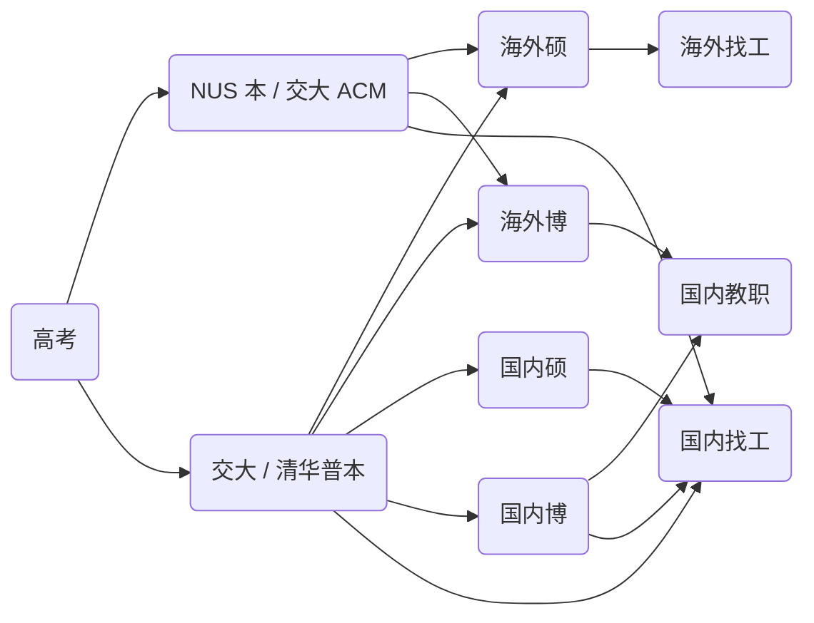

寒冬将尽，新光沓来。

> 为我们永不熄灭的过去、未来和现在。
> 敬一去不返的时间
> 敬过往的得失和照常升起的太阳。
> 敬那些偶然的擦肩与停留。
> 敬自由、敬真理、敬怅惘，
> 敬疲惫但仍踉跄向前的灵魂，
> 敬一切苦痛和仍未熄灭的心，
> 敬如约而至的新春，
> 敬自己。

那些萦绕的雾霭终会在春光中消融，那些未决的诘问终会随时间明晰。

愿你在四季中新生，拥有春夏的轻盈热烈、秋冬的深刻澄明；
愿你光风霁月，欢畅无虞；
愿你步履坚定，前途顺遂。

新春快乐，万事胜意。

2024 在不知不觉中就过去了，趁着这几天走亲戚的间隙，我抽了点空写一写这一年来的一些思考，文字非常拙劣，某些地方或许会词不达意，望见谅。

## 方向与选择

从前我只是一个勤勤恳恳的做题家，除了巧合下接触了两年的竞赛，我的认知中只有“高考 -> 读研 (-> 读博) -> 找工 -> ...” 的人生路径；选专业的时候也是按照招分高低评判专业的好坏（而不是培养计划、给分、学校资源等等，虽然高中生中懂这些的属实是凤毛麟角）。而在上大学 + 大量水群水论坛之后，我才意识到实际上我能够选择的路径是如此之多：

非常多的选择，不是吗？而任意一条不同的路径，所需要做的准备也不相同，甚至可以说大不一样。如果我仍然选择做一个做题家，那么我的路径将会非常单一，并且任何一环出问题，都会引起整个规划的崩溃。

当然我并不是说我可以兼顾几条路径，毕竟我不是超人；我想我所能做的最大努力就是走一条路，同时将几条路的公共部分做好。也可以说是：定好方向，然后做那些始终正确的事情；譬如说运动可以保证我往后几十年的身心健康，所以是“始终正确的”；刷课写项目可以打牢我的各个方面基础，所以是“始终正确的”。

## 任务规划

## 内耗

## 注意力

## 短视频

## 期末周速通

## 国奖答辩

## 输出分享交流群

## aiTour

## 致远工科

## 思维方式

及其带来的学习方式、应试方式的改变

## 培养方案

## GBC

## 认识的人

第一次收到明信片

## 推荐算法

## 学术品味

## 交友 社交

