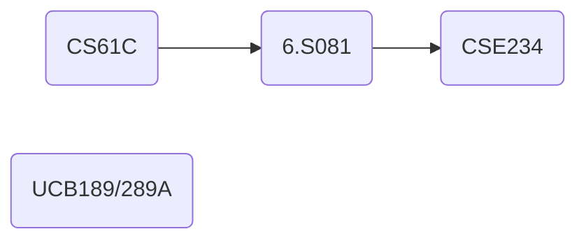

不知不觉就要到大二下学期了，做一个五个月规划，以后的每周就按照这个规划来总结吧。

## 校内课程

对于课内的课程，应对策略可见 [期末周复盘](../../blogs/posts/final-week-review.md)。

培养计划内，大二下学期课程有：

|   课程    |            应对策略             |
|:-----: |:-------------------------: |
|  随机过程   |      老师授课质量很好，跟随老师授课学习      |
|  机器学习   | 完成作业 + UCB 189 课件复习 + 期末周拟合 |
|  深度学习   |         完成作业 + 大作业          |
| 计算机体系结构 |   CS61C 代替 + 完成作业 + 期末周刷题   |
|  移动机器人  |            能水则水             |
|   信息论   |      看老师怎么样，似乎是新来的老师教       |
|   大物    |       能水则水 + 期末周刷题拟合        |
|   武术    |           完全不用担心            |
| 马原   |       平时能水则水，期末疯狂背诵拟合       |

## 公开课

用 CS61C 代替掉校内的计体，然后看 MIT 的 6.S081 学操作系统，之后看有没有时间学 [CSE 234](https://hao-ai-lab.github.io/cse234-w25/index.html)；机器学习的课用 UCB 189/289A 的 PPT 复习一遍（因为印象不太深了）

## 科研

1. 在 IPADS 那边有一个 MLSys 的项目，只需要我写调度层的代码 + 重构代码，应该不会很困难。主要是想通过这个来接触一下 MLSys 在干什么，之后再决定是否需要向这个方向发展，预计会有一篇 2 作 / 3 作产出？
2. 在 GAIR 这边申请了一个科研实习，希望能在下个学期投出一篇一作论文，应该是做大模型相关的研究

## 英语

这学期要开始准备托福考试，预计 7 月或者 8 月参加考试吧

## 习惯

1. 手机短视频：最好是不要刷了……
2. 早睡早起：长时间搏一搏的必要保障
3. 运动：充沛精力的来源
4. 休息：高效率的必要行为

## 社交

### 网络

主要在以下几个地方进行：

- 知乎：发布笔记、想法、总结、科研记录等
- 交流群：转载分享自己的和别人的文章，和群友交流
- 小红书：每周发布一次总结
- 水源（交大论坛）：主要是生活记录
- aiTour：继续写我的 aiTour，可以上知乎宣传一下（bushi

### 现实

减少外出频率，尽量少参加娱乐，因为估计会非常忙（

## 运动

每周必须抽时间参加至少三次运动，跑步或者打球都行。上学期明显感觉到精力不足，该通过运动补补了。

## 时间表

我感觉还是需要用一个时间表来规范自己的作息，所以就简单写写吧。

- 8:00 - 10:00 第一段，早睡早起务必要做到……
- 10:00 - 11:40 午饭可以早点去吃，或者晚点吃，再不济点外卖，不要高峰期去排队，很费时间（
- 12:00 - 14:00 优先保证休息，休息够了就继续干，让下午晚上有精力
- 14:00 - 15:40 休息过后效率会高些？
- 16:00 - 17:40 晚饭和午饭同理
- 18:00 - 20:00 晚饭过后第一段
- 20:00 - 21:00 英语时间，练习听力、阅读、口语、写作
- 21:00 -? 运动 + 生活整理，有多出来的时间就继续学
- 23:30 能睡觉就睡，不能的话最晚 23:50 必须睡

算一算估计共有 10 个小时投入学习，够了。假设每天睡 8 个小时，吃饭一个半小时，还剩约 4 个多小时可以自由安排。用时间日志来记录一下自己每一天的时间安排。这样似乎会很没有人性……但是不得不拼一拼了……

另外每周五晚上就不要学习了，给家里人打打电话、玩玩 mc、原之类的挺好

