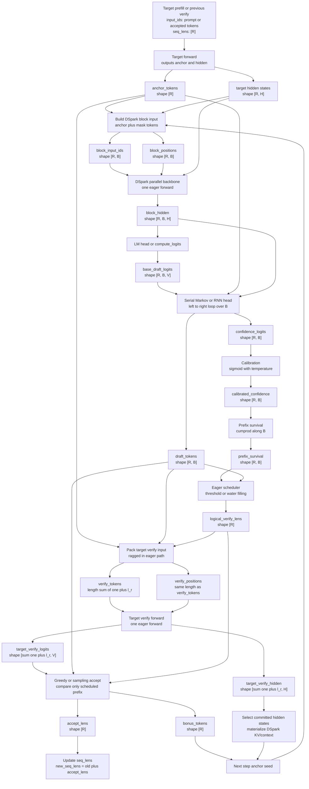

# DeepSeek DSpark 调研报告

## 写在前面
6 月 27 日 DeepSeek 团队发布了 DSpark —— 一个专注于**提升投机解码性能的生产级部署框架**，它解决的痛点是：

1. **猜得更快**：提升草稿模型生成 draft token 的速度。
2. **猜得更准**：提升草稿模型生成质量。
3. **验得更快**：提升主模型的验证速度。

本文从以下 4 点介绍 DSpark，以及新发布的 DeepSeekV4-DSpark 模型：

1. DSpark 是什么，它在大模型推理链路中的位置。
2. 投机解码的瓶颈以及 DSpark 的解决思路。
3. DeepSeekV4-DSpark 模型。
4. DSpark 在厂内应用的可能性。

为帮助更多不了解投机解码的同学阅读本文，在介绍 DSpark 之前我们先简单介绍投机解码的基础知识，以及目前业界最常用的几种投机解码方法，已经有这方面基础的同学可以[直接跳转](#dspark-是什么)。

另外，本文更多从推理的视角进行解读，关于投机解码中草稿模型的训练和评估，可以参考 DeepSeek 专门为此推出的框架 [DeepSpec](https://github.com/deepseek-ai/DeepSpec), DSpark 也是其中的一个组件，以及原论文的 3.3 章节。

## 投机解码基础知识
### 自回归模型的生成瓶颈
### 投机解码的基本原理
投机解码使用一个轻量级的草稿模型$M_d$来加速目标模型$M_t$，一次投机解码过程可以描述为：

在每一个 decode step, 目标模型$M_t$生成的下一个 token 称为锚点，草稿模型$M_d$基于锚点生成$\gamma$个草稿 token: $x_1, \cdots, x_\gamma$

目标模型$M_t$在一次前向过程中验证所有$\gamma$个草稿 token, 在草稿序列的每一个位置$k, k \in [1, \gamma]$, 目标模型$M_t$计算一个分布$p_k^t$, 将其与草稿模型的分布$p_k^d$进行对比，草稿 token $x_k$会被接受的概率为$min(1, \frac{p_k^t(x_k)}{p_k^d(x_k)})$

生成每个 token 的延迟为：

$L = \frac{T_{draft} + T_{verify}}{\tau}$

其中$T_{draft}$为生成草稿模型的延迟，$T_{verify}$为验证的延迟，$\tau$为每次接受的 token 数。

因此要为投机解码提速，可以从三个维度进行优化：

* 降低$T_{draft}$, 即提升草稿模型$M_d$生成草稿 token 的速度。
* 降低$T_{verify}$, 即提升目标模型$M_t$验证的速度。
* 提升$\tau$, 即提升草稿 token 生成质量。

### 自回归投机解码
#### DeepSeek-MTP
#### EAGLE 3
### 并行式投机解码
#### DFlash
### 推理引擎中启用投机解码（以 SGLang 为例）
## DSpark 是什么
### 以往投机解码方法的优缺点
#### 自回归式草稿模型
##### ✅优点
每次 forward pass 生成一个草稿 token, 优点是每个位置都可以看到自己所有前缀 token, 生成质量更高，被验证模型的**接受概率也更高。**

##### ❌缺点
延迟几乎随着生成的草稿序列长度线性增长，这导致大部分自回归式草稿模型都只能采用**更小的草稿序列长度**和**更浅的草稿模型结构**。

#### 并行式草稿模型
##### ✅优点
一次 forward pass 生成完整的草稿序列，优点是生成速度快，延迟与序列长度几乎无关，这让并行式投机解码方法**可以采用更长的草稿序列长度。**

##### ❌缺点
1. 每个位置都是独立生成的，缺乏 token 之间交互的建模信息导致生成质量不如自回归式，**接受率受影响。**
2. 在系统层面，确定一个最优的验证草稿序列长度是很难的，虽然并行式草稿模型可以一次生成很多个草稿 token, 但是把大量草稿 token 一股脑丢给主模型做验证，很有可能会导致系统吞吐量下降，特别是在高并发场景下；最理想的验证长度受数据类型（例如代码生成任务的接受率显然比开放式问答更高）和当前系统负载（轻负载时多验证几个草稿 token 可以接受，但高负载时显然不应该把资源浪费在大概率会被拒绝的草稿 token 上）影响，很难人为提前确定。

### DSpark 整体架构
DSpark 的主要创新点有两个：

1. 半自回归式的草稿模型：让草稿模型 draft better.
2. 基于置信度的验证调度：让验证模型 verify smarter.

#### 半自回归式生成
可以简单理解为 DSpark = EAGLE + DFlash, 先**一次性并行预测**多个草稿 token，再用**轻量串行模块进行纠偏**，同时保留了并行式 drafter “猜得快”和自回归式 drafter “猜得准” 的优点。

#### 基于置信度的验证调度
以往的投机解码算法，每次送入主模型进行验证的草稿 token 个数是固定的，这导致在高并发场景中，用于验证草稿 token 的资源也是十分昂贵的。而在 DSpark 中，这个值不再是一个固定的、需要人为设定的超参，而是系统自动根据当前硬件负载进行调整的参数，主要由以下两个新增组件实现：

1. 新增一个 confidence-head 用来预测每个位置上的草稿 token 会被主模型接受的**置信度。**
2. 新增一个**硬件感知的调度模块**，当系统负载过高时，将**置信度低的后缀 token 丢弃**，防止那些大概率不会被接受的草稿 token 送入主模型进行验证而导致的算力浪费。


### 一次完整的 DSpark Inference Cycle
#### 目标模型进行 Prefill
输入 prompt token: ABC, 目标模型$M_t$经过一次前向计算得到下一个 token D, 这个 token D 就是本次投机解码的**锚点**。


#### 半自回归式生成草稿 token 及其置信度
##### 并行模块生成候选 logits
DSpark 应用一个 heavy 的并行模块，一次前向生成每个位置的草稿 token 的 logits.


##### 串行模块校准 logits 并生成草稿 token 和置信度
DSpark 应用一个轻量级的串行模块，从前往后逐个对候选 logits 进行校准，并最终采样出草稿 token: EFGH 以及它们对应的置信度$c_1, c_2, c_3, c_4$


#### 硬件感知调度器基于置信度选择草稿 token 送入目标模型
草稿 token: EFGH 以及它们对应的置信度$c_1, c_2, c_3, c_4$送入硬件感知调度器，调度器评估置信度后决定保留前缀 EFG 送入目标模型$M_t$进行验证, 丢弃低置信度的草稿 token H


#### 目标模型进行验证
DEFG 被送入目标模型$M_t$通过一次 forward pass 进行验证，决定丢弃 token G, 则 token F 位置采样得到的 token $G^*$作为下一次投机采样的锚点。


即在这个过程中，目标模型$M_t$经过两次 forward pass, 生成了$DEFG^*$4 个 token, 相比于标准 decode 过程效率翻倍（不考虑草稿模型$M_d$生成草稿 token 的延迟）。

### DSpark 非 CUDA Graph 推理流程

下面先描述一个 **eager / 非 CUDA graph** 版本的 DSpark decode step。这个版本不考虑 graph capture、bucket padding 和异步 planner，只关注数据如何在 target、DSpark draft、serial head、confidence scheduler、target verify 之间流动。后续做 CUDA graph 改造时，可以把这里的每个动态节点替换成固定 shape buffer 和 graph replay。

#### Shape 约定

```text
R: 当前 running request 数
H: hidden size
V: vocab size
B: DSpark block size，也就是 speculative_num_draft_tokens
L_r: 第 r 个 request 当前上下文长度
l_r: scheduler 给第 r 个 request 分配的 draft verify length
W: 非 graph eager 下可以是真实 ragged length；graph 化后会变成 bucketed padded width
```

非 CUDA graph baseline 中最常见的 tensor shape：

```text
anchor_tokens                  [R]
target_hidden_for_anchor        [R, H]
block_input_ids                 [R, B]
block_positions                 [R, B]
block_hidden                    [R, B, H]
base_draft_logits               [R, B, V]
draft_tokens                    [R, B]
confidence_logits               [R, B]
calibrated_confidence           [R, B]
prefix_survival                 [R, B]
logical_verify_lens             [R]
verify_tokens_ragged            sum_r(1 + l_r)
target_verify_logits            sum_r(1 + l_r), V
accept_lens                     [R]
bonus_tokens                    [R]
```

#### Mermaid 流程图



#### 分阶段说明

1. Target 先给锚点。
   对每个 request，target 已经生成或验证出了一个 anchor token，同时提供 DSpark 需要的 hidden states。工程上这一步对应 prefill 后的 `next_token_ids`，或者上一轮 verify 后的 `bonus_tokens`。

2. DSpark 构造 block 输入。
   每个 request 构造长度为 `B` 的 block：

   ```text
   [anchor, mask, mask, ..., mask]
   ```

   所以 `block_input_ids` 是 `[R, B]`，`block_positions` 也是 `[R, B]`。

3. Parallel backbone 一次 forward。
   DSpark backbone 一次性为 block 内所有位置产生 hidden states：

   ```text
   block_hidden: [R, B, H]
   base_draft_logits: [R, B, V]
   ```

   这是 DSpark “并行式 drafter” 的速度来源。

4. Serial head 左到右修正。
   Markov/RNN head 不再跑 heavy backbone，而是在每个位置对 `base_draft_logits[:, j, :]` 加一个轻量 bias，然后采样或 argmax 得到 `draft_tokens[:, j]`。

   ```text
   prev_token = anchor
   for j in 0..B-1:
       refined_logits_j = base_logits_j + serial_bias(prev_token)
       draft_token_j = sample_or_argmax(refined_logits_j)
       prev_token = draft_token_j
   ```

   这个阶段输出：

   ```text
   draft_tokens: [R, B]
   confidence_logits: [R, B]
   ```

5. Confidence 转成 prefix survival。
   confidence head 给的是条件概率：

   ```text
   c_{r,j} = P(token j accepted | previous draft tokens accepted)
   ```

   调度器真正需要的是前缀整体通过概率：

   ```text
   s_{r,j} = product(c_{r,1}, ..., c_{r,j})
   ```

   所以 `prefix_survival` shape 是 `[R, B]`。

6. 非 graph scheduler 决定 `l_r`。
   eager baseline 可以先用 threshold：

   ```text
   l_r = first position before confidence drops
   ```

   更接近生产版的做法是 water filling：

   ```text
   给全 batch 一个容量 K
   每次把下一个 verify slot 分给 marginal survival 最高的 request
   得到 logical_verify_lens: [R]
   ```

7. Pack ragged target verify input。
   非 CUDA graph 下可以直接构造 ragged flatten 输入：

   ```text
   req0: anchor, d0_1, ..., d0_l0
   req1: anchor, d1_1, ..., d1_l1
   ...
   ```

   flatten 后长度为：

   ```text
   total_verify_tokens = sum_r(1 + l_r)
   ```

8. Target verify。
   target 一次 eager forward 验证所有 scheduled prefix，输出：

   ```text
   target_verify_logits: [total_verify_tokens, V]
   target_verify_hidden: [total_verify_tokens, H]
   ```

9. Accept 和 seed update。
   greedy 模式下比较：

   ```text
   draft_tokens[:, 1:] vs target_predict[:, :-1]
   ```

   但只比较 `l_r` 范围内的 token。得到：

   ```text
   accept_lens: [R]
   bonus_tokens: [R]
   new_seq_lens: [R]
   ```

   被接受 token 对应的 target hidden states 会写回 DSpark 下一轮需要的 context/KV。

#### 和后续 CUDA Graph 改造的对应关系

非 graph eager 流程里有三个动态点：

```text
1. scheduler 动态决定 l_r
2. verify input 是 ragged flatten
3. target verify total_verify_tokens 每轮变化
```

CUDA graph 化时不能让 graph 看到这些动态 shape，因此要改成：

```text
logical_verify_lens: [R]       # 语义变长
padded_verify_width: W         # 物理定长
verify_tokens: [R_bucket, W]   # bucketed padded
active_token_mask: [R_bucket, W]
```

也就是：

```text
非 graph: 真实 ragged verify
CUDA graph: 逻辑 ragged + 物理 bucket padding
```

### 在大模型推理链路中的位置
DSpark 并不是一个取代 vLLM, SGLang 或 TRT-LLM 的全新推理引擎，我们可以把它理解为一个**专为投机解码加速的后端**，当我们需要在推理引擎中开启投机解码时，可以启用 DSpark backend 进行加速，类似于当我们进行 MoE 模型的推理时，指定`--moe-a2a-backend deepep`将 DeepEP 作为专家通信的加速后端一样，未来（待 DSpark 整合进推理引擎）我们可以指定`--speculative-backend dspark`进行推理加速，也可能是作为一种独立的投机解码算法`--speculative-algorithm dspark`

截止 2026.06.29, DSpark 还未被开源推理引擎所支持，SGLang([issue #29488](https://github.com/sgl-project/sglang/issues/29488)) 与 vLLM([issue #46910](https://github.com/vllm-project/vllm/issues/46910)) 社区均已有相关 issue 并且处于 Open 状态。

## DSpark 如何提升草稿模型的生成速度与生成质量——半自回归式生成
所谓半自回归式生成，指的是先用并行模块经过一次前向生成完整的草稿序列，再使用一个轻量级的串行模块，自回归地对上一步的输出进行纠偏，对最终得到的 logits 进行采样，得到待验证的草稿序列。

### 并行模块
DSpark 采用的并行模块为 DFlash, 但对原始的 DFlash backbone 做了以下修改：

* 原始 DFlash 的输入为目标模型$M_t$生成的锚点 token 以及$\gamma(\text{每次投机解码生成的草稿 token 个数})$个 mask tokens, 输出是$\gamma$个 mask 位置的 draft logits.
* DSpark DFlash 把锚点 token 看作是第一个预测位置，因此输入的 mask token 变为$\gamma - 1$个，输出仍然是$\gamma$个 draft logits.

Deepseek 给出的理由是减小了计算量同时保持了相似的草稿生成质量。

并行模块的输出 logits 为$[\gamma, vocab\_size]$。


### 串行模块
上一步并行模块中生成的每个位置的 logits 是独立的，串行模块需要自回归地从前到后逐个校准每个位置的 logits, 使得每个位置都能看到前缀信息。

先定义：

* $x_0$为 anchor token
* $\mathcal{V}$是完整字典，$\mathcal{v}$是某个具体的候选 token
* $U_k$为并行模块生成的在位置 k 上的 base logit vector, 显然$U_k \in \mathbb{R}^{vocab\_size}$
* $p_k(v)$指在位置 k 选择这个候选 token 的概率

串行模块对 base logits 的修正过程可以描述为：

$p_k(v | x_0, x_{\lt k}) = \frac{exp(U_k(v) + \textcolor{red}{B_k(x_0, x_{\lt k}, v)})}
{\sum_{u \in \mathcal{V}}exp(U_k(u) + \textcolor{red}{B_k(x_0, x_{\lt k}, u))})}$

可以发现这就是一个标准 softmax 公式，只不过每一项都加上了一个偏置项$\textcolor{red}{B_k(x_0, x_{\lt k}, v)}$，这个偏置项就是串行模块对并行模块生成的 base logits 的修正，去掉这个偏置项每个位置的候选 token 概率就变回了 base logits.

剩下的问题就是，偏置项$\textcolor{red}{B_k(x_0, x_{\lt k}, v)}$是怎么来的？

Deepseek 给出了两个串行模块结构的选择，并且通过实验选择了 Markov Head 作为生产部署的结构。

#### Markov Head
在马尔可夫头中，**每个位置的**$B_k$**只关注它前一个位置的 token**, 也就是$x_{k - 1}$, 因此一个完整的偏置项 B 矩阵就是一个$B \in \mathbb{R}^{vocab\_size \times vocab\_size}$的可学习权重矩阵，我们可以近似将标量$B[i, j] \in \mathbb{R}$解读为词表中 word i 后面紧跟着 word j 的概率的修正项，比如说在位置 1 上我们已经确定 token 为 "of", 那么$B(\text{of}) \in \mathbb{R}^{vocab\_size}$就会极大提高下一个 token 为 "course" 的概率而抑制 "problem" 的概率。

##### 低秩分解
目前的问题是，$B \in \mathbb{R}^{vocab\_size \times vocab\_size}$矩阵太大了，对于词表大小普遍达到十万量级的模型来说，单一个 B 矩阵参数量就达到了百亿规模，最直接的解决办法当然是低秩分解：

$B = W_1 \cdot W_2, W_1 \in \mathbb{R}^{vocab\_size \times r}, W_2 \in \mathbb{R}^{r \times vocab\_size}$

DeepSeek 在论文中采用 r = 256.

##### 一次完整的 Markov Head 计算过程
首先不要忘记这是一个自回归过程，总共需要进行$\gamma$次 forward pass, 单次计算过程如下：

1. $x_{k - 1}$是上一步自回归已经确定下来的 token.
2. 查表$W_1[x_{k-1}]$: 这一步可以将$W_1$看作是一个压缩后 lookup table, 基于$x_{k-1}$进行查表得到一个 256 维的向量。
3. 线性投影$W_2$: 将上一步的 256 维向量重新映射回 vocab_size 的维度。
4. 现在我们得到的 vocab_size 维度的向量就是对词表中每一个 word 的偏置项，也就是前面的$\textcolor{red}{B_k}$，将其带入到 base logits 就能对并行模块生成的 logits 进行修正。
5. 对修正后的 logits 进行采样得到这一步的 token $x_k$

#### RNN Head
RNN Head 的优势在于：Markov Head 的每一个位置只能看到前一个位置的 token, 而 RNN Head 中每个位置可以看到前面所有位置的 token, 但因为比 Markov Head 更加 heavy, 所以 DSpark 默认没有选择 RNN Head.

## DSpark 如何提升主模型的验证速度——基于置信度的验证调度
上一个章节的半自回归式草稿模型实现了更快地生成更长的草稿序列，但并不是送入目标模型进行验证的草稿序列越长，最终的投机解码加速效果越明显。

这一章节需要解决的问题就是：该把多少个草稿模型生成的 token 送入目标模型做验证。

主要由两个组件实现：

1. Confidence Head: 预测每个位置的前缀序列被目标模型接受的概率。
2. 硬件感知前缀调度器：基于当前系统负载，动态决定送入目标模型的草稿序列长度。

### Confidence Head
在上一章的串行模块中，每一个自回归步骤在生成位置 k 的草稿 token $x_k$时，还会同时生成$x_k$的置信度$c_k \in (0, 1)$, 这个值表示$x_k$在**它的前缀全部通过目标模型验证的前提下，它能通过验证的条件概率**。

#### 置信度的计算过程
$c_k$通过一个轻量级的线性投影层紧跟一个 sigmoid 函数得到：

$c_k  = \sigma(w^T[h_k; W_1[x_{k-1}]])$

这里的$h_k \in \mathbb{R}^d$指的是并行模块（DFlash）输出的 hidden states 在位置 k 的分量，d 指并行模块的特征维度。

$W_1 \in \mathbb{R}^{vocab\_size \times r}$指的是 Markov Head 中的$W_1$参数矩阵。

$w^T \in \mathbb{R}^{1 \times (d + r)}$是线性投影层权重矩阵。

$[h_k; W_1[x_{k-1}]]$指两个向量拼接。

#### 训练时的置信度 Ground Truth
训练时$c_k$的监督信号$c_k^*$由位置 k 的目标模型概率分布$p_k^t$和草稿模型的概率分布$p_k^d$的 L1 Norm 计算得到：

$c_k^* = 1 - \frac{1}{2} ||p_k^d - p_k^t||_1$

#### Post-hoc Calibration
Confidence Head 训练出来的 raw $c_k$ 通常偏乐观。过去一些投机解码方法只需要用置信度排序，整体偏大问题不大；但 DSpark 的硬件感知调度器要根据置信度估算验证收益，数值偏大会把低价值的 suffix token 也送入目标模型，浪费 batch capacity。

DSpark 使用 **Sequential Temperature Scaling（STS）** 做后处理校准：不重新训练 draft model，也不修改 token logits，只在 confidence head 的输出 logit $z_k$ 上，为每个 draft 位置引入一个温度 $T_k$：

$$
\tilde c_k = \sigma\left(\frac{z_k}{T_k}\right)
$$

如果只有 raw probability $c_k$，也可以等价写成：

$$
\tilde c_k = \sigma\left(\frac{\operatorname{logit}(c_k)}{T_k}\right)
$$

当模型过度自信时，通常会学到 $T_k > 1$，把 logit 往 0 缩小，使概率从过于极端的值拉回一些。

##### 为什么要顺序校准
调度器关心的是前缀整体通过概率，而不是单个 token 的条件概率：

$$
s_k = \prod_{i=1}^{k} c_i
$$

所以 DSpark 在 held-out validation set 上从左到右校准。固定前面已经确定的 $T_1, \dots, T_{k-1}$，只搜索当前 $T_k$，让预测的前缀通过率 $\tilde s_{n,k}$ 尽量对齐真实标签 $y_{n,k}$：

$$
\tilde s_{n,k}(T_k) =
\left(\prod_{i=1}^{k-1} \tilde c_{n,i}\right)
\cdot
\sigma\left(\frac{z_{n,k}}{T_k}\right)
$$

$$
T_k^* = \arg\min_T \operatorname{ECE}
\left(\left\{\tilde s_{n,k}(T), y_{n,k}\right\}_{n=1}^{N}\right)
$$

其中 $y_{n,k}=1$ 表示样本 $n$ 的前 $k$ 个 draft token 全部被 target 接受，否则为 0。论文中这里使用 simple 1D grid search：每个位置只搜索一个标量温度，不需要反向传播，也不更新模型参数。

推理时直接使用这组温度：

$$
\tilde c_k = \sigma\left(\frac{z_k}{T_k^*}\right), \qquad
\tilde s_k = \prod_{i=1}^{k}\tilde c_i
$$

最终送入调度器的是校准后的前缀通过概率 $\tilde s_k$。

##### ECE 怎么理解
ECE（Expected Calibration Error）会把预测概率分桶，并比较每个 bucket 里的平均预测通过率和真实通过率。如果某个 bucket 的平均 $\tilde s_k$ 是 0.8，那么真实前缀通过率也应该接近 0.8。

DSpark 的实验显示，raw confidence estimator 的 ROC-AUC 已经不错，说明排序能力强；但 ECE 仍在 3% 到 8% 左右，说明概率数值偏乐观。经过 STS 后，平均 ECE 降到约 1%。

### 硬件感知前缀调度器
#### 输入
经过前面各个步骤，我们得到了$\gamma$个草稿 token 和$\gamma$个置信度 c.

到这一步，我们需要关注系统层级的整体 benchmark, 因此不再考虑单个请求，这一步的输入是一个总共 R 个请求的 batch, 每个请求包含 1 个 anchor token 和$\gamma$个草稿 token 和它们对应的置信度。

$\begin{bmatrix}
   \text{request }1: [c_{1, 1}, c_{1, 2}, \cdots, c_{1, \gamma}] \\
   \text{request }2: [c_{2, 1}, c_{2, 2}, \cdots, c_{2, \gamma}] \\
   \text{request }3: [c_{3, 1}, c_{3, 2}, \cdots, c_{3, \gamma}] \\
   \vdots \\
    \text{request }R: [c_{R, 1}, c_{R, 2}, \cdots, c_{R, \gamma}] 
\end{bmatrix}$

#### 优化目标
* 每个请求的验证长度：$l_r \in \{0, 1, \cdots, \gamma\}$表示第$r$个请求被调度器送入目标模型进行验证的序列长度，其中$r \in \{1, \cdots, R\}$
* 某个 token 验证通过的概率：对于第 r 个请求的第 j 个位置的草稿 token, 被验证通过的概率为：$a_{r, j} = \prod_{i \leq j} c_{r, i}$（它和它的前缀全部验证通过的概率连乘）
* 这个 batch 送入目标模型进行验证的总 token 数：$B = \sum_{r = 1}^R (1 + l_r)$
* 验证通过的总 token 数期望：$\tau = \sum_{r = 1}^R (1 + \sum_{j = 1}^{l_r}a_{r, j})$
* 引擎吞吐量（目标模型每秒进行 verification step 的次数）：SPS(B) 表示在特定的 batch size B 情况下，engine 每秒进行验证的步数。在引擎初始化的时候，DSpark 会 profile 几个典型的 batch size 并存储其对应的 SPS，在实际推理过程中的 SPS(B) 通过查表获得。

调度器的终极优化目标：

通过动态调节验证序列长度$l_1, \cdots, l_R$最大化$\textcolor{red}{\Theta = \tau \cdot SPS(B)}$, 即每秒验证通过的 token 数。

##### 贪婪搜索找到最大的$\Theta$
DSpark 采用 greedy search 算法来找到最大的$\Theta$. 

## DeepSeekV4-DSpark 模型
首先需要明确：DSV4-DSpark 模型并不是一个新的模型，**它采用了原始 DSV4 模型完全相同的 checkpoints**
