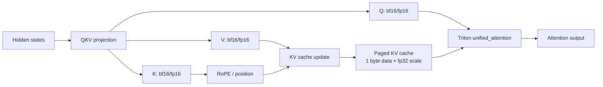
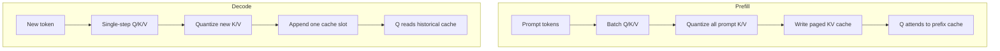
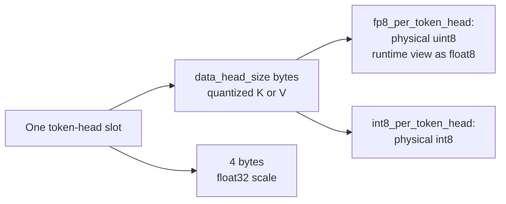
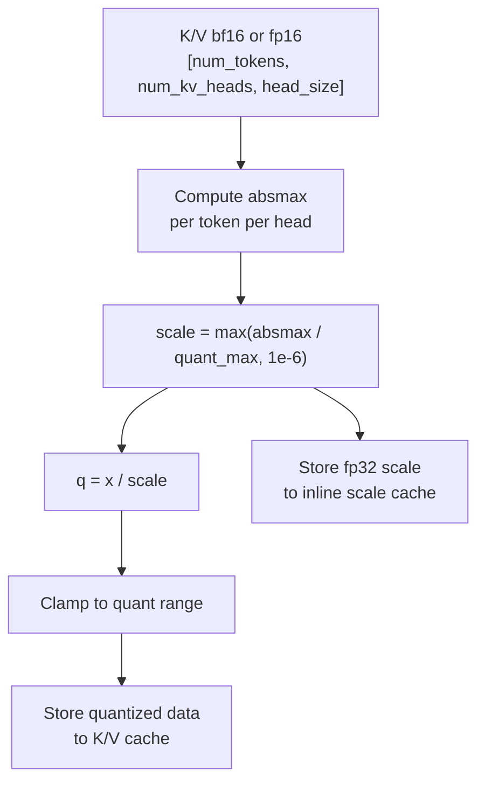
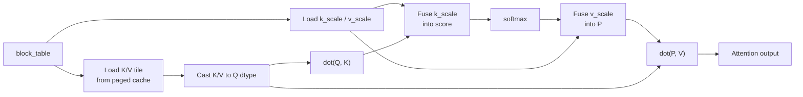
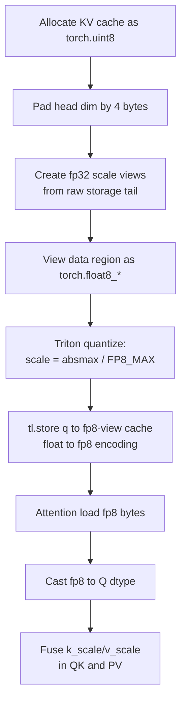
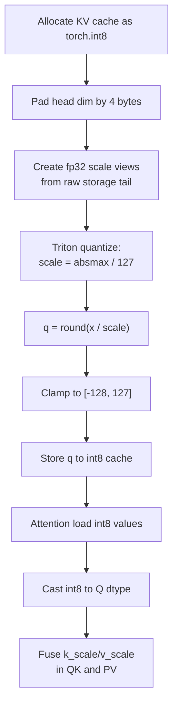

# Hopper 量化 GEMM 算子方案文档

> 基于 CUTLASS 3.x / Triton 的 W8A8、W4A16、W4A8 量化 GEMM 实现与性能分析
>
> 硬件: NVIDIA H20 (sm_90a, 78 SMs, 1980 MHz, 96GB HBM3)
> 软件: CUDA 13.0, CUTLASS v4.x, Triton 3.6.0, PyTorch 2.11.0

---

## 目录

1. [方案总览](#1-方案总览)
2. [W8A8: INT8×INT8 量化 GEMM](#2-w8a8-int8int8-量化-gemm)
3. [W4A16: BF16×INT4 混合精度 GEMM](#3-w4a16-bf16int4-混合精度-gemm)
4. [W4A8: INT8×INT4 量化 GEMM](#4-w4a8-int8int4-量化-gemm)
5. [全流程性能对比](#5-全流程性能对比)
6. [AWQ 权重重排](#6-awq-权重重排)
7. [融合激活 (Fused ReLU)](#7-融合激活-fused-relu)
8. [KV Cache 量化实现](#8-kv-cache-量化实现)
9. [技术选型建议](#9-技术选型建议)
10. [项目文件结构](#10-项目文件结构)

---

## 1. 方案总览

### 1.1 量化格式定义

| 方案 | 激活(A) | 权重(B) | 累加器 | 输出(D) | Scale 方式 |
|------|---------|---------|--------|---------|-----------|
| W8A8 | INT8 | INT8 | INT32 | BF16 | per-tensor (scale_a × scale_b) |
| W4A16 | BF16 | INT4 | FP32 | BF16 | per-group (group_size=128) |
| W4A8 | INT8 | INT4 | INT32 | BF16 | per-tensor (scale_a × scale_b) |

### 1.2 实现版本矩阵

| 方案 | CUTLASS 版本 | Triton 版本 | 说明 |
|------|-------------|------------|------|
| W8A8 | ✅ INT8 WGMMA | — | 原生 INT8 tensor core |
| W4A16 | ✅ Mixed-input collective | ✅ BF16 GEMM | CUTLASS 用 lop3 快速 dequant |
| W4A8 | ✅ dequant + INT8 GEMM | ✅ INT8 融合 / BF16 融合 | 两个 Triton 版本 |

### 1.3 性能总览 @ 2048³

| 方案 | 实现版本 | 延迟 (ms) | TFLOPS | 峰值利用率 |
|------|---------|:---------:|:------:|:---------:|
| W8A8 | CUTLASS (纯 GEMM) | 0.100 | 171.7 | 58.0% |
| W4A16 | CUTLASS (融合 dequant) | 0.162 | 105.7 | 71.4% |
| W4A8 | CUTLASS (GEMM only) | 0.100 | 171.6 | 58.0% |
| W4A8 | CUTLASS (全流程) | 0.111 | 154.4 | 52.2% |
| W4A8 | **Triton (INT8 融合)** | **0.101** | **169.8** | **57.4%** |
| W4A8 | Triton (BF16 融合) | 0.179 | 96.1 | 64.9% |
| W4A16 | Triton (BF16 GEMM) | 0.170 | 101.2 | 68.4% |

> 峰值: INT8 = 296 TFLOPS, BF16 = 148 TFLOPS (H20 dense, 2 ops/MAC)

---

## 2. W8A8: INT8×INT8 量化 GEMM

### 2.1 计算公式

```
D = (scale_a × scale_b) × (A_int8 @ B_int8)
```

- A: [M, K] INT8 row-major (激活)
- B: [K, N] INT8 column-major (权重)
- D: [M, N] BF16 row-major (输出)
- scale_a, scale_b: per-tensor FP32 标量

### 2.2 CUTLASS 实现

**文件**: `include/cute_quant/gemm_w8a8.hpp`

```
架构: Sm90 (Hopper)
MMA atom: MMA_64x128x32_S32S8S8_SS (INT8 WGMMA, SS 模式)
Tile: 128×128×128
Cluster: 1×1×1
Schedule: KernelTmaWarpSpecializedCooperative
Epilogue: NoSmemWarpSpecialized (LinearCombination)
```

关键设计决策:
- **Tile K=128**（非 64）: TMA cooperative schedule 对 INT8 要求 K tile ≥ 128
- **NoSmemWarpSpecialized epilogue**: INT8 不兼容 TMA epilogue（参考 CUTLASS 官方测试配置）
- **sm_90a**（非 sm_90）: 必须使用 `90a` 编译目标以启用 `__CUDA_ARCH_FEAT_SM90_ALL`

### 2.3 性能数据

| Size | 延迟 (ms) | TFLOPS | 利用率 |
|------|:---------:|:------:|:------:|
| 512³ | 0.017 | 15.9 | 5.4% |
| 1024³ | 0.022 | 99.7 | 33.7% |
| 2048³ | 0.100 | 171.7 | 58.0% |

小尺寸 (512³) 受 kernel launch 开销限制；大尺寸 (2048³) 受 NoSmemWarpSpecialized epilogue 的 store 吞吐限制。

---

## 3. W4A16: BF16×INT4 混合精度 GEMM

### 3.1 计算公式

```
D = A_bf16 @ (scale[n, k÷group] × dequant(B_int4))
```

- A: [M, K] BF16 row-major (激活)
- B: [K, N] INT4 packed (2/byte, column-major)
- S: [N, K÷group] BF16, MN-major (N contiguous)
- D: [M, N] BF16 row-major
- group_size: 128 (每 128 个 K 元素共享一个 scale)

### 3.2 CUTLASS 实现

**文件**: `include/cute_quant/gemm_w4a16.hpp`

```
架构: Sm90 (Hopper)
MMA: BF16 WGMMA (MMA_64x128x16_F32BF16BF16), RS 模式
  - 窄类型 INT4 走 register file, 宽类型 BF16 走 shared memory (TMA)
Tile: 128×128×64
Schedule: KernelTmaWarpSpecializedCooperative
Epilogue: TmaWarpSpecializedCooperative (EVT 可选)
Dequant: LayoutAwareConvertImpl (PTX lop3 快速路径)
Value shuffle: [0,2,4,6,1,3,5,7] (离线权重重排)
```

关键设计决策:
- **Mixed-input collective**: 自动处理 INT4→BF16 上转 + group scale 融合
- **Value shuffle [0,2,4,6,1,3,5,7]**: 预先重排权重, 使 lop3 提取后直接匹配 WGMMA fragment 布局
- **Swap+transpose**: 窄类型 (INT4) 放 register file, 显式 swap A/B 以保持 TMA epilogue
- **EVT 融合 ReLU**: float 累加器兼容 EVT, ReLU 融合进 TMA store (零开销)

**INT4→BF16 dequant 的 lop3 快速路径** (8 个 INT4 → 8 个 BF16, ~6 条指令):

```
// 1. lop3.b32: (i4s & 0x000F000F) | 0x43084308  → BF16 {136+x, 136+x}
// 2. sub.f16x2: 减去 {136.0, 136.0}             → 正确的 BF16 值
// 3. 乘 group scale
```

### 3.3 Triton 实现

**文件**: `triton/w4a16_gemm.py`

```
Tile: 128×128×64 (autotuned)
dequant: 逐字节 nibble 提取 + sign-extend + BF16 转换 + group scale
GEMM: tl.dot(BF16, BF16) → FP32 累加
```

朴素 dequant (每元素 4+ 条指令), 无 lop3 优化, 但 autotune 自动选择最优 tile 配置。

### 3.4 性能对比

| Size | CUTLASS (ms) | CUTLASS (TF) | Triton (ms) | Triton (TF) | CUTLASS/Triton |
|------|:----------:|:----------:|:----------:|:----------:|:--------------:|
| 512³ | 0.019 | 13.9 | 0.050 | 5.4 | 2.61x |
| 1024³ | 0.029 | 74.0 | 0.062 | 34.5 | 2.17x |
| 2048³ | 0.162 | 105.7 | 0.170 | 101.2 | 1.04x |

- 小尺寸 CUTLASS 优势大 (TMA + WGMMA + lop3)
- 大尺寸两者趋同 (memory-bandwidth bound)
- Triton 仅 ~80 行代码达到 CUTLASS 96% 峰值

---

## 4. W4A8: INT8×INT4 量化 GEMM

### 4.1 计算公式

```
D = (scale_a × scale_b) × (A_int8 @ dequant(B_int4))
```

- A: [M, K] INT8 row-major (激活)
- B: [K, N] INT4 packed (2/byte, row-major)
- D: [M, N] BF16 row-major
- scale_a, scale_b: per-tensor FP32 标量

### 4.2 核心挑战

Hopper **没有原生 INT4×INT8 WGMMA 指令**。CUTLASS 的 mixed-input collective 只支持窄类型→浮点 (INT4→BF16/FP16) 的上转, 不支持 INT4→INT8。

### 4.3 三种实现方案

#### 方案 A: CUTLASS 分离式 (dequant kernel + INT8 GEMM)

**文件**: `include/cute_quant/gemm_w4a8.hpp`, `include/cute_quant/repack.hpp`

```
步骤 1 (预处理): INT4 → INT8 sign-extend (独立 CUDA kernel)
步骤 2 (GEMM):   INT8 × INT8 → INT32 (复用 W8A8 GEMM)
步骤 3 (epilogue): D = (scale_a × scale_b) × acc → BF16
```

| 优点 | 缺点 |
|------|------|
| INT8 WGMMA 峰值吞吐高 (296 TF) | dequant 独立 kernel, 额外 launch + 内存开销 |
| 权重只需 dequant 一次 (可缓存) | 中间 INT8 buffer 占 K×N bytes |
| 复用 W8A8 kernel, 实现简单 | 全流程性能损失 ~11% |

#### 方案 B: Triton INT8 融合 (dequant + INT8 GEMM 单 kernel)

**文件**: `triton/w4a8_int8_fused_gemm.py`

```
单 kernel 内:
  1. Load A (INT8) tile
  2. Load B (INT4 packed) tile → 提取 nibble → sign-extend → INT8
  3. tl.dot(A_int8, B_int8, out_dtype=tl.int32)  ← INT8 tensor core
  4. Apply scale_a × scale_b → BF16 → store
```

| 优点 | 缺点 |
|------|------|
| 单 kernel, 无额外 launch | Triton autotune 可能不如 CUTLASS 精调 |
| 无中间 INT8 buffer | 小尺寸 launch 开销高于 CUTLASS persistent |
| INT8 tensor core 峰值 | — |
| dequant 被 GEMM 计算掩盖 | — |

#### 方案 C: Triton BF16 融合 (dequant + BF16 GEMM 单 kernel)

**文件**: `triton/w4a8_fused_gemm.py`

```
单 kernel 内:
  1. Load A (INT8) → BF16 × scale_a
  2. Load B (INT4 packed) → dequant → BF16 × group_scale
  3. tl.dot(A_bf16, B_bf16) → FP32 累加
  4. Store BF16
```

| 优点 | 缺点 |
|------|------|
| 单 kernel, 无额外 launch | BF16 GEMM 峰值仅 148 TF (INT8 的一半) |
| 支持 per-group scale | INT4→BF16 转换比 INT4→INT8 更复杂 |

### 4.4 性能对比 @ 2048³

| 方案 | 延迟 (ms) | TFLOPS | dequant 开销 | GEMM 峰值 |
|------|:---------:|:------:|:----------:|:---------:|
| CUTLASS GEMM only (上限) | 0.100 | 171.6 | 不计时 | 296 TF |
| CUTLASS 全流程 | 0.111 | 154.4 | 0.011ms (11%) | 296 TF |
| **Triton INT8 融合** | **0.101** | **169.8** | **~0 (融合)** | 296 TF |
| CUTLASS W4A16 (参考) | 0.162 | 105.7 | 融合 (mainloop) | 148 TF |
| Triton BF16 融合 | 0.179 | 96.1 | ~0 (融合) | 148 TF |

### 4.5 关键发现: 为什么 Triton 能融合 INT4→INT8 + INT8 GEMM

| | Triton | CUTLASS |
|--|--------|---------|
| **dequant 位置** | register file → 直接送入 tl.dot | register file → 必须写回 smem |
| **MMA 输入** | register (tl.dot 从 register 取操作数) | shared memory (WGMMA SS 要求 smem) |
| **INT4→INT8 快速路径** | 不需要 (sign-extend 足够简单) | RS 模式无 INT4→INT8 的 lop3 路径 |
| **融合效果** | dequant 被 GEMM 计算完全掩盖 | 需额外 smem 写回, 抵消融合收益 |

CUTLASS 的 WGMMA SS 模式要求两个操作数都在 shared memory 中。INT4→INT8 dequant 在 register file 中完成后, 需要写回 smem 才能被 SS WGMMA 使用。而 Triton 的 `tl.dot` 直接从 register 调用 INT8 MMA, dequant 在 register 中完成后直接送入 MMA, 无需经过 shared memory。

### 4.6 全尺寸对比

| Size | CUTLASS 全流程 | Triton INT8 融合 | Triton BF16 融合 | Triton/CUTLASS |
|------|:-----------:|:--------------:|:---------------:|:--------------:|
| 512³ | 0.021 ms (13.0 TF) | 0.043 ms (6.2 TF) | 0.051 ms (5.3 TF) | 0.49x |
| 1024³ | 0.025 ms (87.2 TF) | 0.047 ms (45.8 TF) | 0.064 ms (33.6 TF) | 0.53x |
| **2048³** | **0.111 ms (154.4 TF)** | **0.101 ms (169.8 TF)** | 0.179 ms (96.1 TF) | **1.10x** |

- 小尺寸: CUTLASS 更快 (TMA + persistent scheduler launch 开销更低)
- 大尺寸: **Triton INT8 融合反超** (compute-bound, 融合省掉的内存开销开始显现)

---

## 5. 全流程性能对比

### 5.1 综合对比表 @ 2048³

| 方案 | 实现 | 延迟 (ms) | TFLOPS | 利用率 | dequant 方式 | GEMM 类型 |
|------|------|:---------:|:------:|:------:|:----------:|:---------:|
| W8A8 | CUTLASS | 0.100 | 171.7 | 58.0% | 无 | INT8 WGMMA |
| W4A8 | CUTLASS GEMM only | 0.100 | 171.6 | 58.0% | 不计时 | INT8 WGMMA |
| W4A8 | CUTLASS 全流程 | 0.111 | 154.4 | 52.2% | 独立 kernel | INT8 WGMMA |
| **W4A8** | **Triton INT8 融合** | **0.101** | **169.8** | **57.4%** | **单 kernel 融合** | **INT8 tl.dot** |
| W4A16 | CUTLASS | 0.162 | 105.7 | 71.4% | mainloop 融合 | BF16 WGMMA |
| W4A16 | Triton | 0.170 | 101.2 | 68.4% | 单 kernel 融合 | BF16 tl.dot |
| W4A8 | Triton BF16 融合 | 0.179 | 96.1 | 64.9% | 单 kernel 融合 | BF16 tl.dot |

### 5.2 算术强度分析 @ 2048³

| 方案 | 数据量 (MB) | 算术强度 (FLOP/Byte) | 实测带宽 (GB/s) | 瓶颈 |
|------|:----------:|:-------------------:|:-------------:|:----:|
| W8A8 | 16.0 | 1024 | 168 | compute |
| W4A16 | 18.1 | 907 | 117 | compute |
| W4A8 | 14.5 | 1170 | 147 | compute |

所有方案均为 compute-bound (算术强度 >> H20 roofline 交叉点)。

### 5.3 尺寸效应

| Size | W8A8 (TF) | W4A16 (TF) | W4A8 INT8融合 (TF) | 瓶颈 |
|------|:---------:|:---------:|:----------------:|:----:|
| 512³ | 15.9 | 13.9 | 6.2 | launch 开销 (~5μs 占 ~30%) |
| 1024³ | 99.7 | 74.0 | 45.8 | 部分 launch + 部分计算 |
| 2048³ | 171.7 | 105.7 | 169.8 | compute (4096 tiles 填满 78 SM) |

---

## 6. AWQ 权重重排

### 6.1 原理

AWQ (Activation-aware Weight Quantization) 将 INT4 权重从顺序排列 `[v0,v1,v2,v3,v4,v5,v6,v7]` 重排为交错排列 `[v0,v2,v4,v6,v1,v3,v5,v7]`。这使得 PTX `lop3` 指令一次提取 2 个 nibble 后, 直接匹配 WGMMA fragment 的线程内布局, 无需额外 shuffle 指令。

### 6.2 实现

**文件**: `triton/awq_repack.py` (Triton), `include/cute_quant/repack.hpp` (CUTLASS)

Triton 版本: 每 8 个 nibble (4 bytes) 一组, 提取并重排后写回。每个 program 处理 8×BLOCK_N 个元素。

CUTLASS 版本: 使用 `compute_memory_reordering_atom` + `reorder_tensor` 工具, 支持 value shuffle 和 memory reordering 两种模式。

### 6.3 正确性

AWQ repack (Triton): **PASS** — 所有 nibble 重排正确。

---

## 7. 融合激活 (Fused ReLU)

### 7.1 三种融合方式

| 方案 | 融合方式 | 额外开销 | 原因 |
|------|---------|:------:|------|
| W4A16 (CUTLASS) | EVT (Epilogue Visitor Tree) | ~0% | float 累加器兼容 EVT float compute |
| W8A8 (CUTLASS) | 独立 ReLU kernel | +13% | INT32 累加器与 EVT float 不兼容 |
| W4A8 (CUTLASS) | 独立 ReLU kernel | +13% | 同 W8A8 (复用 INT8 GEMM) |
| W4A8 (Triton INT8) | epilogue 内融合 | ~0% | acc.to(float) * alpha, 然后 ReLU |

### 7.2 EVT 不兼容 INT32 的原因

CUTLASS TMA epilogue 的 compute fragment 类型为 `ElementAccumulator` (INT32)。EVT 的 `Sm90Compute` 产出 `float` (ElementCompute)。赋值 `Array<int,16> = Array<float,16>` 无匹配 `operator=` (narrowing conversion)。

### 7.3 融合 ReLU 性能影响 @ 2048³

| 方案 | non-fused (ms) | fused (ms) | 开销 |
|------|:-----------:|:----------:|:----:|
| W8A8 CUTLASS | 0.100 | 0.113 | +13% |
| W4A16 CUTLASS | 0.162 | 0.161 | -0.6% |
| W4A8 CUTLASS | 0.100 | 0.113 | +13% |

---

## 8. KV Cache 量化实现

本节总结 vLLM `TRITON_ATTN` 后端中的 `fp8_per_token_head` 与 `int8_per_token_head` KV cache 路径。两者的共同点是: 每个 `(token, head)` 单独计算一个动态 scale, K/V 数据压缩成 1 byte 存入 paged KV cache, attention 读 cache 时把 scale 融进 QK 和 PV 计算。

### 8.1 整体流程



Prefill 和 decode 使用相同的 cache 格式, 区别主要在 query 数量和调度策略:



### 8.2 KV Cache 存储格式

per-token-head cache 的逻辑 shape:

```text
[num_blocks, 2, block_size, num_kv_heads, data_head_size + scale_pad]

dim=1:
  0 = K cache
  1 = V cache
```

FP8 与 INT8 都是 1 byte 数据, 因此 `scale_pad = sizeof(float32) / 1 = 4`。每个 `(token, head)` 的尾部 4 bytes 被解释成一个 `float32 scale`。



对 FP8 来说, `torch.uint8` 只是 byte container。KV update 和 attention 前, vLLM 会把数据区 `view` 成平台 FP8 dtype, 例如 CUDA 上的 `torch.float8_e4m3fn`。这一步是 zero-copy reinterpret, 真正的 float-to-fp8 编码发生在 Triton `tl.store` 到 fp8-view cache 时。

### 8.3 写 KV Cache
> kv cast 成 fp8 传入该 kernel
写入时, Triton kernel 每个 program 处理一个 `(token, kv_head)`, 分别对 K 和 V 做同样的动态量化:

```text
absmax = max(abs(x[token, head, :]))
scale = max(absmax / quant_max, 1e-6)
q = clamp(x / scale, quant_min, quant_max)
store q
store scale
```



### 8.4 读 KV Cache 与 Attention
> kernel 内部将 kv cast 到 q dtype(fp16)
attention kernel 通过 `block_table` 找到物理 block, 读取 K/V tile 和对应的 per-token-head scale。实现上不一定显式构造 `K_dequant` / `V_dequant`, 而是把 scale 融进矩阵计算:

```text
score = dot(Q, K_quant_casted) * softmax_scale * k_scale[token, head]
P = softmax(score)
acc += dot(P * v_scale[token, head], V_quant_casted)
```

这等价于:

```text
K_dequant = K_quant * k_scale
V_dequant = V_quant * v_scale
score = dot(Q, K_dequant) * softmax_scale
out = dot(P, V_dequant)
```



### 8.5 FP8 Per-Token-Head 详细流程



关键点:
- `uint8` 是物理存储格式, `float8_*` 是运行时数值解释。
- FP8 的 byte 是 `sign/exponent/mantissa` 浮点编码, 不是普通 0..255 整数。
- FP8 路径不显式 round, 依赖 store 到 FP8 dtype 时完成舍入和编码。
- `fp8_per_token_head` 默认使用平台首选 FP8 类型, CUDA 通常是 `e4m3fn`, ROCm MI300/MI325 可能是 `e4m3fnuz`。

### 8.6 INT8 Per-Token-Head 详细流程
> kernel 内部将 kv cast 到 q dtype(fp16)，然后在乘上 k_scale


FP8 与 INT8 对比:

| 项目 | `fp8_per_token_head` | `int8_per_token_head` |
|------|----------------------|-----------------------|
| 物理 data dtype | `torch.uint8` | `torch.int8` |
| 运行时解释 | `torch.float8_*` view | signed integer |
| 量化范围 | `FP8_MIN..FP8_MAX`, e4m3 通常约 `±448` | `-128..127` |
| 舍入方式 | store 到 FP8 dtype 时完成 | kernel 内显式 round |
| scale 粒度 | per `(token, head)` | per `(token, head)` |
| attention 反量化 | scale 融进 QK/PV | scale 融进 QK/PV |

---

## 9. 技术选型建议

### 9.1 按场景选择

| 场景 | 推荐方案 | 延迟 | TFLOPS | 理由 |
|------|---------|:----:|:------:|------|
| **权重可预处理 (常驻)** | CUTLASS W4A8 GEMM only | 0.100ms | 171.6 | dequant 只做一次, 纯 INT8 GEMM |
| **大尺寸全流程** | Triton W4A8 INT8 融合 | 0.101ms | 169.8 | 单 kernel, dequant 被计算掩盖 |
| **小尺寸全流程** | CUTLASS W4A8 全流程 | 0.021ms | 13.0 | TMA + persistent launch 更低 |
| **需要 per-group scale** | CUTLASS W4A16 | 0.162ms | 105.7 | mainloop 融合 group scale + lop3 |
| **快速原型开发** | Triton W4A16 | 0.170ms | 101.2 | ~80 行代码, 96% CUTLASS 性能 |
| **纯 INT8 推理** | CUTLASS W8A8 | 0.100ms | 171.7 | 原生 INT8 WGMMA, 无 dequant |

### 9.2 按需求选择

| 需求 | 推荐方案 |
|------|---------|
| 峰值吞吐 | CUTLASS W8A8 / W4A8 GEMM only (171 TF) |
| 零额外内存 | Triton W4A8 INT8 融合 (单 kernel, 无中间 buffer) |
| per-group 量化精度 | CUTLASS W4A16 (mainloop 融合 group scale) |
| 融合激活 | CUTLASS W4A16 (EVT) / Triton (epilogue 内) |
| 开发效率 | Triton (~80 行 vs CUTLASS 数百行模板) |
| 部署灵活性 | Triton (JIT, 无需编译, 版本无关) |

### 9.3 CUTLASS vs Triton 决策树

```
需要 per-group scale?
├─ 是 → CUTLASS W4A16 (lop3 dequant + group scale 融合)
└─ 否 → 权重可预处理?
        ├─ 是 → CUTLASS W4A8 GEMM only (INT8 WGMMA 峰值)
        └─ 否 → 问题尺寸?
                ├─ 大 (≥2048) → Triton W4A8 INT8 融合 (dequant 被掩盖)
                └─ 小 (<1024) → CUTLASS W4A8 全流程 (TMA launch 更低)
```

---

## 10. 项目文件结构

```
cute_quant/
├── CMakeLists.txt                          # CMake 构建 (sm_90a)
│
├── include/cute_quant/                     # CUTLASS 实现 (C++ headers)
│   ├── common.hpp                          # 共享配置: ArchTag, TileShape, RoundStyle
│   ├── repack.hpp                          # 权重重排: INT4 value-shuffle + INT4→INT8 dequant
│   ├── activation.hpp                      # 元素级 ReLU kernel (用于 INT32 acc 的融合)
│   ├── gemm_w8a8.hpp                       # W8A8: INT8×INT8→BF16, INT8 WGMMA
│   ├── gemm_w4a16.hpp                      # W4A16: BF16×INT4 mixed-input, lop3 dequant
│   └── gemm_w4a8.hpp                       # W4A8: dequant + W8A8 GEMM (wrapper)
│
├── triton/                                 # Triton 实现 (Python)
│   ├── awq_repack.py                       # AWQ INT4 权重重排 [0,2,4,6,1,3,5,7]
│   ├── w4a16_gemm.py                       # W4A16: INT4 dequant + BF16 GEMM (autotuned)
│   ├── w4a8_fused_gemm.py                  # W4A8: INT4+INT8 dequant + BF16 GEMM (融合)
│   └── w4a8_int8_fused_gemm.py             # W4A8: INT4→INT8 dequant + INT8 GEMM (融合)
│
├── cute_dsl/                               # CuTe DSL 手写实现 (WIP)
│   └── w4a16_gemm.cu                       # 手写 WGMMA kernel (layout/MMA/smem/dequant)
│
├── tests/
│   └── test_quant.cu                       # CUTLASS 正确性 + benchmark 测试
│
├── bench/
│   └── compare.py                          # Triton vs CUTLASS 统一 benchmark
│
└── docs/
    ├── cutlass_architecture_guide.md       # CUTLASS 架构深度解析
    └── quantization_operator_guide.md      # 本文档: 量化方案算子文档
```

### 关键编译参数

```cmake
# CMakeLists.txt
set(CMAKE_CUDA_ARCHITECTURES "90a")          # 必须 90a (非 90), 启用 WGMMA/TMA
target_compile_options(... --expt-relaxed-constexpr --expt-extended-lambda -use_fast_math)
```

### 运行方式

```bash
# CUTLASS benchmark
cd build && ./test_quant --m=2048 --n=2048 --k=2048 --iters=30

# Triton benchmark
cd triton && python3 w4a8_int8_fused_gemm.py 2048 2048 2048

# 统一对比
python3 bench/compare.py --sizes 512,1024,2048
```
